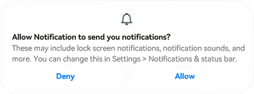
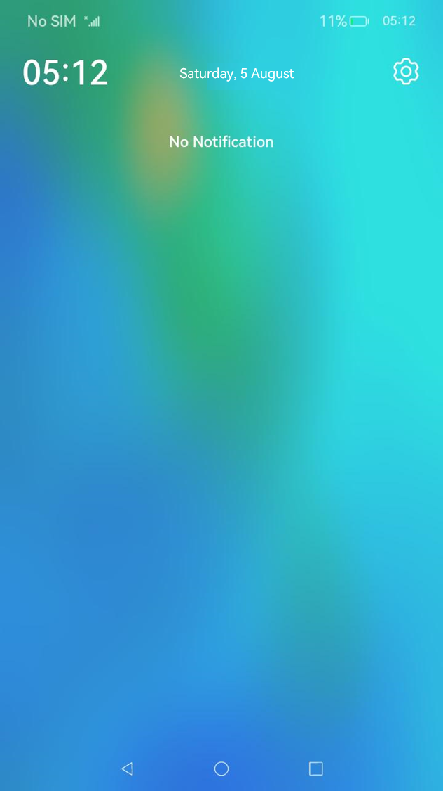
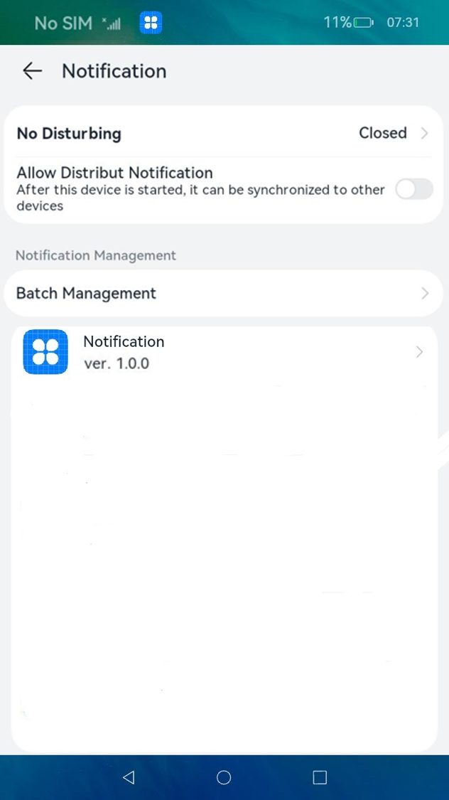
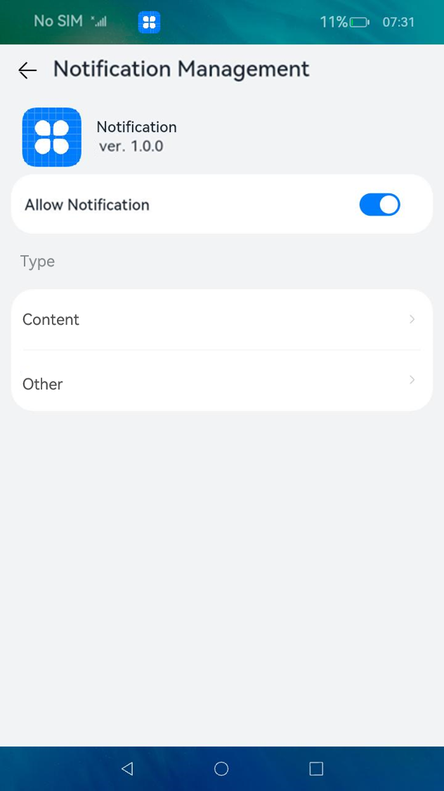

# Enabling Notification


To publish a notification, you must have notification enabled for your application. You can call the [requestEnableNotification()](../reference/apis/js-apis-notificationManager.md#notificationrequestenablenotification) API to display a dialog box prompting the user to enable notification for your application. Note that the dialog box is displayed only when the API is called for the first time.

  **Figure 1** Dialog box prompting the user to enable notification




- Touching **allow** enables notification for the application, and touching **ban** keeps notification disabled.

- The dialog box will not be displayed again when [requestEnableNotification()](../reference/apis/js-apis-notificationManager.md#notificationrequestenablenotification) is called later. The user can manually enable notification as follows.

  | 1. Swipe down from the upper left corner of the device screen to access the notification panel.                             | 2. Touch the **Settings** icon in the upper right corner. On the notification screen, locate the target application.| 3. Toggle on **Allow notifications**.                                         |
  | ------------------------------------------------------------ | ------------------------------------------------------------ | ------------------------------------------------------------ |
  |  |  |  |


## Available APIs

For details about the APIs, see [@ohos.notificationManager](../reference/apis/js-apis-notificationManager.md#notificationrequestenablenotification).

**Table 1** Notification APIs

| Name | Description |
| -------- | -------- |
| isNotificationEnabled(bundle: BundleOption, callback: AsyncCallback&lt;boolean&gt;): void | Checks whether notification is enabled.<br>**NOTE**<br>This is a system API and cannot be called by third-party applications.      |
| setNotificationEnable(bundle: BundleOption, enable: boolean, callback: AsyncCallback&lt;void&gt;): void | Sets whether to enable notification. Notification can be enabled or disabled in **Notifications** of the target application under **Settings** > **Apps & services** > **Apps**.<br>**NOTE**<br>This is a system API and cannot be called by third-party applications.|
| requestEnableNotification(callback: AsyncCallback&lt;void&gt;): void | Requests notification to be enabled. When called for the first time, this API displays a dialog box prompting the user to enable notification.    |


## How to Develop

1. Import the **NotificationManager** module.

   ```ts
   import notificationManager from '@ohos.notificationManager';
   ```

2. Call the API to request notification to be enabled.

   ```ts
   notificationManager.requestEnableNotification().then(() => {
       console.info(`[ANS] requestEnableNotification success`);
   }).catch((err) => {
       console.error(`[ANS] requestEnableNotification failed, errCode[${err}]`);
   });
   ```
