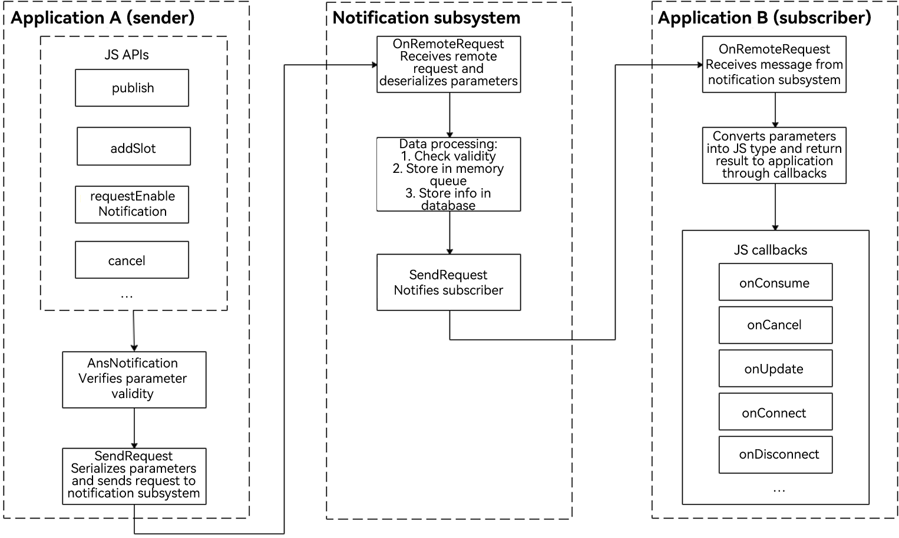

# Notification Overview

## Introduction

All system applications and services can publish notifications through the notification APIs. Users can view the notifications in the notification panel or click a notification to open the publishing application.

Below are some typical use cases for notifications:

- Display received SMS messages and instant messages.

- Display push messages, such as advertisements and version updates.

- Display ongoing events, such as the download progress.

The Advanced Notification Service (ANS) in OpenHarmony is used to manage notifications of various types, such as basic notifications, progress notifications, and reminders published through the background agent.

## Notification Service Process

The notification service process involves the notification subsystem, notification sender, and notification subscriber.

A notification is generated by the notification sender and sent to the notification subsystem through [inter-process communication (IPC)](../connectivity/ipc-rpc-overview.md). The notification subsystem then distributes the notification to the notification subscriber.

System applications also support notification-related configuration options, such as switches. The system configuration initiates a configuration request and sends the request to the notification subsystem for storage in the memory and database.

