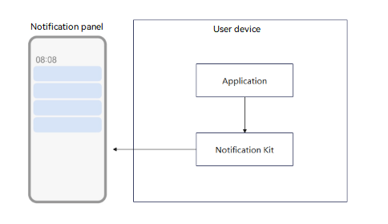
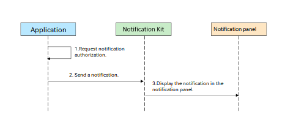
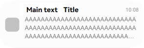
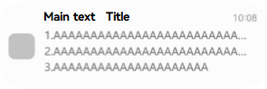

# Introduction to Notification Kit

With Notification Kit, you can publish local notifications from your application and push them to users on the client. Local notifications can be displayed by ringtones, vibrations, banners, lock screen, screen off, Always On Display (AOD), and notification panel based on the notification type and publishing scenario.

## When to Use
When application is running in the foreground, you can use the Notification Kit to publish notifications to users.<!--RP1--><!--RP1End-->
You can use the local notification capability in multiple scenarios. For example, synchronize the upload and download progress of the user, send instant customer service payment notifications, and update the number of steps.

## Capability Scope
The Notification Kit supports the following capabilities:
 - Publishes notifications in the form of text or progress bar.
 - Carries or updates the application notification badge.
 - Cancels one or all published notifications.
 - Queries the list of published notifications.
 - Queries the status of the notification function of an application.
 - The capability of notifying users is disabled by default. You can open the authorization dialog box to request users to authorize the publishing of notifications.

  

## Service Flow
  

The main service flow of using the Notification Kit is as follows:

1. Request notification authorization.

2. Publish a notification to the Notification Kit.

3. Display the notification in the notification center.

## Notification Style

> **NOTE**
>
> The display effect depends on the device capability and notification center UI style.

Common notification styles in the Notification Kit are as follows.
| Type| Notification Style| Description|
| ---- | --------| ------- |
| [Text](./text-notification.md)          |    | A maximum of three lines can be displayed in the notification text. Excess content is truncated by an ellipsis (...).|
| [Multi-line text](./text-notification.md)      |    | A maximum of three lines of content can be displayed. Excess content of each line is truncated by an ellipsis (...).|
| [Notification badge](./notification-badge.md)     |    | Displayed as a number in the upper right corner.|
| [Progress bar](./progress-bar-notification.md)|     | Progress notification.|

## Constraints
- There is a limit on the number of notifications per application in the system windows. The current limit is 24.
- The notification cannot exceed 200 KB (due to cross-process serialization).
- The publication and update frequencies for notifications must meet the following requirements. Otherwise, the publication or update fails and the corresponding error code is returned.
  - The total number of notifications published by an application cannot exceed 10 per second, and that of notifications updated cannot exceed 20 per second.
  - The total number of notifications published by all third-party applications cannot exceed 15 per second, and that of notifications updated cannot exceed 30 per second.
  <!--Del-->
  - The total number of notifications published by all system applications cannot exceed 15 per second, and that of notifications updated cannot exceed 30 per second.
  <!--DelEnd-->

## Relationship with Related Kits
- Notifications created by Notification Kit are displayed in the notification center or other system entries in real time. To display some scheduled notifications to remind users after the application is switched to the background or the process is terminated, for example, reminders for flash sales in shopping applications, you can use [Background Tasks Kit](../task-management/background-task-overview.md) to create notifications. Currently, notifications based on countdown, calendar, and alarm clocks are supported.
- You can use the [getWantAgent](../reference/apis-ability-kit/js-apis-app-ability-wantAgent.md#wantagentgetwantagent) API of [Ability Kit](../application-models/abilitykit-overview.md) to set the **WantAgent** triggered when a user taps a notification.<!--RP2-->
<!--RP2End-->
