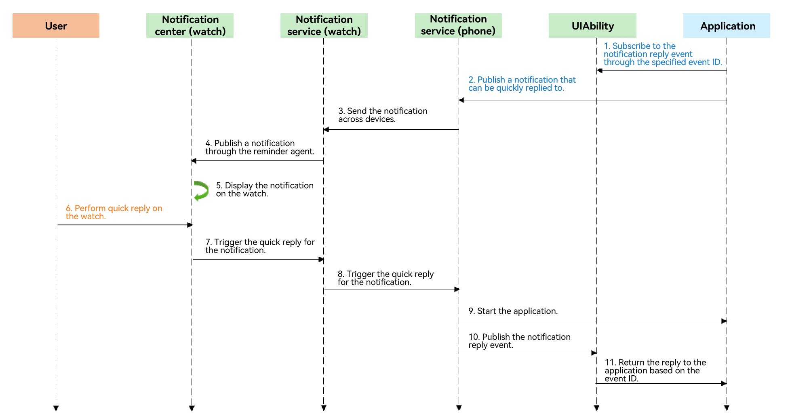

# Enabling Quick Reply for Cross-Device Notifications

<!--Kit: Notification Kit-->
<!--Subsystem: Notification-->
<!--Owner: @peixu-->
<!--Designer: @dongqingran; @wulong158-->
<!--Tester: @wanghong1997-->
<!--Adviser: @huipeizi-->

Since API version 18, quick reply is enabled for cross-device notifications.

When an application on the phone subscribes to a notification reply event by specifying an event ID and publishes a notification that supports quick reply to the watch, the user can view the notification and quickly reply to it on the watch without unlocking the mobile phone.

## Prerequisites

 - The user has connected the watch to the phone through the Huawei Health app.
 - The user has turned on the switch for syncing notifications from phone to watch for specified applications in **Huawei Health** > **Devices** > **Notifications** on their phones.

## Implementation Principles

The figure below shows the procedure for quick reply. You only need to implement step 1 and step 2. Step 6 is a user operation. Other operations are implemented by the system.



## APIs

| **API** | **Description**|
| -------- | -------- |
| [publish](../reference/apis-notification-kit/js-apis-notificationManager.md#notificationmanagerpublish-1)(request: NotificationRequest): Promise\<void\>       | Publishes a notification. |
| [on](../reference/apis-ability-kit/js-apis-app-ability-uiAbility.md#on)(method: string, callback: CalleeCallback): void       | Registers a caller notification callback, which is invoked when the target ability registers a function. |

## How to Develop

1. Import the related modules.

    ```typescript
    import { notificationManager } from '@kit.NotificationKit';
    import { AbilityConstant, UIAbility, Want, wantAgent, WantAgent } from '@kit.AbilityKit';
    import { window } from '@kit.ArkUI';
    import { rpc } from '@kit.IPCKit';
    import { BusinessError } from '@kit.BasicServicesKit';
    ```

2. Enable the application to subscribe to the notification reply event.

    ```typescript
    class MySequenceable implements rpc.Parcelable {
      inputKey: string = ''
      userInput: string = ''

      constructor(inputKey: string, userInput: string) {
        this.inputKey = inputKey
        this.userInput = userInput
      }

      marshalling(messageParcel: rpc.MessageSequence) {
        messageParcel.writeString(this.inputKey)
        messageParcel.writeString(this.userInput)
        return true
      }

      unmarshalling(messageParcel: rpc.MessageSequence) {
        this.inputKey = messageParcel.readString()
        this.userInput = messageParcel.readString()
        return true
      }
    }

    function sendMsgCallback(data: rpc.MessageSequence) {
      // Receive the serialized data sent by the client.
      let receivedData = new MySequenceable('', '')
      // receivedData.inputKey is value1.
      receivedData.inputKey = data.readString();
      // The value of receivedData.userInput is the quick reply content specified by the user.
      receivedData.userInput = data.readString();
      console.info(`inputKey : ${JSON.stringify(receivedData.inputKey)}`);
      console.info(`userInput : ${JSON.stringify(receivedData.userInput)}`);

      return new MySequenceable('', '')
    }

    export default class EntryAbility extends UIAbility {
      onCreate(want: Want, launchParam: AbilityConstant.LaunchParam): void {
        console.info('Ability onCreate');
        console.info(`onCreate ${JSON.stringify(want)}`);
        try {
          // Register sendMsgCallback on the server and subscribe to com.ohos.notification_service.sendReply.
          this.callee.on('com.ohos.notification_service.sendReply', sendMsgCallback)
        } catch (error) {
          console.error(`Failed to register. Code is ${error.code}, message is ${error.message}`);
        }
        console.info('register successfully');
      }
    }
    ```

3. Publish a notification that can be quickly replied to. This notification must contain `actionButtons` of `userInput`, and `notificationSlotType` must be set to `SOCIAL_COMMUNICATION`.

    ```typescript
    // Save the WantAgent object created. It will be used to complete the trigger operations.
    let wantAgentObj:WantAgent;
    // The abilityName of the wantAgentInfo must be EntryAbility.
    let wantAgentInfo:wantAgent.WantAgentInfo = {
      wants: [
        {
          deviceId: '',
          bundleName: 'com.samples.notification', // Use the actual bundle name that sends notifications.
          abilityName: 'EntryAbility',
          action: '',
          entities: [],
          uri: '',
          parameters: {}
        }
      ],
      actionType: wantAgent.OperationType.START_ABILITY,
      requestCode: 0,
      actionFlags:[wantAgent.WantAgentFlags.CONSTANT_FLAG]
    };
    // Create a WantAgent object.
    wantAgent.getWantAgent(wantAgentInfo, (err: BusinessError, data:WantAgent) => {
      if (err) {
         console.error(`Failed to get want agent. Code is ${err.code}, message is ${err.message}`);
         return;
      }
      console.info('Succeeded in getting want agent.');
      wantAgentObj = data;
      let notificationRequest: notificationManager.NotificationRequest = {
        id: 1,
        // notificationSlotType must be set to SOCIAL_COMMUNICATION.
        notificationSlotType: notificationManager.SlotType.SOCIAL_COMMUNICATION,
        content: {
          notificationContentType: notificationManager.ContentType.NOTIFICATION_CONTENT_BASIC_TEXT,
          normal: {
            title: 'Test_Title',
            text: 'Test_Text',
            additionalText: 'Test_AdditionalText',
          },
        },
        actionButtons: [{
          title: 'button1',
          wantAgent: wantAgentObj,
          // userInput must be carried.
          userInput: {'inputKey': 'value1'},
        }],
      }
      // Publish the notification.
      notificationManager.publish(notificationRequest, (err: BusinessError) => {
        if (err) {
          console.error(`Failed to publish notification. Code is ${err.code}, message is ${err.message}`);
          return;
        }
        console.info('Succeeded in publishing notification.');
      });
    });
   ```

## Debugging and Verification

1. Make a quick reply on the watch.

2. On the phone, filter logs by **inputKey** or **userInput** to check whether the message notification callback **sendMsgCallback** exists. If the callback is found, the function is implemented properly.
