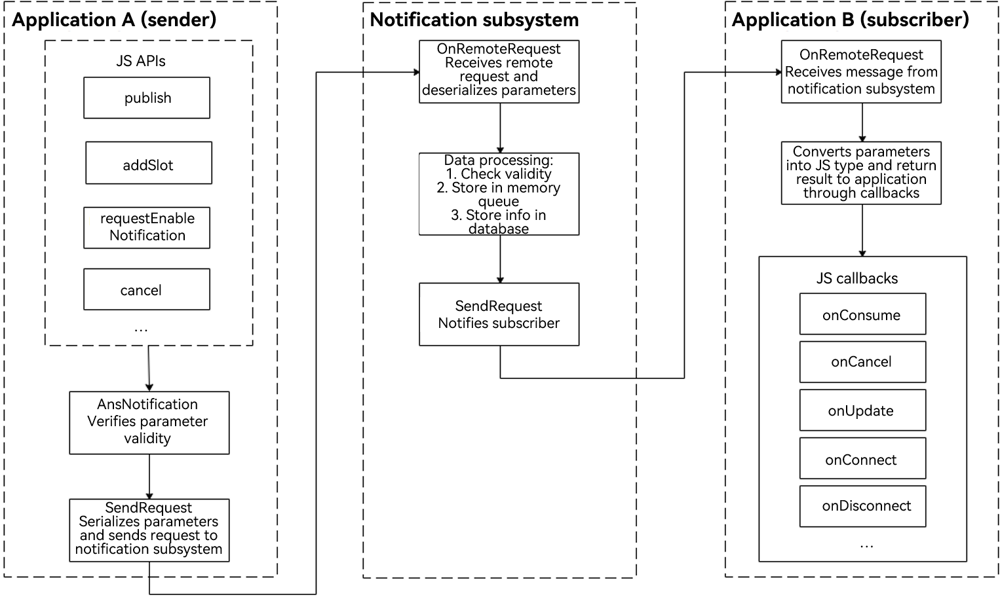

# Subscribing to Notifications (for System Applications Only)

<!--Kit: Notification Kit-->
<!--Subsystem: Notification-->
<!--Owner: @HuYueRong-->
<!--Designer: @dongqingran-->
<!--Tester: @wanghong1997-->
<!--Adviser: @fang-jinxu-->
<!-- md-trans-meta sourceCommit=f34741322b97b9eba604947e7ebe18c8aa44eb5b translatedAt=2026-08-13T03:12:24.680Z pushedAt=2026-08-13T07:46:19.534Z -->

To receive notifications, an application must subscribe to notifications first. The notification subsystem provides two types of subscription APIs, allowing applications to subscribe to notifications from all applications or notifications from a specific application.

You can use the [NotificationSubscriber](../reference/apis-notification-kit/js-apis-inner-notification-notificationSubscriber-sys.md) object to provide callbacks for subscription events, such as subscription success, notification reception, notification cancellation, and subscription cancellation.

## Principle of Notification Subscription

The notification service process involves the notification subsystem, notification sender, and notification subscriber. A notification is generated by the notification sender and sent to the notification subsystem through [inter-process communication (IPC)](../ipc/ipc-rpc-overview.md). The notification subsystem then distributes the notification to the notification subscriber.

* Notification sender: It can be a third-party application or a system application. Pay special attention to this role.

* Notification subscriber: It can only be a system application, for example, the notification center. By default, the notification center subscribes to notifications sent by all applications on the current device to the current user. You do not need to pay attention to this role.

**Figure 1** Notification service process 



## Available APIs

The major APIs for notification subscription are described as follows. For details about the APIs, see [@ohos.notificationSubscribe (NotificationSubscribe) (System API)](../reference/apis-notification-kit/js-apis-notificationSubscribe-sys.md).

**Table 1** Major APIs for notification subscription

| **API**| **Description**|
| -------- | -------- |
| subscribeNotification(subscriber:&nbsp;NotificationSubscriber,&nbsp;info:&nbsp;NotificationSubscribeInfo):&nbsp;Promise&lt;void&gt; | Subscribes to notifications of a specified app. |
| subscribeNotification(subscriber:&nbsp;NotificationSubscriber):&nbsp;Promise&lt;void&gt; | Subscribes to all notifications.    |

**Table 2** Callbacks for notification subscription

For details about the API, see [NotificationSubscriber](../reference/apis-notification-kit/js-apis-inner-notification-notificationSubscriber-sys.md).

| **API**| **Description**|
| -------- | -------- |
| onConsume?: (data:&nbsp;SubscribeCallbackData)&nbsp;=&gt;&nbsp;void  | Callback for receiving notifications.              |
| onCancel?: (data:&nbsp;SubscribeCallbackData)&nbsp;=&gt;&nbsp;void   | Callback for canceling notifications.          |
| onUpdate?: (data:&nbsp;NotificationSortingMap)&nbsp;=&gt;&nbsp;void  | Callback for notification sorting updates.      |
| onConnect?: ()&nbsp;=&gt;&nbsp;void                                 | Called when the subscription succeeds.           |
| onDisconnect?: ()&nbsp;=&gt;&nbsp;void                              | Called when the subscription is canceled.           |
| onDestroy?: ()&nbsp;=&gt;&nbsp;void                                  | Callback for disconnecting from the notification subsystem.  |
| onDoNotDisturbChanged?: (mode:&nbsp;notificationManager.DoNotDisturbDate)&nbsp;=&gt;&nbsp;void           | Callback for the Do Not Disturb (DNT) time changes.|
| onEnabledNotificationChanged?: (callbackData:&nbsp;EnabledNotificationCallbackData)&nbsp;=&gt;&nbsp;void | Callback for notification switch changes.      |
| onBadgeChanged?: (data:&nbsp;BadgeNumberCallbackData)&nbsp;=&gt;&nbsp;void                               | Callback for notification badge number changes.  |
| onBatchCancel?: (data:&nbsp;Array&lt;SubscribeCallbackData&gt;)&nbsp;=&gt;&nbsp;void                               | Called when notifications are deleted in batches.   |
| onEnabledPriorityChanged?: (callbackData:&nbsp;EnabledPriorityNotificationCallbackData)&nbsp;=&gt;&nbsp;void                               | Called when the status of the notification priority master switch changes.   |
| onEnabledPriorityByBundleChanged?: (callbackData:&nbsp;EnabledPriorityNotificationByBundleCallbackData)&nbsp;=&gt;&nbsp;void                               | Called when the status of the app notification priority switch changes.   |
| onSystemUpdate?: SystemUpdateCallback            | Called when a system property value changes.   |
| onEnabledSilentReminderChanged?: EnabledSilentReminderChangedCallback   | Called when the enable status of silent reminders for app notifications changes.   |
| onBadgeEnabledChanged?: BadgeEnabledChangedCallback   | Called when the enable status of app badges changes.   |

## How to Develop

1. Request the `ohos.permission.NOTIFICATION_SYSTEM_SUBSCRIBER` permission. For details about how to configure it, see [Requesting Permissions for system_basic Applications](../security/AccessToken/determine-application-mode.md#requesting-permissions-for-system_basic-applications).

2. Import the **notificationSubscribe** module.

   ```ts
   import { notificationSubscribe, notificationManager } from '@kit.NotificationKit';
   import { BusinessError } from '@kit.BasicServicesKit';
   import { hilog } from '@kit.PerformanceAnalysisKit';

   const TAG: string = '[SubscribeOperations]';
   const DOMAIN_NUMBER: number = 0xFF00;
   ```

3. Create a **subscriber** object.

   ```ts
   let subscriber: notificationSubscribe.NotificationSubscriber = {
     onConsume: (data:notificationSubscribe.SubscribeCallbackData) => {
       let req: notificationManager.NotificationRequest = data.request;
       hilog.info(DOMAIN_NUMBER, TAG, `onConsume callback. req.id: ${req.id}`);
     },
     onCancel: (data:notificationSubscribe.SubscribeCallbackData) => {
       let req: notificationManager.NotificationRequest = data.request;
       hilog.info(DOMAIN_NUMBER, TAG, `onCancel callback. req.id: ${req.id}`);
     },
     onConnect: () => {
       hilog.info(DOMAIN_NUMBER, TAG, `onConnect callback.`);
     },
     onDisconnect: () => {
       hilog.info(DOMAIN_NUMBER, TAG, `onDisconnect callback.`);
     },
     onDestroy: () => {
       hilog.info(DOMAIN_NUMBER, TAG, `onDestroy callback.`);
     },
     onDoNotDisturbChanged: (mode) => {
       hilog.info(DOMAIN_NUMBER, TAG, `onDoNotDisturbChanged callback. mode: ${JSON.stringify(mode)}`);
     },
     onEnabledNotificationChanged: (callbackData) => {
       hilog.info(DOMAIN_NUMBER, TAG, `onEnabledNotificationChanged callback. callbackData: ${JSON.stringify(callbackData)}`);
     },
     onBadgeChanged: (data) => {
       hilog.info(DOMAIN_NUMBER, TAG, `onBadgeChanged callback. data: ${JSON.stringify(data)}`);
     },
     onBatchCancel: (data) => {
       hilog.info(DOMAIN_NUMBER, TAG, `onBatchCancel callback. data: ${JSON.stringify(data)}`);
     },
     onEnabledPriorityChanged: (callbackData) => {
       hilog.info(DOMAIN_NUMBER, TAG, `onEnabledPriorityChanged callback. callbackData: ${JSON.stringify(callbackData)}`);
     },
     onEnabledPriorityByBundleChanged: (callbackData) => {
       hilog.info(DOMAIN_NUMBER, TAG, `onEnabledPriorityByBundleChanged callback. callbackData: ${JSON.stringify(callbackData)}`);
     },
     onSystemUpdate: (data) => {
       hilog.info(DOMAIN_NUMBER, TAG, `onSystemUpdate callback. data: ${JSON.stringify(data)}`);
     },
     onEnabledSilentReminderChanged: (callbackData) => {
       hilog.info(DOMAIN_NUMBER, TAG, `onEnabledSilentReminderChanged callback. callbackData: ${JSON.stringify(callbackData)}`);
     },
     onBadgeEnabledChanged: (data) => {
       hilog.info(DOMAIN_NUMBER, TAG, `onBadgeEnabledChanged callback. data: ${JSON.stringify(data)}`);
     },
   };
   ```

4. Initiate notification subscription.

   ```ts
   notificationSubscribe.subscribeNotification(subscriber).then(() => {
     hilog.info(DOMAIN_NUMBER, TAG, "subscribeNotification success");
   }).catch((err: BusinessError) => {
     hilog.error(DOMAIN_NUMBER, TAG, `subscribeNotification failed, code is ${err.code}, message is ${err.message}`);
   });
   ```