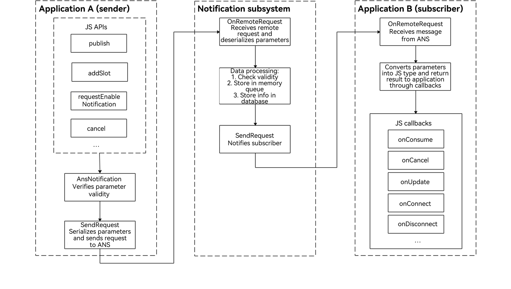

# Subscribing to Notifications (for System Applications Only)


To receive notifications, an application must subscribe to notifications first. The notification subsystem provides two types of subscription APIs, allowing applications to subscribe to notifications from all applications or notifications from a specific application.


You can use the [NotificationSubscriber](../reference/apis-notification-kit/js-apis-inner-notification-notificationSubscriber-sys.md) object to provide callbacks for subscription events, such as subscription success, notification reception, notification cancellation, and subscription cancellation.

## Principle of Notification Subscription

The notification service process involves the notification subsystem, notification sender, and notification subscriber. A notification is generated by the notification sender and sent to the notification subsystem through [inter-process communication (IPC)](../ipc/ipc-rpc-overview.md). The notification subsystem then distributes the notification to the notification subscriber.

* Notification sender: It can be a third-party application or a system application. Pay special attention to this role.

* Notification subscriber: It can only be a system application, for example, the notification center. By default, the notification center subscribes to notifications sent by all applications on the current device to the current user. You do not need to pay attention to this role.

**Figure 1** Notification service process 




## Available APIs

The major APIs for notification subscription are described as follows. For details about the APIs, see [@ohos.notificationSubscribe (NotificationSubscribe)](../reference/apis-notification-kit/js-apis-notificationSubscribe-sys.md).

**Table 1** Major APIs for notification subscription

| API| Description|
| -------- | -------- |
| subscribe(subscriber:&nbsp;NotificationSubscriber,&nbsp;info:&nbsp;NotificationSubscribeInfo,&nbsp;callback:&nbsp;AsyncCallback&lt;void&gt;):&nbsp;void | Subscribes to notifications from a specific application.|
| subscribe(subscriber:&nbsp;NotificationSubscriber,&nbsp;callback:&nbsp;AsyncCallback&lt;void&gt;):&nbsp;void | Subscribes to notifications from all applications.    |

**Table 2** Callbacks for notification subscription

For details about the API, see [NotificationSubscriber](../reference/apis-notification-kit/js-apis-inner-notification-notificationSubscriber-sys.md).

| API| Description|
| -------- | -------- |
| onConsume?: (data:&nbsp;SubscribeCallbackData)&nbsp;=&gt;&nbsp;void  | Callback for receiving notifications.              |
| onCancel?: (data:&nbsp;SubscribeCallbackData)&nbsp;=&gt;&nbsp;void   | Callback for canceling notifications.          |
| onUpdate?: (data:&nbsp;NotificationSortingMap)&nbsp;=&gt;&nbsp;void  | Callback for notification sorting updates.      |
| onConnect?: ()&nbsp;=&gt;&nbsp;void;                                 | Callback for subscription.          |
| onDisconnect?: ()&nbsp;=&gt;&nbsp;void;                              | Callback for unsubscription.          |
| onDestroy?: ()&nbsp;=&gt;&nbsp;void                                  | Callback for disconnecting from the notification subsystem.  |
| onDoNotDisturbDateChange<sup>deprecated</sup>?: (mode:&nbsp;notification.DoNotDisturbDate<sup>deprecated</sup>)&nbsp;=&gt;&nbsp;void | Callback for the Do Not Disturb (DNT) time changes. This API is deprecated since API version 11.|
| onDoNotDisturbChanged?: (mode:&nbsp;notificationManager.DoNotDisturbDate)&nbsp;=&gt;&nbsp;void           | Callback for the Do Not Disturb (DNT) time changes.|
| onEnabledNotificationChanged?: (callbackData:&nbsp;EnabledNotificationCallbackData)&nbsp;=&gt;&nbsp;void | Callback for notification switch changes.      |
| onBadgeChanged?: (data:&nbsp;BadgeNumberCallbackData)&nbsp;=&gt;&nbsp;void                               | Callback for notification badge number changes.  |


## How to Develop

1. Request the **ohos.permission.NOTIFICATION_CONTROLLER** permission. For details, see [Requesting Application Permissions](https://gitee.com/openharmony/docs/blob/master/en/application-dev/security/AccessToken/determine-application-mode.md#requesting-permissions-for-system_basic-applications).

2. Import the **notificationSubscribe** module.
   
   ```ts
   import { notificationSubscribe, notificationManager } from '@kit.NotificationKit';
   import { BusinessError } from '@kit.BasicServicesKit';
   import { hilog } from '@kit.PerformanceAnalysisKit';

   const TAG: string = '[SubscribeOperations]';
   const DOMAIN_NUMBER: number = 0xFF00;
   ```

3. Create a **subscriber** object.
   
   ```ts
   let subscriber:notificationSubscribe.NotificationSubscriber = {
     onConsume: (data:notificationSubscribe.SubscribeCallbackData) => {
       let req: notificationManager.NotificationRequest = data.request;
       hilog.info(DOMAIN_NUMBER, TAG, `onConsume callback. req.id: ${req.id}`);
     },
     onCancel: (data:notificationSubscribe.SubscribeCallbackData) => {
       let req: notificationManager.NotificationRequest = data.request;
       hilog.info(DOMAIN_NUMBER, TAG, `onCancel callback. req.id: ${req.id}`);
     },
     onUpdate: (data) => {
       hilog.info(DOMAIN_NUMBER, TAG, `onUpdate callback. req.id: ${data.sortedHashCode}`);
     },
     onConnect: () => {
       hilog.info(DOMAIN_NUMBER, TAG, `onConnect callback.`);
     },
     onDisconnect: () => {
       hilog.info(DOMAIN_NUMBER, TAG, `onDisconnect callback.`);
     },
     onDestroy: () => {
       hilog.info(DOMAIN_NUMBER, TAG, `onDestroy callback.`);
     },
   };
   ```
   
4. Initiate notification subscription.
   
   ```ts
   notificationSubscribe.subscribe(subscriber, (err: BusinessError) => { // This API uses an asynchronous callback to return the result.
     if (err) {
       hilog.error(DOMAIN_NUMBER, TAG, `Failed to subscribe notification. Code is ${err.code}, message is ${err.message}`);
       return;
     }
   });
   ```
