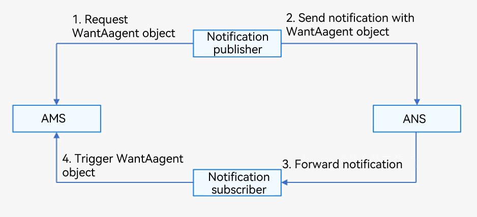

# Adding a WantAgent Object to a Notification

A **WantAgent** object encapsulates an intention to start a specified ability, release a common event, and more. In OpenHarmony, a **WantAgent** object can be passed in a notification from the publisher to the subscriber, so as to trigger the intention specified. For example, you may want the user to start a specific ability by touching the notification published by your application. In this case, you can add a **WantAgent** object that encapsulates such an action to the notification. After receiving the **WantAgent** object, the system triggers it once the user touches the notification from the notification panel, starting the specified ability.

Below you can see the process of adding a **WantAgent** object to a notification. The notification publisher requests a **WantAgent** object from the Ability Manager Service (AMS), and then sends a notification carrying the **WantAgent** object to the home screen. When the user touches the notification from the notification panel on the home screen, the **WantAgent** object is triggered.

  **Figure 1** Publishing a notification with a WantAgent object




## Available APIs

For details about the APIs, see [WantAgent](../reference/apis/js-apis-wantAgent.md).

| Name| Description|
| -------- | -------- |
| getWantAgent(info: WantAgentInfo, callback: AsyncCallback&lt;WantAgent&gt;): void | Creates a **WantAgent** object.|
| trigger(agent: WantAgent, triggerInfo: TriggerInfo, callback?: Callback&lt;CompleteData&gt;): void | Triggers a **WantAgent** object.|
| cancel(agent: WantAgent, callback: AsyncCallback&lt;void&gt;): void | Cancels a **WantAgent** object.|
| getWant(agent: WantAgent, callback: AsyncCallback&lt;Want&gt;): void | Obtains a **WantAgent** object.|
| equal(agent: WantAgent, otherAgent: WantAgent, callback: AsyncCallback&lt;boolean&gt;): void | Checks whether two **WantAgent** objects are equal. |


## How to Develop

1. Import the modules.

   ```ts
   import NotificationManager from '@ohos.notificationManager';
   import wantAgent from '@ohos.app.ability.wantAgent';
   ```

2. Create a **WantAgentInfo** object.

   Scenario 1: Create a [WantAgentInfo](../reference/apis/js-apis-inner-wantAgent-wantAgentInfo.md) object for starting a UIAbility component.

   ```ts
   let wantAgentObj = null; // Save the WantAgent object created. It will be used to complete the trigger operations.
   
   // Set the action type through operationType of WantAgentInfo.
   let wantAgentInfo = {
       wants: [
           {
               deviceId: '',
               bundleName: 'com.example.test',
               abilityName: 'com.example.test.MainAbility',
               action: '',
               entities: [],
               uri: '',
               parameters: {}
           }
       ],
       operationType: wantAgent.OperationType.START_ABILITY,
       requestCode: 0,
       wantAgentFlags:[wantAgent.WantAgentFlags.CONSTANT_FLAG]
   }
   ```

   Scenario 2: Create a [WantAgentInfo](../reference/apis/js-apis-inner-wantAgent-wantAgentInfo.md) object for publishing a [common event](../application-models/common-event-overview.md).

   ```ts
   let wantAgentObj = null; // Save the WantAgent object created. It will be used to complete the trigger operations.
   
   // Set the action type through operationType of WantAgentInfo.
   let wantAgentInfo = {
       wants: [
           {
               action: 'event_name', // Set the action name.
               parameters: {},
           }
       ],
       operationType: wantAgent.OperationType.SEND_COMMON_EVENT,
       requestCode: 0,
       wantAgentFlags: [wantAgent.WantAgentFlags.CONSTANT_FLAG],
   }
   ```

3. Create a **WantAgent** object.

   ```ts
   // Create a WantAgent object.
   wantAgent.getWantAgent(wantAgentInfo, (err, data) => {
       if (err) {
           console.error('[WantAgent]getWantAgent err=' + JSON.stringify(err));
       } else {
           console.info('[WantAgent]getWantAgent success');
           wantAgentObj = data;
       }
   });
   ```

4. Create a **NotificationRequest** object.

   ```ts
   // Create a NotificationRequest object.
   let notificationRequest = {
       content: {
           contentType: NotificationManager.ContentType.NOTIFICATION_CONTENT_BASIC_TEXT,
           normal: {
               title: 'Test_Title',
               text: 'Test_Text',
               additionalText: 'Test_AdditionalText',
           },
       },
       id: 1,
       label: 'TEST',
       wantAgent: wantAgentObj,
   }
   ```

5. Publish a notification that carries the **WantAgent** object.
   
   ```ts
   // Publish a notification.
   NotificationManager.publish(notificationRequest, (err) => {
       if (err) {
           console.error(`[ANS] failed to publish, error[${err}]`);
           return;
       }
       console.info(`[ANS] publish success `);
   });
   ```

6. When the user touches the notification from the notification panel, the system automatically triggers the action specified in the **WantAgent** object.
   
   ```ts
   // Trigger the WantAgent object.
   let triggerInfo = {
       code: 0
   }
   wantAgent.trigger(wantAgentObj, triggerInfo, (completeData) => {
       console.info('[WantAgent]getWantAgent success, completeData: ',  + JSON.stringify(completeData));
   });
   ```
