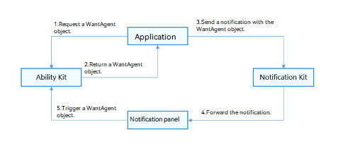

# Adding a WantAgent Object to a Notification

When publishing a notification, if you want users to tap the notification panel to start the target application component or publish a public event, you can use the Ability Kit to apply for [WantAgent](../reference/apis-ability-kit/js-apis-app-ability-wantAgent.md) and encapsulate it into the notification message.

**Figure 1** Publishing a notification with a WantAgent object 
  

## Available APIs

For details about the APIs, see [@ohos.wantAgent (WantAgent)](../reference/apis-ability-kit/js-apis-app-ability-wantAgent.md).

| **API**| **Description**|
| -------- | -------- |
| getWantAgent(info:&nbsp;WantAgentInfo,&nbsp;callback:&nbsp;AsyncCallback&lt;WantAgent&gt;):&nbsp;void | Creates a **WantAgent** object.|

## How to Develop

1. Import the modules.

   ```typescript
   import { notificationManager } from '@kit.NotificationKit';
   import { wantAgent, WantAgent } from '@kit.AbilityKit';
   import { BusinessError } from '@kit.BasicServicesKit';
   import { hilog } from '@kit.PerformanceAnalysisKit';
   
   const TAG: string = '[PublishOperation]';
   const DOMAIN_NUMBER: number = 0xFF00;
   ```

2. Create a **WantAgentInfo** object.

   Scenario 1: Create a [WantAgentInfo](../reference/apis-ability-kit/js-apis-inner-wantAgent-wantAgentInfo.md) object for starting a UIAbility.

   ```typescript
   let wantAgentObj:WantAgent; // Save the created WantAgent object for completing the trigger operations at a later time.
   
   // Set the action type through operationType of WantAgentInfo.
   let wantAgentInfo:wantAgent.WantAgentInfo = {
     wants: [
       {
         deviceId: '',
         bundleName: 'com.samples.notification',
         abilityName: 'SecondAbility',
         action: '',
         entities: [],
         uri: '',
         parameters: {}
       }
     ],
     actionType: wantAgent.OperationType.START_ABILITY,
     requestCode: 0,
     wantAgentFlags:[wantAgent.WantAgentFlags.CONSTANT_FLAG]
   };
   ```

   Scenario 2: Create a [WantAgentInfo](../reference/apis-ability-kit/js-apis-inner-wantAgent-wantAgentInfo.md) object for publishing a [common event](../basic-services/common-event/common-event-overview.md).

   ```typescript
   let wantAgentObj:WantAgent; // Save the created WantAgent object for completing the trigger operations at a later time.
   
   // Set the action type through operationType of WantAgentInfo.
   let wantAgentInfo:wantAgent.WantAgentInfo = {
     wants: [
       {
         action: 'event_name', // Set the action name.
         parameters: {},
       }
     ],
     actionType: wantAgent.OperationType.SEND_COMMON_EVENT,
     requestCode: 0,
     wantAgentFlags: [wantAgent.WantAgentFlags.CONSTANT_FLAG],
   };
   ```

3. Call [getWantAgent()](../reference/apis-ability-kit/js-apis-app-ability-wantAgent.md#wantagentgetwantagent) to create a **WantAgent** object.

   ```typescript
   // Create a WantAgent object.
   wantAgent.getWantAgent(wantAgentInfo, (err: BusinessError, data:WantAgent) => {
     if (err) {
       hilog.error(DOMAIN_NUMBER, TAG, `Failed to get want agent. Code is ${err.code}, message is ${err.message}`);
       return;
     }
     hilog.info(DOMAIN_NUMBER, TAG, 'Succeeded in getting want agent.');
     wantAgentObj = data;
   });
   ```

4. Create a **NotificationRequest** object and publish a notification that carries the **WantAgent** object.

   ```typescript
   // Create a NotificationRequest object.
   let notificationRequest: notificationManager.NotificationRequest = {
     content: {
       notificationContentType: notificationManager.ContentType.NOTIFICATION_CONTENT_BASIC_TEXT,
       normal: {
         title: 'Test_Title',
         text: 'Test_Text',
         additionalText: 'Test_AdditionalText',
       },
     },
     id: 6,
     label: 'TEST',
     // Before using wantAgentObj, ensure that a value has been assigned to it (that is, step 3 is performed).
     wantAgent: wantAgentObj,
   }
   
   notificationManager.publish(notificationRequest, (err: BusinessError) => {
     if (err) {
       hilog.error(DOMAIN_NUMBER, TAG, `Failed to publish notification. Code is ${err.code}, message is ${err.message}`);
       return;
     }
     hilog.info(DOMAIN_NUMBER, TAG, 'Succeeded in publishing notification.');
   });
   ```

5. When the user touches the notification from the notification panel, the system automatically triggers the action specified in the **WantAgent** object.
