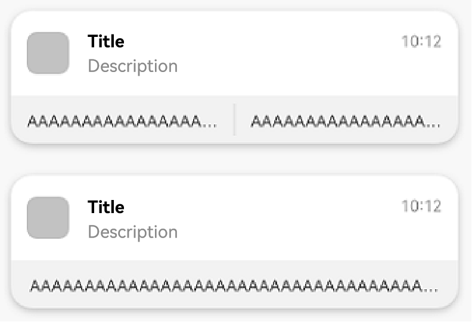

# Adding a WantAgent Object to a Notification

An application requests [WantAgent](../reference/apis-ability-kit/js-apis-app-ability-wantAgent.md) from Ability Kit and encapsulates it into the notification. When a notification is published, the user may tap a message or a button in the notification panel to start the target application or publish a common event.

The following figure shows a notification carrying action buttons.



## Working Principles


## Available APIs

| **API**| **Description**|
| -------- | -------- |
| [publish](../reference/apis-notification-kit/js-apis-notificationManager.md#notificationmanagerpublish-1)(request: NotificationRequest): Promise\<void\>       | Publishes a notification. |
| [getWantAgent](../reference/apis-ability-kit/js-apis-app-ability-wantAgent.md#wantagentgetwantagent)(info:&nbsp;WantAgentInfo,&nbsp;callback:&nbsp;AsyncCallback&lt;WantAgent&gt;):&nbsp;void | Creates a **WantAgent** object.|

## How to Develop

1. Import the modules.

   ```typescript
   import { notificationManager } from '@kit.NotificationKit';
   import { wantAgent, WantAgent } from '@kit.AbilityKit';
   import { BusinessError } from '@kit.BasicServicesKit';
   import { hilog } from '@kit.PerformanceAnalysisKit';
   
   const TAG: string = '[PublishOperation]';
   const DOMAIN_NUMBER: number = 0xFF00;
   ```

2. Create a **WantAgentInfo** object.

   Scenario 1: Create a [WantAgentInfo](../reference/apis-ability-kit/js-apis-inner-wantAgent-wantAgentInfo.md) object for starting a UIAbility.

   ```typescript
   let wantAgentObj:WantAgent; // Save the created WantAgent object for completing the trigger operations at a later time.
   
   // Set the action type through operationType of WantAgentInfo.
   let wantAgentInfo:wantAgent.WantAgentInfo = {
     wants: [
       {
         deviceId: '',
         bundleName: 'com.samples.notification',
         abilityName: 'SecondAbility',
         action: '',
         entities: [],
         uri: '',
         parameters: {}
       }
     ],
     actionType: wantAgent.OperationType.START_ABILITY,
     requestCode: 0,
     actionFlags:[wantAgent.WantAgentFlags.CONSTANT_FLAG]
   };
   ```

   Scenario 2: Create a [WantAgentInfo](../reference/apis-ability-kit/js-apis-inner-wantAgent-wantAgentInfo.md) object for publishing a [common event](../basic-services/common-event/common-event-overview.md).

   ```typescript
   let wantAgentObj:WantAgent; // Save the created WantAgent object for completing the trigger operations at a later time.
   
   // Set the action type through operationType of WantAgentInfo.
   let wantAgentInfo:wantAgent.WantAgentInfo = {
     wants: [
       {
         action: 'event_name', // Set the action name.
         parameters: {},
       }
     ],
     actionType: wantAgent.OperationType.SEND_COMMON_EVENT,
     requestCode: 0,
     actionFlags: [wantAgent.WantAgentFlags.CONSTANT_FLAG],
   };
   ```

3. Call [getWantAgent()](../reference/apis-ability-kit/js-apis-app-ability-wantAgent.md#wantagentgetwantagent) to create a **WantAgent** object.

   ```typescript
   // Create a WantAgent object.
   wantAgent.getWantAgent(wantAgentInfo, (err: BusinessError, data:WantAgent) => {
     if (err) {
       hilog.error(DOMAIN_NUMBER, TAG, `Failed to get want agent. Code is ${err.code}, message is ${err.message}`);
       return;
     }
     hilog.info(DOMAIN_NUMBER, TAG, 'Succeeded in getting want agent.');
     wantAgentObj = data;
   });
   ```

4. Create a **NotificationRequest** object and publish a notification carrying **WantAgent**.

   > **NOTE**
   >
   > - If **WantAgent** is encapsulated in a notification, **WantAgent** is triggered when the notification is tapped. If a notification contains action buttons, the buttons are displayed when the notification is tapped and **WantAgent** is triggered when the notification is tapped again.
   >
   > - If **WantAgent** is encapsulated in the action buttons, the buttons are displayed under the notification when the notification is tapped and **WantAgent** is triggered when a button is tapped.

   ```typescript
   // Create the NotificationActionButton object.
   let actionButton: notificationManager.NotificationActionButton = {
     title: 'Test_Title',
     // Before using wantAgentObj, ensure that a value has been assigned to it (that is, step 3 is performed).
     // WantAgent of the notification buttons
     wantAgent: wantAgentObj
   }
   
   // Create a NotificationRequest object.
   let notificationRequest: notificationManager.NotificationRequest = {
     content: {
       notificationContentType: notificationManager.ContentType.NOTIFICATION_CONTENT_BASIC_TEXT,
       normal: {
         title: 'Test_Title',
         text: 'Test_Text',
         additionalText: 'Test_AdditionalText',
       },
     },
     id: 6,
     // WantAgent of the notification
     wantAgent: wantAgentObj,
     // Action buttons
     actionButtons: [actionButton],
   }
   
   notificationManager.publish(notificationRequest, (err: BusinessError) => {
     if (err) {
       hilog.error(DOMAIN_NUMBER, TAG, `Failed to publish notification. Code is ${err.code}, message is ${err.message}`);
       return;
     }
     hilog.info(DOMAIN_NUMBER, TAG, 'Succeeded in publishing notification.');
   });
   ```
<!--RP1-->

## Sample Code

  - [Custom Notification](https://gitcode.com/openharmony/applications_app_samples/blob/master/code/BasicFeature/Notification/CustomNotification/README.md)
<!--RP1End-->
