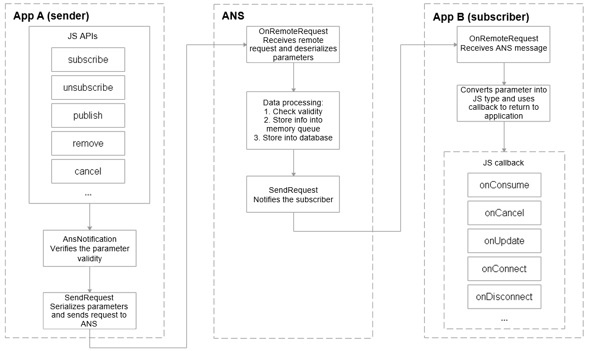

# Notification Development

## When to Use

OpenHarmony uses the Advanced Notification Service (ANS) to manage notifications, with support for various notification types, including text, long text, multi-text, image, social, and media. All system services and applications can send notifications through the notification API. Users can view all notifications on the system UI.

Below are some typical use cases for notifications:

- Display received SMS messages and instant messages.
- Display push messages of applications, such as advertisements and version updates.
- Display ongoing events, such as navigation information and download progress.


## Notification Service Process

The notification service process involves the ANS subsystem, notification sender, and notification subscriber.

A notification is generated by the notification sender and sent to the ANS through inter-process communication (IPC). The ANS then distributes the notification to the notification subscriber.

System applications also support notification-related configuration options, such as switches. The system configuration initiates a configuration request and sends the request to the ANS for storage in the memory and database.




## Available APIs

Certain APIs can be invoked only by system applications that have been granted the **SystemCapability.Notification.Notification** permission. The APIs use either a callback or promise to return the result. The tables below list the APIs that use a callback, which provide same functions as their counterparts that use a promise. For details about the APIs, see the [API document](https://gitee.com/openharmony/docs/blob/master/en/application-dev/reference/apis/js-apis-notification.md).

**Table 1** APIs for notification enabling

| API                                                      | Description            |
| ------------------------------------------------------------ | ---------------- |
| isNotificationEnabled(bundle: BundleOption, callback: AsyncCallback<boolean>): void | Checks whether notification is enabled.|
| enableNotification(bundle: BundleOption, enable: boolean, callback: AsyncCallback<void>): void | Sets whether to enable notification.    |

If the notification function of an application is disabled, it cannot send notifications.


**Table 2** APIs for notification subscription

| API                                                      | Description            |
| ------------------------------------------------------------ | ---------------- |
| subscribe(subscriber: NotificationSubscriber, info: NotificationSubscribeInfo, callback: AsyncCallback<void>): void | Subscribes to a notification with the subscription information specified.|
| subscribe(subscriber: NotificationSubscriber, callback: AsyncCallback<void>): void | Subscribes to all notifications.    |
| unsubscribe(subscriber: NotificationSubscriber, callback: AsyncCallback<void>): void | Unsubscribes from a notification.    |

The subscription APIs support subscription to all notifications or notifications from specific applications.


**Table 3** Notification subscription callbacks

| API                                          | Description            |
| ------------------------------------------------ | ---------------- |
| onConsume?:(data: SubscribeCallbackData) => void | Callback for receiving notifications.        |
| onCancel?:(data: SubscribeCallbackData) => void  | Callback for canceling notifications.    |
| onUpdate?:(data: NotificationSortingMap) => void | Callback for notification sorting updates.|
| onConnect?:() => void;                           | Callback for subscription.    |
| onDisconnect?:() => void;                        | Callback for unsubscription.    |


**Table 4** APIs for notification sending

| API                                                      | Description                    |
| ------------------------------------------------------------ | ------------------------ |
| publish(request: NotificationRequest, callback: AsyncCallback<void>): void | Publishes a notification.                |
| publish(request: NotificationRequest, userId: number, callback: AsyncCallback<void>): void | Publishes a notification to the specified user.        |
| cancel(id: number, label: string, callback: AsyncCallback<void>): void | Cancels a specified notification.          |
| cancelAll(callback: AsyncCallback<void>): void;              | Cancels all notifications published by the application.|

The **publish** API that carries **userId** can be used to publish notifications to subscribers of a specified user.


## Development Guidelines

The notification development process generally involves three aspects: subscribing to notifications, enabling the notification feature, and publishing notifications.

### Modules to Import

```js
import Notification from '@ohos.notification';
```


### Subscribing to Notifications

The notification recipient preferentially initiates a notification subscription request to the notification subsystem.

```js
var subscriber = {
    onConsume: function (data) {
      let req = data.request;
      console.info('===>onConsume callback req.id: ' + req.id);
    },
    onCancel: function (data) {
      let req = data.request;
      console.info('===>onCancel callback req.id: : ' + req.id);
    },
    onUpdate: function (data) {
      console.info('===>onUpdate in test===>');
    },
    onConnect: function () {
      console.info('===>onConnect in test===>');
    },
    onDisconnect: function () {
      console.info('===>onDisConnect in test===>');
    },
    onDestroy: function () {
      console.info('===>onDestroy in test===>');
    },
  };

  Notification.subscribe(subscriber, (err, data) => { // This API uses an asynchronous callback to return the result.
    if (err.code) {
      console.error('===>failed to subscribe because ' + JSON.stringify(err));
      return;
    }
    console.info('===>subscribeTest success : ' + JSON.stringify(data));
  });
```


### Publishing Notifications

Before publishing a notification, check whether the notification feature is enabled for the respective application. By default, the feature is disabled for newly installed apps.

##### Enabling Notification

Check whether notification is enabled.

```js
var bundle = {
    bundle: "bundleName1",
}
Notification.isNotificationEnabled(bundle).then((data) => {
	console.info("===>isNotificationEnabled success===>");
});
```

If the check result is **false**, notification is disabled. In this case, enable it.

```js
var bundle = {
    bundle: "bundleName1",
}
Notification.enableNotification(bundle, true, async(err) => {
    console.log("===>enableNotification success===>");
});
```


##### Publishing Notifications

To publish a notification, create a **NotificationRequest** object and set attributes such as the notification type, title, and content. In the following examples, a normal text notification and a notification containing a **WantAgent** are being published.

Normal Text Notification

```js
// Create a NotificationRequest object.
var notificationRequest = {
  	id: 1,
  	content: {
  		contentType: notify.ContentType.NOTIFICATION_CONTENT_BASIC_TEXT,
  		normal: {
  			title: "test_title",
  			text: "test_text",
  			additionalText: "test_additionalText"
  		}
  	}
}

// Publish the notification.
Notification.publish(notificationRequest) .then((data) => {
	console.info('===>publish promise success req.id : ' + notificationRequest.id);
}).catch((err) => {
	console.error('===>publish promise failed because ' + JSON.stringify(err));
});
```


Notification Containing WantAgent.

For details about how to use **WantAgent**, see [WantAgent Development](https://gitee.com/openharmony/docs/blob/master/en/application-dev/ability/wantagent.md).

- Create a **WantAgent** object.

```js
import wantAgent from '@ohos.wantAgent';
import { OperationType, Flags } from '@ohos.wantagent';

// WantAgentInfo object
var wantAgentInfo = {
    wants: [
        {
            deviceId: 'deviceId',
            bundleName: 'com.example.myapplication',
            abilityName: 'com.example.myapplication.MainAbility',
            action: 'REMINDER_EVENT_REMOVE_NOTIFICATION',
            entities: ['entity1'],
            type: 'MIMETYPE',
            uri: 'key={true,true,false}',
            parameters: { myKey0: 1111 },
        }
    ],
    operationType: OperationType.START_ABILITIES,
    requestCode: 0,
    wantAgentFlags:[Flags.UPDATE_PRESENT_FLAG]
}

// WantAgent object
var WantAgent;

// getWantAgent callback
function getWantAgentCallback(err, data) {
    console.info("===>getWantAgentCallback===>");
    if (err.code == 0) {
    	WantAgent = data;
    } else {
        console.info('----getWantAgent failed!----');
    }
}

// Obtain the WantAgent object.
wantAgent.getWantAgent(wantAgentInfo, getWantAgentCallback)
```

- Publish the notification.

```js
// Create a NotificationRequest object.
var notificationRequest = {
  content: {
    contentType: notify.ContentType.NOTIFICATION_CONTENT_BASIC_TEXT,
    normal: {
      title: "AceApplication_Title",
      text: "AceApplication_Text",
      additionalText: "AceApplication_AdditionalText"
    },
  },
  id: 1,
  label: 'TEST',
  wantAgent: WantAgent,
  slotType: notify.SlotType.OTHER_TYPES,
  deliveryTime: new Date().getTime()
}

// Publish the notification.
Notification.publish(notificationRequest) .then((data) => {
	console.info('===>publish promise success req.id : ' + notificationRequest.id);
}).catch((err) => {
	console.error('===>publish promise failed because ' + JSON.stringify(err));
});
```


- Cancel the notification.

An application can cancel a single notification or all notifications. An application can cancel only the notifications published by itself.

```js
// cancel callback
function cancelCallback(err) {
	console.info("===>cancelCallback===>");
}

Notification.cancel(1, "label", cancelCallback)
```


## Development Example

The following sample is provided to help you better understand how to develop notification functions:

- notification

This sample shows how to use **Notification** APIs in Extended TypeScript (eTS) to subscribe to, unsubscribe from, publish, and cancel notifications as well as enable the notification feature and check whether the feature is enabled.
