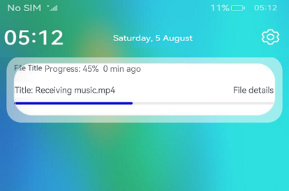

# Publishing a Progress Notification


The progress notification is a commonly used notification type, mainly used to display the progress of an ongoing operation, such as file downloading. When publishing a progress notification through the notification subsystem, you can use the readily available template by specifying the related attributes, such as the template name and template data.

In the [NotificationTemplate](../reference/apis/js-apis-inner-notification-notificationTemplate.md), which can only be of the progress type, **data** indicates custom template data.

**Figure 1** Progress notification




## Available APIs

 

| Name| Description|
| -------- | -------- |
| isSupportTemplate(templateName: string, callback: AsyncCallback&lt;boolean&gt;): void | Checks whether a specific template is supported. This API uses an asynchronous callback to return the result. For details, see [isSupportTemplate()](../reference/apis/js-apis-notificationManager.md#notificationmanagerissupporttemplate).<br>Only the progress-type template is supported.|


## How to Develop

1. [Request notification authorization](notification-enable.md). Your application can send notifications only after obtaining user authorization. 

2. Import the module.
   
   ```ts
   import notificationManager from '@ohos.notificationManager';
   import Base from '@ohos.base';
   ```

3. Check whether a specific template is supported. In this example, the template of the **downloadTemplate** type is checked.
   
   ```ts
   notificationManager.isSupportTemplate('downloadTemplate').then((data:boolean) => {
     console.info(`[ANS] isSupportTemplate success`);
     console.info('Succeeded in supporting download template notification.');
     let isSupportTpl: boolean = data; // The value true means that the template of the downloadTemplate type is supported, and false means the opposite.
   }).catch((err:Base.BusinessError) => {
     console.error(`Failed to support download template notification. Code is ${err.code}, message is ${err.message}`);
   });
   ```
   
   > **NOTE**
   > Proceed with the step below only when the specified template is supported.
   
4. Create a **NotificationRequest** object and publish a progress notification.
   
   ```ts
   let notificationRequest: notificationManager.NotificationRequest = {
     id: 5,
     content: {
       notificationContentType: notificationManager.ContentType.NOTIFICATION_CONTENT_BASIC_TEXT,
       normal: {
         title: 'test_title',
         text: 'test_text',
         additionalText: 'test_additionalText'
       }
     },
     // Create a progress template. The name field has a fixed value of downloadTemplate.
     template: {
       name: 'downloadTemplate',
       data: { title: 'File Title', fileName: 'music.mp4', progressValue: 45 }
     }
   }
   
   // Publish the notification.
   notificationManager.publish(notificationRequest, (err:Base.BusinessError) => {
     if (err) {
       console.error(`Failed to publish notification. Code is ${err.code}, message is ${err.message}`);
       return;
     }
     console.info('Succeeded in publishing notification.');
   });
   ```
