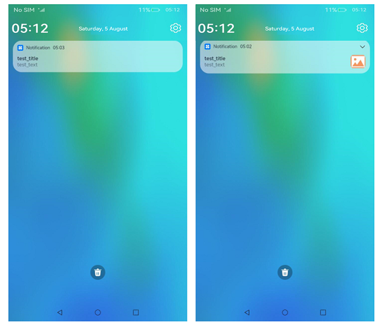
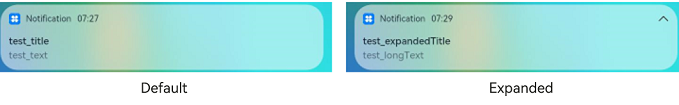
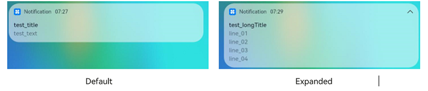
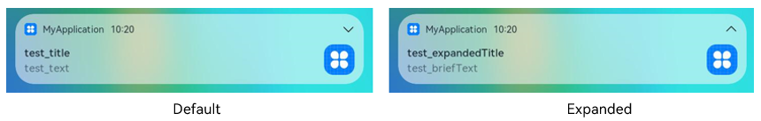

# Publishing a Basic Notification


You can publish basic notifications to send SMS messages, prompt messages, and advertisements. Available content types of basic notifications include normal text, long text, multi-line text, and picture-attached.


  **Table 1** Basic notification content types

| Type| Description|
| -------- | -------- |
| NOTIFICATION_CONTENT_BASIC_TEXT | Normal text notification.|
| NOTIFICATION_CONTENT_LONG_TEXT | Long text notification.|
| NOTIFICATION_CONTENT_MULTILINE | Multi-line text notification.|
| NOTIFICATION_CONTENT_PICTURE | Picture-attached notification.|


Notifications are displayed in the notification panel, which is the only system subscriber to notifications. Below you can see two examples of the basic notification.

**Figure 1** Examples of the basic notification 



## Available APIs

The following table describes the APIs for notification publishing. You specify the notification type by setting the [NotificationRequest](../reference/apis/js-apis-notificationManager.md#notificationrequest) parameter in the APIs.

| Name| Description|
| -------- | -------- |
| publish(request: NotificationRequest, callback: AsyncCallback&lt;void&gt;): void | Publishes a notification.                |
| cancel(id: number, label: string, callback: AsyncCallback&lt;void&gt;): void | Cancels a notification.          |
| cancelAll(callback: AsyncCallback&lt;void&gt;): void; | Cancels all notifications published by the application.|


## How to Develop

1. [Enable notification](notification-enable.md). An application can use the notification feature only after being authorized by the user.

2. Import the module.
   
   ```ts
   import notificationManager from '@ohos.notificationManager';
   ```

3. Create a **NotificationRequest** object and publish a progress notification.
   - A normal text notification consists of the **title**, **text**, and **additionalText** parameters, of which **title** and **text** are mandatory. The value of these parameters contains less than 200 bytes.
     
      ```ts
      let notificationRequest = {
        id: 1,
        content: {
      	contentType: notificationManager.ContentType.NOTIFICATION_CONTENT_BASIC_TEXT, // Basic notification
      	normal: {
      	  title: 'test_title',
      	  text: 'test_text',
      	  additionalText: 'test_additionalText',
      	}
        }
      }
      
      notificationManager.publish(notificationRequest, (err) => {
          if (err) {
              console.error(`[ANS] failed to publish, error[${err}]`);
              return;
          }
          console.info(`[ANS] publish success`);
      });
      ```

      Below is an example of the normal text notification. 
     
   - In addition to the parameters in the normal text notification, the long text notification provides the **longText**, **briefText**, and **expandedTitle** parameters. The value of **longText** contains a maximum of 1024 bytes, while that of any other parameters contains less than 200 bytes. By default, a long-text notification looks in the same way as a normal text notification. When expanded, the notification displays the title and content specified in **expandedTitle** and **longText**, respectively.
     
      ```ts
      let notificationRequest = {
        id: 1,
        content: {
      	contentType: notificationManager.ContentType.NOTIFICATION_CONTENT_LONG_TEXT, // Long-text notification
      	longText: {
      	  title: 'test_title',
      	  text: 'test_text',
      	  additionalText: 'test_additionalText',
      	  longText: 'test_longText',
      	  briefText: 'test_briefText',
      	  expandedTitle: 'test_expandedTitle',
      	}
        }
      }
      
      // Publish the notification.
      notificationManager.publish(notificationRequest, (err) => {
          if (err) {
              console.error(`[ANS] failed to publish, error[${err}]`);
              return;
          }
          console.info(`[ANS] publish success`);
      });
      ```
   
      Below is an example of the long-text notification. 
     
   - In addition to the parameters in the normal text notification, the multi-line text notification provides the **lines**, **briefText**, and **longTitle** parameters. The value of these parameters contains less than 200 bytes. By default, a multi-line notification looks in the same way as a normal text notification. When expanded, the notification displays the title and content specified in **longTitle** and **lines**, respectively.
     
      ```ts
      let notificationRequest = {
        id: 1,
        content: {
      	contentType: notificationManager.ContentType.NOTIFICATION_CONTENT_MULTILINE, // Multi-line text notification
      	multiLine: {
      	  title: 'test_title',
      	  text: 'test_text',
      	  briefText: 'test_briefText',
      	  longTitle: 'test_longTitle',
      	  lines: ['line_01', 'line_02', 'line_03', 'line_04'],
      	}
        }
      }
      
      // Publish the notification.
      notificationManager.publish(notificationRequest, (err) => {
        if (err) {
      	console.error(`[ANS] failed to publish, error[${err}]`);
      	return;
        }
        console.info(`[ANS] publish success`);
      });
      ```
   
      Below is an example of the multi-line notification. 
     
   - In addition to the parameters in the normal text notification, the picture-attached text notification provides the **picture**, **briefText**, and **expandedTitle** parameters. The value of **picture** is a pixel map that does not exceed 2 MB.
     
      ```ts
      let notificationPicture: PixelMap = undefined; // Obtain the pixel map information.
      let notificationRequest = {
          id: 1,
          content: {
      	contentType: notificationManager.ContentType.NOTIFICATION_CONTENT_PICTURE,
              picture: {
                title: 'test_title',
                text: 'test_text',
                additionalText: 'test_additionalText',
                briefText: 'test_briefText',
                expandedTitle: 'test_expandedTitle',
                picture: notificationPicture
              }
          }
      }
      
      // Publish the notification.
      notificationManager.publish(notificationRequest, (err) => {
          if (err) {
      	console.error(`[ANS] failed to publish, error[${err}]`);
      	return;
          }
          console.info(`[ANS] publish success `);
      });
      ```
   
      Below is an example of the picture-attached notification. 
     
