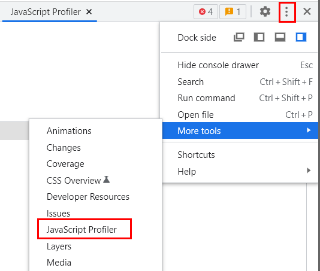
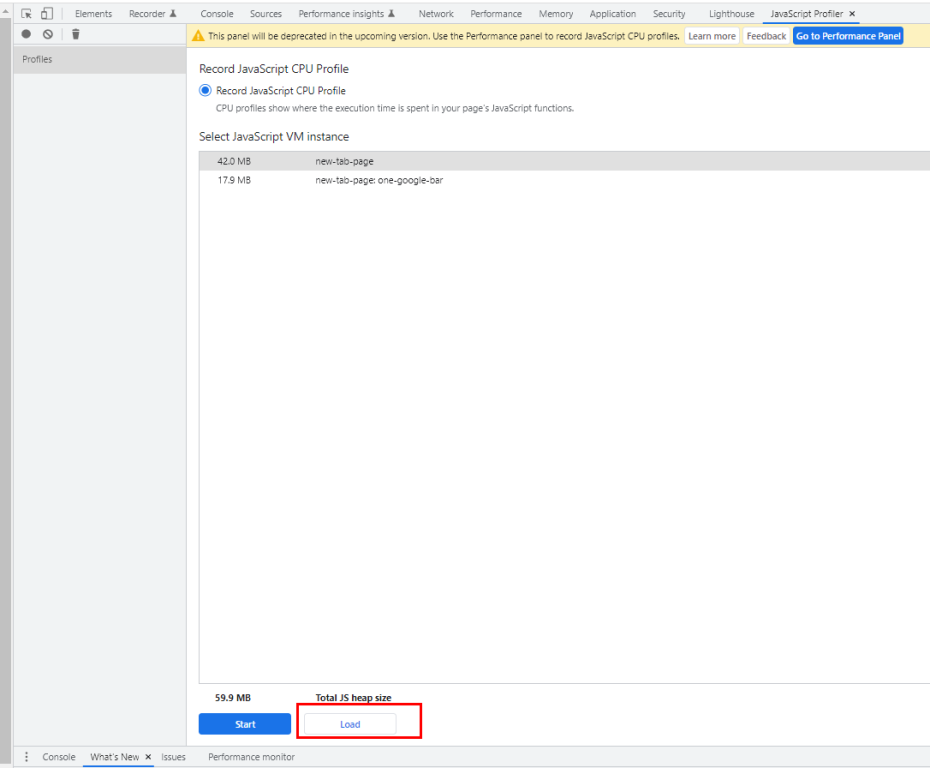
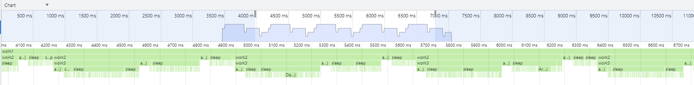
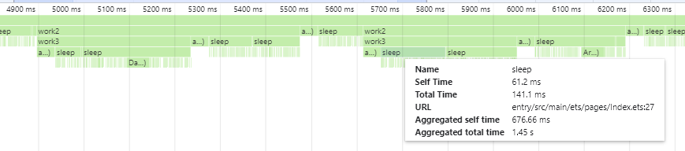
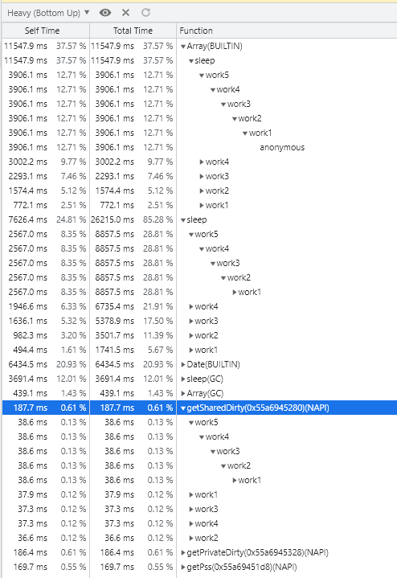
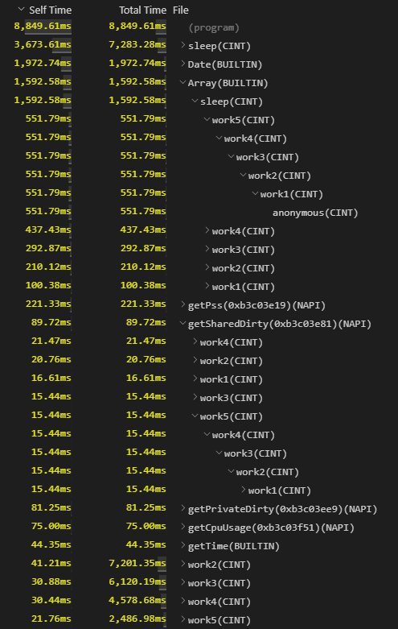
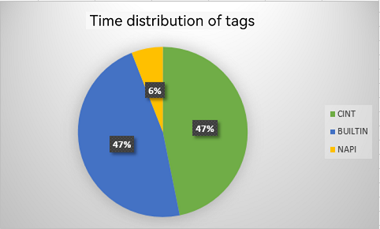
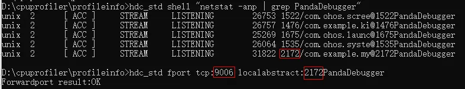
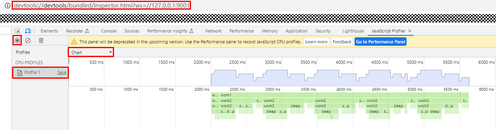

# CPU Profiler

## Introduction

CPU Profiler provides insights into your application's performance. It can measure the time spent in functions at different layers of the call stack without instrumentation, and display the profile data in the timeline.

In this document, you can learn how to get the most out of this tool – inspect the timing and time consumption of TS/JS code and NAPI code, identify hotspot functions and performance bottlenecks, and make informed improvements.

## Data Visualization

Profile data from CPU Profiler can be visualized in two places: **DevEco Studio** > **Profiler** > **Time** > **ArkTS Callstack** and **Chrome** > **JavaScript Profiler**. The former provides two views: **ArkTS Callstack** and **Details**. The latter provides three views: **Chart**, **Heavy**, and **Tree**.

### DevEco Studio Profiler Views

> **NOTE**
>
> To use Profiler, your DevEco Studio must be 4.0 beta2 or later.  

#### ArkTS Callstack View

In the **ArkTS Callstack** view, you can discover the function that is being executed or the phase it is in along the time axis. In terms of functions, the representation can be understood as the top of the call stack over time. You can press and hold **Ctrl** and move the mouse scroll wheel to zoom in on or zoom out of a segment.

Native APIs (NAPIs) are marked yellow in the timeline. You can check the native call stack of these APIs in the **Details** view.

Figure 1 ArkTS Callstack view


#### Details View

You can access the **Details** view by clicking any time bar in the timeline or selecting a time range. The **Details** view, shown at the bottom of the page, consists of two panes. The left pane shows the complete call chains of the functions represented by the time bar or time range. The right pane, **Heaviest Stack**, shows the most stack-hungry call chains.

Figure 2 Details view


As shown above, we can see not only the JS call stack, but also the C++ call stack in the native implementation of the NAPI.

For a JS method or a custom native method, you can double-click the line where the method is located in **Details** to navigate to the source code of the method.

> **NOTE**
>
> The line of code you navigate to here is the first line of the executable code in the method.

### Chrome JavaScript Profiler Views

By default, JavaScript Profiler of the Chrome browser uses V8's sample-based profiler to capture web page JS profile data. You can import the profile data (in .cpuprofile format) from the TS/JS CPU Profiler to JavaScript Profiler for analysis.

To open JavaScript Profiler and import data in Chrome, press **F12** and choose **More tools** > **JavaScript Profiler** > **Load**.

The following figure shows this procedure.

Figure 3 Opening JavaScript Profiler



Figure 4 Loading .cpuprofile files



If JavaScript Profiler cannot be found, select the option shown below and press **F12** to try again.

Figure 5 Enabling JavaScript Profiler


As aforementioned, JavaScript Profiler comes in three views: **Chart**, **Heavy**, and **Tree**.

#### Chart

Figure 6 Chart overview



The **Chart** view contains a flame graph that visualizes the stack traces of the profiled application. Time 0 on the time axis indicates when data collection starts. You can move the mouse scroll wheel to zoom in.

Figure 7 Chart details



Hover on a function to view the function details, which include the following fields:

- **Name**: function name, followed by a tag in parentheses. The tag indicates the function type. For details, see [Description of Function Name Tags](#description-of-function-name-tags).

- **Self Time**: amount of time, in milliseconds, spent in the function within its own stack frame, excluding the time spent in other functions it calls. The calculation formula is as follows: Total amount of time the stack frame takes to execute – Amount of time spent in downstream function calls.

- **Total Time**: total amount of time, in milliseconds, spent in the function, including the time spent in other functions it calls.

- **URL**: location of the function in the TS/JS code, in the format of "file path: line number." Wherein, the line number refers to the line number of the function header.

    > **NOTE**
    >
    > - As sourcemap conversion is not yet performed on some function URLs, these URLs are in the build directory.
    >
    > - Though the aforementioned line number, by specification, refers to the line number of the function header. Currently, it actually refers to the number of the first line of the executable code in the function.

- **Aggregated self time**: sum of all self times of the function throughout the sampling process, in milliseconds. Only the function calls under the same call stack are counted.

- **Aggregated total time**: sum of all total times of the function throughout the sampling process, in milliseconds. Only the function calls under the same call stack are counted.

#### Heavy

The **Heavy** view lists the top functions of all call stacks. It can be seen as a **bottom-up view** of the flame graph. From this view you can initially see the end functions of call chains and their self time. The proportions of all self times add up to 100%.

If you click the down arrow of a function to expand it, you can find its complete call chain, which may contain multiple call chains, all of which the function is called.

You can sort functions in this view by self time. The first one displayed indicates that it has the longest self time and may be worth further examination.

Below are **Heavy** views from Chrome and Visual Studio Code, both illustrating the parsing result of the same .cpuprofile file. Noticeably, the time from the parsing results is different, which is caused by difference in the calculation method.

The time in the Chrome **Heavy** view is obtained by multiplying the hit ratio of the function by the total time, while that in the Visual Studio Code **Heavy** view is the actual time spent.

In light of this, for the purpose of analysis accuracy, it is recommended that you use Visual Studio Code for parsing. Simply open the .cpuprofile file in the tool.

Figure 8 Chrome Heavy view



Figure 9 Visual Studio Code Heavy view



#### Tree

The **Tree** view lists the bottom functions of all call stacks. It can be seen as a **top-down view** of the flame graph. From this view you can initially see the start functions of call chains and their total time. The proportions of all total times add up to 100%.

If you click the down arrow of a function to expand it, you can find its complete call chain, which may contain multiple call chains, all of which start from the function.

You can sort functions in this view by total time. The first one displayed indicates that it has the longest total time and may be worth further examination.

Figure 10 Tree view


### Description of Function Name Tags

When represented in a view, the function name tag may be preceded by the function name, as in **func1(AOT)**, or appear on its own, as in **(program)**.

#### Tags Preceded by Function Names

Tags preceded by function names are: (NAPI), (ARKUI_ENGINE), (BUILTIN), (GC), (AINT), (CINT), (AOT), and (RUNTIME). They can be used as reference for category-specific performance analysis. The last four tags are invisible by default when profile data is collected in non-CLI mode. To enable them, run the **hdc shell param set persist.ark.properties 0x505c; hdc shell reboot** command.

- **(NAPI)**: system-provided native APIs or native APIs customized in DevEco Studio, for example, **testNapi.add()** in the template native C++ application.

- **(ARKUI_ENGINE)**: ArkUI component implemented by native code, for example, **onClick()**. Currently, functions labeled with this tag do not provide a function name.

- **(BUILTIN)**: JS standard library interface provided by the virtual machine (VM) and implemented by native code, for example, **JSON.stringify()**.

- **(GC)**: garbage collection phase.

- **(AINT)**: TS/JS method, which is interpreted and executed by the assembly interpreter of the VM.

- **(CINT)**: TS/JS method, which is interpreted and executed by the C interpreter of the VM.

- **(AOT)**: TS/JS method, which is compiled into machine code before it is executed, by using the Ahead of Time (AOT) compiler of the VM. When in compliance with the programming specifications, AOT can fully accelerate compilation, with execution time faster than that of interpretation.

- **(RUNTIME)**: method that is called by native APIs (NAPI, ARKUI_ENGINE, BUILTIN) and that calls the internal runtime code of the VM.

#### Tags Standing on Their Own

The tags standing on their own represent a type of special node or phase, not actual functions. These tags are (root), (program), and (idle).

- **(root)**: root node, which is the parent node of the **program** node, **idle** node, and all stack bottoms. It can be seen as the upper layer of the main function.

- **(program)**: phase where the application executes only native code (no JS code is executed, no JS calls native code, and no native code calls JS). At this phase, the application may be executing code at the system framework layer.

- **(idle)**: phase where the profiled thread is not executing any task or is not in the running state, and does not occupy the CPU.

    > **NOTE**
    >
    > Currently, the (idle) phase is included in the (program) phase and not separately counted.

#### Time Distribution of Tags

To inspect the time distribution of tags, first open the .cpuprofile file in JSON format. At the start of the file you can find the execution time (in microseconds) of functions by tag, with the (idle), (root), and (program) tags grouped under the **otherTime** field. Based on the preceding information, you can work out the time distribution of tags to provide reference for performance analysis.

Figure 11 Example of time distribution of tags



## Data Collection Methods

### Usage of Data Collection Methods

| Collection Method      | [DevEco Studio Profiler](#collecting-data-using-deveco-studio-profiler) | [JavaScript Profiler](#collecting-data-using-chrome-javascript-profiler) | [hdc shell](#collecting-data-using-hdc-shell-commands) | [Instrumentation](#collecting-data-using-instrumentation) |
| -------------- | ------------------------------------------------------- | --------------------------------------------------------------- | ------------------------------- | --------------------------------- |
| Debug-type applications     | Supported                                                   | Supported                                                           | Supported                           | Supported                             |
| Release-type application   | Not supported currently                                               | Not supported currently                                                       | Supported                           | Supported                             |
| Main thread    | Supported                                                   | Supported                                                           | Supported                           | Supported                             |
| Worker thread| Not supported currently                                               | Supported                                                           | Supported                           | Supported                             |
| Data after application startup| Supported                                                   | Supported                                                           | Supported                           | Supported                             |
| Cold start data| Not supported currently                                               | Not supported                                                         | Supported                           | Supported                             |

### Collecting Data Using DevEco Studio Profiler

1. Start the target application, open DevEco Studio, and make sure the target device is connected (the device SN is displayed in the upper right corner).

2. Choose **Profiler** > **Time**, select the target device and application, and create a time session, as shown in the following figure.

   Figure 12 Using DevEco Studio Profiler

   

3. Click **Start Recording**. If the arrow changes to a square, the recording starts.

4. Interact with the application to reproduce the scenario to be analyzed.

5. Click the recording button again. If the square turns gray, the recording ends.

6. Select **ArkTS Callstack** and then select a time range or directly select a function for analysis. For details, see [DevEco Studio Profiler Views](#deveco-studio-profiler-views).

### Collecting Data Using Chrome JavaScript Profiler

1. Start the application. Run the following command to obtain a list of the application thread IDs. In the list, the long IDs (whose length is twice the length of short IDs) are of Worker threads.

    ```shell
    hdc shell "netstat -anp | grep PandaDebugger"
    ```

2. Bind thread IDs and port numbers. To collect data for different Worker threads at once, bind them to different port numbers and open multiple Chrome windows.

    > **NOTE**
    >
    > - To avoid conflicts, select larger port numbers. Port 9006 is used in this example.
    >
    > - The port number needs to be rebound each time the process is disconnected or exited.
    >
    > -  

    ```shell
    hdc fport tcp:9006 localabstract:2172PandaDebugger
    ```

   Figure 13 Port mapping

   

3. Visit **devtools://devtools/bundled/inspector.html?ws=//127.0.0.1:9006** from Chrome to access the JavaScript Profiler page.

4. Click the recording button in the upper left corner. If the button turns red, the recording starts.

5. Interact with the application to reproduce the scenario to be analyzed.

6. Click the recording button again. If the button turns gray, the recording ends.

7. Click a profile in the left pane. The profile data is then displayed in the right pane, in a chart or flame graph, depending on your selection. For details, see [Chrome JavaScript Profiler Views](#chrome-javascript-profiler-views).

    Figure 14 JavaScript Profile view

   

### Collecting Data Using hdc shell Commands

1. Set VM parameters as needed.

   - Collect cold start data.

     ```shell
     # Collect cold start data of the main thread only.
     hdc shell param set persist.ark.properties 0x705c
     # Collect cold start data of the Worker thread only.
     hdc shell param set persist.ark.properties 0x1505c
     # Collect cold start data of both the main and Worker threads.
     hdc shell param set persist.ark.properties 0x1705c
     ```

   - Collect data for any phase after application startup.

     ```shell
     # Collect data after startup of the main thread only.
     hdc shell param set persist.ark.properties 0x2505c 
     # Collect data after startup of the Worker thread only.
     hdc shell param set persist.ark.properties 0x4505c
     # Collect data after startup of both the main and Worker threads.
     hdc shell param set persist.ark.properties 0x6505c
     ```

2. (Applicable to collection of cold start data) Set the bundle name of the application to be profiled. In this example, the bundle name is **com.ohos.example**.

    ```shell
    hdc shell param set persist.ark.arkbundlename com.ohos.example
    ```

3. Restart the device.

    ```shell
    hdc shell reboot
    ```

4. Start the application. Data is automatically collected before the application is started.

5. Interact with the application to reproduce the scenario to be analyzed.

6. To collect data for any phase after application startup, run the following command, where **pid** indicates the application process ID:

    ```shell
    hdc shell kill -39 pid
    ```

7. Interact with the application to reproduce the scenario to be analyzed.

8. To stop data collection, run the following command, where **pid** indicates the application process ID:

    ```shell
    hdc shell kill -39 pid
    ```

9. Fetch the .cpuprofile file. The actual file location and file name vary by application. **com.ohos.example** is used as an example.

    > **NOTE**
    >
    > You can repeat steps 6 through 8 multiple times to collect data for multiple phases and generate multiple .cpuprofile files.
    >
    > The count suffix increments by one each time data is collected. The initial count is 1. For collection of cold start data, the file name does not include the count suffix.

    ```shell
    # Main thread:
    # In general cases, for non-system applications, the .cpuprofile file is stored in **/data/app/el2/100/base/<bundle_name>/files/**.
    hdc file recv /data/app/el2/100/base/com.ohos.example/files/com.ohos.example_*count*.cpuprofile ./
    # For system applications, the .cpuprofile file is stored in **/data/app/el2/0/base/<bundle_name>/files/**.
    hdc file recv /data/app/el2/0/base/com.ohos.example/files/com.ohos.example_*count*.cpuprofile ./
    ```

    ```shell
    # Worker thread:
    # In general cases, for non-system applications, the .cpuprofile file is stored in **/data/app/el2/100/base/<bundle_name>/files/**.
    hdc file recv /data/app/el2/100/base/com.ohos.example/files/com.ohos.example_*thread ID*_*count*.cpuprofile ./
    # For system applications, the .cpuprofile file is stored in **/data/app/el2/0/base/<bundle_name>/files/**.
    hdc file recv /data/app/el2/0/base/com.ohos.example/files/com.ohos.example_*thread ID*_*count*.cpuprofile ./
    ```

10. Import the **com.ohos.example.cpuprofile** file to Chrome JavaScript Profiler for analysis. For details, see [Chrome JavaScript Profiler Views](#chrome-javascript-profiler-views).

    Figure 15 Loading the .cpuprofile file

    

### Collecting Data Using Instrumentation

1. Instrument the application, and then package and install the application.

    > **NOTE**
    >
    > When possible, place trace code to a key position that will not be executed repeatedly, for example, the first and last lines in **onClick**. If you perform start and stop operations repeatedly, only the first start and stop operations will be successfully executed.

    ```ts
    import hidebug from '@ohos.hidebug';
    // The parameter is the name of the output file. No suffix is required. This parameter is mandatory.
    hidebug.startJsCpuProfiling("filename");
    // Code block
    // ...
    // Code block
    hidebug.stopJsCpuProfiling("filename");
    ```

2. Interact with the application to reproduce the scenario to be analyzed, and ensure that the trace code is executed properly.

3. Fetch the JSON file and change the file name extension to .cpuprofile. The actual file location and file name vary by application. **com.ohos.example** is used as an example.

    ```shell
    # In general cases, for non-system applications, the .cpuprofile file is stored in **/data/app/el2/100/base/<bundle_name>/files/**.
    hdc file recv /data/app/el2/100/base/com.ohos.example/files/filename.json ./filename.cpuprofile

    # For system applications, the .cpuprofile file is stored in **/data/app/el2/0/base/<bundle_name>/files/**.
    hdc file recv /data/app/el2/0/base/com.ohos.example/files/filename.json ./filename.cpuprofile
    ```

4. Import the **filename.cpuprofile** file to Chrome JavaScript Profiler for analysis. For details, see [Chrome JavaScript Profiler Views](#chrome-javascript-profiler-views).

    Figure 16 Loading the .cpuprofile file

    
