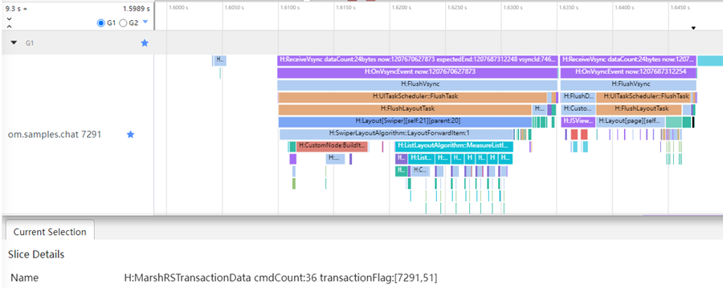
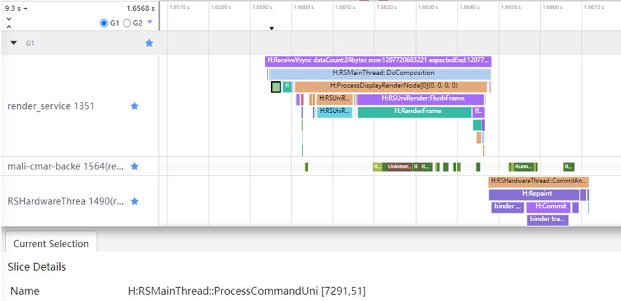
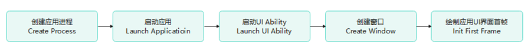

# Application Performance Problem Analysis Guide

## Overview

Developers can analyze common application performance problems from two perspectives: frame loss (such as frame loss during list sliding and discontinuous window animation) and response speed (such as long white screen during application startup and failure to follow hands during sliding). Before analyzing performance problems and verifying the performance optimization solution, developers need to check the performance indicators of applications. This document describes how to detect performance counters related to frame loss and response speed, and then describes how to analyze problems from the two perspectives. 
  
This document uses trace data as the breakthrough point for analysis. You can use the SmartPerf Host or the built-in Frame of DevEco Studio. If developers need to supplement knowledge about the SmartPerf Host tool and Trace, see application development documents such as [Performance Optimization Tool SmartPerf-Host] (performance-optimization-using-smartperf-host.md) and [Common Trace Usage Guide] (common-trace-using-instructions.md).

## Application performance indicators

### Average Frame Rate
Developers can use the HiTrace command tool to capture trace information when applications are refreshed and use the SmartPerf Host integrated performance tool to analyze the information. For example, if the trace information of an application where frame loss occurs is captured, as shown in Figure 1, the average frame rate is calculated as follows:

**Figure 1 Trace data at the point where frame loss occurs**
 
The frame rate is = Occurrences / Selected range.

| Trace tag for reference when calculating the frame rate	| Meaning| 	Number of frames| 	Average Frame Rate |
| --- | --- | --- |--- |
| RSMainThread::DoComposition| 	Layers of Nodes in the Synthesis Rendering Tree| 	20| 	32.5 |
| Repaint	| Hardware Synthesizer Synthesis Drawing | 	18 | 	29.27 |

If the RSMainThread::DoComposition tag is used to simulate the number of frames displayed on the screen from the perspective of the GPU synthesis layer, the average frame rate is 32.5 FPS.

Based on the Repaint tag, simulate the number of frames displayed on the screen from the perspective of hardware synthesizer synthesis and drawing. The average frame rate is 29.27 FPS.

It can be learned that different trace tags are selected to estimate an average frame rate actually perceived by a user, which is slightly different.
 
After learning the estimation principle, it should be noted that the SmartPerf Host can automatically calculate the average frame rate within the selected time range for some tags. For example, if the RSMainThread::DoComposition lane exists in the selected range, the automatic calculation effect of the average frame rate is shown in FIG. 2, and the corresponding average frame rate algorithm is as follows: 

Number of frames = Number of complete DoCompositions within the selected time range. 
Time = Time from the start of the first complete DoComposition to the end of the last complete DoComposition within the selected time range. 

Then, calculate the average frame rate by using the following formula: Average frame rate = Number of frames/Time.

**Figure 2 Automatic calculation of the average frame rate of SmartPerf Host**
 
 
### Completion Delay

The following uses the scenario where you click the application tab to switch to the page as an example. You can use the trace function to analyze the completion delay. 
Before learning how to use Trace to analyze the completion delay of an application, developers need to understand the graphics rendering process in OpenHarmony. In the entire rendering process, the app responds to the screen input event of the user. After processing the event, the app submits the event to the RS. The RS coordinates resources such as the GPU to process the event and sends the final image to the screen for display. FIG. 3 shows several common process/label names and time sequence distribution on the system side, the app side, and the RS side in this process. The following sections briefly describe the behavior of the system, app, and RS in the graphics rendering process based on the trace diagram example and tag description.

**Figure 3 Page redirection completion delay**
 
 
On the system side, as shown in FIG. 4, after the user taps the screen, the CPU receives a hardware interrupt. The aptouch process responds to the interrupt and determines which pixels are tapped and whether the pixels are gestures. If the pixels are gestures, the multimode receives a gesture signal, forms a tap event, and executes event callback registered by the application.

**Figure 4 Trace on the system side**
 
 | System-Side Process Label | 	Meaning | 
 | --- | 	--- | 
 | irp	 | The CPU receives a hardware interrupt. | 
 | aptouch_daemon | 	Respond to the interrupt, determine which pixels are clicked, and determine whether the pixels are gestures. | 
 | mmi_service	 | After receiving a gesture, the multi-mode module executes the callback function registered by the application. | 
 
On the app side, as shown in Figure 5, the app receives a click and runs the callback in onClick. After the measurement and layout are complete, the UI backend engine serializes the component tree information and sends it to the RS side.

**Figure 5 Trace on the app side**
 
 |Example of the trace label on the app side |	Meaning |
 | --- |	--- |
 |DispatchTouchEvent |	The app receives the event and starts to run the onClick callback function. |
 |MarshRSTransactionData cmdCount:36 transactionFlag:[7291, 51] |	The app serializes the component tree information and sends it to the RS. |
 
The Render Service in the graphics and image subsystem is a component responsible for drawing GUI content. As shown in FIG. 6, after receiving serialized component tree information from the app side, the Render Service deserializes the component tree information, updates the unified rendering tree, translates the component tree information into a GPU drawing instruction, and finally draws a layer drawn by the GPU, it is placed on the hardware synthesizer for synthesis, stacked layer by layer, and finally displayed on the screen.

**Figure 6 Trace on the RS side**
 
Example of Trace Labels on the RS Side Meaning
RSMainThread::ProcessCommandUni [7291, 51] Deserialization Component Tree Information
RenderFrame	Translates the rendering tree into GPU drawing instructions.
Repaint	Hardware Synthesizer Synthesis Drawing
 
The trace example tags of serialization on the app side and deserialization on the RS side contain [7291, 51], which are the thread ID and frame ID, respectively. The processed frame information is displayed on the app side and RS side by number. 
 
Different developers analyze problems for different purposes, and focus on different problem levels and entries. Therefore, the start point and end point of the response time may be different. Here, the hardware interrupt of the system behavior is used as the start point, and the hardware synthesizer on the RS side is used as the end point to measure the response time.

**Figure 7 Measurement completion delay**
 
As shown in FIG. 7, a completion delay of the click event is about 138.4 ms.
 
## Application performance

### Analysis Roadmap for Frame Loss

This section uses frame loss in an application sliding scenario as an example to describe how to analyze application-side problems.

#### Required Information

**Determine the problem symptom.**

What are the user environment version and data volume? What operations did the user perform? Can the problem be reproduced locally? What is the recurrence probability?

**Capturing Required Log Information**

Observable data such as HiTrace, HiPerf, cpuProfiler, and common logs.

#### Problem Analysis

There are many causes for application frame loss, which may be caused by the application itself, system, or hardware layer. Different stalling causes have different symptoms in the trace. Therefore, a large amount of experience is required for identifying stalling causes.
 
Based on the trace data of the app main process and RenderService rendering process, check whether the system and hardware are normal, and then analyze the application cause.
1.	Check the thread status and running core to check whether resources are preempted by other processes. If yes, the system is running properly.

    **Check the thread status.**

    As shown in Figure 8, the application thread is in the Running state most of the time and no special exception occurs.
    **Figure 8 Status of the application main thread at the frame loss point**
    
    
    **Check the running frequency.**

    Check whether key tasks are running on the small core at a low frequency. As shown in Figure 9, the application thread at the frame loss point is similar to that at the previous normal frame, and both run on the big core. For details about the operating frequency, see the Freq Usage information bar, as shown in Figure 10.
    **Figure 9 Running core of the application main thread at the frame loss point**
    
    **Figure 10 Freq Usage frequency information**
    
    To meet the requirements of high performance and low power consumption, the multi-core engineering machine usually adopts the heterogeneous architecture design. Large, medium, and small cores are distinguished based on the CPU frequency.
    
2.	Find the time-consuming part of each frame in the trace, roughly determine whether the problem is caused by the app or RS, and preliminarily locate the cause based on the trace tag. 
    As shown in Figure 11, the orange frame loss position indicates that the time is mainly consumed on the app side, which is caused by the long time required by the BuildLazyItem method. It can be inferred that the time required for drawing the customized component in the item is long when the list is lazy loaded.

    **Figure 11 TimeLine of the application main thread and RenderService thread**
     

3.	Check the ArkTS function call stack information or other log information based on cpuProfiler to check the application code. 
    For example, you can use the Frame tool in DevEco Studio to easily jump back to the source code and locate the customized component that takes a long time to draw.

    **Figure 12 Application information captured by the Frame tool**
     

### Solution
Developers can try to optimize the smoothness of apps from the following aspects:

- If the fault is located on the app side, further review the processing logic in the UI thread to check whether the processing logic is too complex or inefficient. 
- If the problem is caused by the RS side, check whether the GUI layout is too complex. 

Finally, find a proper solution based on the frame freezing cause, service scenario, and API, and use trace data to verify the optimization result.
 
### Analysis of Response Speed Problems

This section uses the response speed in the cold start scenario as an example to describe the analysis roadmap.

#### Required Information

**Determine the problem symptom.**

What are the user environment version and data volume? What operations did the user perform? What phenomena have you experienced? Can the problem be reproduced locally?

**Specify test standards.**

Why do I feel that the performance is poor when I experience this phenomenon? What are the start point and end point for measuring the response speed?

**Capturing Required Log Information**

Observable data such as HiTrace, HiPerf, cpuProfiler, and common logs.

#### Problem Analysis

To analyze the application cold start scenario, developers need to understand the OpenHarmony application startup process, as shown in Figure 13. The process is divided into five phases: 
**Figure 13 OpenHarmony application startup process**
 
1.	AbilityManageService requests AppSpawn to create an application process.
2.	The AppManageService triggers the application startup process and the application process loads the application package.
3.	The AppManageService triggers the Ability startup process, the application process loads Ability resources, and triggers lifecycle callback based on the application lifecycle definition.
4.	Creates a Windows object held by UI Ability.
5.	Draw the first frame of the UI.

The label information in the trace information corresponding to the five phases is as follows:

| Lifecycle	| Trace label| 
| ---	| ---| 
| Creating an Application Process	| AppManageService::StartAbility()| 
| Start application	| OHOS::AppExecFwk::MainTread::HandleLaunchApplication()| 
| Starting the UI Ability	| OHOS::AppExecFwk::MainTread::HandleLaunchAbility()| 
| Creating a Window	| AbilityMonitor::OnWindowStageCreate()| 
| Draw the application UI for the first diagnosis.	| JsRuntime::RunScript() RSMainThread::SendCommands()| 
 
During actual analysis, developers can use the AppStartup template provided by the SmartPerf Host to automatically split each startup phase, as shown in Figure 14. For details about how to use the AppStartup template, see [Performance Optimization Tool SmartPerf-Host] (performance-optimization-using-smartperf-host.md).

**Figure 14 AppStartup swimlane diagram**

 
Based on the trace information in each phase of the app startup, developers can compare the performance of the previous version or competing products to find out the differences and analyze the phase in which the time increases.
 
**Time Required for Analyzing the System**

If the fault is caused by the system, check the corresponding part of the system. Generally, check whether the system is normal. For example:
- Check whether key tasks are running on small cores. (The app thread is in the Running state, but the execution takes a long time.)
- Check whether the frequency is not full. (The app thread is in the Running state, but the execution takes a long time.)
- Check whether the CPU usage is full (a large number of app threads are in the Runnable state).
- Check whether the memory usage is low (the app thread is in the Uninterruptible Sleep state for a large number of times).

**Time Required for Application Analysis**

If the problem is caused by the application, check the corresponding part of the application based on the preceding time-consuming points. For example:
- Check whether the execution of a method takes a long time (the app thread is in the Running state).
- Indicates whether to wait for a subthread or subprocess to return data (the app thread is in the sleep state).

#### Solution

A performance problem point usually involves multiple problems in complex applications. Find out the factors that have the greatest impact and optimize them. Ignore the factors that have little impact. 
If the problem is caused by the system, check whether the problem can be avoided by the application. If the problem cannot be avoided, ask the system to handle the problem. 
If the fault is caused by the application itself, you can view the function invoking information based on cpuProfiler, review the source code, and explore a solution. 
The response speed optimization of applications focuses on the UI, visual effect, and instruction logic. Developers can try to optimize the response speed from the following aspects: 
- UI optimization: Accelerates application drawing performance from the perspective of UI layout rendering, for example, reducing layout nesting, reducing element rendering, and caching UI dynamic effects.
- On-demand loading optimization: The loading of related content is delayed based on the GUI display or module loading requirements to reduce the performance consumption of the first frame page.
- Concurrency optimization: The capability of executing multiple tasks concurrently is used to reduce the overall task execution time during the response.
- Code logic optimization: Reduce redundancy, avoid time consumption, and improve execution efficiency in related life cycles, including making good use of data structures, caching, and optimizing and adjusting time sequences.
- Visual perception optimization: Optimize the interaction design and use dynamic animations to improve users' perception of response speed at the visual level.
Finally, find a proper solution based on the delay cause, service scenario, and API, and use trace data to verify the optimization result.
 

## Summary
This document describes how to detect basic performance indicators corresponding to application problems by analyzing traces. 
For the frame loss problem, shows how to estimate the actual average frame rate perceived by users based on the trace tags of related threads in the Render Service process. 
To solve the response speed problem, this document describes how to estimate the click completion delay perceived by users based on the trace tags related to the OpenHarmony graphics rendering process. 
This article also analyzes common application performance problems from the perspectives of frame loss and response speed. The common steps from the two perspectives are as follows: 
1.	Information preparation: Determine the problem symptom, specify the problem standard, and capture related observability data.
2.	Problem analysis: Based on related observability data, analyze and check hardware and system causes, and then analyze and diagnose application causes to locate faults.
3.	Solution: Analyze and locate the problem, regress the code, find a proper solution based on the service scenario and API, and use related observability data to verify the optimization solution.
