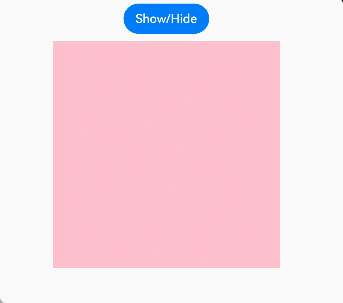

# More Performance Improvement Methods

Poor-performing code may work, but will take away from your application performance. This topic presents a line-up of recommendations that you can take to improve your implementation, thereby avoiding possible performance drop.

## Using Lazy Loading

When developing a long list, use of loop rendering, as in the code snippet below, can greatly slow down page loading and increase server load.

```ts
@Entry
@Component
struct MyComponent {
  @State arr: number[] = Array.from(Array<number>(100), (v:number,k:number) =>k);  // Construct an array of 0 to 99.
  build() {
    List() {
      ForEach(this.arr, (item: number) => {
        ListItem() {
          Text(`item value: ${item}`)
        }
      }, (item: number) => item.toString())
    }
  }
}
```

The preceding code snippet loads all of the 100 list elements at a time during page loading. This is generally not desirable. Instead, what we need is to load data from the data source and create corresponding components on demand. This can be achieved through lazy loading. The sample code is as follows:

```ts
class BasicDataSource implements IDataSource {
  private listeners: DataChangeListener[] = [];
  private originDataArray: string[] = [];

  public totalCount(): number {
    return 0;
  }

  public getData(index: number): string {
    return this.originDataArray[index];
  }

  registerDataChangeListener(listener: DataChangeListener): void {
    if (this.listeners.indexOf(listener) < 0) {
      console.info('add listener');
      this.listeners.push(listener);
    }
  }

  unregisterDataChangeListener(listener: DataChangeListener): void {
    const pos = this.listeners.indexOf(listener);
    if (pos >= 0) {
      console.info('remove listener');
      this.listeners.splice(pos, 1);
    }
  }

  notifyDataReload(): void {
    this.listeners.forEach(listener => {
      listener.onDataReloaded();
    })
  }

  notifyDataAdd(index: number): void {
    this.listeners.forEach(listener => {
      listener.onDataAdd(index);
    })
  }

  notifyDataChange(index: number): void {
    this.listeners.forEach(listener => {
      listener.onDataChange(index);
    })
  }

  notifyDataDelete(index: number): void {
    this.listeners.forEach(listener => {
      listener.onDataDelete(index);
    })
  }

  notifyDataMove(from: number, to: number): void {
    this.listeners.forEach(listener => {
      listener.onDataMove(from, to);
    })
  }
}

class MyDataSource extends BasicDataSource {
  private dataArray: string[] = ['item value: 0', 'item value: 1', 'item value: 2'];

  public totalCount(): number {
    return this.dataArray.length;
  }

  public getData(index: number): string {
    return this.dataArray[index];
  }

  public addData(index: number, data: string): void {
    this.dataArray.splice(index, 0, data);
    this.notifyDataAdd(index);
  }

  public pushData(data: string): void {
    this.dataArray.push(data);
    this.notifyDataAdd(this.dataArray.length - 1);
  }
}

@Entry
@Component
struct MyComponent {
  private data: MyDataSource = new MyDataSource();

  build() {
    List() {
      LazyForEach(this.data, (item: string) => {
        ListItem() {
          Row() {
            Text(item).fontSize(20).margin({ left: 10 })
          }
        }
        .onClick(() => {
          this.data.pushData('item value: ' + this.data.totalCount());
        })
      },(item:string):string => item)
    }
  }
}
```


The preceding code initializes only three list elements during page loading and loads a new list item each time a list element is clicked.

## Setting Width and Height for \<List> Components

When a **\<List>** component is nested within a **\<Scroll>** component, all of its content will be loaded if its width and height is not specified, which may result in performance drop.

>  **NOTE**
>
>  When a **\<List>** component is nested within a **\<Scroll>** component:
>
>  - If the width and height of the **\<List>** component are not set, all its child components are laid out.
>  
>  - If the width and height of the **\<List>** component are set, only child components within its display area are laid out.
>  
>  - When [ForEach](../quick-start/arkts-rendering-control-foreach.md) is used to load child components in the **\<List>** component, all child components are laid out, regardless of whether the width and height are set.
>  
>  - When [LazyForEach](../quick-start/arkts-rendering-control-lazyforeach.md) is used to load child components in the **\<List>** component, all child components are laid out if the component does not have its width and height specified; and only child components within its display area are laid out if the component has its width and height specified.

```ts
class BasicDataSource implements IDataSource {
  private listeners: DataChangeListener[] = [];
  private originDataArray: string[] = [];

  public totalCount(): number {
    return 0;
  }

  public getData(index: number): string {
    return this.originDataArray[index];
  }

  registerDataChangeListener(listener: DataChangeListener): void {
    if (this.listeners.indexOf(listener) < 0) {
      console.info('add listener');
      this.listeners.push(listener);
    }
  }

  unregisterDataChangeListener(listener: DataChangeListener): void {
    const pos = this.listeners.indexOf(listener);
    if (pos >= 0) {
      console.info('remove listener');
      this.listeners.splice(pos, 1);
    }
  }

  notifyDataReload(): void {
    this.listeners.forEach(listener => {
      listener.onDataReloaded();
    })
  }

  notifyDataAdd(index: number): void {
    this.listeners.forEach(listener => {
      listener.onDataAdd(index);
    })
  }

  notifyDataChange(index: number): void {
    this.listeners.forEach(listener => {
      listener.onDataChange(index);
    })
  }

  notifyDataDelete(index: number): void {
    this.listeners.forEach(listener => {
      listener.onDataDelete(index);
    })
  }

  notifyDataMove(from: number, to: number): void {
    this.listeners.forEach(listener => {
      listener.onDataMove(from, to);
    })
  }
}

class MyDataSource extends BasicDataSource {
  private dataArray: Array<string> = new Array(100).fill('test');

  public totalCount(): number {
    return this.dataArray.length;
  }

  public getData(index: number): string {
    return this.dataArray[index];
  }

  public addData(index: number, data: string): void {
    this.dataArray.splice(index, 0, data);
    this.notifyDataAdd(index);
  }

  public pushData(data: string): void {
    this.dataArray.push(data);
    this.notifyDataAdd(this.dataArray.length - 1);
  }
}

@Entry
@Component
struct MyComponent {
  private data: MyDataSource = new MyDataSource();

  build() {
    Scroll() {
      List() {
        LazyForEach(this.data, (item: string, index: number ) => {
          ListItem() {
            Row() {
              Text('item value: ' + item + (index + 1)).fontSize(20).margin(10)
            }
          }
        })
      }
    }
  }
}
```

In the above scenario, you are advised to set the width and height for the **\<List>** component.

```ts
class BasicDataSource implements IDataSource {
  private listeners: DataChangeListener[] = [];
  private originDataArray: string[] = [];

  public totalCount(): number {
    return 0;
  }

  public getData(index: number): string {
    return this.originDataArray[index];
  }

  registerDataChangeListener(listener: DataChangeListener): void {
    if (this.listeners.indexOf(listener) < 0) {
      console.info('add listener');
      this.listeners.push(listener);
    }
  }

  unregisterDataChangeListener(listener: DataChangeListener): void {
    const pos = this.listeners.indexOf(listener);
    if (pos >= 0) {
      console.info('remove listener')
      this.listeners.splice(pos, 1);
    }
  }

  notifyDataReload(): void {
    this.listeners.forEach(listener => {
      listener.onDataReloaded();
    })
  }

  notifyDataAdd(index: number): void {
    this.listeners.forEach(listener => {
      listener.onDataAdd(index);
    })
  }

  notifyDataChange(index: number): void {
    this.listeners.forEach(listener => {
      listener.onDataChange(index);
    })
  }

  notifyDataDelete(index: number): void {
    this.listeners.forEach(listener => {
      listener.onDataDelete(index);
    })
  }

  notifyDataMove(from: number, to: number): void {
    this.listeners.forEach(listener => {
      listener.onDataMove(from, to);
    })
  }
}

class MyDataSource extends BasicDataSource {
  private dataArray: Array<string> = new Array(100).fill('test')

  public totalCount(): number {
    return this.dataArray.length;
  }

  public getData(index: number): string {
    return this.dataArray[index];
  }

  public addData(index: number, data: string): void {
    this.dataArray.splice(index, 0, data);
    this.notifyDataAdd(index);
  }

  public pushData(data: string): void {
    this.dataArray.push(data);
    this.notifyDataAdd(this.dataArray.length - 1);
  }
}

@Entry
@Component
struct MyComponent {
  private data: MyDataSource = new MyDataSource();

  build() {
    Scroll() {
      List() {
        LazyForEach(this.data, (item: string, index: number) => {
          ListItem() {
            Text('item value: ' + item + (index + 1)).fontSize(20).margin(10)
          }.width('100%')
        })
      }.width('100%').height(500)
    }.backgroundColor(Color.Pink)
  }
}
```


## Prioritizing Conditional Rendering over Visibility Control

Use of the visibility attribute to hide or show a component, as in the code snippet below, results in re-creation of the component, leading to performance drop.

```ts
@Entry
@Component
struct MyComponent {
  @State isVisible: Visibility = Visibility.Visible;

  build() {
    Column() {
      Button ("Show/Hide")
        .onClick(() => {
          if (this.isVisible == Visibility.Visible) {
            this.isVisible = Visibility.None
          } else {
            this.isVisible = Visibility.Visible
          }
        })
      Row().visibility(this.isVisible)
        .width(300).height(300).backgroundColor(Color.Pink)
    }.width('100%')
  }
}
```

To avoid the preceding issue, use the **if** statement instead. The sample code is as follows:

```ts
@Entry
@Component
struct MyComponent {
  @State isVisible: boolean = true;

  build() {
    Column() {
      Button ("Show/Hide")
        .onClick(() => {
          this.isVisible = !this.isVisible
        })
      if (this.isVisible) {
        Row()
          .width(300).height(300).backgroundColor(Color.Pink)
      }
    }.width('100%')
  }
}
```



## Prioritizing Flex over Column/Row

By default, the flex container needs to re-lay out flex items to comply with the **flexShrink** and **flexGrow** settings. This may result in drop in rendering performance.

```ts
@Entry
@Component
struct MyComponent {
  build() {
    Flex({ direction: FlexDirection.Column }) {
      Flex().width(300).height(200).backgroundColor(Color.Pink)
      Flex().width(300).height(200).backgroundColor(Color.Yellow)
      Flex().width(300).height(200).backgroundColor(Color.Grey)
    }
  }
}
```

To avoid the preceding issue, replace **Flex** with **Column** and **Row**, which can create the same page layout as **Flex** does.

```ts
@Entry
@Component
struct MyComponent {
  build() {
    Column() {
      Row().width(300).height(200).backgroundColor(Color.Pink)
      Row().width(300).height(200).backgroundColor(Color.Yellow)
      Row().width(300).height(200).backgroundColor(Color.Grey)
    }
  }
}
```


## Minimizing White Blocks During Swiping

To minimize white blocks during swiping, expand the UI loading range by increasing the value of **cachedCount** for the **\<List>** and **\<Grid>** components. **cachedCount** indicates the number of list or grid items preloaded outside of the screen. 
If an item needs to request an online image, set **cachedCount** as appropriate so that the image is downloaded in advance before the item comes into view on the screen, thereby reducing the number of white blocks. 
The following is an example of using **cachedCount**:

```ts
@Entry
@Component
struct MyComponent {
  private source: MyDataSource = new MyDataSource();

  build() {
    List() {
      LazyForEach(this.source, (item:string) => {
        ListItem() {
          Text("Hello" + item)
            .fontSize(50)
            .onAppear(() => {
              console.log("appear:" + item)
            })
        }
      })
    }.cachedCount(3) // Increase the number of list or grid items preloaded outside of the screen.
  }
}

class MyDataSource implements IDataSource {
  data: number[] = [1, 2, 3, 4, 5, 6, 7, 8, 9, 10, 11, 12, 13, 14, 15];

  public totalCount(): number {
    return this.data.length
  }

  public getData(index: number): number {
    return this.data[index]
  }

  registerDataChangeListener(listener: DataChangeListener): void {
  }

  unregisterDataChangeListener(listener: DataChangeListener): void {
  }
}
```


**Instructions**
A greater **cachedCount** value may result in higher CPU and memory overhead of the UI. Adjust the value by taking into account both the comprehensive performance and user experience.
