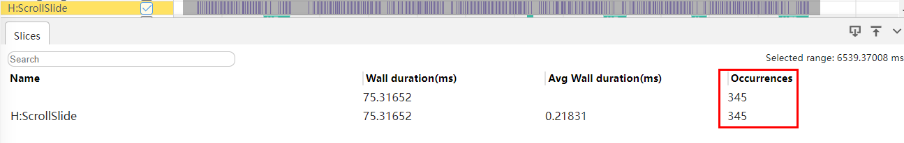

# Avoid redundant operations during development.

## Overview

In the software development process, it is critical to identify and reduce redundant operations. To optimize performance, developers need to add logs in the development phase to assist debugging. In the production environment, redundant logs and trace output need to be avoided. You also need to review and delete empty callback functions that do not have actual functions to ensure that the callback has a clear purpose. By simplifying logs, properly planning trace tracing, and strictly processing callback functions, you can effectively reduce redundancy, improve code quality and running performance, and improve user experience of software products. Next, we will further discuss the concerns and optimization methods.

## Do not perform redundant and time-consuming operations when the system frequently calls the interface.

The high-frequency callback usually refers to an event or a callback function that is frequently triggered in a running process of an application program, for example, a scrolling event, a touch event, a mouse event, a drag event, and a gesture movement process update event. The core features of such interfaces are extremely high triggering frequency and strict requirements on performance. In the software development phase, the performance optimization of such high-frequency callbacks cannot be ignored. An effective optimization policy is to avoid redundant log recording, trace tracing, and time-consuming operations inside the interface. Common high-frequency interfaces in a system include but are not limited to the following types:

Common events:

- `onTouch`: This callback function is triggered when a finger touch occurs.

- `onItemDragMove`: triggered when an element is dragged to move within the list element range.

- `onDragMove`: When a drag event moves within the widget range, a callback is triggered.

- `onMouse`: This callback function is triggered when the current widget is clicked by the mouse button or the mouse pointer moves over the widget.

- `onVisibleAreaChange`: This callback function is triggered when the visible region of the widget changes.

- `onAreaChange`: This callback function is triggered when the widget area changes.

Specific events:

- `onScroll`: The scrolling event callback is triggered when the list slides. (such as Scroll, List, Grid, and WaterFlow)

- `onActionUpdate`: The gesture movement update event is called back during gesture movement. (In basic gestures, such as PinchGesture, PinchGesture, and RotationGesture)

**Negative example:**

The following code example demonstrates how to bind the onScroll() scrolling event to the Scroll component, which is a high-frequency triggering interface. Redundant trace, log printing, and time-consuming operations are added.

```ts
// Negative example of the onScroll high-frequency callback scenario
@Component
struct NegativeOfOnScroll {
  private arr: number[] = [1, 2, 3, 4, 5, 6, 7, 8, 9, 10];

  build() {
    Scroll() {
      List() {
        ForEach(this.arr, (item: number) => {
          ListItem() {
            Text("TextItem" + item)
          }
          .width("100%")
          .height(100)
        }, (item: number) => item.toString())
      }
      .divider({ strokeWidth: 3, color: Color.Gray })
    }
    .width('100%')
    .height('100%')
    .onScroll(() => {
      hitrace.startTrace("ScrollSlide", 1001);
      hilog.info(1001, 'Scroll', 'TextItem');
      // Time-consuming operation
      // ...
      // Service logic
      // ...
      hitrace.finishTrace("ScrollSlid", 1001);
    })
  }
}
```

**Positive example:**

When processing the scrolling event callback function onScroll() of the Scroll component, avoid redundant trace tracing, log recording, and time-consuming operations to ensure code simplicity and efficiency. Add such tracing and log output instructions during development and debugging or to solve specific problems. Trace tracing, log recording, and time-consuming operations must be removed from the actual running environment of applications, especially released versions, to avoid potential negative impact on program performance and improve the pertinence and value of log information.

```ts
// Positive example of the onScroll high-frequency callback scenario
@Component
struct PositiveOfOnScroll {
  private arr: number[] = [1, 2, 3, 4, 5, 6, 7, 8, 9, 10];

  build() {
    Scroll() {
      List() {
        ForEach(this.arr, (item: number) => {
          ListItem() {
            Text("TextItem" + item)
          }
          .width("100%")
          .height(100)
        }, (item: number) => item.toString())
      }
      .divider({ strokeWidth: 3, color: Color.Gray })
    }
    .width('100%')
    .height('100%')
    .onScroll(() => {
      // Service logic
      // ...
    })
  }
}
```

As shown in the following figure, the Hilog is printed more than 300 times during the 6-second list scrolling period. This phenomenon may cause many problems when processing high-frequency interactions such as scrolling events. Therefore, in the development process, you need to periodically review the code and clear unnecessary trace tracing and log output to prevent time-consuming operations from affecting the overall performance and efficiency of the project.



## Redundant Trace and Log Printing Are Deleted

In the development process, log printing and trace tracing are important auxiliary tools to help developers diagnose problems and debug code. However, the processing of logs and traces in debug mode is different from that in release mode. After the debug phase is complete, remove redundant log output and trace tracing when releasing the release version to avoid adverse impact on the performance of the release version. The following describes the potential impact of trace tracing and log printing in the release version.

### Delete Trace from the release version.

In a release version, the trace function should be restricted or removed. The trace function is used in the development and debugging phases to record and trace detailed information during program execution. Retaining trace information in a release version may introduce unnecessary performance overhead, for example, occupying extra CPU resources, memory, and storage space. Especially when trace information is frequently generated, the performance and response speed of applications may be affected.

**Negative example:**

In the negative example, trace tracing is added to the `aboutToAppear` lifecycle to record and trace detailed information during program execution, which introduces unnecessary performance overhead.

```ts
// Negative example of the trace scenario
@Component
struct NegativeOfTrace {
  aboutToAppear(): void {
    hitrace.startTrace("HITRACE_TAG_APP", 1002);
    // Service code.
    // ...
    hitrace.finishTrace("HITRACE_TAG_APP", 1002);
  }
  build() {
    // Service code.
  }
}
```

**Positive example:**

In the positive example, the original Trace trace has been removed from the `aboutToAppear` lifecycle function. Eliminates unnecessary performance overhead and ensures that applications are more efficient at run time.

```ts
// Positive example of the trace scenario
@Component
struct PositiveOfTrace {
  aboutToAppear(): void {
    // Service code.
    // ...
  }
   build() {
    // Service code.
  }
}
```

### Debug logs are deleted from the release version.

During development, developers can use the startTrace, finishTrace, and traceByValue interfaces provided by HiTrace to accurately monitor and record system performance on key service logic nodes. However, in a release environment, continuously activating such trace functions incurs performance costs. Therefore, when the project enters the release phase, to ensure software running efficiency optimization and resource utilization, you need to remove the trace function enabled in the debugging phase to avoid impact on the actual running performance.

**Negative example:**

The following is a pseudocode instance used to demonstrate the log execution principle. When the debug log function is called, if the parameters to be printed need to be constructed first, the parameter construction logic is executed before the printing method is called. For example, assume that there is a debug log statement that combines the string1 and string2 parameters. During the actual running, the system performs the string combination operation before executing the log printing logic.

```ts
// A negative example is recorded in debug logs.
struct NegativeOfDebug {
  @State string1: string = 'a';
  @State string2: string = 'b';

  aboutToAppear(): void {
    hilog.debug(1003, 'Debug', (this.string1 + this.string2));
    // Service code.
    // ...
  }

  build() {
    // Service code.
    // ...
  }
}

//Before invoking the debug method, combine the parameters into msg and then call the debug method.
const msg = this.string1 + this.string2 ;
hilog.debug(msg);
```

Positive example:

When logs are printed, the construction logic is simplified to reduce the participation of status variables and remove debug logs in release mode to optimize the performance.

```ts
// A positive example is recorded in debug logs.
@Component
struct PositiveOfDebug {
  aboutToAppear(): void {
    // Service code.
    // ...
  }
  build() {
    // Service code.
    // ...
  }
}
```

According to the preceding case, in release mode, even if debug logs are not printed, the internal construction logic is still executed, which undoubtedly causes performance overhead. When @state state variables are involved, resource consumption is exacerbated due to the bidirectional data binding feature between such variables. Therefore, during development, developers should pay attention to and avoid writing redundant log logic that does not take effect in non-debugging state. To optimize performance in release mode, take measures to reduce or remove unnecessary log construction and printing operations. The following is a simplified pseudocode description of the bottom-layer implementation of the debug function:

```ts
//Underlying implementation of the debug function
void debug(string& msg){ // msg is the combination result of string1 and string2.
    if(isDebug){ // isDebug determines whether the debug mode is used.
      print(msg) // Print the result.
    }
}
```

## Do not set redundant system callback listening.

When optimizing the callback, if the callback function body does not contain any service logic code, you can delete it. The impact of log output on system performance cannot be ignored. Redundant trace and log printing not only increases performance overhead, but also reduces code readability and maintainability, but also increases storage costs. Therefore, you must take active measures to periodically review and clear unnecessary logs and trace files to ensure efficient and stable running of the system.

**Negative example:**

The following code example demonstrates how to add redundant trace and log printing operations to the button click event callback function .onClick(). In the .onAreaChange callback function, there is no actual code logic.

```ts
// Negative example of the onClick callback scenario
@Component
struct NegativeOfOnClick {
  build() {
    Button('Click', { type: ButtonType.Normal, stateEffect: true })
      .onClick(() => {
        hitrace.startTrace("ButtonClick", 1004);
        hilog.info(1004, 'Click', 'ButtonType.Normal')
        hitrace.finishTrace("ButtonClick", 1004);
        // Service code.
        // ...
      })
      .onAreaChange((oldValue: Area, newValue: Area) => {
        //No code.
      })
   }
}
```

**Positive example:**

When processing the click event callback function onClick() of the button, do not add meaningless trace tracing and log printing to ensure code simplification and execution efficiency. These tracing and log output statements can be inserted only in the development and debugging phase or during fault locating. In the formal running environment of the application, these redundant statements must be removed to prevent potential impact on the program performance and improve the validity of log information. If there is no service logic code when the .onAreaChange callback function is processed, you can directly and securely delete the empty callback function to prevent the system from responding to meaningless events, saving resources and improving program running efficiency.

```ts
// Positive example of the onClick callback scenario
@Component
struct PositiveOfOnClick {
  build() {
    Button('Click', { type: ButtonType.Normal, stateEffect: true })
      .onClick(() => {
        // Service code.
        // ...
    })
}
```

**Time consumption of redundant logs**

As shown in the following figure, it takes about 600 microseconds to trigger Hilog at a time. Although the value seems small in a single dimension, the total time required increases significantly when such operations accumulate in the entire project. Therefore, unnecessary trace traces and log output should be reviewed and cleaned up periodically to ensure the overall performance and efficiency of the project.

![Callback Log Duration] (figures/avoiding-redundant-operations-callback.PNG)

During development, if the `onAreaChange` or `onClick` callback function prints only one line of logs or does not execute any service logic, you are advised to remove these redundant callback functions. This is because even if the developer does not perform any substantial operation in the callback function, as long as the callback, such as `onAreaChange`, is registered, the system bottom layer (C++ side) still consumes resources to monitor the occurrence of the corresponding event, for example, the location or size change of the computing component, and transfers the data to the arkTs side. Even if the data is not effectively used at the arkTs layer, the underlying computing and communication overhead already exists. Therefore, to avoid unnecessary resource consumption and improve application performance, you need to carefully review and remove the registration of callback functions that are not actually used. In this way, the system load can be reduced and the program running efficiency can be improved.

## Summary

In terms of log printing and trace tracing, redundant operations may cause unnecessary performance overhead, increase memory usage, slow down the program response speed, and even affect the GUI smoothness. Especially in callbacks that are frequently triggered, such as scrolling events and touch events, if redundant log printing or trace tracing is involved each time the callbacks are triggered, the system performance will be significantly affected.

To optimize log output and trace tracing, the following suggestions are provided:

- Remove or disable debug log output and trace tracing used in the development phase in the official release version.

- For all types of callback functions, especially interfaces that are frequently triggered, do not perform redundant operations in the callback body, including unnecessary log recording and time consumption calculation.

- Periodically review code and clear redundant log output and trace tracing to improve system running efficiency and performance.

In addition, the log content construction logic may be executed even if it is not printed in release mode. Therefore, redundant log construction logic in non-debugging mode must be avoided. Computing and log preparation operations are performed only when necessary. This improves program performance and reduces resource consumption, thereby building high-quality and high-performance software products.
