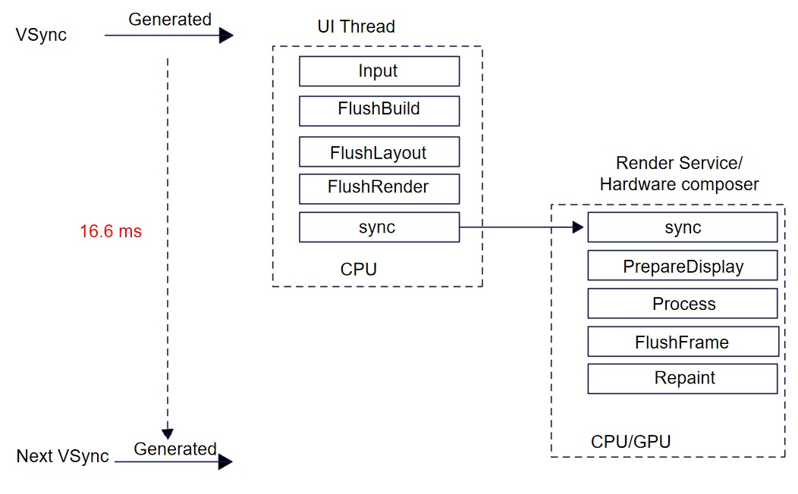
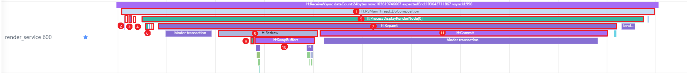
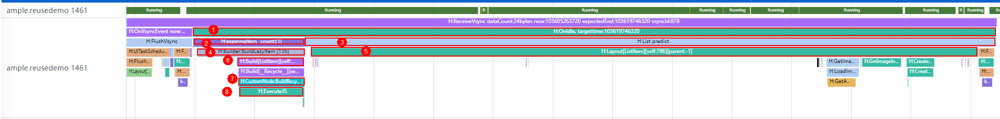
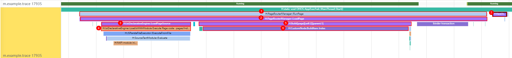
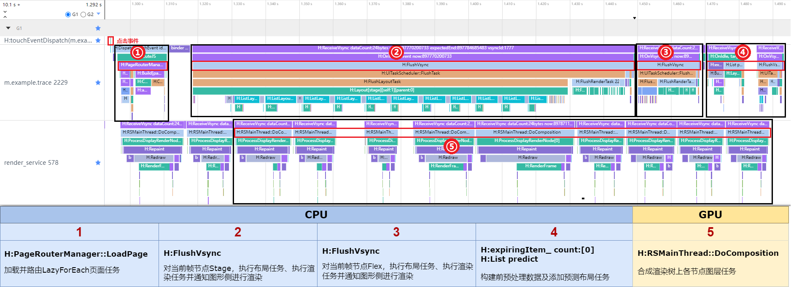
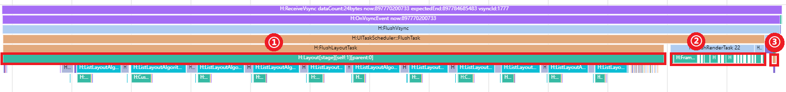
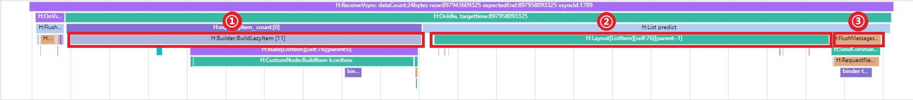
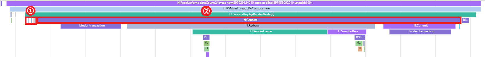
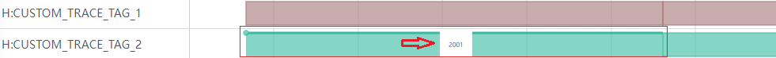

# Typical Traces

## Introduction

The DFX subsystem provides performance traces for the application framework and core modules of the system. Each trace records the task execution time, formatted data at runtime, and process or thread information. You can use [Smartperf-Host](../../device-dev/device-test/smartperf-host.md) to parse the traces, analyze the performance hotspots during application running based on the trace lanes, and work out a performance optimization solution.

This topic describes the meanings and usage of typical traces, and demonstrates how to use them to identify potential performance problems. It also elaborates the working principles of traces to help you better collect and analyze performance data. An in-depth understanding of traces will provide considerable support for your application performance profiling.

## Typical Traces and Their Meanings

The following describes typical traces in the rendering process.

### Rendering Process

Like other operating systems, OpenHarmony uses the Vsync signal to determine the time to render a frame. The Vsync signal, short for vertical sync signal, instructs the display to start refreshing the next frame after the vertical blanking interval.

The display sends the Vsync signal at a fixed frequency. For example, if the refresh rate is 60 Hz, the display sends the Vsync signal every 16.6 ms.

Upon receiving the Vsync signal, the UI backend engine prepares for rendering of the next frame. Then the application submits a rendering command, which is used to describe graphics rendering, texture setting, and shader usage. The UI backend engine adds the command to the rendering queue and executes the command at a proper time. Generally, the rendering command is executed in the background thread to prevent the main thread from being blocked.

After finishing the command execution, the UI backend engine sends it to Render Service of the graphics subsystem. Render Service performs graphics calculation and rendering operations, such as vertex transformation, illumination, and texture mapping. After Render Service finishes rendering, it writes the rendering result to the frame buffer. The frame buffer is a memory area that stores image data for display output. Once the frame buffer is updated, the UI backend engine waits for the next Vsync signal. This ensures that the rendering result is ready before the vertical blanking interval elapses. When the next Vsync signal arrives, the UI backend engine sends the content in the frame buffer to the display, and the display refreshes its pixels accordingly. Till now, the rendering process is complete. See Figure 1.

**Figure 1 Rendering flowchart**



From the perspective of traces, the rendering process for a frame is as follows:

(1) A Vsync signal arrives.

(2) The UI backend engine draws the first frame.

(3) The UI backend engine sends a rendering command to Render Service and requests a frame.

(4) Render Service composites graphics layers, calculates the region to refresh, and renders and draws the frame.

(5) Render Service sends the drawn frame to the display.

Figure 2 shows typical traces used by the UI backend engine in the rendering process of a frame.

**Figure 2** Trace lanes for UI backend engine rendering


| No. | **Trace**                               | **Parameter Description**        | **Process Description**                              |
|:--- | --------------------------------------- | ---------------- | ------------------------------------ |
| 1   | OnVsyncEvent now:%" PRIu64 "            | Current timestamp, in nanoseconds.      | Receives a Vsync signal. The rendering process starts.                    |
| 2   | FlushVsync                              |                  | Refreshes the view synchronization events, including recording frame information, refreshing tasks, drawing and rendering the context, and processing user input.|
| 3   | UITaskScheduler::FlushTask              |                  | Refreshes the UI, including the layout, rendering, and animation.                  |
| 4   | FlushMessages                           |                  | Sends a message to instruct Render Service to perform rendering.                       |
| 5   | FlushLayoutTask                         |                  | Executes the layout task.                              |
| 6   | FlushRenderTask %zu                     | Number of nodes to be rendered on the current page.| Executes the rendering task.                             |
| 7   | Layout                                  |                  | Lays out the nodes.                                |
| 8   | FrameNode::RenderTask                   |                  | Executes a single rendering task.                            |
| 9   | ListLayoutAlgorithm::MeasureListItem:%d | Index of the current list item.         | Calculates the layout size of the list item.                          |

Render Service in the graphics subsystem is responsible for drawing UI content, processing rendering tasks submitted by applications, combining graphics layers of different applications, and presenting images on the display.

When receiving a Vsync signal, the UI backend engine processes the command sent by the application, including adding, deleting, or modifying the application's render node, and then performs animation calculation and occlusion calculation. All these operations are used to update the render tree.

The UI backend engine draws the render tree. Specifically, it preprocess every node, calculates the absolute position and dirty region, and draws the dirty region. It preferentially uses the hardware composer for drawing. If certain content cannot be composited, the GPU performs redrawing. All the drawing results are stored in the display buffer and finally presented on the display.

Figure 3 shows the trace lanes when the Vsync signal is refreshed.

**Figure 3** Trace lanes on Render Service



| No. | Trace                        | Description          |
|:--- | ---------------------------- | ------------ |
| 1   | RSMainThread::DoComposition  | Composites the layers of nodes in the render tree. |
| 2   | RSMainThread::ProcessCommand | Processes the command from the client. |
| 3   | Animate                      | Processes the animation.        |
| 4   | RSMainThread::CalcOcclusion  | Calculates the occlusion.        |
| 5   | ProcessDisplayRenderNode[x]  | Performs drawing on a single display.|
| 6   | ProcessSurfaceNode:x         | Performs composition on a single node.  |
| 7   | Repaint                      | The hardware composer performs composition.   |
| 8   | Redraw                       | Redraws the image if certain content cannot be composited.|
| 9   | RenderFrame                  | The GPU performs drawing.     |
| 10  | SwapBuffers                  | Refreshes the display buffer.     |
| 11  | Commit                       | Presents the drawing result on the display.    |

### Lazy Loading

Lazy loading is implementing using **LazyForEach**, which iterates over provided data sources and creates corresponding components during each iteration. When **LazyForEach** is used in a scrolling container, the framework creates components as required within the visible area of the scrolling container. When a component is out of the visible area, the framework destroys the component to reduce memory usage.

Figure 4 shows the traces for a frame during lazy loading.

**Figure 4** Trace lanes for lazy loading



| **No.**| **Trace**                      | **Parameter Description**                              | **Process Description**                                          |
|:------ | ------------------------------ | -------------------------------------- | ------------------------------------------------ |
| 1      | OnIdle, targettime:%" PRId64 " | Timestamp, before which the task is completed.                      | Checks whether there are new events to process in the idle event loop, and if yes, adds the task scheduler to the UI thread and executes the predicted layout task.|
| 2      | expiringItem_ count:[%zu]      | Number of lazy-loaded items.                            | Pre-builds items, including processing all lazy-loaded items.                                  |
| 3      | List predict                   |                                        | Adds a predicted layout task.                                        |
| 4      | Builder:BuildLazyItem [%d]     | Index of the project to be created.                              | Creates an item when needed and caches it.                                   |
| 5      | Layout[%s][self:%d][parent:%d] | Tags, which indicate the index of the current node in the UI node tree and the index of the parent node in the UI node tree, respectively.| Lays out the current frame node.                                         |
| 6      | Build[%s][self:%d][parent:%d]  | Tags, which indicate the index of the current node in the UI node tree and the index of the parent node in the UI node tree, respectively.| Builds the current frame node.                                         |
| 7      | CustomNode:BuildRecycle %s     | JavaScript view name.                                | Triggers re-rendering.                                          |
| 8      | ExecuteJS                      |                                        | Runs JavaScript code.                                          |

### Page Loading

When page loading is triggered, the system creates a new page instance and calls the lifecycle functions of the page accordingly. The page layout is loaded in the lifecycle functions, and the data is bound to the page components so that the page can display and update the data.

Figure 5 shows the traces for a frame during page loading.

Figure 5 Trace lanes for page loading



| **No.**| **Trace**                                                     | **Parameter Description**                              | **Process Description**                      |
|:------ | ------------------------------------------------------------- | -------------------------------------- | ---------------------------- |
| 1      | PageRouterManager::RunPage                                    |                                        | Preprocesses page routes and loads the page.                |
| 2      | PageRouterManager::LoadPage                                   |                                        | Loads the page and processes routes.                     |
| 3      | JsiDeclarativeEngine::LoadPageSource                          |                                        | Loads a JavaScript file and parses it into ABC bytecode.|
| 4      | JsiDeclarativeEngine::LoadJsWithModule Execute Page code : %s | Page URL.                               | Executes the page code.                      |
| 5      | Build[%s][self:%d][parent:%d]                                 | Tags, which indicate the index of the current node in the UI node tree and the index of the parent node in the UI node tree, respectively.| Builds the current frame node.                     |
| 6      | CustomNode:BuildItem %s                                       | JavaScript view name.                                | Renders the child node and mounts it to the parent node.            |
| 7      | ViewChangeCallback(%d, %d)                                    | Width and height of the view.                               | Called when the view changes.                      |

## Practice of Traces

The following example traverses a list in **LazyForEach** mode and uses [Smartperf-Host](../../device-dev/device-test/smartperf-host.md) to trace the code execution process.

In the [sample code](https://gitee.com/openharmony/applications_app_samples/tree/master/code/Performance/PerformanceLibrary/feature/trace), a **List** container component is used to create 120 custom **IconView** components in lazy loading mode. In each **IconView** component, a **Flex** container that holds the **Image** and **Text** components is used to present a list item with text and an image.

```ts
// src/main/ets/pages/LazyForEachPage.ets

@Entry
@Component
struct LazyForEachPage {
  private iconItemSourceList = new ListData();
  aboutToAppear() {
    // Add data of 120 icon items.
     ......
  }
  build() {
    Column() {
      Text ('Example of lazy loading')
        .fontSize(24)
        .fontColor(Color.Black)
        .fontWeight(FontWeight.Bold)
        .textAlign(TextAlign.Start)
        .width('90%')
        .height(50)
      List({ space: 20 }) {
        LazyForEach(this.iconItemSourceList, (item: IconItemModel) => {
          ListItem() {
            IconItem({ image: item.image, text: item.text })
          }
        }, (item: IconItemModel, index) => index.toString())
      }
      .divider({ strokeWidth: 2, startMargin: 20, endMargin: 20 }) // Divider
      .width('100%')
      .height('100%')
      .layoutWeight(1)
    }
    .width('100%')
    .height('100%')
    .alignItems(HorizontalAlign.Center)
  }
}
```

```ts
// src/main/ets/view/IconView.ets

@Component
export struct IconItem {
  image: string | Resource = '';
  text: string | Resource = '';
  build() {
    Flex({ direction: FlexDirection.Row, justifyContent: FlexAlign.Center, alignContent: FlexAlign.Center }) {
      Image(this.image)
        .height(40)
        .width(40)
        .objectFit(ImageFit.Contain)
        .margin({
          left: 15
        })
      Text(this.text)
        .fontSize(20)
        .fontColor(Color.Black)
        .width(100)
        .height(50)
        .textAlign(TextAlign.Center)
    }
    .width('100%')
    .height(50)
  }
}
```

The following uses [Smartperf-Host](../../device-dev/device-test/smartperf-host.md) to capture the htrace file and generate a trace lane diagram, helping you better understand the loading process of the sample code. The lane diagram is divided into five parts. Each part is marked with numbers and tags.

**Figure 6** Lane diagram of the list traversed in LazyForEach mode



The following describes the details of each part.

**1. Loading the LazyForEach page**

**Figure 7** Lane for loading the LazyForEach page


- **H:JsiDeclarativeEngine::LoadPageSource**: loads a JavaScript file and parses it into ABC bytecode.
- **H: FlushPipelineWithoutAnimation**: flushes the rendering pipeline.
- **H:CustomNode:OnAppear**: builds the current **OnAppear** lifecycle and executes the **aboutToAppear** lifecycle function.
- **H:CustomNode:BuildItem LazyForEachPage**: renders the child node and mounts it to the LazyForEachPage page.

**2. Laying out and rendering the current frame node Stage, and instructing Render Service to perform rendering**

**Figure 8** Lane for Stage layout and rendering



- **H:Layout[stage][self:1][parent:0]**: lays out the current frame node Stage, which functions as the framework and bears the Page node. Therefore, the tag presentation starts from Stage.
  - **H:Measure[%s][self:17][parent:16]**: calculates the layout size of the components **Page**, **Column**, **Row**, **Image**, **Text**, and more.
  - **H:Builder:BuildLazyItem [0]** and **H:ListLayoutAlgorithm::MeasureListItem:0**: create a lazy item and calculate the layout size of the list item, respectively.
  - **H:Layout[%s][self:38][parent:37]**: lays out the components **Page**, **Column**, **Row**, **Image**, **Text**, and more.
- **H:FrameNode::RenderTask**: executes the rendering task.
- **H: RequestNextVSync**: requests the Vsync signal of the next frame.

**3. Laying out and rendering the current frame node Flex, and instructing Render Service to perform rendering**

**Figure 9** Lane for Flex layout and rendering


- **H:Layout[Flex][self:63][parent:62]**: lays out the current frame node Flex.
  - **H:Measure[%s][self:17][parent:16]**: calculates the layout size of the components **Image**, **Text**, and more.
- **H:FrameNode::RenderTask**: renders Flex;
- **H: RequestNextVSync**: requests the Vsync signal of the next frame.

**4. Preprocessing data and adding a predicted layout task**

**Figure 10** Lane for preprocessing data and adding a predicted layout task



- **H:Builder:BuildLazyItem [11]**: preprocesses 11 data records.
- **H:Layout[ListItem][self:76][parent:-1]**: adds a predicted layout for Flex, **Image**, and **Text**.
- **H:FlushMessages**: sends a message to instruct Render Service to perform rendering.

**5. Compositing the layers for each node in the render tree**

**Figure 11** Lane of compositing the layers for each node in the render tree



- **H:AcquireBuffer** and **H:ProcessSurfaceNode:EntryView XYWH[0 0 720 1280]**: obtain the display buffer and draw the EntryView, SystemUi_StatusBar, and SystemUi_NavigationBar.
- **H:Repaint**: uses a hardware composer to composite and draw the current node tree.

## Custom Traces

You can use hiTraceMeter to customize traces based on service requirements. Currently, ArkTS and native APIs are provided for trace customization. For details, read the following topics:

> [Development of Performance Tracing (ArkTS)](../dfx/hitracemeter-guidelines-arkts.md)
>
> [Performance Tracing Development Guide (Native)](../dfx/hitracemeter-guidelines-ndk.md)

After custom traces are added, you can view them on [Smartperf-Host](../../device-dev/device-test/smartperf-host.md). They are displayed within an independent lane under the corresponding process.

The figure below shows two lanes that record the duration from the calling of **startTrace** to the calling of **finishTrace**. Two tags (**CUSTOM_TRACE_TAG_1** and **CUSTOM_TRACE_TAG_2**) are used to record the time consumption.

**Figure 12** Example of custom traces


The figure below shows two lanes that record the use of **TraceByValue**, which specifies the status value of a trace in the corresponding period. The meanings of the status values can be customized as required. You can move the cursor to the corresponding data block to view the status value. In the figure, the status value of the **CUSTOM_TRACE_TAG_2** tag is 2001 in the period marked in the red box.

**Figure 13** Example of a custom status value



## Working Principles of Traces

The generation of traces depends on the HiTrace component of the DFX subsystem. The hiTraceMeter module provides APIs to trace system performance. For details, read the following topics:

> [HiTrace Component](https://gitee.com/openharmony/hiviewdfx_hitrace)
>
> [hiTraceMeter Module](../reference/apis-performance-analysis-kit/_hitrace.md)

hiTraceMeter provides two sets of trace start and end APIs to collect statistics on the time consumed by logical behavior. Most time consumption statistics are collected per method. Therefore, hiTraceMeter also provides the macro definitions **HITRACE_METER**, **HITRACE_METER_NAME**, and **HITRACE_METER_FMT** to quickly record the time consumption of a single method. You only need to add them at the beginning of the method. These macro definitions depend on the lifecycle of local variables in the method. The principle is that a trace instance is created at the beginning of the method, and the trace start API is called in the instance constructor. Once the method finishes execution, the trace instance is destructed and the trace end API is called in the instance destructor.

### Tracing Example in Applications

The following example shows the use of hiTraceMeter in the ArkUI framework subsystem. The source code comes from the [ArkUI framework](https://gitee.com/openharmony/arkui_ace_engine).

The following code is used to encapsulate the hiTraceMeter APIs. The principle is the same as that of **HITRACE_METER**. Quick tracing is implemented based on the lifecycle of local variables in the method.

```cpp
// frameworks/base/log/ace_trace.h

#define ACE_SCOPED_TRACE(fmt, ...) AceScopedTrace aceScopedTrace(fmt, ##__VA_ARGS__)
#define ACE_FUNCTION_TRACE() ACE_SCOPED_TRACE(__func__)

class ACE_FORCE_EXPORT AceScopedTrace final {
public:
    explicit AceScopedTrace(const char* format, ...) __attribute__((__format__(printf, 2, 3)));
    ~AceScopedTrace();

    ACE_DISALLOW_COPY_AND_MOVE(AceScopedTrace);

private:
    bool traceEnabled_ { false };
};
```

The following code is used to refresh the view synchronization events, including recording frame information, refreshing tasks, drawing and rendering the context, and processing user input. Invoke the macro definition **ACE_FUNCTION_TRACE** at the beginning of the method, record the function name **FlushVsync** as the trace name, and record the function start time. When the function ends, record the function end time to obtain the execution duration.

```cpp
// frameworks/core/pipeline/pipeline_context.cpp

void PipelineContext::FlushVsync(uint64_t nanoTimestamp, uint32_t frameCount)
{
    ACE_FUNCTION_TRACE();

    // Other service logic in the method is omitted here.
    // ...
}
```

### Tracing Example on Render Service

The following example shows the use of hiTraceMeter in the graphics subsystem. The source code comes from the [graphics subsystem](https://gitee.com/openharmony/graphic_graphic_2d).

The following code is used to encapsulate the hiTraceMeter APIs.

```cpp
// utils/log/rs_trace.h

#include "hitrace_meter.h"
#define ROSEN_TRACE_BEGIN(tag, name) StartTrace(tag, name)
#define RS_TRACE_BEGIN(name) ROSEN_TRACE_BEGIN(HITRACE_TAG_GRAPHIC_AGP, name)
#define ROSEN_TRACE_END(tag) FinishTrace(tag)
#define RS_TRACE_END() ROSEN_TRACE_END(HITRACE_TAG_GRAPHIC_AGP)
#define RS_TRACE_NAME(name) HITRACE_METER_NAME(HITRACE_TAG_GRAPHIC_AGP, name)
#define RS_TRACE_NAME_FMT(fmt, ...) HITRACE_METER_FMT(HITRACE_TAG_GRAPHIC_AGP, fmt, ##__VA_ARGS__)
#define RS_ASYNC_TRACE_BEGIN(name, value) StartAsyncTrace(HITRACE_TAG_GRAPHIC_AGP, name, value)
#define RS_ASYNC_TRACE_END(name, value) FinishAsyncTrace(HITRACE_TAG_GRAPHIC_AGP, name, value)
#define RS_TRACE_INT(name, value) CountTrace(HITRACE_TAG_GRAPHIC_AGP, name, value)
#define RS_TRACE_FUNC() RS_TRACE_NAME(__func__)
```

The following code is used to draw images on the display. Invoke the macro definition **RS_TRACE_NAME** at the beginning of the method, combine the function name **ProcessDisplayRenderNode** with a display ID, and record the combination as the trace name. In essence, the macro definition **HITRACE_METER_NAME** for tracing a single method is used. Therefore, you only need to call the **ProcessDisplayRenderNode** function once to collect the function execution start time and end time and obtain the execution duration.

```cpp
// rosen/modules/render_service/core/pipeline/rs_surface_capture_task.cpp

void RSSurfaceCaptureVisitor::ProcessDisplayRenderNode(RSDisplayRenderNode &node)
{
    RS_TRACE_NAME("RSSurfaceCaptureVisitor::ProcessDisplayRenderNode:" +
        std::to_string(node.GetId()));

    // Other service logic in the method is omitted here.
    // ...
}
```
