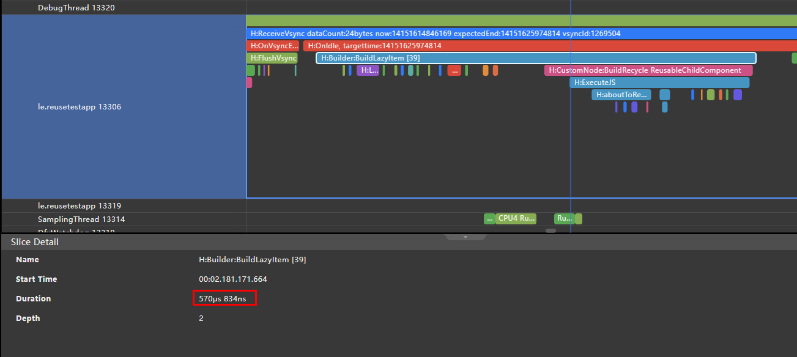

# Best Practices for Component Reuse

Component reuse is a useful tool in the following scenarios for removing the frame rate bottleneck in the UI thread:

1. Scrolling scenarios where instances of the same type of custom components are frequently created and destroyed
2. Scenarios where branches of conditional rendering are switched repeatedly, and the component subtree structure in the branches is complex

For component reuse to take effect, the following conditions must be met:

1. The custom component to reuse is decorated by the @Reusable decorator.
2. The reusable custom component (child) created under a custom component (parent) is added to the reuse cache of the parent after being is removed from the component tree.
3. In attempts to create a reusable child component under a custom component (parent), the child is quickly created by updating the reusable component instance of the corresponding type, if any, in the reuse cache of the parent.

## Constraints

1. @Reusable indicates that a custom component can be reused. While it can be used to decorate any custom component, take notes of the creation and update processes of the custom component to ensure that the component behaves correctly after being reused.
2. The cache and reuse of reusable custom components can occur only under the same parent component. This means that instances of the same custom component cannot be reused under different parent components. For example, component A is a reusable component, which is also a child component of component B and in the reuse cache of component B. When component A is created in component C, component A cached in component B cannot be used in component C.
3. To reuse a subtree, you only need to decorate its root node with @Reusable. For example, if custom component A has custom child component B, then to reuse the subtree of A and B, you only need to add the @Reusable decorator to A.
4. When a custom component is nested within a reusable custom component, to update the content of the nested component, you must implement the **aboutToReuse** lifecycle callback in the component.
5. The performance benefits of component reuse mainly result from its reducing the time for creating JS objects and reusing the component tree structure. As such, if the component tree structure of custom components is significantly changed due to conditional rendering before or after the reuse, you will not be able to reap the performance benefits of component reuse.
6. Component reuse occurs only when a reusable component is removed from the component tree and then added to the component tree again. For example, if **ForEach** is used to create a reusable custom component, component reuse cannot be triggered due to the full expansion attribute of **ForEach**.
7. Reusable components cannot be nested. That is, if a reusable component exists in the subtree of another reusable component, undefined results may occur.

## Developer's Tips

1. To maximize the component reuse performance, avoid any operations that may change the component tree structure or re-lay out the reusable components.
2. For best possible performance, combine component reuse with the **LazyForEach** syntax in list scrolling scenarios.
3. Pay attention to the behavior differences between the creation and update of custom components. Component reuse is, in effect, a special form of component update. The process and lifecycle callbacks used in component creation will not occur during component reuse, and the constructor parameters of the custom component are passed to it through the **aboutToReuse** lifecycle callback. In other words, the **aboutToAppear** lifecycle and initialization parameter input of the custom component will not occur during component reuse.
4. Avoid time-consuming operations during the **aboutToReuse** lifecycle callback. The best practice is to, in **aboutToReuse**, only update the state variable values required for updating custom components.
5. You do not need to update the state variables decorated by @Link, @StorageLink, @ObjectLink, and @Consume in **aboutToReuse**. These state variables are automatically updated, and manual update may trigger unnecessary component re-rendering.

## Lifecycle

When a reusable component is removed from the component tree in C++ code, the **CustomNode** instance of the component on the native side of the ArkUI framework is mounted to the corresponding JSView. When reuse occurs, **CustomNode** is referenced by JSView and the **aboutToRecycle** callback on **ViewPU** is triggered. The **ViewPU** instance is referenced by **RecycleManager**.

When the reusable component is re-added to the component tree from **RecycleManager**, the **aboutToReuse** callback on the frontend **ViewPU** instance is called.

## Available APIs

Called when this reusable component is about to be added from the reuse cache to the component tree. The component's state variables can be updated in this callback. The argument type is the same as the constructor parameter type of the custom component.

```ts
aboutToReuse?(params: { [key: string]: unknown }): void;
```

Called when this reusable component is about to be added from the component tree to the reuse cache.

```ts
aboutToRecycle?(): void;
```

Adds this reusable component to a reuse group. Components with the same **reuseId** value are reused in the same reuse group.

```ts
reuseId(id: string);
```

Declares that a component is reusable.

```ts
declare const Reusable: ClassDecorator;
```

**Example**

```ts
private dataArray: string[] = [];
  private listener: DataChangeListener;

  public totalCount(): number {
    return this.dataArray.length;
  }

  public getData(index: number): any {
    return this.dataArray[index];
  }

  public pushData(data: string): void {
    this.dataArray.push(data);
  }

  public reloadListener(): void {
    this.listener.onDataReloaded();
  }

  public registerDataChangeListener(listener: DataChangeListener): void {
    this.listener = listener;
  }

  public unregisterDataChangeListener(listener: DataChangeListener): void {
    this.listener = null;
  }
}

@Entry
@Component
struct MyComponent {
  private data: MyDataSource = new MyDataSource();

  aboutToAppear() {
    for (let i = 0; i < 1000; i++) {
      this.data.pushData(i.toString())
    }
  }

  build() {
    List({ space: 3 }) {
      LazyForEach(this.data, (item: string) => {
        ListItem() {
          ReusableChildComponent({ item: item })
        }
      }, item => item)
    }
    .width('100%')
    .height('100%')
  }
}

@Reusable
@Component
struct ReusableChildComponent {
  @State item: string = ''

  aboutToReuse(params) {
    this.item = params.item;
  }

  build() {
    Row() {
      Text(this.item)
        .fontSize(20)
        .margin({ left: 10 })
    }.margin({ left: 10, right: 10 })
  }
}
```

## Samples

The following sample code from a shopping application exemplifies code before and after component reuse and the benefits that can be reaped from component reuse.

### Code Before and After Component Reuse

**Before Component Reuse**

```ts
LazyForEach(this.GoodDataOne, (item, index) => {
  GridItem() {
    Column() {
      Image(item.img)
        .height(item.hei)
        .width('100%')
        .objectFit(ImageFit.Fill)

      Text(item.introduce)
        .fontSize(14)
        .padding({ left: 5, right: 5 })
        .margin({ top: 5 })
      Row() {
        Row() {
          Text('￥')
            .fontSize(10)
            .fontColor(Color.Red)
            .baselineOffset(-4)
          Text(item.price)
            .fontSize(16)
            .fontColor(Color.Red)
          Text(item.numb)
            .fontSize(10)
            .fontColor(Color.Gray)
            .baselineOffset(-4)
            .margin({ left: 5 })
        }

        Image($r('app.media.photo63'))
          .width(20)
          .height(10)
          .margin({ bottom: -8 })
      }
      .width('100%')
      .justifyContent(FlexAlign.SpaceBetween)
      .padding({ left: 5, right: 5 })
      .margin({ top: 15 })
    }
    .borderRadius(10)
    .backgroundColor(Color.White)
    .clip(true)
    .width('100%')
    .height(290)
  }
}, (item) => JSON.stringify(item))
```

**After Component Reuse**

When the component is reused, the ArkUI framework passes to the **aboutToReuse** lifecycle callback the constructor parameters of the component. Assign values to the state variables to be updated in **aboutToReuse**, and the ArkUI framework will display the UI with the latest state variable values.

If the instances of a custom component vary greatly, use **reuseId** to assign these instances to different reuse groups to achieve the optimal effect.

If a custom component has a reference to a large object or other unnecessary resources, release the reference in the **aboutToRecycle** lifecycle callback to avoid memory leak.

```ts
LazyForEach(this.GoodDataOne, (item, index) => {
  GridItem() {
    GoodItems({
      boo:item.data.boo,
      img:item.data.img,
      webimg:item.data.webimg,
      hei:item.data.hei,
      introduce:item.data.introduce,
      price:item.data.price,
      numb:item.data.numb,
      index:index
    })
    .reuseId(this.CombineStr(item.type))
  }
}, (item) => JSON.stringify(item))


@Reusable
@Component
struct GoodItems {
  @State img: Resource = $r("app.media.photo61")
  @State webimg?: string = ''
  @State hei: number = 0
  @State introduce: string = ''
  @State price: string = ''
  @State numb: string = ''
  @LocalStorageLink('storageSimpleProp') simpleVarName: string = ''
  boo: boolean = true
  index: number = 0
  controllerVideo: VideoController = new VideoController();

  aboutToReuse(params)
  {
    this.webimg = params.webimg
    this.img = params.img
    this.hei = params.hei
    this.introduce = params.introduce
    this.price = params.price
    this.numb = params.numb
  }

  build() {
    // ...
  }
}
```

### Performance Benefit

Analysis results from the profiler tool in DevEco Studio show that, with component reuse, the average component creation time is reduced from 1800 μs to 570 μs.




| Component Reuse | Component Creation Time|
| -------------- | ------------ |
| Component reuse disabled| 1813 μs      |
| Component reuse enabled  | 570 μs       |
