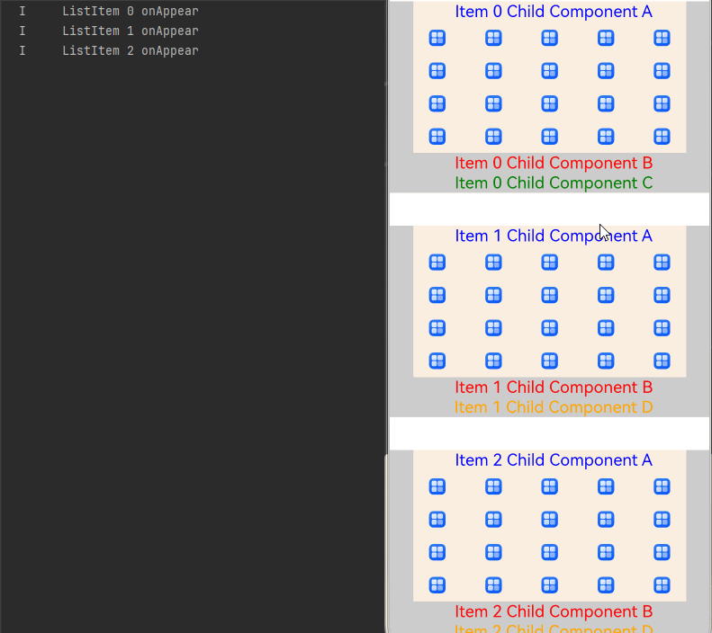

# Component Reuse Overview

Component reuse is a core policy for optimizing user interface performance and improving application smoothness. It reuses existing component nodes instead of creating new nodes, greatly reducing performance loss caused by frequent component creation and destruction and ensuring smoothness and response speed of UI threads. Component reuse applies to user-defined components. Component reuse can be used as long as the same user-defined component is destroyed or re-created.

This document systematically describes six reuse types and their application scenarios to help developers better understand and implement component reuse policies to optimize application performance.

For details about the component reuse mechanism, see ./component-recycle-case.md#Component Reuse Mechanism.

## Multiplexing Type Overview

|Multiplexing Type|Description|Reuse Roadmap|Reference Document|
|:--:|--|--|--|
|**Standard**|The layouts of reused components are the same.|Standard Reuse|[Component Reuse Practice](./component-recycle.md)|
|**finite change type**|Reused components are different, but the types are limited.|Use reuseId or create two customized components.|[Component Reuse Performance Optimization Guide](./component-recycle-case.md)|
|**Combination**|There are many differences between reused components, but they have common subcomponents.|The reused component is changed to Builder so that internal subcomponents can be reused.|[Combined Component Reuse Guide](#combined)|
|**Global**|Components can be reused in different parent components, and @Builder is not suitable.|Use BuilderNode to customize the reuse component pool and transfer freely in the entire application.|[Reuse of Global Customized Components] (./node_custom_component_reusable_pool.md)|
|**Nested**|The subcomponents of the reused component are different.|The nesting problem is solved by converting the nesting problem into the preceding four standard types.|/|
|**Non-reusable**|Components differ greatly, are not regular, and subcomponents are different.|Component reuse is not recommended.|/|

## Multiplexing Types

For ease of description, the following uses a sliding list scenario as an example. The user-defined component to be reused, such as the content component of ListItem, is called a reuse component. The user-defined component at its child level is called a subcomponent. The user-defined component at the upper layer of the reuse component is called a parent component. To be more intuitive, each of the following reuse types displays the component layout in a simple chart. In addition, to facilitate separation, subcomponents with the same layout are represented in the same shape.

### Standard


This is a standard component reuse scenario. The layout of reused components in a scrolling container is the same, but the data is different. For details about this type of component reuse, see [Component Reuse Practice] (./component-recycle.md).

**Application Scenarios and Cases**


### finite change type


There are differences between reused components in this type, but the types are limited. As shown in the preceding figure, the subcomponents in the reused components in the container are different. However, the subcomponents can be summarized into two types. Type 1 consists of three subcomponents A, and type 2 consists of subcomponents B, C, and D.

In this case, you can take either of the following measures:

- The service logic of type 1 is different from that of type 2. You are advised to use two different customized components for the two types of components and reuse them separately. The following figure shows the status of the component reuse pool. Reuse component 1 and reuse component 2 are in different reuse lists.


For details, see the following sample code:

```typescript
class MyDataSource implements IDataSource {
  // ...
}

@Entry
@Component
struct Index {
  private data: MyDataSource = new MyDataSource();

  aboutToAppear() {
    for (let i = 0; i < 1000; i++) {
      this.data.pushData(i);
    }
  }

  build() {
    Column() {
      List({ space: 10 }) {
        LazyForEach(this.data, (item: number) => {
          ListItem() {
            if (item % 2 === 0) {
              ReusableComponentOne({ item: item.toString() })
            } else {
              ReusableComponentTwo({ item: item.toString() })
            }
          }
          .backgroundColor(Color.Orange)
          .width('100%')
        }, (item: number) => item.toString())
      }
      .cachedCount(2)
    }
  }
}

@Reusable
@Component
struct ReusableComponentOne {
  @State item: string = '';

  aboutToReuse(params: ESObject) {
    this.item = params.item;
  }

  build() {
    Column() {
      Text(`Item ${this.item} ReusableComponentOne`)
        .fontSize(20)
        .margin({ left: 10 })
    }.margin({ left: 10, right: 10 })
  }
}

@Reusable
@Component
struct ReusableComponentTwo {
  @State item: string = '';

  aboutToReuse(params: ESObject) {
    this.item = params.item;
  }

  build() {
    Column() {
      Text(`Item ${this.item} ReusableComponentTwo`)
        .fontSize(20)
        .margin({ left: 10 })
    }.margin({ left: 10, right: 10 })
  }
}
```

- The layouts of type 1 and type 2 are different, but many service logics are the same. In this case, if a component is divided into two customized components for reuse, code redundancy occurs. According to the system component reuse principle, reused components are distinguished by reuseId, and the name of a customized component is the default reuseId. Therefore, explicitly setting two reuseIds for a reused component is the same as using two custom components for reuse. For ArkUI, the reuse logic is the same. The following figure shows the status of the component reuse pool.


For a specific implementation, refer to the following example:

```typescript
class MyDataSource implements IDataSource {
  // ...
}

@Entry
@Component
struct Index {
  private data: MyDataSource = new MyDataSource();

  aboutToAppear() {
    for (let i = 0; i < 1000; i++) {
      this.data.pushData(i);
    }
  }

  build() {
    Column() {
      List({ space: 10 }) {
        LazyForEach(this.data, (item: number) => {
          ListItem() {
            ReusableComponent({ item: item })
              .reuseId(item % 2 === 0 ? 'ReusableComponentOne' : 'ReusableComponentTwo')
          }
          .backgroundColor(Color.Orange)
          .width('100%')
        }, (item: number) => item.toString())
      }
      .cachedCount(2)
    }
  }
}

@Reusable
@Component
struct ReusableComponent {
  @State item: number = 0;

  aboutToReuse(params: ESObject) {
    this.item = params.item;
  }

  build() {
    Column() {
      if (this.item % 2 === 0) {
        Text(`Item ${this.item} ReusableComponentOne`)
          .fontSize(20)
          .margin({ left: 10 })
      } else {
        Text(`Item ${this.item} ReusableComponentTwo`)
          .fontSize(20)
          .margin({ left: 10 })
      }
    }.margin({ left: 10, right: 10 })
  }
}
```

**Application Scenarios and Cases**


### Combination


There are differences between reused components in this type, and there are many cases, but there are common subcomponents. If the component reuse mode of the limited change type is used, all types of reused components are written as customized components for reuse. In this case, the same subcomponents in the reuse list of different reused components cannot be reused. In this case, the reused component can be converted into a Builder function so that the cache pool of the common child components within the reused component can be shared on the parent component. The following figure shows the status of the component reuse pool.


**Nonexample**

The following is a sample code that uses finite change component reuse:

```typescript
class MyDataSource implements IDataSource {
  // ...
}

@Entry
@Component
struct MyComponent {
  private data: MyDataSource = new MyDataSource();

  aboutToAppear() {
    for (let i = 0; i < 1000; i++) {
      this.data.pushData(i.toString());
    }
  }

  build() {
    List({ space: 40 }) {
      LazyForEach(this.data, (item: string, index: number) => {
        ListItem() {
          if (index % 3 === 0) {
            ReusableComponentOne({ item: item })
          } else if (index % 5 === 0) {
            ReusableComponentTwo({ item: item })
          } else {
            ReusableComponentThree({ item: item })
          }
        }
        .backgroundColor('#cccccc')
        .width('100%')
        .onAppear(()=>{
          console.info(`ListItem ${index} onAppear`);
        })
      })
    }
    .width('100%')
    .height('100%')
    .cachedCount(0)
  }
}

@Reusable
@Component
struct ReusableComponentOne {
  @State item: string = '';

  //Component lifecycle callback, which is called before reusable components are added from the reuse cache to the component tree.
  aboutToReuse(params: ESObject) {
    console.info(`ReusableComponentOne ${params.item} Reuse ${this.item}`);
    this.item = params.item;
  }

  //Component lifecycle callback, which is called before reusable components are added from the component tree to the reuse cache.
  aboutToRecycle(): void {
    console.info(`ReusableComponentOne ${this.item} Recycle`);
  }

  build() {
    Column() {
      ChildComponentA({ item: this.item })
      ChildComponentB({ item: this.item })
      ChildComponentC({ item: this.item })
    }
  }
}

@Reusable
@Component
struct ReusableComponentTwo {
  @State item: string = '';

  aboutToReuse(params: ESObject) {
    console.info(`ReusableComponentTwo ${params.item} Reuse ${this.item}`);
    this.item = params.item;
  }

  aboutToRecycle(): void {
    console.info(`ReusableComponentTwo ${this.item} Recycle`);
  }

  build() {
    Column() {
      ChildComponentA({ item: this.item })
      ChildComponentC({ item: this.item })
      ChildComponentD({ item: this.item })
    }
  }
}

@Reusable
@Component
struct ReusableComponentThree {
  @State item: string = '';

  aboutToReuse(params: ESObject) {
    console.info(`ReusableComponentThree ${params.item} Reuse ${this.item}`);
    this.item = params.item;
  }

  aboutToRecycle(): void {
    console.info(`ReusableComponentThree ${this.item} Recycle`);
  }

  build() {
    Column() {
      ChildComponentA({ item: this.item })
      ChildComponentB({ item: this.item })
      ChildComponentD({ item: this.item })
    }
  }
}

@Component
struct ChildComponentA {
  @State item: string = '';

  aboutToReuse(params: ESObject) {
    console.info(`ChildComponentA ${params.item} Reuse ${this.item}`);
    this.item = params.item;
  }

  aboutToRecycle(): void {
    console.info(`ChildComponentA ${this.item} Recycle`);
  }

  build() {
    Column() {
      Text(`Item ${this.item} Child Component A`)
        .fontSize(20)
        .margin({ left: 10 })
        .fontColor(Color.Blue)
      Grid() {
        ForEach((new Array(20)).fill(''), (item: string,index: number) => {
          GridItem() {
            Image($r('app.media.startIcon'))
              .height(20)
          }
        })
      }
      .columnsTemplate('1fr 1fr 1fr 1fr 1fr')
      .rowsTemplate('1fr 1fr 1fr 1fr')
      .columnsGap(10)
      .width('90%')
      .height(160)
    }
    .margin({ left: 10, right: 10 })
    .backgroundColor(0xFAEEE0)
  }
}

@Component
struct ChildComponentB {
  @State item: string = '';

  aboutToReuse(params: ESObject) {
    this.item = params.item;
  }

  build() {
    Row() {
      Text(`Item ${this.item} Child Component B`)
        .fontSize(20)
        .margin({ left: 10 })
        .fontColor(Color.Red)
    }.margin({ left: 10, right: 10 })
  }
}

@Component
struct ChildComponentC {
  @State item: string = '';

  aboutToReuse(params: ESObject) {
    this.item = params.item;
  }

  build() {
    Row() {
      Text(`Item ${this.item} Child Component C`)
        .fontSize(20)
        .margin({ left: 10 })
        .fontColor(Color.Green)
    }.margin({ left: 10, right: 10 })
  }
}

@Component
struct ChildComponentD {
  @State item: string = '';

  aboutToReuse(params: ESObject) {
    this.item = params.item;
  }

  build() {
    Row() {
      Text(`Item ${this.item} Child Component D`)
        .fontSize(20)
        .margin({ left: 10 })
        .fontColor(Color.Orange)
    }.margin({ left: 10, right: 10 })
  }
}
```

In the preceding code, four subcomponents are combined in different arrangements to form three types of reusable components. To facilitate the observation of component cache and reuse, set cachedCount of List to 0 and add log output to the lifecycle functions of some customized components. Pay attention to the cache and reuse of the ChildComponentA subcomponent.

The following figure shows the running effect of the example.


As shown in the preceding figure, when the list slides to ListItem 0 and disappears, the reusable component ReusableComponentOne and its subcomponent ChildComponentA are added to the reuse cache. When you slide up, the reusable component ReusableComponentThree of ListItem 4 and its subcomponents are still re-created because the reusable components of ListItem 4 and ListItem 0 are not in the same reusable list. The subcomponent ChildComponentA in the cache is not reused.

In this case, it takes 6 ms, 387 μs, and 499 ns to re-create ChildComponentA in ListItem 4.


**Example**

After the three reused components in the preceding example are converted into Builder functions based on the combined component reuse mode, the common subcomponents are under the same parent component MyComponent. When component reuse is used for these subcomponents, their cache pools are also shared on the parent component, reducing the consumption of component creation.

Sample code after modification:

```typescript
class MyDataSource implements IDataSource {
  // ...
}

@Entry
@Component
struct MyComponent {
  private data: MyDataSource = new MyDataSource();

  aboutToAppear() {
    for (let i = 0; i < 1000; i++) {
      this.data.pushData(i.toString())
    }
  }

  @Builder
  itemBuilderOne(item: string) {
    Column() {
      ChildComponentA({ item: item })
      ChildComponentB({ item: item })
      ChildComponentC({ item: item })
    }
  }

  @Builder
  itemBuilderTwo(item: string) {
    Column() {
      ChildComponentA({ item: item })
      ChildComponentC({ item: item })
      ChildComponentD({ item: item })
    }
  }

  @Builder
  itemBuilderThree(item: string) {
    Column() {
      ChildComponentA({ item: item })
      ChildComponentB({ item: item })
      ChildComponentD({ item: item })
    }
  }

  build() {
    List({ space: 40 }) {
      LazyForEach(this.data, (item: string, index: number) => {
        ListItem() {
          if (index % 3 === 0) {
            this.itemBuilderOne(item)
          } else if (index % 5 === 0) {
            this.itemBuilderTwo(item)
          } else {
            this.itemBuilderThree(item)
          }
        }
        .backgroundColor('#cccccc')
        .width('100%')
        .onAppear(() => {
          console.info(`ListItem ${index} onAppear`);
        })
      }, (item: number) => item.toString())
    }
    .width('100%')
    .height('100%')
    .cachedCount(0)
  }
}

@Reusable
@Component
struct ChildComponentA {
  @State item: string = '';

  aboutToReuse(params: ESObject) {
    console.info(`ChildComponentA ${params.item} Reuse ${this.item}`);
    this.item = params.item;
  }

  aboutToRecycle(): void {
    console.info(`ChildComponentA ${this.item} Recycle`);
  }

  build() {
    Column() {
      Text(`Item ${this.item} Child Component A`)
        .fontSize(20)
        .margin({ left: 10 })
        .fontColor(Color.Blue)
      Grid() {
        ForEach((new Array(20)).fill(''), (item: string,index: number) => {
          GridItem() {
            Image($r('app.media.startIcon'))
              .height(20)
          }
        })
      }
      .columnsTemplate('1fr 1fr 1fr 1fr 1fr')
      .rowsTemplate('1fr 1fr 1fr 1fr')
      .columnsGap(10)
      .width('90%')
      .height(160)
    }
    .margin({ left: 10, right: 10 })
    .backgroundColor(0xFAEEE0)
  }
}

@Reusable
@Component
struct ChildComponentB {
  @State item: string = '';

  aboutToReuse(params: ESObject) {
    this.item = params.item;
  }

  build() {
    Row() {
      Text(`Item ${this.item} Child Component B`)
        .fontSize(20)
        .margin({ left: 10 })
        .fontColor(Color.Red)
    }.margin({ left: 10, right: 10 })
  }
}

@Reusable
@Component
struct ChildComponentC {
  @State item: string = '';

  aboutToReuse(params: ESObject) {
    this.item = params.item;
  }

  build() {
    Row() {
      Text(`Item ${this.item} Child Component C`)
        .fontSize(20)
        .margin({ left: 10 })
        .fontColor(Color.Green)
    }.margin({ left: 10, right: 10 })
  }
}

@Reusable
@Component
struct ChildComponentD {
  @State item: string = '';

  aboutToReuse(params: ESObject) {
    this.item = params.item;
  }

  build() {
    Row() {
      Text(`Item ${this.item} Child Component D`)
        .fontSize(20)
        .margin({ left: 10 })
        .fontColor(Color.Orange)
    }.margin({ left: 10, right: 10 })
  }
}
```

The following figure shows the running effect of the example.



As shown in the effect drawing, component reuse can be triggered between ChildComponentA subcomponents in each ListItem. In this case, when ListItem 4 is created, ChildComponentA reuses ChildComponentA in ListItem 0, and the reuse takes only 864 μs and 583 ns.


**Application Scenarios and Cases**


### Global


In some scenarios, components need to be reused in different parent components and cannot be changed to Builder. As shown in the preceding figure, sometimes an application switches between multiple tab pages. The structures of tab pages are similar. Components need to be reused between tab pages to improve page switching performance. In combined scenarios, some applications cannot be changed to Builder functions because reused components contain service logic with status.

In this type of component reuse scenario, you can use BuilderNode to customize a cache pool, encapsulate the components to be reused in BuilderNode, and use the NodeController of BuilderNode as the minimum reuse unit to manage the reuse pool. For details, see [Reusing Global Customized Components] (./node_custom_component_reusable_pool.md).

In this scenario, the built-in reuse pool of the system is not applicable. You can manage component reuse by yourself.

**Application Scenarios and Cases**


### Nested


There are differences between subcomponents of a reused component. The idea of regression can be run to transform complex problems into known and simple problems.

The nested type is actually the preceding four types of components. As shown in the preceding figure, subcomponent B can be changed to subcomponent B1/B2/B3 through the finite change solution. In this way, the problem becomes a standard finite change type. Alternatively, you can change subcomponent B to Builder through a combined solution, or convert a problem into a standard finite change problem or a combined problem.

### Non-reusable

Components vary greatly, are not regular, and subcomponents are reused. Reuse means that components with the same layout are reused. If the layouts are completely different, component reuse is not recommended.
