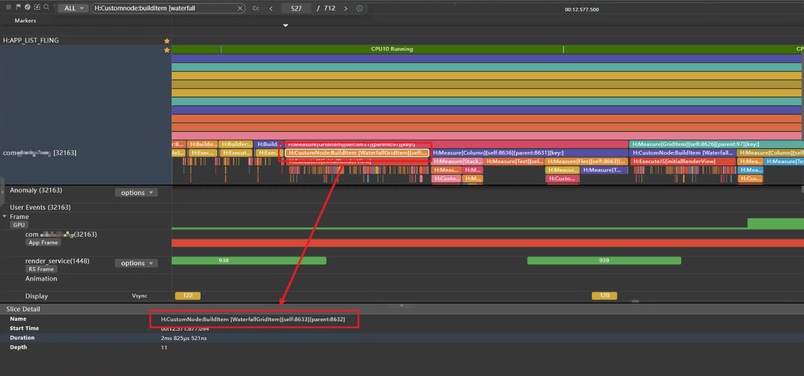

# Practice of Analyzing Delay Performance Problems

## Overview

When an application is running with obvious delay or unsmoothness, user experience is affected. Developers need to locate, analyze, and resolve the application delay problem. This document briefly describes application smoothness evaluation indicators, introduces delay problem analysis methods based on trace data, and locates, analyzes, and optimizes delay problems based on cases.

## Performance metrics

**Introduction to Performance Counters**

The standard delay for loading placeholders on sliding pages is 40 ms.

**Sliding Page Placeholder Loading Completion Delay**

On a sliding page, the scrolling stops and the placeholder (usually an image) on the screen is loaded.

## Problem Analysis Process

### Required Information

**Determine the problem symptom.**

- What are the version and data volume of the application running environment?
- What operations are performed when the application is running?
- Can the problem be reproduced locally? What is the recurrence probability?

**Prepare observability information.**

When processing an application, you can view the operation screen recording and operation scenario to check whether you can find some information that helps locate the fault. Then, obtain observable data such as HiTrace, HiPerf, CPU Profiler, and common logs.

**Trace capture**

Before capturing trace packets, you can enable some debugging functions of ArkUI in HDC. In this way, some detailed trace information is added, for example, displaying variables that cause dirty components, adding layout-related information, and displaying all component levels involved in the layout process. After connecting to the device, run the hdc shell command to enter the command line interaction mode and enter the commands listed in the following table.

| Switch Command                                         | Switch Information                                   |
| ------------------------------------------------ | ------------------------------------------ |
| param set persist.ace.debug.enabled 1             | Enables or disables the trace function for debugging, including the trace function for status change and update. |
| param set persist.ace.trace.enabled 1             | Global Trace Switch of ArkUI                       |
| param set persist.ace.layout.enabled true         | Trace of the detailed process of node tree layout                 |
| param set persist.ace.property.build.enabled      | Specifies whether to enable the build function. This parameter is supported only when the root image is used.       |
| param set const.security.developermode.state true | Whether to enable the developer mode (only supported by the root image)         |

After the debugging function is enabled on the device, you can use tools such as Frame or SmartPerf Host to capture scenario trace packets. When capturing scenario trace packets, you need to make the trace packets short and specific based on the fault symptom to facilitate subsequent fault locating.

### Problem Analysis

The general method of locating delay problems is as follows: Determine the start and end points of the delay, and then check whether the delay at the start and end points exceeds the standard 40 ms. If the delay does not exceed the standard 40 ms, the delay meets the requirement. If the delay exceeds the standard 40 ms, further analyze the location where the trace time occurs, mainly the network time and frame rendering time, finally, determine whether the problem is a system problem or a third-party problem.

Figure 1 Processing flowchart

#### Confirm the start and end points.

**Start point of the loading completion delay**
The end point of APP_LIST_FLING is regarded as the sliding stop point, which is the start point of the loading completion delay.
After the placeholder of the sliding page is loaded, the sliding stop point is used as the start point. In the trace, the APP_LIST_FLING lane can reflect the start and end of the FLING inertial scrolling status of the scrolling view. If the inertial scrolling stops, the scrolling stops, in this case, the placeholder loading delay starts to be calculated.

Figure 2 Delay start point

Search Procedure

1. Search for APP_LIST_FLING.
2. Find the APP_LIST_FLING lane and move it to the top.
3. Trace marks the inertial scrolling interval.
4. **APP_LIST_FLING end point = Start point of the loading completion delay.**

**End point of the loading completion delay**

The end point of APP_LIST_FLING is the end point of the loading completion delay. After the sliding stops, the image loading is complete, that is, the page does not change (the application side does not submit the Vsync signal to the RenderService).

After the page scrolling stops, the following situations may occur:

1. The pull-up loading is not triggered. The first frame after the scrolling stops is analyzed.
2. Triggers pull-up loading, analyzes network requests, and analyzes abnormal frames.

Figure 3 End point of the delay

**Loading Completion Delay**

Figure 4 Interval between the start point and end point

#### Fault Locating Point

1. If network loading is detected on the application UI, check whether a network request is sent in the ArkTS CallStack lane. The key trace point is createHttp. Continue to search for the request response point off(request) and parse data, onDataReload (LazyForEach refresh data) is used to determine the time when the request ends data refresh. In a long list application, the pagination loading function is used to load more data. When the scrolling stops or is about to stop, more functions are loaded, a network request is sent, and the data source is parsed and refreshed after the response data is received to drive page refreshing.

Figure 5 createHttp

1. At the FLING end point, check the ArkTS CallStack call stack to check the time-consuming tasks. If a time-consuming task is found, check the cause of the time-consuming task based on the main thread of the application process UI. If no time-consuming task is found (for example, in the idle state), check whether there are rendering tasks and corresponding components on the frame application side. Generally, the application in the idle state sends frames as animations.

2. At the FLING end point, check the frame rendering status on the frame application side to see whether abnormal frames or jumbo frames exist. In this case, you can view the component rendering details based on the UI main thread of the application process.

Figure 6 Frame rendering type

|swimlane|Issue 1|2|Issue 3|
|-|-|-|-|
|Frame/Application thread|Smooth frame transmission|Jumbo frame|Abnormal frame|
|ArkUI Component|Few components|Most of the System and Custom components|Most system components|
|ArkTS CallStack|Idle + request|Scenario|Scenario|
|Exception Tracing|Single component animation, background task network request|A large number of components are created or refreshed for rendering.|System Component Creation or Refresh Rendering|

#### Root Cause Analysis

1. If there is a network request when the slide stops, the network delay is considered.
2. If the sliding stops, extra-long frames or abnormal frames may take a long time. In this case, consider the multiplexing mechanism failure or redundant nested rendering delay.
3. Item placeholders in the list often load network images, considering network latency.
4. If an animation is used during the loading of a placeholder image, the rendering completion delay is caused. For example, if the transparency is 0 to 1 and the scaling ratio is 0 to 1, the animation delay is considered.

## Typical Issue

### The placeholder loading delay does not meet the standard due to network loading.

Swipe on the page to trigger pull-up loading. During the loading animation, wait for the data request. After the data request is complete, refresh the list. The placeholder loading completion delay does not meet the standard.

Figure 7 Pull-up loading example

#### Root Cause Analysis

1. Determine the start point and end point of the problem trace based on the start point. As shown in the following figure, the total loading completion delay is 700 ms.

Figure 8 Delay

2. Pull up to load more data based on the scenario. The data is refreshed after being requested by the network. Zoom in the trace to find the tail of APP_LIST_FLING and trigger the request at the end to request data. That is, when the scrolling to the tail is about to stop, pull up to load data and send a request to obtain the network API data. For details about key trace points, see "Key Trace Points on the Network."

 Figure 9 Sending a request

After a network data request is sent, a response is displayed in the application, indicating that the data is updated after parsing. The IDataSource bound to LazyForEach triggers the update listening. The OnDataReloaded is used to find the trace point of the updated data. The network request takes 177 ms.

Figure 10 Starting to refresh data OnDataReloaded

3. In this case, the main placeholder in the list is the Image component. The loading is to decode the ImageSource to generate the PixelMap. When loading a network image, the system sends a network request for the image address, and then decodes the returned data into PixelMap in the Image component. It takes 14 ms to create an image pixel map by searching for CreateImagePixelMap.

Figure 11 Loading the network image resource CreateImagePixelMap

#### Solutions

The network delay is affected by many factors. Therefore, you can optimize the network request and network diagram loading.

1. More data is loaded in pre-request mode. When a user quickly slides to a position at the bottom, a request is triggered. In this way, the user does not feel that more data is loaded, reducing the network request waiting time.
2. The list diagram can be loaded in small image mode to accelerate the download of network diagram resources.
3. The alt property of the Image component loads the local placeholder map to prevent the placeholder from being blank when waiting for the netmap to be loaded.
4. Image cache mechanism. Images can be obtained from the cache after the network diagram is loaded again.

The placeholder image loading completion delay is generally affected by the first network request delay. If the secondary image loading completion delay is less than or equal to 40 ms, the delay meets the standard.

### The placeholder loading delay does not meet the standard due to component rendering.

When scrolling to the bottom, pull up to load more network requests and drive the UI to refresh after the network request data is complete. In the actual test, the more the pull-up loading times, the longer the placeholder map loading takes. It can be inferred that the rendering is abnormal after more loading times.

Figure 12 Example of placeholder loading

#### Root Cause Analysis

1. According to the trace analysis, each time the list stops scrolling and triggers pull-up loading, an ultra-long frame is generated.

Figure 13 Oversized frame

2. Analyze the ultra-long frames of the main thread swimlane in the trace. It is found that a large number of components are created and the layout is calculated. For details about the key trace points, see "Key Trace Points for UI Frame Drawing."
- OnDataReloaded (LazyForEach notifies the controller of data reloading) before the main thread applies the ultra-long frame of the lane.
- Check the call stack in ArkTS CallStack. It is found that the JS calls notifyDataReload, indicating that the page refresh is triggered on the application side.
- When LazyItem is loaded twice to create indexes for ultra-long frames in the swimlane of the main thread, it is found that more and more items are drawn in a single frame from 0-51 0-51 to 0-71 0-71.

Based on the preceding three points, a larger number of pull-up loading times indicates a longer delay, indicating that full data update is used on the application side.

Figure 14 OnDataReloaded starts to trigger UI refresh

Figure 15 Viewing oversized frames and pulling up for the first time to load more

Figure 16 Viewing oversized frames and pulling up for the second time to load more

3. Continue to analyze ultra-long frames. Through the swimlane of the application main thread, it is found that a large number of BuildItems are used to construct GridItems in a single frame. In addition, a large number of aboutToBeDeleted are found in lazy loading LazyForEach predict, indicating that GridItems are released during sliding. Therefore, the subcomponents in the list are not reused, which affects the performance. For details about the key trace points, see "Key Trace Points for UI Frame Drawing."

Figure 17 Building GridItem by BuildItem

Figure 18 AboutToBeDeleted destructor GridItem in LazyForEach predict

#### Solutions

1. The component reuse mechanism @Reusable can be used to optimize performance.
2. The key value update rule of LazyForEach is optimized, and onDataAdd is used for partial update. The onDataReloaded component instructs the component to reload all data. If the key value of a data item does not change, the original subcomponent is used. If the key value of a data item changes, the subcomponent is rebuilt.

After the placeholder Image component is loaded, UI rendering is required. Optimizing the UI component rendering efficiency during sliding can improve the placeholder loading efficiency.

### The delay does not meet the standard when placeholder loading is complete due to component animation.

During the sliding list, the placeholder image loads to see a gradient animation from scratch.

Figure 19 Gradient animation

#### Root Cause Analysis

Analyze each frame during the trace sliding process. It is found that a customized animation is used during GridItem loading. The JSAnimation animation parameter duration is 150 ms, indicating that the animation completion time is 150 ms, which affects the image loading effect.

Figure 20 Animation JSAnimation

#### Solutions

Evaluate whether the animation is proper or optimize parameters.

In the UI display phase, animation is an important factor that affects the response delay.

## Appendix: Description of Common Trace Process Points in Scenarios

### Key Trace Points on the Network

Figure 21 Key trace points on the network

|No.|swimlane|Trace point|Description|
|-|-|-|-|
|1|ArkTS CallStack|createHttp|Request for creating a network|
|2|ArkTS CallStack|request|Sending a Network Request|
|3|ArkTS CallStack|parse|Parse data|
|4|ArkTS CallStack|off|Cancel Subscription|
|5|Application process|OnDataReloaded|Refreshes lazy loading data. Lazy loading data can be refreshed in full or partial mode. When there is a large amount of data, partial refresh is recommended.|

### Drawing Key Trace Points on the UI

Figure 22 Drawing key trace points on the UI

|No.|swimlane|Trace point|Description|
|-|-|-|-|
|1|Application process|SendCommands|Submitting the Application UI to the Render Service|
|2|render_service|RSMainThread::DoComposition|Layers of Nodes in the Synthesis Rendering Tree|
|3|RSHardWareThread|Commit|Submit the drawing result to the upper screen.|

|No.|swimlane|Trace point|Description|
|-|-|-|-|
|1|Application process|ReceiveVsync|RX Vsync signal.|
|2|Application process|OnVsyncEvent|The Vsync signal is received, and the rendering process starts.|
|3|Application process|FlushVsync|Refreshes view synchronization events, including recording frame information, refreshing tasks, drawing and rendering contexts, and processing user input.|
|4|Application process|FlushDirtyNodeUpdate|The dirty component is updated. Reduce the number of components to be refreshed during page refreshing and rendering. After the state variable changes, the components related to the state variable are marked dirty, and then the components are measured and laid out again. Finally, the components are rendered.|
|5|Application process|JSAnimation|Animation is displayed. The animation affects the component loading completion delay. For example, the transparency is 0-1 0-1, and the zoom-in is 0-1 0-1.|
|6|Application process|FlushLayoutTask|Execute the layout task. In this phase, the component layout is calculated. If the layer is deep or there are many components, the performance will be affected.|
|7|Application process|Builder:BuildLazyItem|Index of the item to be created. Items are created when necessary and cached.|
|8|Application process|FlushMessage|Sends information to instruct the graphics side to perform rendering.|
|9|Application process|LazyForEach predict|Onldle is generally used for preloading. LazyForEach will be triggered.|
|10|Application process|aboutToDeleted|Customize the widget lifecycle function. This problem occurs when a component is destructed. When the reuse mechanism is not used, the FlushDirtyNodeUpdate and LazyForEach predict components are destructed. As a result, the components are repeatedly created during refresh, affecting the performance.|

**FlushDirtyNodeUpdate**
- Execute the JS code to modify the status variable.
- All components associated with the state variable are marked as dirty nodes due to state variable changes.
- Remeasure and lay out all dirty nodes.
- Serializes the result and sends it to the rendering service for synthesis display.
