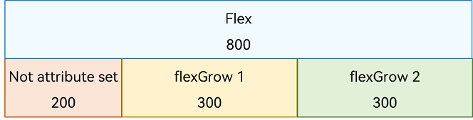
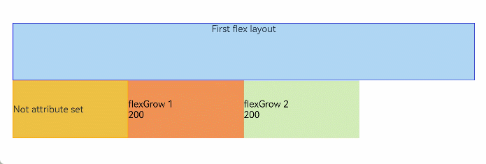
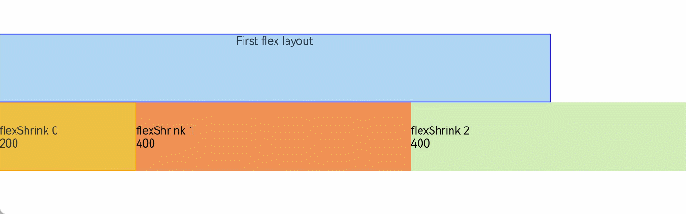
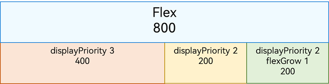
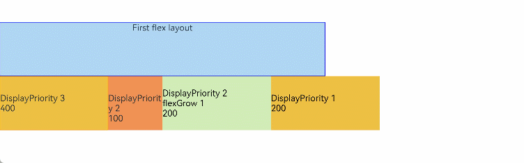
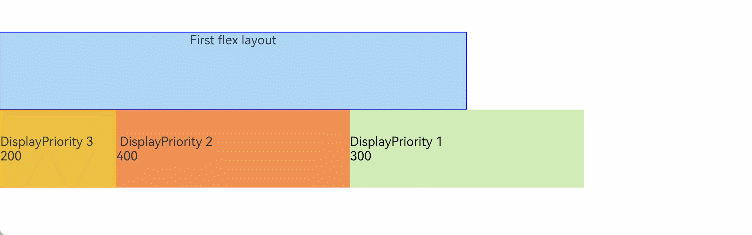

# Flex Layout Performance Improvement

The **Flex** component is a container whose child elements are automatically laid out to create a flexible layout. By default, the child elements are arranged along the main axis. The size of a child element on the main axis is called its main axis size.

When you are using the **Flex** container, note that the layout performance may drop in scenarios where child elements expand or shrink as required in a second layout to fit in the container. This can happen when child elements are laid out on a single line and their total main axis size does not equal the main axis size of the container. For example, when a 500 px wide container houses three 200 px wide child elements: After the first and second child elements are laid out, you need to set the [flexShrink](../reference/apis-arkui/arkui-ts/ts-universal-attributes-flex-layout.md#flexshrink) attribute for the second and third child elements to fully display the third child element. In this case, the second child element will be laid out again, reducing the layout efficiency.

## Scenario 1

The child elements in the flex container do not have the [displayPriority](../reference/apis-arkui/arkui-ts/ts-universal-attributes-layout-constraints.md#displaypriority) or [layoutWeight](../reference/apis-arkui/arkui-ts/ts-universal-attributes-size.md#layoutweight) attribute set, or have the attributes at their default settings. In this scenario, after the first layout of the child elements is completed:

- If the total main axis size of the child elements is equal to the main axis size of the container, no second layout is required.

  

- If the total main axis size of the child elements is less than the main axis size of the container, those child elements that have a valid [flexGrow](../reference/apis-arkui/arkui-ts/ts-universal-attributes-flex-layout.md#flexgrow) value will trigger second layout and expand to fill additional available space.

  

- If the total main axis size of the child elements is greater than the main axis size of the container, those child elements that have a valid **flexShrink** value will trigger second layout and shrink to fit into smaller space.
  

## Scenario 2

The child elements in the flex container have **displayPriority** set, but not **layoutWeight**.

In this scenario, the child elements are laid out by group in descending order of the **displayPriority** values, with those sharing the same **displayPriority** value in the same group. When the total main axis size of the child elements reaches the maximum and does not exceed the main axis size of the container, child elements that have not been laid out and have the smallest **displayPriority** value will be discarded (a set of child elements with critical **displayPriority** values may be laid out but still be discarded). After the first layout of the child elements is completed:

- If the total main axis size of the child elements is equal to the main axis size of the container, no second layout is required.
  

- If the total main axis size of the child elements is less than the main axis size of the container, those child elements that have a valid **flexGrow** value will trigger second layout and expand to fill additional available space.
  

## Scenario 3

Some child elements in the flex container have **layoutWeight** set.

In this scenario, the child elements whose **displayPriority** values are the same and whose **layoutWeight** attribute is not set are laid out in descending order of the **displayPriority** values. When the total main axis size of the child elements exceeds the main axis size of the container, child elements that have not been laid out and have the smallest **displayPriority** value will be discarded. A set of child elements with critical **displayPriority** values may be laid out but still be discarded.

The remaining space in the container is filled by the child elements whose **layoutWeight** attribute is set.

- All the child elements are laid out only once in this process, and second layout is not triggered.
  

## How to Optimize Flex Layout Performance

- Use **Column** and **Row** instead of **Flex**.

- Set the **flexShrink** attribute of child components whose size does not need to be changed to **0**.

- Prioritize the **layoutWeight** attribute over the **flexGrow** and **flexShrink** attributes.

- Use the most common layout result so that the total main axis length of child components is equal to the main axis length of the **Flex** container.
