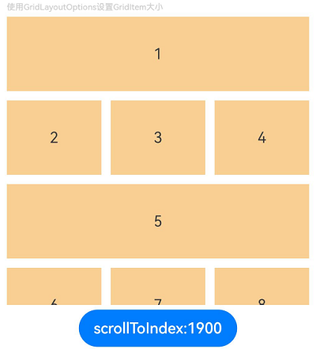
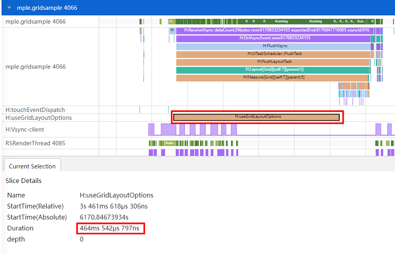
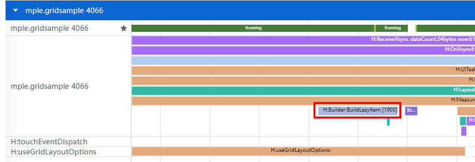

# High-Performance Grid Development

## Overview

Performance optimization is critical when building large and complex applications. As an efficient layout mode, the Grid layout can improve the page even distribution capability, subcomponent proportion control capability, and adaptive layout capability. This document describes the application of Grid in high-performance development, including lazy loading, cachedCount, component reuse, and GridItem size setting using GridLayoutOptions. This helps developers optimize Grid layout performance, reduce loading and rendering time, and improve user experience.

## Use lazy loading to improve Grid performance.

For details about the principles and mechanisms of lazy loading, cachedCount, and component reuse, see [Performance Improvement Practice in Application List Scenarios](./list-perf-improvment.md).

### When to Use

Lazy loading: LazyForEach is an optimization strategy for improving performance when processing a large amount of data. It provides the on-demand data loading capability to solve the problem that loading a large amount of data at a time takes a long time and occupies too many resources, improving the page response speed. It is usually used for container components such as List, Grid, and Swiper. LazyForEach lazy loading is recommended when Grid needs to cyclically render subcomponents with the same layout, display a large amount of data, and load all data creation and rendering pages at a time, causing performance bottlenecks.

**cachedCount**: In the Grid component, cachedCount is used to set the number of GridItems to be preloaded. This parameter is valid only when LazyForEach is used for lazy loading. If lazy loading of Grid data items is time-consuming, for example, video data and images need to be obtained from the network, sliding white blocks may occur. In this case, you need to use cachedCount to adjust the number of GridItem caches.

**Component reuse**: Reusing components can reduce the overhead of frequent component creation and destruction and thereby increase component render efficiency. When a developer's application has a control branch that frequently creates and destroys instances of the same type of customized components and repeatedly switches condition rendering in a sliding scenario, and the component subtree structure in the control branch is complex and becomes a frame rate bottleneck of the UI thread, component reuse should be considered to improve the page loading speed and response speed.

### Scenario Examples

The following is a basic example of lazy loading, cachedCount, and component reuse of the Grid component:

```ts
//The MyDataSource class implements the IDataSource interface.
class MyDataSource implements IDataSource {
  private dataArray: number[] = [];

  public pushData(data: number): void {
    this.dataArray.push(data);
  }

  //Total data volume of the data source
  public totalCount(): number {
    return this.dataArray.length;
  }

  // Return the data at the specified index position.
  public getData(index: number): number {
    return this.dataArray[index];
  }

  registerDataChangeListener(listener: DataChangeListener): void {
  }

  unregisterDataChangeListener(listener: DataChangeListener): void {
  }
}

@Entry
@Component
struct MyComponent {
  //Data source
  private data: MyDataSource = new MyDataSource();

  aboutToAppear() {
    for (let i = 1; i < 1000; i++) {
      this.data.pushData(i);
    }
  }

  build() {
    Column({ space: 5 }) {
      Grid() {
        LazyForEach(this.data, (item: number) => {
          GridItem() {
            //Use reusable custom components.
            ReusableChildComponent({ item: item })
          }
        }, (item: string) => item)
      }
      .cachedCount(2) //Set the number of cached GridItems.
      .columnsTemplate('1fr 1fr 1fr')
      .columnsGap(10)
      .rowsGap(10)
      .margin(10)
      .height(500)
      .backgroundColor(0xFAEEE0)
    }
  }
}

//The customized component is modified by the @Reusable decorator, indicating that the component can be reused.
@Reusable
@Component
struct ReusableChildComponent {
  @State item: number = 0;

  // aboutToReuse is called before being added to the component tree from the reuse cache. The component status variable can be updated here to display the correct content.
  // The aboutToReuse parameter type does not support any. In this example, Record is used to specify a specific data type. Record is used to construct an object type. The attribute key is Keys, and the attribute value is Type.
  aboutToReuse(params: Record<string, number>) {
    this.item = params.item;
  }

  build() {
    Column() {
      Image($r('app.media.icon'))
        .objectFit(ImageFit.Fill)
        .layoutWeight(1)
      Text (`Image ${this.item}`)
        .fontSize(16)
        .textAlign(TextAlign.Center)
    }
    .width('100%')
    .height(120)
    .backgroundColor(0xF9CF93)
  }
}
```

- Using lazy loading can effectively shorten the Grid loading and rendering time. In addition, when a large number of GridItems are processed, lazy loading can significantly reduce memory and CPU resource consumption. In the example, LazyForEach is used for lazy data loading. During Grid layout, the GridItem component is created as required based on the visible area and destroyed when the GridItem slides out of the visible area to reduce memory usage. For more information about lazy loading, see [LazyForEach: Lazy Data Loading](./lazyforeach_optimization.md).

- When grids are rendered in lazy loading mode, properly using cachedCount can provide better scrolling experience for applications and reduce white blocks during sliding. In the example, Grid uses the cachedCount attribute to set the number of cached GridItems. GridItems are cached before and after the Grid display area. GridItems that exceed the display and cache range are released. Note that the increase of cachedCount increases the CPU and memory overhead. Adjust the value by taking into account both the comprehensive performance and user experience.

- Component reuse can be used to further optimize the performance of frequent GridItem creation and destruction in the Grid scrolling scenario and repeated condition rendering scenario, thereby improving the page loading speed and response speed. In the example, the @Reusable decorator is used to modify the customized component ReusableChildComponent in GridItem, indicating that the component can be reused. In addition, the parameters of the customized component need to be transferred to the lifecycle callback function aboutToReuse. The aboutToReuse is used to trigger the Grid before it is added from the reuse cache to the component tree during sliding. The aboutToReuse is used to update the component status variable to display the correct content. Note that you do not need to update the status variables of automatic update values such as @Link, @StorageLink, @ObjectLink, and @Consume in aboutToReuse, which may trigger unnecessary component update. For more information about component reuse, see [Component Reuse Practice](./component-recycle.md).

## Using GridLayoutOptions to Improve Grid Performance

GridLayoutOptions is used together with rowsTemplate and columnsTemplate to set only one grid. It can replace the scenario where columnStart/columnEnd is used to control GridItem to occupy multiple columns and rowStart/rowEnd is used to control GridItem to occupy multiple rows.

### When to Use

Changing the GridItem position by deleting or dragging: A large number of GridItems exist in a grid. When columnStart/columnEnd and rowStart/rowEnd are used to set the GridItem size, grid rendering takes a long time in this scenario. In this case, GridLayoutOptions should be used to improve performance. When columnStart/columnEnd and rowStart/rowEnd are used for re-rendering, all GridItem nodes are rebuilt. GridLayoutOptions does not need to be rebuilt, and the rendering and loading time is shorter.

Use scrollToIndex to slide to a specified GridItem: There are a large number of GridItems in the Grid. When columnStart/columnEnd and rowStart/rowEnd are used to set the GridItem size, it takes a long time to set the GridItem size. In this scenario, GridLayoutOptions should be used to improve performance. The columnStart/columnEnd and rowStart/rowEnd layouts are used. When scrollToIndex slides to specify an index, Grid traverses GridItem to search for the position. If the GridLayoutOptions layout is used, when scrollToIndex slides to specify an index, the position is searched through calculation, which improves the efficiency of searching for the GridItem position.

### Scenario Examples

The following describes the scenario where scrollToIndex is used to slide to a specified position in Grid. Other scenarios are not described here.

**Negative example:**

Use columnStart and columnEnd to set the GridItem size.

```ts
//Import the performance dotting module.
import hiTraceMeter from '@ohos.hiTraceMeter';

@Component
struct TextItem {
  @State item: string = "";

  build() {
    Text(this.item)
      .fontSize(16)
      .backgroundColor(0xF9CF93)
      .width('100%')
      .height(80)
      .textAlign(TextAlign.Center)
  }

  aboutToAppear() {
    //End the dotting task.
    hiTraceMeter.finishTrace("useColumnStartColumnEnd", 1);
  }
}

class MyDataSource implements IDataSource {
  private dataArray: string[] = [];

  public pushData(data: string): void {
    this.dataArray.push(data);
  }

  public totalCount(): number {
    return this.dataArray.length;
  }

  public getData(index: number): string {
    return this.dataArray[index];
  }

  registerDataChangeListener(listener: DataChangeListener): void {
  }

  unregisterDataChangeListener(listener: DataChangeListener): void {
  }
}

@Entry
@Component
struct GridExample {
  private datasource: MyDataSource = new MyDataSource();
  scroller: Scroller = new Scroller();

  aboutToAppear() {
    for (let i = 1; i <= 2000; i++) {
      this.datasource.pushData(i + '');
    }
  }

  build() {
    Column({ space: 5 }) {
      Text ('Use columnStart,columnEnd to set GridItem size') .fontColor (0xCCCCCC).fontSize (9).width ('90%')
      Grid(this.scroller) {
        LazyForEach(this.datasource, (item: string, index: number) => {
          if ((index % 4) === 0) {
            GridItem() {
              TextItem({ item: item })
            }
            .columnStart(0).columnEnd(2)
          } else {
            GridItem() {
              TextItem({ item: item })
            }
          }
        }, (item: string) => item)
      }
      .columnsTemplate('1fr 1fr 1fr')
      .columnsGap(10)
      .rowsGap(10)
      .width('90%')
      .height('40%')

      Button("scrollToIndex:1900").onClick(() => {
        //Start a dotting task.
        hiTraceMeter.startTrace("useColumnStartColumnEnd", 1);
        this.scroller.scrollToIndex(1900);
      })
    }.width('100%')
    .margin({ top: 5 })
  }
}
```


**Positive example:**

Use GridLayoutOptions to set the GridItem size. The layout effect is the same as that in the negative example.

```ts
//Import the performance dotting module.
import hiTraceMeter from '@ohos.hiTraceMeter';

@Component
struct TextItem {
  @State item: string = "";

  build() {
    Text(this.item)
      .fontSize(16)
      .backgroundColor(0xF9CF93)
      .width('100%')
      .height(80)
      .textAlign(TextAlign.Center)
  }

  aboutToAppear() {
    //End the dotting task.
    hiTraceMeter.finishTrace("useGridLayoutOptions", 1);
  }
}

class MyDataSource implements IDataSource {
  private dataArray: string[] = [];

  public pushData(data: string): void {
    this.dataArray.push(data);
  }

  public totalCount(): number {
    return this.dataArray.length;
  }

  public getData(index: number): string {
    return this.dataArray[index];
  }

  registerDataChangeListener(listener: DataChangeListener): void {
  }

  unregisterDataChangeListener(listener: DataChangeListener): void {
  }
}

@Entry
@Component
struct GridExample {
  private datasource: MyDataSource = new MyDataSource();
  scroller: Scroller = new Scroller();
  private irregularData: number[] = [];
  layoutOptions: GridLayoutOptions = {
    regularSize: [1, 1],
    irregularIndexes: this.irregularData,
  };

  aboutToAppear() {
    for (let i = 1; i <= 2000; i++) {
      this.datasource.pushData(i + '');
      if ((i - 1) % 4 === 0) {
        this.irregularData.push(i - 1);
      }
    }
  }

  build() {
    Column({ space: 5 }) {
      Text ('Use GridLayoutOptions to set GridItem size') .fontColor (0xCCCCCC).fontSize (9).width ('90%')
      Grid(this.scroller, this.layoutOptions) {
        LazyForEach(this.datasource, (item: string, index: number) => {
          GridItem() {
            TextItem({ item: item })
          }
        }, (item: string) => item)
      }
      .columnsTemplate('1fr 1fr 1fr')
      .columnsGap(10)
      .rowsGap(10)
      .width('90%')
      .height('40%')

      Button("scrollToIndex:1900").onClick(() => {
        //Start a dotting task.
        hiTraceMeter.startTrace("useGridLayoutOptions", 1);
        this.scroller.scrollToIndex(1900);
      })
    }.width('100%')
    .margin({ top: 5 })
  }
}
```



### Effect

The operation procedure is the same as that of the positive and negative examples. Click the button and run the startTrace command to start performance dotting tracing before invoking scrollToIndex. When Grid finds the specified GridItem location and prepares to render the GridItem node, it enters the lifecycle callback aboutToAppear of the GridItem customized component. In aboutToAppear, finishTrace is used to stop performance dotting tracing. Use the startTrace flag to call scrollToIndex as the start dotting position, and use the finishTrace flag to render the first GridItem node as the end dotting position to compare the time consumption data in the positive and negative scenarios. For details about performance dotting in this example, see [Performance Dotting](../reference/apis-performance-analysis-kit/js-apis-hitracemeter.md).

The following describes how to use the SmartPerf tool to capture traces to analyze the performance differences in the forward and reverse scenarios.

As shown in Figure 1, columnStart and columnEnd are used to set the layout mode of the GridItem size. According to the customized dotting label H:useColumnStartColumnEndGrid, it takes 2974 ms from invoking scrollToIndex to finding the specified index to build the GridItem node.

Figure 1 Dotting information when columnStart and columnEnd are used


As shown in Figure 2, a large number of H:Builder:BuildLazyItem tags exist in the H:useColumnStartColumnEndGrid dotting tag period. It can be found that Grid traverses the specified index 1900 in sequence.

Figure 2 Enlarged trace label information using columnStart and columnEnd


As shown in Figure 3, GridLayoutOptions is used to set the layout mode of the GridItem size. According to the customized dotting label H:useGridLayoutOptions, it takes 464 ms from invoking scrollToIndex to finding the specified index and preparing to build the GridItem node.

Figure 3 Dotting information when GridLayoutOptions is used



As shown in Figure 4, only one H:Builder:BuildLazyItem tag exists in the H:useGridLayoutOptions dotting tag period. It can be found that Grid directly finds the specified index 1900 at a time.

Figure 4 Enlarged trace label information using GridLayoutOptions



According to the preceding analysis, when columnStart and columnEnd are used to set the GridItem size in the same layout, Grid traverses GridItem nodes in sequence when scrollToIndex is used to search for a specified index. The search process takes a long time. If GridLayoutOptions is used to set the GridItem size, the specified index is directly found at a time. The search process takes a short time. Therefore, using GridLayoutOptions to set the GridItem size can effectively reduce the Grid loading time and improve application performance when scrollToIndex is used to slide the specified index.
