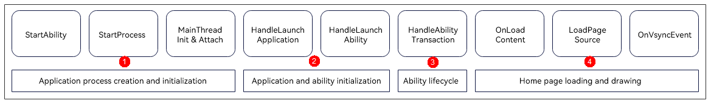

# Speeding Up Application Cold Start

Application startup latency is a key factor that affects user experience. When an application is started, the background does not have a process of the application, and therefore the system creates a new process and allocates it to the application. This startup mode is called cold start.

## Analyzing the Time Required for Application Cold Start

The cold start process of applications can be divided into four phases: application process creation and initialization, application and ability initialization, ability/ability stage lifecycle, and home page loading and drawing, as shown below.



## 1. Shortening Time Required for Application Process Creation And Initialization

In the phase of application process creation and initialization, the system creates and initializes an application process, including decoding the icon of the startup page (specified by **startWindowIcon**).

### Using startWindowIcon of Appropriate Resolution

With regard to the icon of the startup page, the recommended maximum resolution is 256 x 256 pixels. Larger resolutions may result in slow startup.

```json
    "abilities": [
      {
        "name": "EntryAbility",
        "srcEntry": "./ets/entryability/EntryAbility.ets",
        "description": "$string:EntryAbility_desc",
        "icon": "$media:icon",
        "label": "$string:EntryAbility_label",
        "startWindowIcon": "$media:startIcon", // Modify the icon of the startup page. It is recommended that the icon be less than or equal to 256 x 256 pixels.
        "startWindowBackground": "$color:start_window_background",
        "exported": true,
        "skills": [
          {
            "entities": [
              "entity.system.home"
            ],
            "actions": [
              "action.system.home"
            ]
          }
        ]
      }
    ]
```

The following uses the [SmartPerf](https://gitee.com/openharmony/developtools_smartperf_host) tool to compare the startup performance of the startup page icon before optimization (4096 x 4096 pixels) with that after optimization (144 x 144 pixels). The analysis starts when the ability is started (that is, the start point of **H:void OHOS::AppExecFwk::MainThread::HandleLaunchAbility**), and ends when **vsync** is received for the first time (that is, the start point of **H:ReceiveVsync dataCount:24Bytes now:timestamp expectedEnd:timestamp vsyncId:int**).

The comparison data is as follows.

|                        | Start (s)  | End (s)  | Duration (s)|
| ---------------------- | -------------- | -------------- | ------------ |
| Before optimization | 5419.484537973 | 5420.327775266 | 0.843237293  |
| After optimization | 4186.436835246 | 4186.908777335 | 0.471942089  |

As the comparison shows, setting **startWindowIcon** to an icon with an appropriate resolution is effective for shortening the duration of application process creation and initialization.

## 2. Shortening Time Required for Application and Ability Initialization

In the phase of application and ability initialization, resources are loaded, virtual machines are created, application and ability related objects are created and initialized, and dependent modules are loaded.

### Minimizing the Number of Imported Modules

Before executing code, an application must find and load all imported modules. Naturally, each additional third-party framework or module to be loaded by the application increases its startup time. The time required depends on the number and size of the third-party frameworks or modules to load. As such, to speed up startup, use system-provided modules whenever possible and load the modules as required.

The sample code is as follows:

```ts
// Reduce the number of imported modules.
// import ability from '@ohos.ability.ability';
// import dataUriUtils from '@ohos.ability.dataUriUtils';
// import errorCode from '@ohos.ability.errorCode';
// import featureAbility from '@ohos.ability.featureAbility';
// import particleAbility from '@ohos.ability.particleAbility';
// import wantConstant from '@ohos.ability.wantConstant';
// import common from '@ohos.app.ability.common';
// import Configuration from '@ohos.app.ability.Configuration';
// import contextConstant from '@ohos.app.ability.contextConstant';
// import ConfigurationConstant from '@ohos.app.ability.ConfigurationConstant';
// import FormExtensionAbility from '@ohos.app.form.FormExtensionAbility';
// import GesturePath from '@ohos.accessibility.GesturePath';
// import GesturePoint from '@ohos.accessibility.GesturePoint';
// import distributedAccount from '@ohos.account.distributedAccount';
// import osAccount from '@ohos.account.osAccount';

import AbilityConstant from '@ohos.app.ability.AbilityConstant';
import UIAbility from '@ohos.app.ability.UIAbility';
import Want from '@ohos.app.ability.Want';
import window from '@ohos.window';
import logger from '../common/Logger';

export default class EntryAbility extends UIAbility {
  // ...
}
```

The following uses the [SmartPerf](https://gitee.com/openharmony/developtools_smartperf_host) tool to compare the startup performance before optimization (20 imported modules) with that after optimization (5 imported modules). The analysis starts when the ability is started (that is, the start point of **H:void OHOS::AppExecFwk::MainThread::HandleLaunchAbility**), and ends when **vsync** is received for the first time (that is, the start point of **H:ReceiveVsync dataCount:24Bytes now:timestamp expectedEnd:timestamp vsyncId:int**).

The comparison data is as follows.

|                    | Start (s)  | End (s)  | Duration (s)|
| ------------------ | -------------- | -------------- | ------------ |
| Before optimization| 3042.259391282 | 3046.385614613 | 4.126223331  |
| Before optimization| 4186.436835246 | 4186.908777335 | 0.471942089  |

As the comparison shows, reducing the number of imported modules is effective for shortening the duration of application and ability initialization.

## 3. Shortening Time Required for AbilityStage Lifecycle

In this phase of AbilityStage lifecycle, the AbilityStage lifecycle callbacks are executed.

### Avoiding Time-Consuming Operations in AbilityStage Lifecycle Callbacks

In the application startup process, the system executes the AbilityStage lifecycle callbacks. Whenever possible, avoid performing time-consuming operations in these callbacks. You are advised to perform time-consuming operations through asynchronous tasks or execute them in other threads.

In these lifecycle callbacks, perform only necessary operations. For details, see [AbilityStage Component Container](../application-models/abilitystage.md).

The sample code is as follows:

```ts
const LARGE_NUMBER = 10000000;
const DELAYED_TIME = 1000;

export default class MyAbilityStage extends AbilityStage {
  onCreate(): void {
    // Time-consuming operation
    // this.computeTask();
    this.computeTaskAsync(); // Asynchronous task
  }

  onAcceptWant(want: Want): string {
    // Triggered only for the ability with the specified launch type.
    return 'MyAbilityStage';
  }

  computeTask(): void {
    let count = 0;
    while (count < LARGE_NUMBER) {
      count++;
    }
  }

  private computeTaskAsync(): void {
    setTimeout(() => {// setTimeout is used to implement asynchronous processing.
      this.computeTask();
    }, DELAYED_TIME);
  }
}
```

The following uses the [SmartPerf](https://gitee.com/openharmony/developtools_smartperf_host) tool to compare the startup performance before optimization (with synchronous operations) with that after optimization (with asynchronous operations). The analysis starts when the ability is started (that is, the start point of **H:void OHOS::AppExecFwk::MainThread::HandleLaunchAbility**), and ends when **vsync** is received for the first time (that is, the start point of **H:ReceiveVsync dataCount:24Bytes now:timestamp expectedEnd:timestamp vsyncId:int**).

The comparison data is as follows.

|                        | Start (s)  | End (s)  | Duration (s)|
| ---------------------- | -------------- | -------------- | ------------ |
| Before optimization| 2124.915558194 | 2127.041354575 | 2.125796381  |
| After optimization| 4186.436835246 | 4186.908777335 | 0.471942089  |

As the comparison shows, avoiding time-consuming operations in AbilityStage lifecycle callbacks is effective for shortening the time required for the AbilityStage lifecycle.

## 4. Shortening Time Required for Ability Lifecycle

In this phase of ability lifecycle, the ability lifecycle callbacks are executed.

### Avoiding Time-Consuming Operations in Ability Lifecycle Callbacks

In the application startup process, the system executes the ability lifecycle callbacks. Whenever possible, avoid performing time-consuming operations in these callbacks. You are advised to perform time-consuming operations through asynchronous tasks or execute them in other threads.

In these lifecycle callbacks, perform only necessary operations. The following uses the UIAbility as an example. For details about the UIAbility lifecycle, see [UIAbility Lifecycle](../application-models/uiability-lifecycle.md).

```ts
const LARGE_NUMBER = 10000000;
const DELAYED_TIME = 1000;

export default class EntryAbility extends UIAbility {
  onCreate(want: Want, launchParam: AbilityConstant.LaunchParam): void {
    logger.info('Ability onCreate');
    // Time-consuming operation
    // this.computeTask();
    this.computeTaskAsync(); // Asynchronous task
  }

  onDestroy(): void {
    logger.info('Ability onDestroy');
  }

  onWindowStageCreate(windowStage: window.WindowStage): void {
    logger.info('Ability onWindowStageCreate');

    windowStage.loadContent('pages/Index', (err, data) => {
      if (err.code) {
        logger.error('Failed to load the content. Cause: ' + JSON.stringify(err) ?? '');
        return;
      }
      logger.info('Succeeded in loading the content. Data: ' + JSON.stringify(data) ?? '');
    });

    // Time-consuming operation
    // this.computeTask();
    this.computeTaskAsync(); // Asynchronous task
  }

  onWindowStageDestroy(): void {
    logger.info('Ability onWindowStageDestroy');
  }

  onForeground(): void {
    logger.info('Ability onForeground');
    // Time-consuming operation
    // this.computeTask();
    this.computeTaskAsync(); // Asynchronous task
  }

  onBackground(): void {
    logger.info('Ability onBackground');
  }

  computeTask(): void {
    let count = 0;
    while (count < LARGE_NUMBER) {
      count++;
    }
  }

  private computeTaskAsync(): void {
    setTimeout(() => {// setTimeout is used to implement asynchronous processing.
      this.computeTask();
    }, DELAYED_TIME);
  }
}
```

The following uses the [SmartPerf](https://gitee.com/openharmony/developtools_smartperf_host) tool to compare the startup performance before optimization (with synchronous operations) with that after optimization (with asynchronous operations). The analysis starts when the ability is started (that is, the start point of **H:void OHOS::AppExecFwk::MainThread::HandleLaunchAbility**), and ends when **vsync** is received for the first time (that is, the start point of **H:ReceiveVsync dataCount:24Bytes now:timestamp expectedEnd:timestamp vsyncId:int**).

The comparison data is as follows.

|                        | Start (s)  | End (s)  | Duration (s)|
| ---------------------- | -------------- | -------------- | ------------ |
| Before optimization| 1954.987630036 | 1957.565964504 | 2.578334468  |
| After optimization| 4186.436835246 | 4186.908777335 | 0.471942089  |

As the comparison shows, avoiding time-consuming operations in ability lifecycle callbacks is effective for shortening the time required for the ability lifecycle.

## 5. Shortening Time Required for Home Page Loading and Drawing

In this phase of home page loading and drawing, the home page content is loaded, the layout is measured, and components are refreshed and drawn.

### Avoid time-consuming operations in the custom component lifecycle callbacks.

When the lifecycle of a custom component changes, the corresponding callback is called.

The **aboutToAppear** function is executed after the custom component instance is created and before the page is drawn. The following code asynchronously processes the time-consuming computing task in **aboutToAppear** to avoid executing the operation in this function and blocking the page drawing.

The sample code is as follows:

```ts
const LARGE_NUMBER = 10000000;
const DELAYED_TIME = 1000;

@Entry
@Component
struct Index {
  @State private text: string = "";
  private count: number = 0;

  aboutToAppear() {
    // Time-consuming operation
    // this.computeTask();
    this.computeTaskAsync(); // Asynchronous task
    let context = getContext(this) as Context;
    this.text = context.resourceManager.getStringSync($r('app.string.startup_text'));
  }

  build() {
    Column({ space: 10 }) {
      Text(this.text).fontSize(50)
    }
    .width('100%')
    .height('100%')
    .padding(10)
  }

  computeTask(): void {
    this.count = 0;
    while (this.count < LARGE_NUMBER) {
      this.count++;
    }
    let context = getContext(this) as Context;
    this.text = context.resourceManager.getStringSync($r('app.string.task_text'));
  }

  // Asynchronous processing of the computing task
  private computeTaskAsync(): void {
    setTimeout(() => {// setTimeout is used to implement asynchronous processing.
      this.computeTask();
    }, DELAYED_TIME);
  }
}
```

The following uses the [SmartPerf](https://gitee.com/openharmony/developtools_smartperf_host) tool to compare the startup performance before optimization (with synchronous operations) with that after optimization (with asynchronous operations). The analysis starts when the ability is started (that is, the start point of **H:void OHOS::AppExecFwk::MainThread::HandleLaunchAbility**), and ends when **vsync** is received for the first time (that is, the start point of **H:ReceiveVsync dataCount:24Bytes now:timestamp expectedEnd:timestamp vsyncId:int**).

The comparison data is as follows.

|                        | Start (s)  | End (s)  | Duration (s)|
| ---------------------- | -------------- | -------------- | ------------ |
| Before optimization| 3426.272974492 | 3431.785898837 | 5.512924345  |
| After optimization| 4186.436835246 | 4186.908777335 | 0.471942089  |

As the comparison shows, avoiding time-consuming operations in custom component lifecycle callbacks is effective for shortening the time required for home page loading and drawing.
