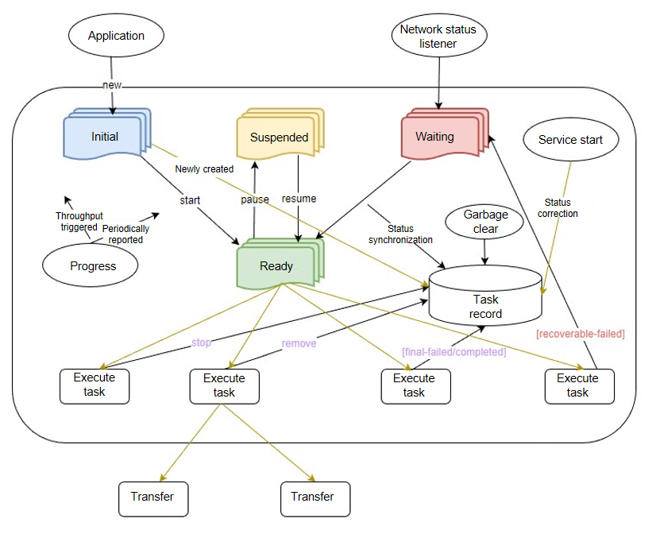
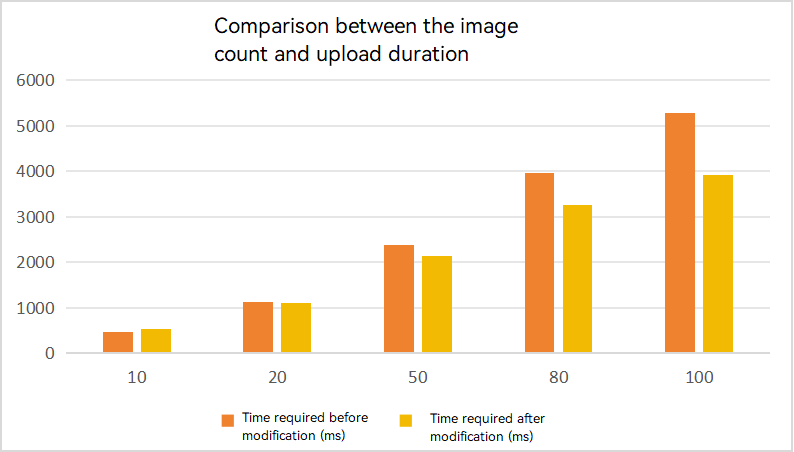
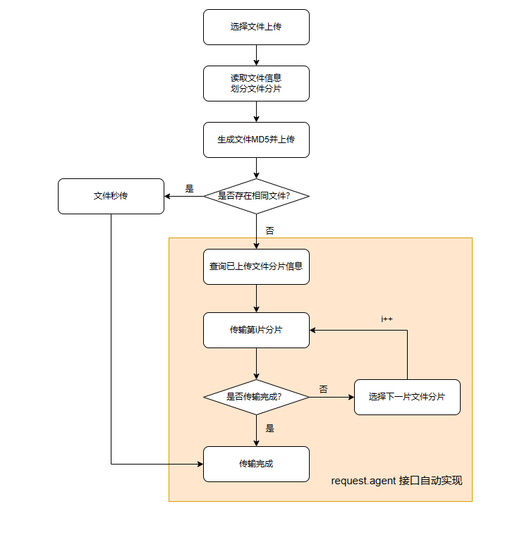

# Improving File Upload and Download Performance

## Overview

File transfer performance is critical to efficient data exchange between the client and server. An application with poor data exchange performance prolongs the loading process and may even cause screen freezing, delivering a poor user experience. On the contrary, efficient data exchange makes an application smoother.

This topic describes two key technologies for upload/download and network requests: data compression and resumable download. Both technologies accelerate upload and download speed, reduce bandwidth usage, and boost data transmission efficiency.

## Upload and Download APIs

You can use the APIs provided by the [@ohos.net.http](../reference/apis-network-kit/js-apis-http.md) and [@ohos.request](../reference/apis-basic-services-kit/js-apis-request.md) modules to implement file upload and download. The [@ohos.net.http](../reference/apis-network-kit/js-apis-http.md) module provides the basic HTTP data request capability, which is not described in this topic. The [@ohos.request](../reference/apis-basic-services-kit/js-apis-request.md) module provides applications with basic upload, download, and background transmission agent capabilities. This module has the default concurrency capability of the task management system. It simplifies the implementation and management of downloads, and improves the security of data transmission. It also integrates the notification mechanism, and supports task status and progress query. It features flexibility, efficiency, scalability, reliability, consistency, and security.

Specifically, the [@ohos.request (Upload and Download)](../reference/apis-basic-services-kit/js-apis-request.md) module provides the following functionalities:

- Task management: The operations include creating, pausing, resuming, and deleting tasks, uploading and downloading files, and sending system notifications. The created tasks are classified into foreground tasks and background tasks. Foreground tasks are synchronous, can be displayed on modal screens, and follow the application lifecycle. Generally, a foreground task involves a small volume of data and can be completed within a short period of time. Examples are posting a WeChat Moment. Foreground tasks usually have a high priority and require more bandwidth resources. Background tasks are asynchronous, and can be displayed on any screen. Generally, a foreground task carries relatively large data and is time consuming. Examples are caching a movie and synchronizing hundreds of megabytes of data or even several GB of data. Background tasks have a low priority and are irrelevant to the application lifecycle.

- Task query management: The system can query all tasks or information about the specified task, filter upload or download tasks, tasks within a time segment, foreground tasks, or background tasks, and clear the specified task. An application can query information about the specified task and specified hidden task.

- Automatic task resumption: A task is automatically started or resumed when the network conditions are met. (The HTTP server must support resumable download.)

- Security and privacy protection: The operations include network permission check, encrypted storage of task information, system API check, query and hiding of sensitive task fields (by both system APIs and public APIs), identification of traversal attacks, DoS attacks, zombie tasks, and malicious silent background tasks, and system-managed API permission. In addition, public APIs are allowed only to operate tasks created by themselves.

- Log: The debug mode and release mode are provided. In debug mode, all logs about memory modification, disk read/write, network read/write, and logic branches can be printed. In release mode, only logs related to task failures and service exceptions are printed.

- Retry upon failure: In case of unrecoverable failures, no retry is provided. In case of recoverable failures, such as network disconnection and network type mismatch, the task enters the queue and waits for network recovery. If the failure cause is network timeout, the task is retried once, and if network timeout is reported again, the task fails.

- On-demand service and stop: Upload and download do not automatically start with the system. When your application proactively calls any APIs, upload and download automatically start. The network connection event triggers the start of upload and download. If no task is being processed or a task is waiting for network recovery in the queue, the system checks the queue 10 seconds later. If no task is being processed, the system instructs SAMGR to stop and uninstall the upload and download service. During service exit, new API requests may fail. In this case, check the service status on the client and retry to start the service as required.

- Notification: Progress notifications are sent from the start to the end of a task. The notifications are triggered at a fixed interval, which is 1 second for a foreground task and 3 seconds for a background task. A progress notification is required for each change of the task status. A dedicated progress notification is triggered when the task is complete or fails. A suppression switch is also provided. You can turn on the switch during task creation to prevent frequent notifications.


### State Transition of a Download Task

When you use [@ohos.request](../reference/apis-basic-services-kit/js-apis-request.md) to execute a download task, the task has the following states: initial, ready, suspended, waiting, successful, and failed. You can call **create()** **start()**, **pause()**, **resume()**, **remove()**, and **stop()** to operate the task. The task result includes final-failed, final-completed, and recoverable-failed. You can also query the task state.

**Figure 1** Module flowchart



## Typical Scenarios and Solutions

**Scenario 1: Uploading Trivial Files on a Low-Bandwidth Network**

In an environment with poor network connection and low bandwidth, establishing an HTTP connection may be time-consuming. In this case, you can use [data compression](#data-compression) to speed up page loading and reduce the number of HTTP requests and data traffic.

**Scenario 2: Processing a Large Number of Resources**

App store and web disk applications usually involve the transfer of a large volume of files. After the application resumes from a pause or network disconnection, restart the upload or download from the beginning may take a lot of time. To address this scenario, you can use [resumable transfer](#resumable-transfer).

### Data Compression

Data compression enables the system to compress data in your application, thereby reducing storage space and data transmission volume, saving bandwidth, and improving loading speed. It plays an important role in network transmission and storage, especially in scenarios of frequent data transmission or processing of a large amount of data.

In application development, common data compression technologies are classified into the following types:

- Lossy compression: applies only to images, videos, and audio files. It decreases the file size by reducing the image/video resolution or the audio quality to shorten the loading time and lower the bandwidth consumption.
- Lossless compression: You can use [@ohos.zlib (Zip)](../reference/apis-basic-services-kit/js-apis-zlib.md) to pack and compress fragmented files, thereby reducing the number of upload requests. You can use cache for large files. Specifically, the server caches the MD5 value of the large file that has been uploaded, and the client, before uploading a large file, pre-generates an MD5 value and transfers it to the server for comparison. If the MD5 values are the same, the file exists on the server, and the file does not need to be uploaded again.
  

The following uses uploading images in batches from Gallery as an example to describe the technology related to lossless compression.

**Figure 2** Uploading images from Gallery


The table below lists the test results of batch image uploading on the RK device. (For each image, the resolution is 480 x 640, the bit depth is 24, and the average size is 50 to 120 KB).

| Image Count| Time Required Before Optimization (ms)| Time Required After Optimization (ms)|
| --- | --- | ---|
| 10 | 470 | 526 |
| 20 | 1124 | 1091 |
| ... | ... | ... |
| 50 | 2379 | 2138 |
| 80 | 3950 | 3258 |
| ... | ... | ... |
| 100 | 5276 | 3909 |

**Figure 3** Comparison between the image count and upload duration



The time required for uploading varies greatly according to the network status. In this example, the minimum value of multiple measurement results is used. According to the data, before the optimization, the time required increases linearly as the number of images increase. After the optimization, the time difference is not obvious when the number of images is small, as compression consumes extra time. However, as the number of images increases, the time difference becomes obvious.

To implement data compression, proceed as follows:

1. Import the modules.

   ```ts
   import common from '@ohos.app.ability.common';
   import fs from '@ohos.file.fs';
   import zlib from '@ohos.zlib';
   ```

2. Create a class related to compression and upload.

   ```ts
   class ZipUpload {
     // Storage URI before the task is created.
     private waitList: Array<string> = [];
     // URIs of the images to upload.
     private fileUris: Array<string> = [];
     ...
   }
   ```

3. Create a temporary folder to receive images from Gallery, compress the temporary folder, and add it to the list to be uploaded.

   ```ts
   // Compress the images.
   async zipUploadFiles(fileUris: Array<string>): Promise<void> {
     this.context = getContext(this) as common.UIAbilityContext;
     let cacheDir = this.context.cacheDir;
     let tempDir = fs.mkdtempSync(`${cacheDir}/XXXXXX`);
     // Put the image URIs into the fileUris, and traverse and copy the images to the temporary folder.
     for (let i = 0; i < fileUris.length; i++) {
       let fileName = fileUris[i].split('/').pop();
       let resourceFile: fs.File = fs.openSync(fileUris[i], fs.OpenMode.READ_ONLY);
       fs.copyFileSync(resourceFile.fd, `${tempDir}/${fileName}`, 0);
       fs.closeSync(resourceFile);
     }
     // Compress the temporary folder into test.zip.
     let options: zlib.Options = {
       level: zlib.CompressLevel.COMPRESS_LEVEL_DEFAULT_COMPRESSION,
       memLevel: zlib.MemLevel.MEM_LEVEL_DEFAULT,
       strategy: zlib.CompressStrategy.COMPRESS_STRATEGY_DEFAULT_STRATEGY
     };
     let data = await zlib.compressFile(tempDir, `${cacheDir}/test.zip`, options);
     // Delete the temporary folder.
     fs.rmdirSync(tempDir);
     // Place the generated .zip package in the transmission queue.
     this.waitList.push(`${cacheDir}/test.zip`);
   }
   ```

### Resumable Transfer

To empower resumable download, both the application and the server must use proper technologies for collaboration. You do not need to implement the code of resumable download. Instead, you only need to properly configure the SDK.

You can use the following APIs on the application side:

- [@ohos.file.fs (File Management)](../reference/apis-core-file-kit/js-apis-file-fs.md): processes file upload operations, for example, reading file content, slicing files, and combining file slices.
- [@ohos.file.hash (File Hash Processing)](../reference/apis-core-file-kit/js-apis-file-hash.md): calculates the MD5 value of a file and sends the value to the server for preprocessing. In this way, files can be transferred within seconds, with the accuracy and reliability ensured.
- [@ohos.request (Upload and Download)](../reference/apis-basic-services-kit/js-apis-request.md): implements file upload and resumable upload.

You can use the following technologies on the server:

- Range support: The server must support requests carrying the **Range** field to facilitate resumable file upload and download.
- File verification: Implement file verification to ensure that the file transfer can be resumed after an interruption.
  

By combining technologies on the application side and server side, efficient and reliable resumable transfer can be implemented, delivering a better user experience and ensuring stable data transmission.

This topic provides code snippet for resumable upload in the background upload scenario, which is described in the sample [Upload and Download](https://gitee.com/openharmony/applications_app_samples/tree/master/code/BasicFeature/Connectivity/UploadAndDownLoad). You can refer to the sample for the complete code.

#### File Upload

You can use the **request.agent** API in [@ohos.request (Upload and Download)](../reference/apis-basic-services-kit/js-apis-request.md) to implement automatic pause, resume, and retry operations in resumable upload scenarios. It frees you from manually slicing a file and recording the slice information. Figure 4 shows the flowchart.

**Figure 4** Flowchart of resumable upload



To implement resumable upload, proceed as follows:

The complete code is provided in [RequestUpload.ets](https://gitee.com/openharmony/applications_app_samples/blob/master/code/BasicFeature/Connectivity/UploadAndDownLoad/features/uploadanddownload/src/main/ets/upload/RequestUpload.ets).

1. Import the modules.

   ```ts
   import common from '@ohos.app.ability.common';
   import request from '@ohos.request';
   ```

2. Create an upload class.

   ```ts
   class Upload {
     // Background task.
     private backgroundTask: request.agent.Task | undefined = undefined;
     // Storage URI before the task is created.
     private waitList: Array<string> = [];
     ...
   }
   ```

3. Generate an MD5 value and upload it to the server for verification.

   ```ts
   async checkFileExist(fileUri: string): Promise<boolean> {
     let httpRequest = http.createHttp();
     // Generate an MD5 value.
     let md5 = await hash.hash(fileUri, 'md5');
     let requestOption: http.HttpRequestOptions = {
       method: http.RequestMethod.POST,
       extraData: {
         'MD5': md5
       }
     }
     let response = await httpRequest.request('http://XXX.XXX.XXX.XXX/XXXX', requestOption);
     let result = response.result;
     let flag = false;
     ... // Determine whether the file exists based on the data returned by the server.
     if (flag) {
       return true;
     } else {
       return false;
     }
   }
   ```

4. Configure an agent and create a background upload task.

   ```ts
   private config: request.agent.Config = {
     action: request.agent.Action.UPLOAD,
     headers: HEADER,
     url: '',
     mode: request.agent.Mode.BACKGROUND,
     method: 'POST',
     title: 'upload',
     network: request.agent.Network.ANY,
     data: [],
     token: 'UPLOAD_TOKEN'
   }
   ...
   // Convert the URI.
   private async getFilesAndData(cacheDir: string, fileUris: Array<string>): Promise<Array<request.agent.FormItem>> {
   ...
   }
   // Create a background task to upload the file.
   async createBackgroundTask(fileUris: Array<string>) {
    // Obtain the URL.
     this.config.url = 'http://XXX.XXX.XXX.XXX';
     this.config.mode = request.agent.Mode.BACKGROUND;
     let tempData = await this.getFilesAndData(this.context.cacheDir, fileUris);
     // Check whether the file is empty.
     for (let i = 0; i < tempData.length; i++) {
       let flag = await this.checkFileExist(`${this.context.cacheDir}/${tempData[i].name}`);
       if (!flag) {
         this.config.data.push(tempData[i])
       }
     }
     let isFileExist = await this.checkFileExist(`${this.context.cacheDir}/${this.config.data[0].name}`);
     if (this.config.data.length === 0) {
       return;
     }
     this.backgroundTask = await request.agent.create(this.context, this.config);
   }
   ```

5. Start the task.

   ```ts
   await this.backgroundTask.start();
   ```

6. Pause the task.

   ```ts
   async pause() {
     if (this.backgroundTask === undefined) {
       return;
     }
     await this.backgroundTask.pause();
   }
   ```

7. Resume the task.

   ```ts
   async resume() {
     if (this.backgroundTask === undefined) {
       return;
     }
     await this.backgroundTask.resume();
   }
   ```

#### File Download

You can call **request.agent** in resumable download scenarios. This API implements resumable download based on the **Range** field in the HTTP header. This field is automatically set when a task is resumed and requires no additional configuration.

> **Introduction to Range**
> 
> The **Range** field in the HTTP protocol allows the server to send an HTTP message
> to the client to request part of the data rather than the entire resource.
> 
> The format of the field is Range: \<unit>=\<start>-\<end>, where **\<unit>** indicates the range unit (bytes usually), and **\<start>** and **\<end>** indicate the start byte and end byte of the message, respectively.
> 
> The syntax of **Range** is as follows:
> ```ts
> // From range-start to the end of the file.
> Range: <unit>=<range-start>-
> // From range-start to range-end.
> Range: <unit>=<range-start>-<range-end>
> // Multiple parts, separated by commas (,).
> Range: <unit>=<range-start>-<range-end>, <range-start>-<range-end>
> 
> // Example: The file content after 1024 bytes is returned.
> Range: bytes=1024-
> ```
> The server returns 206 Partial Content if it properly processes the message, and returns other response codes in the case of a failure. The table below lists the common response codes returned by the server.
> 
> | Response Code | Common Cause |
> | ------------------ | -----------------|
> | 206 Partial Content | The server successfully processes the message and returns the requested range of data.|
> | 416 Range Not Satisfiable | The range requested by the client is invalid.|
> |200 OK | The server ignores the **Range** field in the header and returns the entire file.|
> 

To implement resumable download, proceed as follows:

The complete code is provided in [RequestDownload.ets](https://gitee.com/openharmony/applications_app_samples/blob/master/code/BasicFeature/Connectivity/UploadAndDownLoad/features/uploadanddownload/src/main/ets/download/RequestDownload.ets).

1. Import the modules.

   ```ts
   import common from '@ohos.app.ability.common';
   import request from '@ohos.request';
   ```

2. Create a download class.

   ```ts
   class Download {
     // Storage URI before the task is created.
     private waitList: Array<string[]> = [];
     // Download task.
     private downloadTask: request.agent.Task | undefined = undefined;
     // Background task download list.
     private backgroundDownloadTaskList: Array<request.agent.Task> = [];
     ...
   }
   ```

3. Configure an agent and create a background download task.

   ```ts
   async createBackgroundTask(downloadList: Array<string[]>) {
     let splitUrl = url.split('//')[1].split('/');
     let context: common.UIAbilityContext = getContext(this) as common.UIAbilityContext;
     let downloadConfig: request.agent.Config = {
       action: request.agent.Action.DOWNLOAD,
       url: url,
       method: 'POST',
       title: 'download',
       mode: request.agent.Mode.FOREGROUND, // Only background tasks can be resumed.
       network: request.agent.Network.ANY,
       saveas: `./${folder}/${splitUrl[splitUrl.length-1]}`,
       overwrite: true
     }
     this.downloadTask = await request.agent.create(context, downloadConfig);
     if (this.backgroundDownloadTaskList.findIndex(task => task.config.url === downTask.config.url) === -1) {
       this.backgroundDownloadTaskList.push(downTask);
     }
   }
   ```

4. Start the task.

   ```ts
   ...
   await downTask.start();
   ...
   ```

5. Pause the task.

   ```ts
   async pause() {
     if (this.backgroundDownloadTaskList.length === 0) {
       return;
     }
     this.backgroundDownloadTaskList.forEach(async task => {
       await task.pause();
     })
   }
   ```

6. Resume the task.

   ```ts
   async resume() {
     if (this.backgroundDownloadTaskList.length === 0) {
       return;
     }
     this.backgroundDownloadTaskList.forEach(async task => {
       await task.resume();
     })
   }
   ```

7. Stop the task.

   ```ts
   async deleteAllBackTasks() {
     if (this.backgroundDownloadTaskList.length > 0) {
       this.backgroundDownloadTaskList.forEach(async task => {
         await request.agent.remove(task.tid);
       })
       this.backgroundDownloadTaskList = [];
     }
   }
   ```

