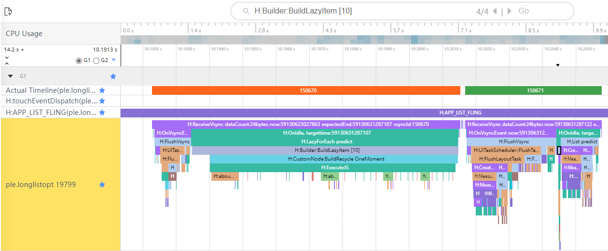
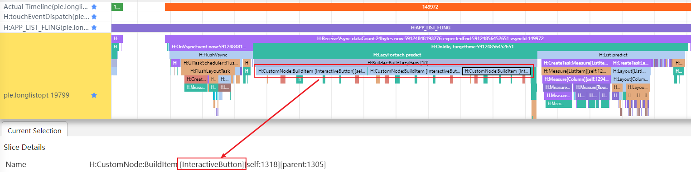

# Analysis and Practice of Frame Rate Problems in Application Sliding Scenarios

## Overview

If obvious delay or unsmoothness occurs when an app is running, user experience will be affected. Developers need to locate, analyze, and resolve the oversized frame problem of the app. This document briefly describes the application smoothness evaluation indicators, analyzes ultra-long frame problems based on trace data, and locates, analyzes, and optimizes frame freezing problems based on cases.

This document uses trace data as the breakthrough point for analysis. The corresponding tool can be SmartPerf Host or DevEco Stdio built-in Frame. If developers need to supplement knowledge about the SmartPerf Host tool and Trace, see application development documents such as [Performance Optimization Tool SmartPerf-Host] (https://docs.openharmony.cn/pages/v4.1/zh-cn/application-dev/performance/performance-optimization-using-smartperf-host.md) and [Common Trace Usage Guide] (https://docs.openharmony.cn/pages/v4.1/zh-cn/application-dev/performance/common-trace-using-instructions.md).


## Smoothness Evaluation Indicators

The smoothness of application running involves human factors and is not completely equivalent to the application system performance. The measurement can be performed based on the following indicators:

**Response Delay**

The response delay is a time from a time when a user enters a touch instruction to a time when a system starts to feed back output information to a touchscreen when the user operates the mobile terminal. The response delay is classified into click response delay and slide response delay.

- Click Response Delay: indicates the time spent by the system to respond and display the corresponding content after a user clicks a button or link.
- Sliding response delay: It refers to the time spent by the system to respond and update the content when a user slides a page or an application.

**Frame Loss Rate**

The frame loss rate is used to measure the average frame loss rate during GUI refreshing.

**Completion Delay**

The completion delay refers to the duration from the time when the page starts to be loaded to the time when all placeholders of the application are loaded. In the startup scenario, the delay can be classified into cold start delay and hot start delay.

- Cold start: When an application is started, the background does not have the process of the application. In this case, the system creates a new process and allocates it to the application, and then starts the corresponding process component based on the startup parameters.
- Hot start: When an application is started, the process of the application already exists in the background. In this case, the system starts the corresponding process component from the existing process.


## Analysis

If obvious delay or unsmoothness occurs during application running, or the smoothness evaluation indicators do not meet expectations, you can analyze the frame freezing problem as follows:

### Required Information

- Determine the problem symptom.

  What are the user environment version and data volume? What operations did the user perform? Can the problem be reproduced locally? What is the recurrence probability?

- Capturing Required Log Information

  Observable data such as HiTrace, HiPerf, cpuProfiler, and common logs.

### Issue analysis

There are many reasons for the application of oversized frames, which may be caused by the application itself, the system, or the hardware layer. Different stalling causes have different symptoms in the trace. Therefore, a large amount of experience is required for identifying stalling causes.

Based on the trace data of the app main process and RenderService rendering process, check whether the system and hardware are normal, and then analyze the application cause.

1. Check the thread status and running core to check whether resources are preempted by other processes. If yes, the system is running properly.
2. Find the time consumed by each frame in the trace, roughly determine whether the problem is caused by the app or RS, and preliminarily locate the cause based on the trace tag.
3. Check the ArkTS function call stack information or other log information based on cpuProfiler to check the application code.

### Solution

After locating the app code, developers can try to optimize the app smoothness from the following aspects:

- If the fault is located on the app side, further review the processing logic in the UI thread to check whether the processing logic is too complex or inefficient.
- If the problem is caused by the RS side, check whether the GUI layout is too complex.

Finally, find a proper solution based on the frame freezing cause, service scenario, and API, and use trace data to verify the optimization result.


## Case Practice

The following figure shows the process of locating and analyzing jumbo frames based on trace information. This case describes how to locate and analyze problems on the Trace Server side based on the preceding analysis method.


### Capture Details

Before capturing trace messages, you can enable some debugging functions of ArkUI. In this way, some detailed trace information is added, for example, displaying variables that cause dirty components, adding layout-related information, and displaying all component levels involved in the layout process. After the device is connected, run the `hdc shell` command to enter the command line interaction mode and enter the commands listed in the following table.

| Switch Command                                         | Switch Information                                    |
| ------------------------------------------------- | -------------------------------------------- |
| param set persist.ace.debug.enabled 1             | Enables or disables the trace function for debugging, including the trace function for updating status variables.|
| param set persist.ace.trace.enabled 1             | Global Trace Switch of ArkUI                        |
| param set persist.ace.trace.layout.enabled true   | Trace of the detailed process of node tree layout                 |
| param set persist.ace.trace.build.enabled 1       | Indicates whether to enable the trace function.                         |
| param set const.security.developermode.state true | Indicates whether to enable the developer mode.                            |

After the debugging function is enabled on the device, use the SmartPerf Host tool to capture scenario trace packets. In the case scenario, slide up for three times and then slide down for three times, and control the operation duration within 10s. When capturing trace messages, developers need to determine the fault symptom based on the preceding analysis roadmap to make the trace messages shorter and more specific, facilitating subsequent fault locating.

### Locate the fault.

Use the SmartPerf Host tool to open the application trace. Select Favorites Top, FrameTimeLine, Actual Timeline in the App main process and RanderService process, and the main thread in the RenderService process.

After you select a period of time for the RenderService main thread, SmartPerf automatically calculates the average frame rate based on the `RSMainThread::DoComposition` or `Repaint` tag. As shown in the following figure, the average sliding frame rate is 118.8 fps, which does not meet the requirement of 120 fps and needs to be optimized.


At the same time, the information on the way shows that the abnormal frames in orange and red are concentrated on the app side. Therefore, you need to focus on locating and analyzing app problems.

### Analyze problems frame by frame.

Because abnormal frames are concentrated on the app side, you can retain only Actual Timeline in the main process of the app to assist fault locating, and cancel the pinning of Actual Timeline in the FrameTimeLine and RanderService processes and the main thread in the RenderService process.

In the example scenario, the long list slips. To combine the actual operation action with the trace data dotting time to facilitate problem segmentation and comparison, developers can add the following two lanes to favorites:

- Slide your finger to perform dotting, that is, the `H:touchEventDispatch` lane in the app or sceneboard process.
- Dotting in the app sliding list, that is, the `H:APP_LIST_FLING` lane in the app process

Then, add the main thread in the main process of the sticky app to favorites, that is, the swimlane whose name is the bundle name of the app. Check the swimlane frame by frame. If abnormal frames in orange and red are found, analyze the cause of the overlong abnormal frames.


#### Symptom

Check the trace frame by frame and locate the oversized frame 149972 in orange and red. The `H:Builder:BuildLazyItem [10]` tag can be used to determine the time required for loading the No.10 list item. The creation process of list item 10 is under the `H:OnIdle` and `H:LazyForEach predict` tags, indicating that the cache list item is preloaded after lazy loading is enabled during the Vsync idle time.


This pre-loading, for relatively complex list items, may not be done only in one frame. Therefore, you can try to supplement the information about the related frames to help understand and analyze the problem. That is, you can use the search tag `H:Builder:BuildLazyItem [10]` to locate four related frames.

Among the four frames, frames 149971 and 149972 are used to load list item 10. The `H:CustomNode:BuildItem` tag indicates that this is the first creation of list item 10. The involved customized components do not use the reuse logic.


Frames 150670 and 150671 among the four frames are also used to load No.10 list item. However, the `H:CustomNode:BuildRecycle` tag indicates that this is a scenario where No.10 list item is reused. The involved customized components use the reuse logic.




#### Cause

After the related information is collected, it is found that both the 149972 frame during the first creation and the 150670 frame during the multiplexing are abnormal. Next, split the two phases and check the exceptions in detail.

First, in the phase of loading list item 10 for the first time. It takes two frames of Vsync idle time to complete the pre-loading. Through the label `H:CustomNode:BuildItem`, you can know that the creation of a custom component is involved in the creation phase. Zoom in frames 149971 and 149972. Multiple user-defined component names `OneMoment` and `InteractiveButton` are displayed. It can be inferred that nested user-defined components exist. Frame 149972 is mainly used to create multiple `InteractiveButton` user-defined components. Therefore, it can be inferred that the frame is an ultra-long frame.




Then look at the phase of multiplexing the No. 10 list item. Zoom in frame 150670. According to the `H:aboutToReuse` tag, the aboutToReuse callback of the customized component `OneMoment` is used during reuse. In addition, the aboutToReuse callback of all nested customized components `InteractiveButton` needs to be implemented one by one to update data. It can be inferred that this situation also causes the length of frame 150670 to be too long.


#### Analyze the code.

Based on the optimization experience, it can be inferred that if the internal UI structure of the customized component is fixed, data is transferred only with the user, and no special operation is performed in the lifecycle of each component, you can consider whether to use @Builder to optimize and replace customized components. To actually determine this, you need to return to the code.

In this process, you can use the Frame tool in Profiler to open the observability data of the application. Similar jumbo frame 5 can be located in a similar way, except that it is creating list item 17.


You only need to pay attention to the ArkTS call stack information. The ArkTS call stack is located in the ArkTS Callstack unit, as shown in the following figure. You can see an Ark object here. You can add it to favorites and pin it on top.


Select the time range of the abnormal frame and click the favorite ArkVM. The ArkTS function call stack information is displayed in the lower information area.


The percentage in the information helps developers locate the most time-consuming function in the range. If the flame graph is not intuitive enough, you can open it for comparison.


In addition to system functions, you can locate the most time-consuming TS-side function for initialRender and locate it in InteractiveButton.ets. Move the mouse pointer to view the detailed file location information: URL:entry/src/main/ets/view/InteractiveButton.ets. If the current project is associated with the information, the corresponding code location is displayed after you click.

According to the source code analysis, the user-defined component InteractiveButton meets the conditions for using lightweight @Builder optimization. Therefore, you can optimize the user-defined function InteractiveButton.

```ts
//Simplified code before optimization
@Component
export struct InteractiveButton {
  @Link imageStr: ResourceStr;
  @Link text: ResourceStr;

  aboutToReuse(params: Record<string, Object>): void {
    this.imageStr = params.imageStr as ResourceStr;
    this.text = params.text as ResourceStr;
  }

  build() {
    Row() {
      Image(this.imageStr)
      Text(this.text)
      ...
    }
  }
}
```

```ts
//Simplified code after optimization
class Temp {
  imageStr: ResourceStr = '';
  text: ResourceStr = '';
}

@Builder
function interactiveButton($$: Temp) {
  Row() {
    Image($$.imageStr)
    Text($$.text)
    ...
  } 
}
```


#### **Optimization Effect**

Use a more lightweight UI element reuse mechanism @Builder to optimize the customized component `InteractiveButton`, capture the trace again, and use the `H:Builder:BuildLazyItem [10]` tag to retrieve list item 10. When list item 10 is created for the first time, it is combined into an array for pre-loading and no exception occurs.


Therefore, when the No. 10 list item is created for the first time, it takes about 4 ms to optimize the list item.


Check the 152160 frames during multiplexing. It is found that no exception occurs. Compared with the time before the optimization, the time is reduced by about 4 ms.


## Summary

This article summarizes the analysis roadmap of the ultra-long frame problem based on the application frame freezing problem. The analysis roadmap is as follows:

1. Information preparation: Determine the problem symptom, specify the problem standard, and capture related observable data.
2. Problem analysis: Check hardware and system causes based on observable data, and then analyze and diagnose application problems.
3. Solution: Analyze the code based on the problem analysis and locating, find a proper solution based on the service scenario and API, and verify the optimization result using related observable data.

This document describes how to use Trace to locate, analyze, and solve TS problems in the long list sliding scenario.
