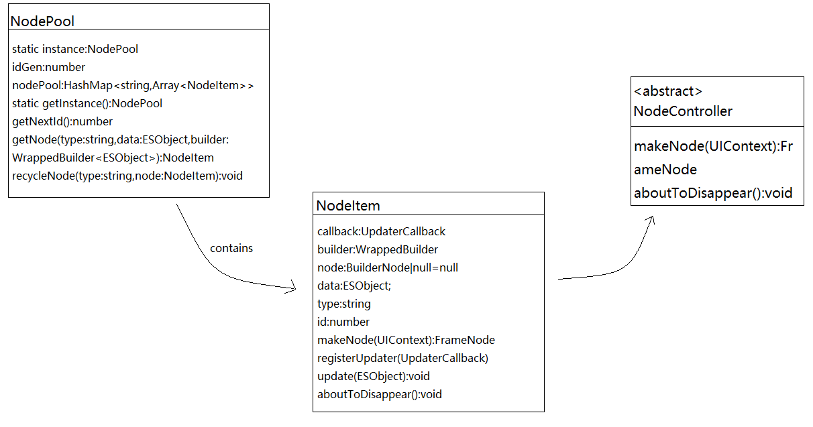

# Implementation of Global Customized Component Reuse

## Overview

By default, subcomponents are placed in the cache pool of the parent component. Due to this restriction, the same subcomponents in different parent components cannot be reused. The recommended solution is to change the parent component to the builder function so that subcomponents can share the component reuse pool. However, in some application scenarios, the parent component bears complex service logic with status. However, the builder is stateless and difficult to maintain. Therefore, developers can use the BuilderNode to manage the component reuse pool.


## Implementation Roadmap

1. Use [NodeContainer](../reference/apis-arkui/arkui-ts/ts-basic-components-nodecontainer.md#nodecontainer) as the placeholder for the customized component to be generated. Store the [NodeController](../reference/apis-arkui/js-apis-arkui-nodeController.md) in the NodeContainer in the NodePool based on the component type.
2. Each time a subcomponent needs to be created, a component is preferentially obtained from the NodePool. If there is no reusable component in the NodePool, a new component is created. Otherwise, data is updated. When the NodeController is destroyed, it is reclaimed to the NodePool for next use.

### Data Structure

NodeItem inherits NodeController and implements the makeNode method to create a component. NodePool uses HashMap to manage NodeItem reuse and recycling.



### Reuse Pool Process During Creation and Destruction

1. Use NodeContainer as a placeholder to customize the position of a component on the page. When the component runs here, search for NodeItem in NodePool based on the type.
2. If the NodeItem of the corresponding type is not found, a new NodeItem is created. Otherwise, the existing NodeItem is obtained and the data is updated.
3. When a page is destroyed, the NodeItem is reclaimed to the reuse pool for next use.


## Application Scenarios

During application development, page switching is required. For example, the home page of some video apps is a tab switching scenario implemented by List (title)+Swiper (list page). Each page in Swiper uses waterfall streams to load the video list. The subcomponents in each waterfall stream may have the same layout. To improve application performance, subcomponents need to be reused across pages. However, in the common reuse provided by ArkUI, the reuse pool is placed in the parent component. As a result, the subcomponents in the waterfall flow of the previous page cannot be reused across pages. In this case, you can use the [BuilderNode](../reference/apis-arkui/js-apis-arkui-builderNode.md#buildernode) to customize a global component reuse pool and create, reclaim, and reuse subcomponents based on the page status to implement cross-page component reuse.

## Component Reuse Performance Comparison

The following describes how to compare the performance of component reuse in common reuse mode and customized component reuse pool mode.

### Common Multiplexing

1. Use List+Swiper to switch between tab pages.

   ```ts
   ...
   List() {
     ForEach(this.arrayTitle, (title: Title, index: number) => {
       ListItem() {
         TitleView({
           title: title, clickListener: () => {
             if (title.isSelected) {
               return;
             }
             this.swiperController.changeIndex(index, true);
             this.arrayTitle[index].isSelected = true;
             this.arrayTitle[this.selectIndex].isSelected = false;
             this.selectIndex = index;
           }
         })
         ...
       }
     })
   }
   .height(30)
   .listDirection(Axis.Horizontal)
   
   Swiper(this.swiperController) {
     //Use LazyForEach to load the Swiper page as required instead of creating all pages at a time.
     LazyForEach(this.array, () => {
       TabComp()
     }, (title: string) => title)
   }
   .loop(false)
   .onChange((index: number) => { 
     if (this.selectIndex !== index) {
       this.arrayTitle[index].isSelected = true;
       this.arrayTitle[this.selectIndex].isSelected = false;
       this.selectIndex = index;
     }
   })
   .cachedCount(0) //Set cachedCount to 0 to facilitate performance comparison. You can set cachedCount as required in actual development.
   ...
   ```

2. Use the Swiper component to implement carousel charts, use the WaterFlow component to implement waterfall data loading, and set reuseId for customized components for component reuse.

   ```ts
   ...
   Scroll(this.scroller) {
     Column({ space: 2 }) {
       SwiperBuilder({images: this.images})
   
       WaterFlow() {
         LazyForEach(this.dataSource, (item: ViewItem, index: number) => {
           FlowItem() {
             FlowItemComp({
               item: item,
               itemHeight: this.itemHeightArray[index % 100],
               itemColor: Color.White,
               updater: (item: ViewItem) => {
                 this.fillNewData(item);
               }
             }).reuseId('reuse_type_')
           }
           .width('100%')
         }, (item: string) => item)
       }
       ...
       .nestedScroll({ //Set the nested sliding attribute.
         scrollForward: NestedScrollMode.PARENT_FIRST,
         scrollBackward: NestedScrollMode.SELF_FIRST
       })
     }
   }.width('100%')
   .height('100%')
   ...
   ```

3. Subcomponent that implements the waterfall flow.

   ```ts
   //The @Reusable decorator needs to be added and the aboutToReuse API needs to be implemented to refresh data during component reuse.
   @Reusable
   @Component
   export struct FlowItemComp {
     ...
   
     build() {
       ...
     }
     //Refresh the reused data through the aboutToReuse API.
     aboutToReuse(params: ESObject): void {
       this.item = params.item;
       this.itemHeight = params.itemHeight;
       this.itemColor = params.itemColor;
     }
   }
   ```

After the compilation and running, click Tabs to switch pages, and then capture Trace. According to the area selected in Figure 1, when Tabs are switched, the first frame duration (starting from the DispatchTouchEvent tag and ending with the sendCommands tag) of each page is about 30-40 ms. This is because the component reuse that uses @Reusable uses the reuse pool of the parent component. The parent component of FlowItemComp is WaterFlow. When a tab is switched, WaterFlow on the new page is re-created. As a result, the reuse pool of the previous page cannot be used, and all subcomponents have to be re-created.

Figure 1 Common multiplexing trace


### Customized Component Reuse Pool

1. Use List+Swiper to switch between tab pages.

   ```ts
   ...
   Swiper(this.swiperController) {
     LazyForEach(this.array, () => {
       TabNode()
     }, (title: string) => title)
   }
   ...
   ```

2. Inherits NodeController, implements makeNode, creates or refreshes components, and reclaims components when components are hidden (aboutToDisappear).

   ```ts
   export class NodeItem extends NodeController {
     private callback: UpdaterCallback | null = null;
     ...
     //Parent class method, which is used to create child components.
     makeNode(uiContext: UIContext): FrameNode | null {
       if (!this.node) {
         this.node = new BuilderNode(uiContext);
         this.node.build(this.builder, this.data);
       } else {
         this.node.update(this.data);
         this.update(this.data);
       }
   
       return this.node.getFrameNode();
     }
     //Reclaim the component when it is hidden.
     aboutToDisappear(): void {
       NodePool.getInstance().recycleNode(this.type, this);
     }
     ...
   }
   ```

3. The singleton mode is used to implement the reuse pool, and components are reused in the application in a unified manner.

    ```ts
    export class NodePool {
      private static instance: NodePool;
      ...
    
      private constructor() {
        this.nodePool = new HashMap();
        this.nodeHook = new HashSet();
        this.idGen = 0;
      }
      //Singleton mode, which can be managed globally in a unified manner.
      public static getInstance() {
        if (!NodePool.instance) {
          NodePool.instance = new NodePool();
        }
        return NodePool.instance;
      }
      ...
    }
    ```

4. Add the getNode method to obtain the corresponding node component based on the input type parameter. If the node component is not found, create it again.

    ```ts
      ...
      //Obtain the Node component. If the Node component of the **type** type exists, use it directly. Otherwise, create it again.
      public getNode(type: string, data: ESObject, builder: WrappedBuilder<ESObject>): NodeItem | undefined {
        let node: NodeItem | undefined = this.nodePool.get(type)?.pop();
        if (!node) {
          node = new NodeItem(builder, data, type);
          this.nodeHook.add(node);
        } else {
          node.data = data;
        }
        node.data.callback = (callback: UpdaterCallback) => {
          if (node) {
            node.registerUpdater(callback);
          }
        }
        return node;
      }
      ...
    ```

5. Implement the recycleNode method to reclaim the Node component.

    ```ts
      //Reclaim the Node component for reuse next time.
      public recycleNode(type: string, node: NodeItem) {
        let nodeArray: Array<NodeItem> = this.nodePool.get(type);
        if (!nodeArray) {
          nodeArray = new Array();
          this.nodePool.set(type, nodeArray);
        }
        nodeArray.push(node);
      }
    ```

6. When the outermost Swiper is switched, the page is reclaimed based on the lazy loading mechanism of LazyForEach. In this case, the aboutToDisappear method in NodeItem is triggered, recycle the component to the reuse pool. For a newly loaded page, available subcomponents can be obtained from the customized component reuse pool. If no component of the corresponding type is obtained, a new component is created. Otherwise, the reclaimed subcomponents are directly obtained for reuse.

   ```ts
   ...
   @Builder
   function FlowItemBuilder(data: ESObject) {
     FlowItemNode({
       item: data.item,
       itemHeight: data.itemHeight,
       itemColor: data.itemColor,
       updater: data.updater,
       callback: data.callback
     })
   }
   
   let flowItemWrapper: WrappedBuilder<ESObject> = wrapBuilder<ESObject>(FlowItemBuilder);
   let swiperWrapper: WrappedBuilder<ESObject> = wrapBuilder<ESObject>(SwiperBuilder);
   
   @Component
   export struct TabNode {
     ...
     build() {
       Scroll(this.scroller) {
         Column({ space: 2 }) {
           NodeContainer(NodePool.getInstance().getNode('reuse_type_swiper_', {
             images: this.images
           }, swiperWrapper))
           WaterFlow() {
             LazyForEach(this.dataSource, (item: ViewItem, index: number) => {
               FlowItem() {
                 NodeContainer(NodePool.getInstance().getNode('reuse_type_', {
                   item: item,
                   itemHeight: this.itemHeightArray[index % 100],
                   itemColor: this.colors[index % 5],
                   updater: (item: ViewItem) => {
                     this.fillNewData(item);
                   },
                   callback: null
                 }, flowItemWrapper))
               }
               .width('100%')
             }, (item: string) => item)
           }
       ...
     }
   }
   ```

After the compilation and running, click Tabs to switch pages and capture traces. In the selection area shown in Figure 2, the time required for the first frame of the first page is similar to that for common reuse. However, the time required for the last two pages is greatly reduced, only about 14 ms and 17 ms. This is because there is no reclaimed subcomponent in the customized reuse pool when the first page is created. Therefore, you need to directly create a subcomponent, which is the same as common reuse. When you switch to the third page, the subcomponents on the first page are reclaimed to the customized reuse pool NodePool. When the third page is created, the system searches for available subcomponents in the reuse pool and directly uses them, reducing the time for creating subcomponents.

Figure 2 Trace diagram of the customized component reuse pool


### Performance Data Comparison

| Page            | Movies  | TV series| Animation  | Sports  |
| :-------------: | :----: | :----: | :----: | :----: |
| Time Required for Creation (Before Optimization)| 39.5ms | 35.7ms | 29.8ms | 26.5ms |
| Time Required for Creation (After Optimization)| 40.3ms | 14.8ms | 17.8ms | 18.3ms |

## Summary

When components are reused inside the parent component, common reuse can solve the problem and is easy to use. You only need to add the @Reusable decorator and implement aboutToReuse. However, due to the limitation of the reuse pool, different parent components fail to reuse the same child component. The customized component reuse pool can implement cross-page component reuse. However, the implementation is complex and developers need to maintain the reuse pool by themselves.

## FAQ

Q: Why is the List+Swiper component used instead of the Tabs+TabContent component provided by ArkUI used in the sample code?

A: LazyForEach is not supported in Tabs. Only ForEach can be used. If ForEach is used, all TabContents are created during page creation, and subcomponents cannot be reclaimed during switchover (aboutToDisappear is not executed). As a result, the customized reuse pool NodePool is empty, and components cannot be obtained during each creation, you can only re-create the component, which loses the effect of component reuse. In addition, because one more NodeContainer component is created, it takes a longer time than common reuse.

Q: What should I do if I want to optimize the first frame duration of the first page?

A: You can create some subcomponents in the reuse pool in advance (for example, when the application is started) based on service requirements. In this way, the subcomponent creation process can be skipped when the first page is loaded, reducing the time required for the first frame.

Q: Is the aboutToDisappear API in NodeController the same as that in the customized component lifecycle?

A: The meaning of aboutToDisappear in NodeController is different from that of aboutToDisappear in the lifecycle of a customized component. During reuse, aboutToDisappear is also used. In the outer reuse scenario, repeated mounting occurs.

## References

[Scenario Sample Code] (https://gitee.com/harmonyos-cases/cases/tree/master/CommonAppDevelopment/feature/perfermance/customreusablepool)
