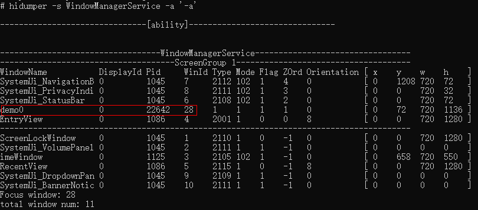
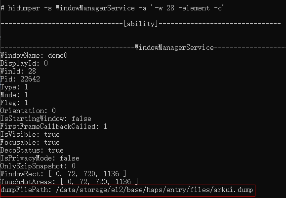
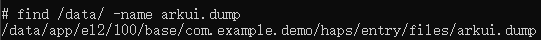
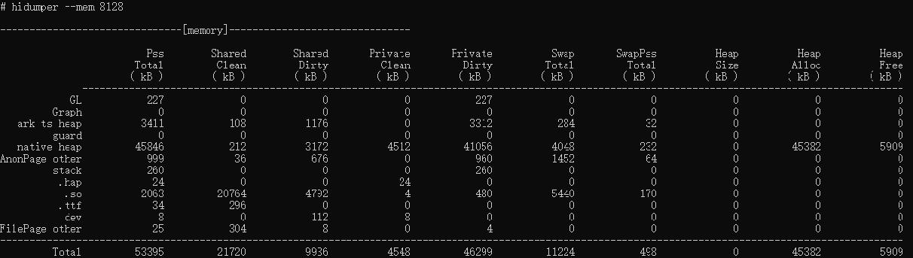

# Using HiDumper to Improve Performance


## Introduction

HiDumper is a command line tool that developers, testers, and IDE tool engineers can use to obtain system information necessary for analyzing and locating faults. During application development, you can use HiDumper to obtain the UI component tree information, which can be used with a graphical tool such as ArkUI Inspector to locate layout performance issues. You can also use HiDumper to obtain system data such as memory and CPU usage to evaluate application performance.  

This document provides a walkthrough of using HiDumper to analyze application performance. For more details about HiDumper, see [HiDumper](../../device-dev/subsystems/subsys-dfx-hidumper.md)


## Viewing Component Information

Compared with ArkUI Inspector, HiDumper allows you to obtain fine-grained component information more flexibly.

1. Enable the debug mode of ArkUI.
    ```
    hdc shell param set persist.ace.debug.enabled 1
    ```
2. Restart the application.
3. Obtain the window ID of the current page.
    ```
    hdc shell hidumper -s WindowManagerService -a '-a'
    ```

   


   * **hidumper -s**: exports all ability information of the system.
   * **idumper -s WindowManagerService -a ['-a']**: exports the ability information of the open window. **-a** indicates that the information is printed, and **['-a']** indicates the detailed information to be printed.
   * **WindowName**: name of the open window. **demo0** is the default window name of the sample application.
   * The table below lists the mapping between **WindowName** values and built-in application windows.
   
     | WindowName           | Description  |
     |----------------------|------|
     | EntryView            | Home screen  |
     | RecentView           | Recent Tasks screen|
     | SystemUi_NavigationB | Three-button navigation|
     | SystemUi_StatusBar   | Status bar |
     | ScreenLockWindow     | Magazine unlock  |
   
4. Obtain the component tree file of the target page based on **WinId** (window ID).
   ```
   hdc shell hidumper -s WindowManagerService -a '-w 28 -element -c' // 28 is the obtained window ID.
   ```

   


5. Download the component tree file to the local device. Due to the security mechanism, the path obtained is not a real path. You need to run the **find** command to search for the file.
   ```
   hdc shell find /data/ -name arkui.dump
   ```

   

   ```
   hdc file recv /data/app/el2/100/base/com.example.demo/haps/entry/files/arkui.dump . // Obtain the file and save it to the local device.
   ```
6. Open the component tree file, which lists the properties of each component, such as the number of child components (**childSize**), component ID, and background color (**BackgroundColor**).
   ```
   // Fragment of the arkui.dump file
   |-> GridItem childSize:1
     | ID: 22
     | Depth: 9
     | IsDisappearing: 0
     | FrameRect: RectT (360.00, 0.00) - [180.00 x 29.00]
     | BackgroundColor: #00000000
     ...
     |-> Stack childSize:1
       | ID: 23
       | Depth: 10
       | IsDisappearing: 0
       | FrameRect: RectT (0.00, 0.00) - [180.00 x 29.00]
       | BackgroundColor: #FFFFFF00
       ...
       |-> Stack childSize:1
         | ID: 24
         | Depth: 11
         | IsDisappearing: 0
         | FrameRect: RectT (0.00, 0.00) - [180.00 x 29.00]
         | BackgroundColor: #FF0000FF
         ...
         |-> Stack childSize:1
           | ID: 25
           | Depth: 12
           | IsDisappearing: 0
           | FrameRect: RectT (0.00, 0.00) - [180.00 x 29.00]
           | BackgroundColor: #00000000
           ...
           |-> Text childSize:0
               ID: 26
               Depth: 13
               IsDisappearing: 0
               FrameRect: RectT (83.00, 0.00) - [14.00 x 29.00]
               BackgroundColor: #00000000
               ... 
   ```

### Viewing the if/else Component

When **if/else** is used, the **if/else** statement is regarded as a component and exists in the component tree as a node. When you run HiDumper commands, the printed component tree contains the **if/else** component information. (On contrast, in ArkUI Inspector, the **if/else** component is not displayed as a node in the component tree.) In the following code, the **if(this.isShow)** statement is used to create and destroy a **Row** component.
```
@Entry
@Component
struct ConditionComponent {
  @State isShow: boolean = true;

  build() {
    Column() {
      Button ("Show/Hide")
        .onClick(() => {
          this.isShow = !this.isShow
        })
      if (this.isShow) {
        Row()
          .width(300).height(300).backgroundColor(Color.Pink)
      }
    }.width('100%')
  }
}
```
When **isShow** is set to **true**, the **Row** component is shown. At this time, in the component tree file from HiDumper, you can find that the **if/else** component is created as a node, and the **Row** component is nested as a child component.
```
|-> IfElse childSize:1
  | ID: 9
  | Depth: 6
  | IsDisappearing: 0
  |-> Row childSize:0
      ID: 12
      Depth: 7
      IsDisappearing: 0
      FrameRect: RectT (135.00, 60.00) - [450.00 x 450.00]
      BackgroundColor: #FFFFC0CB
      ParentLayoutConstraint: minSize: [[0.00 x 0.00]]maxSize: [[720.00 x 1136.00]]percentReference: [[720.00 x 1136.00]]parentIdealSize: [[720.00 x NA]]selfIdealSize: [[NA x NA]]
      top: 60.000000 left: 135.000000
      Active: 1
      Visible: 0
      ...
```
When **isShow** is set to **false**, the **Row** component is hidden. At this time, in the component tree file from HiDumper, you can find that the **if/else** component is created as a node, but the **Row** component is not loaded.
```
|-> IfElse childSize:0
    ID: 9
    Depth: 6
    IsDisappearing: 0
```

### Viewing the visibility Attribute

You can use the **visibility** attribute to control the visibility of components. In the following code, the **visibility(this.isVisible)** attribute is used to show and hide the **Row** component.
```
@Entry
@Component
struct VisibilityComponent {
  @State isVisible: Visibility = Visibility.Visible;

  build() {
    Column() {
      Button("Visible")
        .onClick(() => {
          this.isVisible = Visibility.Visible
        })
      Button("Hidden")
        .onClick(() => {
          this.isVisible = Visibility.Hidden
        })
      Button("None")
        .onClick(() => {
          this.isVisible = Visibility.None
        })
      Row().visibility(this.isVisible)
        .width(720).height(300).backgroundColor(Color.Pink)
    }.width('100%')
  }
}
```
When **isVisible** is set to **Visible**, the **Row** component is shown. At this time, in the component tree file from HiDumper, you can find that the value of **Visible** is **0**, and the width and height of the component in the **FrameRect** attribute are **450**.
```
|-> Row childSize:0
    ID: 13
    Depth: 6
    IsDisappearing: 0
    FrameRect: RectT (135.00, 180.00) - [450.00 x 450.00]
    BackgroundColor: #FFFFC0CB
    ParentLayoutConstraint: minSize: [[0.00 x 0.00]]maxSize: [[720.00 x 1136.00]]percentReference: [[720.00 x 1136.00]]parentIdealSize: [[720.00 x NA]]selfIdealSize: [[NA x NA]]
    top: 180.000000 left: 135.000000
    Active: 1
    Visible: 0
    ...
```
When **isVisible** is set to **Hidden**, the **Row** component is hidden. At this time, in the component tree file from HiDumper, you can find that the value of **Visible** is **1**, and the width and height of the component in the **FrameRect** attribute are **450**.
```
|-> Row childSize:0
    ID: 13
    Depth: 6
    IsDisappearing: 0
    FrameRect: RectT (135.00, 180.00) - [450.00 x 450.00]
    BackgroundColor: #FFFFC0CB
    ParentLayoutConstraint: minSize: [[0.00 x 0.00]]maxSize: [[720.00 x 1136.00]]percentReference: [[720.00 x 1136.00]]parentIdealSize: [[720.00 x NA]]selfIdealSize: [[NA x NA]]
    top: 180.000000 left: 135.000000
    Active: 1
    Visible: 1
    ...
```
When **isVisible** is set to **None**, the **Row** component is hidden. At this time, in the component tree file from HiDumper, you can find that the value of **Visible** is **2**, and the width and height of the component in the **FrameRect** attribute are **0**.
```
|-> Row childSize:0
    ID: 13
    Depth: 6
    IsDisappearing: 0
    FrameRect: RectT (135.00, 180.00) - [0.00 x 0.00]
    BackgroundColor: #FFFFC0CB
    ParentLayoutConstraint: minSize: [[0.00 x 0.00]]maxSize: [[720.00 x 1136.00]]percentReference: [[720.00 x 1136.00]]parentIdealSize: [[720.00 x NA]]selfIdealSize: [[NA x NA]]
    top: 180.000000 left: 135.000000
    Active: 1
    Visible: 2
    ...
```
By comparing the number of components in preceding cases, we can find that:
* When the **visibility** attribute is used to control the visibility of a component, the component's **Visible** attribute changes based on the settings, but its other structures are created regardless of the settings.
* When the **visibility** attribute is set to **Hidden**, the component is hidden, but still takes up space on the page.

## Viewing Memory Information

To obtain the memory information of an application:

1. Open the application and run **hdc shell hidumper -s WindowManagerService -a '-a'** to obtain the PID of the application.
2. Run **hidumper --mem [pid]**, replacing **[pid]** with the actual PID of the application, to obtain the memory information, as shown in the following figure.
```
hdc shell hidumper --mem [pid]
```



In general cases, you only need to pay attention to the data in the **Pss Total** column, which provides the physical memory actually used by the application. In this example, the application occupies 53395 KB of memory, including 3411 KB of the ArkUI heap memory (**ark ts heap**) and 45846 KB of the native heap memory.

## Viewing CPU Information

With CPU information from HiDumper, you can identify performance issues regarding CPU usage, which is especially useful when your application involves large computing scenarios. The following example shows how to check the CPU information of the Chat application.

1. Compile the project, install and open the Chat application, and run the following HiDumper command to obtain the PID of the application.
    ```
    hdc shell hidumper -s WindowManagerService -a '-a'
    ```
2. Run **hidumper --cpuusage [pid]** to obtain the CPU information of the Chat application.
    ```
    hdc shell hidumper --cpuusage [pid]
    ```
   
    
    
    Your primary concern would be **Total Usage**, **User Space**, and **Kernel Space**. **Total Usage** shows the total CPU usage of applications, **User Space** shows the CPU usage for simple calculation, and **Kernel Space** shows CPU usage for calling system resources. As shown in the preceding figure, the values of these three items are 11%, 11%, and 0%, indicating that the application does not call system resources. In this case, you only need to check the user space of the application. To view the CPU usage for a specific period of time, run the **hdc shell hidumper --cpuusage [pid]** command multiple times through the shell script, and then export the result to the **/data/log/hidumper** directory of the local device through **hdc shell hidumper --zip --cpuusage**.
