# Using SmartPerf-Host to Analyze Application Performance

## Overview

Smartperf-Host is an intuitive performance and power optimization tool that offers in-depth data mining and fine-grained data visualization. In this tool, you can gain visibility into a multitude of metrics in terms of CPU scheduling, frequency, process and thread time slices, heap memory, frame rate, and more, in swimlanes. Better yet, you can analyze the collected data intuitively on the GUI. This tool provides five analysis templates: frame rate analysis, CPU/thread scheduling analysis, application startup analysis, task pool analysis, and animation analysis. For details about how to use the tool, see [Smartperf-Host User Guide](../../device-dev/device-test/smartperf-host.md).

This document provides some performance analysis examples to describe how to use the frame rate analysis and application startup analysis templates to collect and analyze performance data and identify areas of improvement.

## Deployment

Before using SmartPerf-Host, deploy it on your local device. Then you can access SmartPerf-Host at **https://[*Device IP address*]:9000/application/**, as shown in the following figure.

**Figure 1** Local deployment access page


## Performance Analysis

### FrameTimeline: Frame Rate Analysis

The FrameTimeline feature allows you to record the rendering data of each frame, automatically identify frame freezing, and gain system trace information in the same period.

#### Example

In this example, the **Grid** component is used to implement a grid layout. Frame freezing or frame loss occurs during swiping on the application page. Let's see how the FrameTimeline feature works in this case.

```
@Entry  
@Component  
struct Index {  
  @State children: number[] = Array.from<undefined, number>(Array(2000).fill(undefined), (_v: undefined, k) => k);  
  build() {  
    Scroll() {  
      Grid() {  
       ForEach(this.children, (item: number) => {  
          GridItem() {  
            Stack() {  
              Stack() {  
                Stack() {  
                  Text(item.toString())  
                    .fontSize(32)  
                }  
              }  
            }  
          }  
        }, (item: number) => item.toString())  
      }  
      .columnsTemplate('1fr 1fr 1fr 1fr')  
      .columnsGap(0)  
      .rowsGap(0)  
      .size({ width: "100%", height: "100%" })  
    }  
  }  
}
```

#### Recording Data

To record data with FrameTimeline, perform the following steps:

1. Choose **Record template** > **Trace template** and enable **FrameTimeline**.

	**Figure 2** Enabling the FrameTimeline frame

	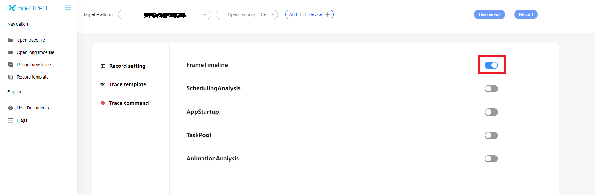

2. Customize the recording settings.

	**Figure 3** Recording settings

	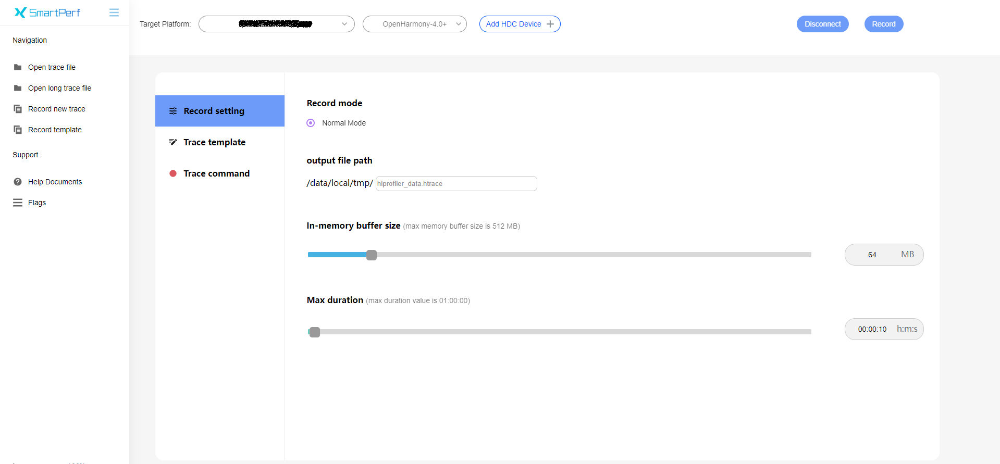

3. Click **Record** in the upper right corner to start recording. At the same time, interact with the test device to reproduce the frame loss or frame freezing. When the recording is complete, the page automatically loads the trace data.

**NOTE**

- During data recording and analysis, do not exit the application or power off the device. Otherwise, the analysis may fail.

- After you click **Record**, if "please kill other hdc-server!" is displayed on the top of the web page, the HDC port of the device is in use. In this case, run **hdc kill** in the CLI and reconnect to the device to try again.

#### Analyzing Data

A complete rendering process is as follows: The application responds to the user input, completes UI drawing, and submits the UI drawing to Render Service, which then coordinates resources such as the GPU to complete rendering, synthesis, and display. During this process, frame freezing and subsequent frame loss may occur on both the application and Render Service sides.

Based on the three groups of data shown in Figure 4, Figure 5, and Figure 6, you can quickly locate where frame loss occurs and complete preliminary demarcation.

**Figure 4** Total time consumed by the UI and RenderService

 

  
**Figure 5** Time consumed by the UI

 

  
**Figure 6** Time consumed by RenderService

 

- **Expected Timeline** represents the expected, ideal timeline, and **Actual Timeline** the actual timeline.

- There are three types of frames in the timeline: Green frames are normal frames, orange frames are janky frames, and yellow frames are where the interaction between the application and Render Service is abnormal.

- In the preceding figures, the length of each frame indicates the amount of time spent on the frame.

- If the actual end time of a frame on the application or Render Service side is later than the expected deadline, it is considered as a janky frame.

- If there are orange frames on the application side, check whether the processing logic of the UI thread is too complex or inefficient and whether resources are preempted by other tasks.

- If there are orange frames on the Render Service side, check whether the GUI layout is too complex. You can use ArkUI Inspector and [HiDumper](../performance/performance-optimization-using-hidumper.md) to analyze and locate the fault.

In this example, as shown in Figure 5 and Figure 6, the frame freezing issue lies in the application side. Click a janky frame for detailed analysis. The associated frames are represented through lines, and the details of the frame are displayed under **Current Selection**, as shown in Figure 7.

**Figure 7** Frame freezing in the application

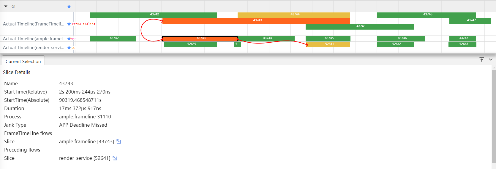

- **Duration** indicates the amount of time spent on the frame.

- **Jank Type** indicates the janky frame type. **APP Deadline Missed** indicates that the janky frame occurs on the application side.

- **FrameTimeLine flows Slice** indicates the associated frame in **FrameTimeLine**.

- **Preceding flows Slice** indicates the associated frame in Render Service.

In the following figure that shows the expanded application lanes, there are two lanes with the same name and PID. The first lane indicates the thread usage, and the second lane indicates the call stack in the thread. Based on the trace data of the time corresponding to the janky frame, it can be discerned that the FlushLayoutTask, which re-measures and lays out items, is time consuming. A closer look reveals that Layout[Gird] takes the longest time. Therefore, it is safe to conclude that the frame freezing can be ascribed to the gird layout processing logic being too complex or inefficient.

**Figure 8** Application layout drawing trace data

 

After locating and analyzing the grid layout code segment, we can optimize the code as follows: Remove the redundant three-layer stack container, pre-convert the source data to the string type required the layout, and add the **cachedCount** parameter to the **Grid** component to work with the **LazyForEach** syntax for pre-loading. Set **cachedCount** to the number of grid items that can be rendered on one screen. After the optimization, let's record data in the same way. As shown in Figure 9, no frame freezing or frame loss occurs during swiping.

**Figure 9** FrameTimeline diagram after optimization

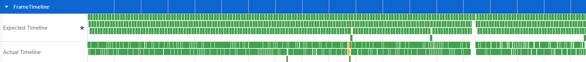 

The code after optimization is as follows:

```
class MyDataSource implements IDataSource { // LazyForEach data source 
  private list: string[] = [];  
  
  constructor(list: string[]) {  
    this.list = list;  
  }  
  
  totalCount(): number {  
    return this.list.length;  
  }  
  
  getData(index: number): string {  
    return this.list[index];  
  }  
  
  registerDataChangeListener(_: DataChangeListener): void {  
  }  
  
  unregisterDataChangeListener(): void {  
  }  
}  
@Entry  
@Component  
struct Index {  
  @State children: string[] = Array.from<undefined, string>(Array(2000).fill(undefined), (_v: undefined, k) => k.toString());  
  @State data: MyDataSource = new MyDataSource(this.children)  
  build() {  
    Scroll() {  
      Grid() {  
        LazyForEach(this.data, (item: string) => {  
          GridItem() {  
            Text(item)  
              .fontSize(32)  
          }  
        }, (item: string) => item)  
      }  
      .cachedCount(80)  
      .columnsTemplate('1fr 1fr 1fr 1fr')  
      .columnsGap(0)  
      .rowsGap(0)  
      .size({ width: "100%", height: "100%" })  
    }  
  }  
}
```

### AppStartup: Application Startup Analysis

The AppStartup feature provides the time consumption of each phase during application startup. With the provided data, you can discover which phase is slowing down your application startup and the time-consuming call stacks on the system side.

#### Example

This example shows how the AppStartup feature works.

```
@Entry  
@Component  
struct Index {  
  @State private text: string = "hello world";  
  private count: number = 0;  
  
  aboutToAppear() {  
    this.computeTask();  
  }  
  
  build() {  
    Column({space: 10}) {  
      Text(this.text).fontSize(50)  
    }  
    .width('100%')  
    .height('100%')  
    .padding(10)  
  }  
  
  computeTask() {  
    this.count = 0;  
    while (this.count < 10000000) {  
      this.count++;  
    }  
  }  
}
```

#### Recording Data

To record data with AppStartup, perform the following steps:

1. Switch to the **Flags** page and set **AppStartup** to **Enabled**.

	**Figure 10** Enabling AppStartup

	 

2. Switch to the **Record template** page, click **Trace template**, and enable **AppStartup**.

	**Figure 11** Enabling the AppStartup template

	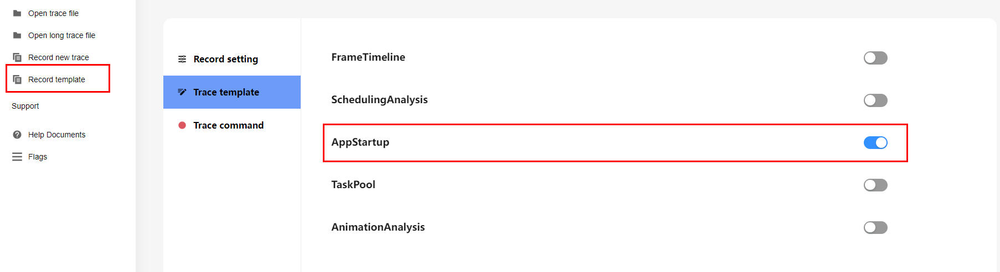 

3. On the **Record setting** tab, customize the recording settings.

	**Figure 12** Recording settings

	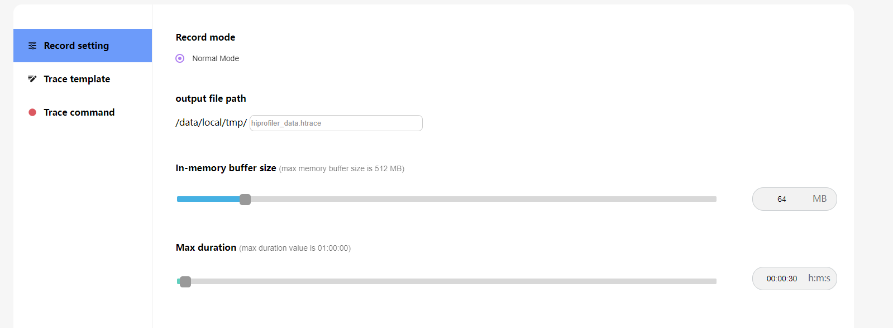 

4. Click **Record** in the upper right corner to start recording. At the same time, open the target application on the device. To end the recording, click **StopRecord**. Alternatively, wait until the recording is complete automatically. When the recording is complete, the page automatically loads the trace data.

	**Figure 13** Ending recording

	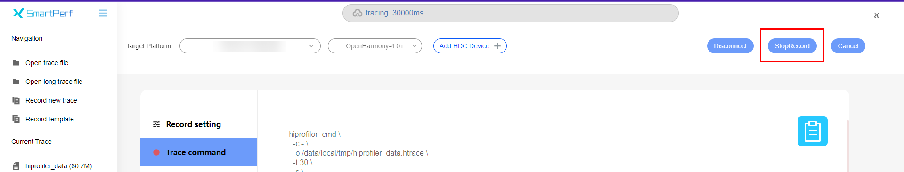 

#### Analyzing Data

Wait until the analysis result is automatically generated. Click the filter button in the upper right corner and select **AppStartup** to view and analyze data.

**Figure 14** Filtering template data

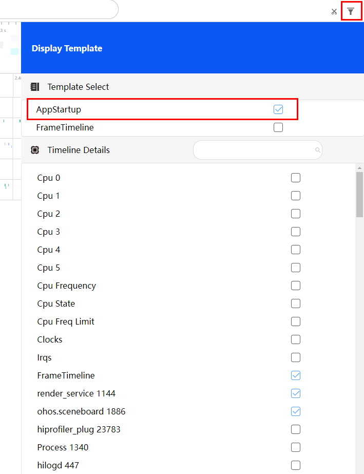 

Expand the lane of the corresponding application and locate the time frame in which the application is started. Select all phases of the AppStartup lane. You can view the time consumption of each phase in the lower pane.

**Figure 15** Time required for each AppStartup phase (before optimization)

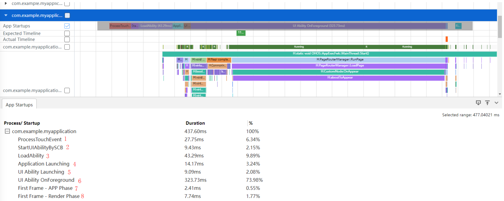 

- **ProcessTouchEvent**: input and processing of click events

- **StartUIAbilityBySCB**: process information and window creation

- **LoadAbility**: process startup

- **Application Launching**: application loading

- **UI Ability Launching**: UI ability loading

- **UI Ability OnForeground**: application being switched to the foreground.

- **First Frame - App Phase**: submission of the first frame for rendering – application

- **First Frame - Render Phase**: submission of the first frame for rendering – Render Service

As shown in the preceding figure, the **UI Ability OnForeground** phase takes the longest time, which is 323 ms.

**Figure 16** Time required for the **UI Ability OnForeground** phase (before optimization)

 

A closer look at the phase data reveals that the **aboutToAppear** lifecycle callback takes a long time, which is 268 ms, accounting for 82% of the time consumed by the entire **UI Ability OnForeground** phase.

**Figure 17** Time required for **aboutToAppear** (before optimization)

 

It is found in the code that a time-consuming calculation task is executed in the **aboutToAppear** lifecycle callback. This task slows down the cold start of the application.

To speed up application startup, we can conduct asynchronous processing for **aboutToAppear**. The code after optimization is as follows:

```
@Entry  
@Component  
struct Index {  
  @State private text: string = "hello world";  
  private count: number = 0;  
  
  aboutToAppear() {  
    setTimeout(() => {  
      this.computeTask();  
    }, 0)  
  }  
  
  build() {  
    Column({space: 10}) {  
      Text(this.text).fontSize(10)  
    }  
    .width('100%')  
    .height('100%')  
    .padding(10)  
  }  
  
  computeTask() {  
    this.count = 0;  
    while (this.count < 10000000) {  
      this.count++;  
    }  
  }  
}
```

Now, let's record the data in the same way.

**Figure 18** Time required for each AppStartup phase (after optimization)

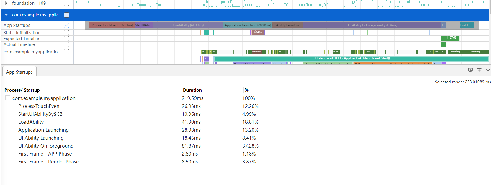 

The focus of optimization, the **UI Ability OnForeground** phase, where the **aboutToAppear** lifecycle is located, takes 81 ms.

**Figure 19** Time required for the UI Ability OnForeground phase (after optimization)

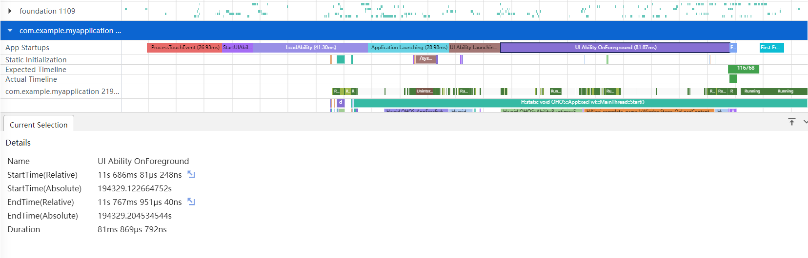 

A closer look at the phase data reveals that the **aboutToAppear** lifecycle callback now takes 2 ms, accounting for only 2.5% of the time consumed by the entire **UI Ability OnForeground** phase.

**Figure 20** Time consumed by aboutToAppear (after optimization)

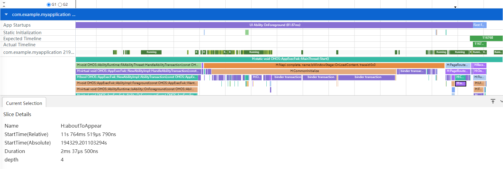
