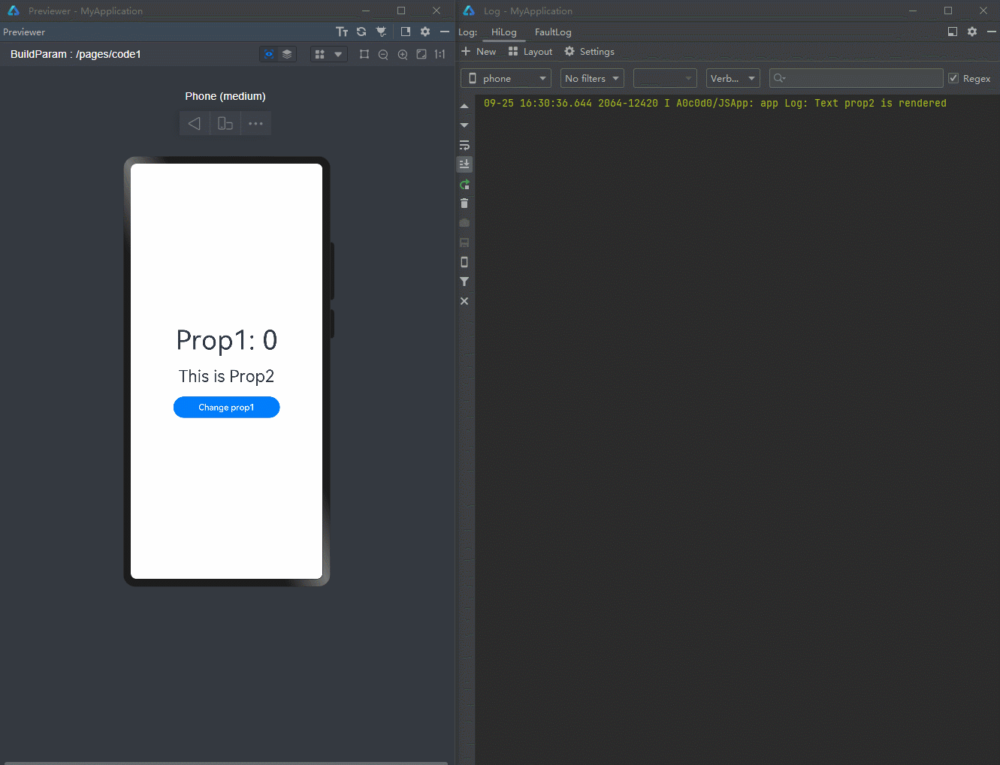
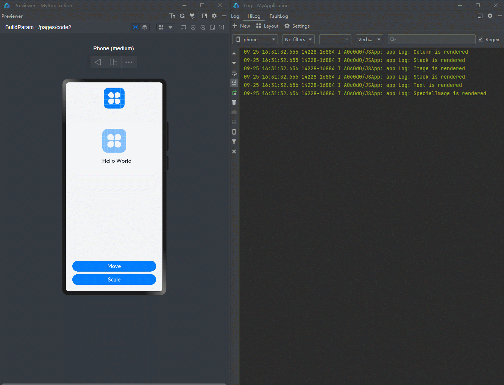
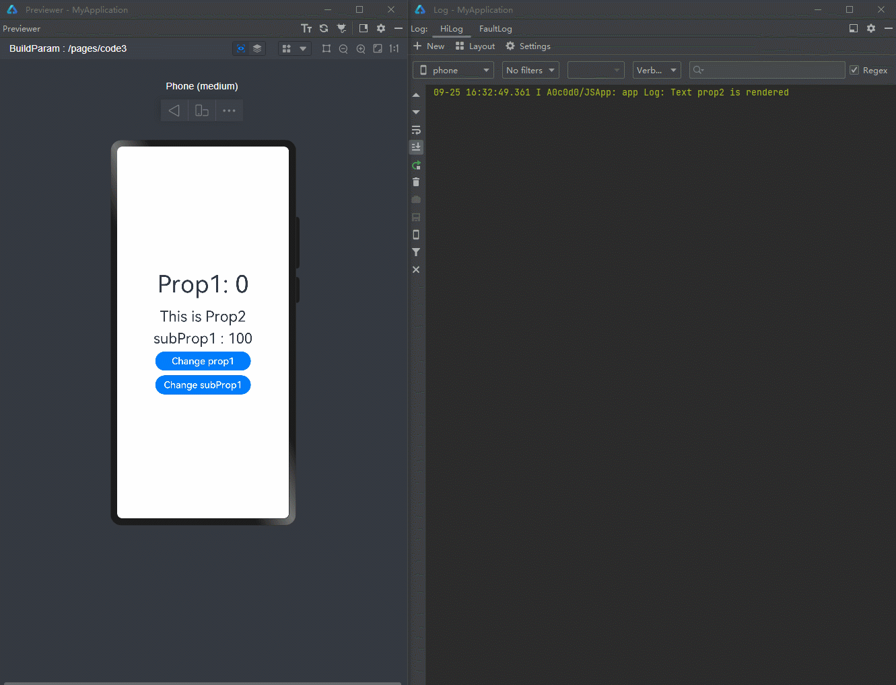
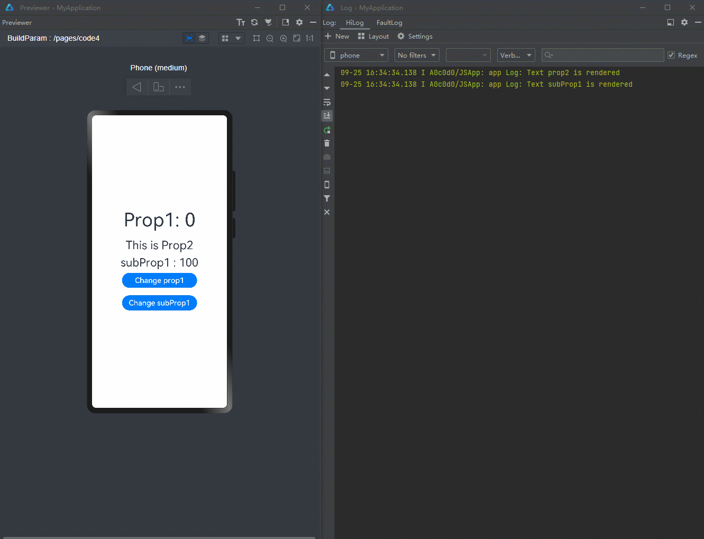

# Precisely Controlling Render Scope

In development of complex pages, precisely controlling the component render scope is especially important to speed up applications.

This document exemplifies why and how the component render scope may be precisely controlled. For starters, you need to understand the re-render mechanism with state management.

```ts
@Observed
class ClassA {
  prop1: number = 0;
  prop2: string = "This is Prop2";
}
@Component
struct CompA {
  @ObjectLink a: ClassA;
  private sizeFont: number = 30; // the private variable does not invoke rendering
  private isRenderText() : number {
    this.sizeFont++; // the change of sizeFont will not invoke rendering, but showing that the function is called
    console.log("Text prop2 is rendered");
    return this.sizeFont;
  }
  build() {
    Column() {
      Text(this.a.prop2) // when this.a.prop2 changes, it will invoke Text rerendering
        .fontSize(this.isRenderText()) // If the <Text> renders, the function isRenderText will be called.
    }
  }
}
@Entry
@Component
struct Page {
  @State a: ClassA = new ClassA();
  build() {
    Row() {
      Column() {
        Text("Prop1: " + this.a.prop1)
          .fontSize(50)
          .margin({ bottom: 20 })
        CompA({a: this.a})
        Button("Change prop1")
          .width(200)
          .margin({ top: 20 })
          .onClick(() => {
            this.a.prop1 = this.a.prop1 + 1 ;
          })
      }
      .width('100%')
    }
    .width('100%')
    .height('100%')
  }
}
```

In the preceding example, when the value of **prop1** changes at the click of the button, although the components in **CompA** do not use **prop1**, you can still observe that the **Text** component associated with **prop2** is re-rendered – reflected by the component's enlarged font size and the console log of "Text prop2 is rendered." This indicates that, when a property (**prop1** in this example) of an @Observed decorated class object is changed, all components associated with any property of this object are re-rendered at once, even though these components may not directly use the changed property (i.e., the **Text** component using **prop** in this example). In this case, invisible, redundant re-renders occur. When a large number of components are involved in redundant re-renders, the render performance is greatly affected.

The following figure shows the code running.



The following is a typical example of redundant re-renders.

```ts
@Observed
class UIStyle {
  translateX: number = 0;
  translateY: number = 0;
  scaleX: number = 0.3;
  scaleY: number = 0.3;
  width: number = 336;
  height: number = 178;
  posX: number = 10;
  posY: number = 50;
  alpha: number = 0.5;
  borderRadius: number = 24;
  imageWidth: number = 78;
  imageHeight: number = 78;
  translateImageX: number = 0;
  translateImageY: number = 0;
  fontSize: number = 20;
}
@Component
struct SpecialImage {
  @ObjectLink uiStyle: UIStyle;
  private isRenderSpecialImage() : number { // Function to show whether the component is rendered.
    console.log("SpecialImage is rendered");
    return 1;
  }
  build() {
    Image($r('app.media.icon'))
      .width(this.uiStyle.imageWidth)
      .height(this.uiStyle.imageHeight)
      .margin({ top: 20 })
      .translate({
        x: this.uiStyle.translateImageX,
        y: this.uiStyle.translateImageY
      })
      .opacity(this.isRenderSpecialImage()) // If the <Image> is rendered, it will call the function.
  }
}
@Component
struct CompA {
  @ObjectLink uiStyle: UIStyle
  // The following functions are used to show whether the component is called to be rendered.
  private isRenderColumn() : number {
    console.log("Column is rendered");
    return 1;
  }
  private isRenderStack() : number {
    console.log("Stack is rendered");
    return 1;
  }
  private isRenderImage() : number {
    console.log("Image is rendered");
    return 1;
  }
  private isRenderText() : number {
    console.log("Text is rendered");
    return 1;
  }
  build() {
    Column() {
      // When you compile this code in API version 9, the IDE may tell you that
      // "Assigning the '@ObjectLink' decorated attribute 'uiStyle' to the '@ObjectLink' decorated attribute 'uiStyle' is not allowed. <etsLint>"
      // Yet, you can still run the code by Previewer.
      SpecialImage({
        uiStyle: this.uiStyle
      })
      Stack() {
        Column() {
            Image($r('app.media.icon'))
              .opacity(this.uiStyle.alpha)
              .scale({
                x: this.uiStyle.scaleX,
                y: this.uiStyle.scaleY
              })
              .padding(this.isRenderImage())
              .width(300)
              .height(300)
        }
        .width('100%')
        .position({ y: -80 })
        Stack() {
          Text("Hello World")
            .fontColor("#182431")
            .fontWeight(FontWeight.Medium)
            .fontSize(this.uiStyle.fontSize)
            .opacity(this.isRenderText())
            .margin({ top: 12 })
        }
        .opacity(this.isRenderStack())
        .position({
          x: this.uiStyle.posX,
          y: this.uiStyle.posY
        })
        .width('100%')
        .height('100%')
      }
      .margin({ top: 50 })
      .borderRadius(this.uiStyle.borderRadius)
      .opacity(this.isRenderStack())
      .backgroundColor("#FFFFFF")
      .width(this.uiStyle.width)
      .height(this.uiStyle.height)
      .translate({
        x: this.uiStyle.translateX,
        y: this.uiStyle.translateY
      })
      Column() {
        Button("Move")
          .width(312)
          .fontSize(20)
          .backgroundColor("#FF007DFF")
          .margin({ bottom: 10 })
          .onClick(() => {
            animateTo({
              duration: 500
            },() => {
              this.uiStyle.translateY = (this.uiStyle.translateY + 180) % 250;
            })
          })
        Button("Scale")
          .borderRadius(20)
          .backgroundColor("#FF007DFF")
          .fontSize(20)
          .width(312)
          .onClick(() => {
            this.uiStyle.scaleX = (this.uiStyle.scaleX + 0.6) % 0.8;
          })
      }
      .position({
        y:666
      })
      .height('100%')
      .width('100%')

    }
    .opacity(this.isRenderColumn())
    .width('100%')
    .height('100%')

  }
}
@Entry
@Component
struct Page {
  @State uiStyle: UIStyle = new UIStyle();
  build() {
    Stack() {
      CompA({
        uiStyle: this.uiStyle
      })
    }
    .backgroundColor("#F1F3F5")
  }
}
```

In the above example, **uiStyle** defines multiple properties, which are each associated with multiple components. When some of these properties are changed at the click of a button, all the components associated with **uiStyle** are re-rendered according to the mechanism described above, even though they actually do not need to be re-rendered (because the properties of these components are not changed). The re-renders of these components can be observed through a series of defined **isRender** functions. When **Move** is clicked to perform the translation animation, the values of **translateX** and **translateY** change multiple times. As a result, redundant re-renders occur at each frame, which greatly worsen the application performance.

The following figure shows the code running.



To precisely control the component render scope and avoid redundant re-renders, it is recommended that you divide a large property object into several small property objects.

To achieve this purpose, it is first necessary to understand the mechanism for property change observation.

Below is sample code:

```TS
@Observed
class ClassB {
  subProp1: number = 100;
}
@Observed
class ClassA {
  prop1: number = 0;
  prop2: string = "This is Prop2";
  prop3: ClassB = new ClassB();
}
@Component
struct CompA {
  @ObjectLink a: ClassA;
  private sizeFont: number = 30; // the private variable does not invoke rendering
  private isRenderText() : number {
    this.sizeFont++; // the change of sizeFont will not invoke rendering, but showing that the function is called
    console.log("Text prop2 is rendered");
    return this.sizeFont;
  }
  build() {
    Column() {
      Text(this.a.prop2) // When this.a.prop1 changes, it will invoke <Text> re-rendering.
        .margin({ bottom: 10 })
        .fontSize(this.isRenderText()) // If the <Text> renders, the function isRenderText will be called.
      Text("subProp1 : " + this.a.prop3.subProp1) //the Text can not observe the change of subProp1
        .fontSize(30)
    }
  }
}
@Entry
@Component
struct Page {
  @State a: ClassA = new ClassA();
  build() {
    Row() {
      Column() {
        Text("Prop1: " + this.a.prop1)
          .margin({ bottom: 20 })
          .fontSize(50)
        CompA({a: this.a})
        Button("Change prop1")
          .width(200)
          .fontSize(20)
          .backgroundColor("#FF007DFF")
          .margin({
            top: 10,
            bottom: 10
          })
          .onClick(() => {
            this.a.prop1 = this.a.prop1 + 1 ;
          })
        Button("Change subProp1")
          .width(200)
          .fontSize(20)
          .backgroundColor("#FF007DFF")
          .onClick(() => {
            this.a.prop3.subProp1 = this.a.prop3.subProp1 + 1;
          })
      }
      .width('100%')
    }
    .width('100%')
    .height('100%')
  }
}
```

In the preceding example, when **Change subProp1** is clicked, you can find that the page is not re-rendered. This is because the change to **subProp1** is not observed by the component. When **Change prop1** is clicked, the page is re-rendered, with the latest values of **prop1** and **subProp1** displayed. According to the ArkUI state management mechanism, the state variable can only observe the change at the first layer. For **Change subProp1**, the property value changes at the second layer and therefore cannot be observed. In other words, the change of **this.a.prop3.subProp1** does not cause component re-renders, even if the value of **subProp1** has changed. In comparison, the change of **this.a.prop1** causes component re-renders.

The following figure shows the code running.



With this mechanism of property change observation, the render scope of components can be precisely controlled.

```ts
@Observed
class ClassB {
  subProp1: number = 100;
}
@Observed
class ClassA {
  prop1: number = 0;
  prop2: string = "This is Prop2";
  prop3: ClassB = new ClassB();
}
@Component
struct CompA {
  @ObjectLink a: ClassA;
  @ObjectLink b: ClassB; // A new @ObjectLink decorated variable.
  private sizeFont: number = 30;
  private isRenderText() : number {
    this.sizeFont++;
    console.log("Text prop2 is rendered");
    return this.sizeFont;
  }
  private isRenderTextSubProp1() : number {
    this.sizeFont++;
    console.log("Text subProp1 is rendered");
    return this.sizeFont;
  }
  build() {
    Column() {
      Text(this.a.prop2) // When this.a.prop1 changes, it will invoke <Text> re-rendering.
        .margin({ bottom: 10 })
        .fontSize(this.isRenderText()) // If the <Text> renders, the function isRenderText will be called.
      Text("subProp1 : " + this.b.subProp1) // Use directly b rather than a.prop3.
        .fontSize(30)
        .opacity(this.isRenderTextSubProp1())
    }
  }
}
@Entry
@Component
struct Page {
  @State a: ClassA = new ClassA();
  build() {
    Row() {
      Column() {
        Text("Prop1: " + this.a.prop1)
          .margin({ bottom: 20 })
          .fontSize(50)
        CompA({
          a: this.a,
          b: this.a.prop3
        })
        Button("Change prop1")
          .width(200)
          .fontSize(20)
          .backgroundColor("#FF007DFF")
          .margin({
            top: 10,
            bottom: 10
          })
          .onClick(() => {
            this.a.prop1 = this.a.prop1 + 1 ;
          })
        Button("Change subProp1")
          .width(200)
          .fontSize(20)
          .backgroundColor("#FF007DFF")
          .margin({
            top: 10,
            bottom: 10
          })
          .onClick(() => {
            this.a.prop3.subProp1 = this.a.prop3.subProp1 + 1;
          })
      }
      .width('100%')
    }
    .width('100%')
    .height('100%')
  }
}
```

In the preceding example, a new variable **b** decorated by @ObjectLink is defined in **CompA**. When **CompA** is created on the page, **prop3** in object **a** is passed to **b**. In this way, **b** can be directly used in **CompA**. This means that, in effect, **CompA** is associated with **b** and can observe the change of **subProp1** in **b**. When **Change subProp1** is clicked, the associated **Text** component is re-rendered, but other components are not (because these components are associated with **a**). Similarly, changes to other properties in **a** do not cause the **Text** component to be re-rendered.

The following figure shows the code running.



By using the aforementioned method, properties in the foregoing complex redundant re-render scenario can be divided to optimize performance.

```ts
@Observed
class NeedRenderImage { // Properties only used in the same component can be divided into the same new divided class.
  public translateImageX: number = 0;
  public translateImageY: number = 0;
  public imageWidth:number = 78;
  public imageHeight:number = 78;
}
@Observed
class NeedRenderScale { // Properties usually used together can be divided into the same new child class.
  public scaleX: number = 0.3;
  public scaleY: number = 0.3;
}
@Observed
class NeedRenderAlpha { // Properties that may be used in different places can be divided into the same new child class.
  public alpha: number = 0.5;
}
@Observed
class NeedRenderSize { // Properties usually used together can be divided into the same new child class.
  public width: number = 336;
  public height: number = 178;
}
@Observed
class NeedRenderPos { // Properties usually used together can be divided into the same new child class.
  public posX: number = 10;
  public posY: number = 50;
}
@Observed
class NeedRenderBorderRadius { // Properties that may be used in different places can be divided into the same new child class.
  public borderRadius: number = 24;
}
@Observed
class NeedRenderFontSize { // Properties that may be used in different places can be divided into the same new child class.
  public fontSize: number = 20;
}
@Observed
class NeedRenderTranslate { // Properties usually used together can be divided into the same new child class.
  public translateX: number = 0;
  public translateY: number = 0;
}
@Observed
class UIStyle {
  // Define a new variable instead of using the old one.
  needRenderTranslate: NeedRenderTranslate = new NeedRenderTranslate();
  needRenderFontSize: NeedRenderFontSize = new NeedRenderFontSize();
  needRenderBorderRadius: NeedRenderBorderRadius = new NeedRenderBorderRadius();
  needRenderPos: NeedRenderPos = new NeedRenderPos();
  needRenderSize: NeedRenderSize = new NeedRenderSize();
  needRenderAlpha: NeedRenderAlpha = new NeedRenderAlpha();
  needRenderScale: NeedRenderScale = new NeedRenderScale();
  needRenderImage: NeedRenderImage = new NeedRenderImage();
}
@Component
struct SpecialImage {
  @ObjectLink uiStyle : UIStyle;
  @ObjectLink needRenderImage: NeedRenderImage // Receive the new class from its parent component.
  private isRenderSpecialImage() : number { // Function to show whether the component is rendered.
    console.log("SpecialImage is rendered");
    return 1;
  }
  build() {
    Image($r('app.media.icon'))
      .width(this.needRenderImage.imageWidth) // Attention: Use this.needRenderImage.xxx rather than this.uiStyle.needRenderImage.xxx.
      .height(this.needRenderImage.imageHeight)
      .margin({top:20})
      .translate({
        x: this.needRenderImage.translateImageX,
        y: this.needRenderImage.translateImageY
      })
      .opacity(this.isRenderSpecialImage()) // If the <Image> is rendered, it will call the function.
  }
}
@Component
struct CompA {
  @ObjectLink uiStyle: UIStyle;
  @ObjectLink needRenderTranslate: NeedRenderTranslate; // Receive the new class from its parent component.
  @ObjectLink needRenderFontSize: NeedRenderFontSize;
  @ObjectLink needRenderBorderRadius: NeedRenderBorderRadius;
  @ObjectLink needRenderPos: NeedRenderPos;
  @ObjectLink needRenderSize: NeedRenderSize;
  @ObjectLink needRenderAlpha: NeedRenderAlpha;
  @ObjectLink needRenderScale: NeedRenderScale;
  // The following functions are used to show whether the component is called to be rendered.
  private isRenderColumn() : number {
    console.log("Column is rendered");
    return 1;
  }
  private isRenderStack() : number {
    console.log("Stack is rendered");
    return 1;
  }
  private isRenderImage() : number {
    console.log("Image is rendered");
    return 1;
  }
  private isRenderText() : number {
    console.log("Text is rendered");
    return 1;
  }
  build() {
    Column() {
      // When you compile this code in API version 9, the IDE may tell you that
      // "Assigning the '@ObjectLink' decorated attribute 'uiStyle' to the '@ObjectLink' decorated attribute 'uiStyle' is not allowed. <etsLint>"
      // "Assigning the '@ObjectLink' decorated attribute 'uiStyle' to the '@ObjectLink' decorated attribute 'needRenderImage' is not allowed. <etsLint>"
      // Yet, you can still run the code by Previewer.
      SpecialImage({
        uiStyle: this.uiStyle,
        needRenderImage: this.uiStyle.needRenderImage // Send it to its child.
      })
      Stack() {
        Column() {
          Image($r('app.media.icon'))
            .opacity(this.needRenderAlpha.alpha)
            .scale({
              x: this.needRenderScale.scaleX, // Use this.needRenderXxx.xxx rather than this.uiStyle.needRenderXxx.xxx.
              y: this.needRenderScale.scaleY
            })
            .padding(this.isRenderImage())
            .width(300)
            .height(300)
        }
        .width('100%')
        .position({ y: -80 })

        Stack() {
          Text("Hello World")
            .fontColor("#182431")
            .fontWeight(FontWeight.Medium)
            .fontSize(this.needRenderFontSize.fontSize)
            .opacity(this.isRenderText())
            .margin({ top: 12 })
        }
        .opacity(this.isRenderStack())
        .position({
          x: this.needRenderPos.posX,
          y: this.needRenderPos.posY
        })
        .width('100%')
        .height('100%')
      }
      .margin({ top: 50 })
      .borderRadius(this.needRenderBorderRadius.borderRadius)
      .opacity(this.isRenderStack())
      .backgroundColor("#FFFFFF")
      .width(this.needRenderSize.width)
      .height(this.needRenderSize.height)
      .translate({
        x: this.needRenderTranslate.translateX,
        y: this.needRenderTranslate.translateY
      })

      Column() {
        Button("Move")
          .width(312)
          .fontSize(20)
          .backgroundColor("#FF007DFF")
          .margin({ bottom: 10 })
          .onClick(() => {
            animateTo({
              duration: 500
            }, () => {
              this.needRenderTranslate.translateY = (this.needRenderTranslate.translateY + 180) % 250;
            })
          })
        Button("Scale")
          .borderRadius(20)
          .backgroundColor("#FF007DFF")
          .fontSize(20)
          .width(312)
          .margin({ bottom: 10 })
          .onClick(() => {
            this.needRenderScale.scaleX = (this.needRenderScale.scaleX + 0.6) % 0.8;
          })
        Button("Change Image")
          .borderRadius(20)
          .backgroundColor("#FF007DFF")
          .fontSize(20)
          .width(312)
          .onClick(() => { // In the parent component, still use this.uiStyle.needRenderXxx.xxx to change the properties.
            this.uiStyle.needRenderImage.imageWidth = (this.uiStyle.needRenderImage.imageWidth + 30) % 160;
            this.uiStyle.needRenderImage.imageHeight = (this.uiStyle.needRenderImage.imageHeight + 30) % 160;
          })
      }
      .position({
        y: 616
      })
      .height('100%')
      .width('100%')
    }
    .opacity(this.isRenderColumn())
    .width('100%')
    .height('100%')
  }
}
@Entry
@Component
struct Page {
  @State uiStyle: UIStyle = new UIStyle();
  build() {
    Stack() {
      CompA({
        uiStyle: this.uiStyle,
        needRenderTranslate: this.uiStyle.needRenderTranslate, // Send all the new class child need.
        needRenderFontSize: this.uiStyle.needRenderFontSize,
        needRenderBorderRadius: this.uiStyle.needRenderBorderRadius,
        needRenderPos: this.uiStyle.needRenderPos,
        needRenderSize: this.uiStyle.needRenderSize,
        needRenderAlpha: this.uiStyle.needRenderAlpha,
        needRenderScale: this.uiStyle.needRenderScale
      })
    }
    .backgroundColor("#F1F3F5")
  }
}
```

The following figure shows the code running.


In the preceding example, the 15 properties in the original class are divided into eight child classes, and the corresponding adaptation is performed on the binding between properties and components. Division of properties complies with the following principles:

- Properties that are only used in the same component can be divided into the same new child class, that is, **NeedRenderImage** in the example. This mode of division is applicable to the scenario where components are frequently re-rendered due to changes of unassociated properties. In this scenario, divide the properties or review the view model design.
- Properties that are frequently used together can be divided into the same new child class, that is, **NeedRenderScale**, **NeedRenderTranslate**, **NeedRenderPos**, and **NeedRenderSize** in the example. This mode of division is applicable to the scenario where properties often appear in pairs or are applied to the same style, for example, **.translate**, **.position**, and **.scale** (which usually receive an object as a parameter).
- Properties that may be used in different places should be divided into a new child class, that is, **NeedRenderAlpha**, **NeedRenderBorderRadius**, and **NeedRenderFontSize** in the example. This mode of division is applicable to the scenario where a property works on multiple components or is not related to other properties, for example, **.opacity** and **.borderRadius** (which usually work on their own).

After properties are divided, use the following format to bind components using the properties:

```ts
.property(this.needRenderXxx.xxx)

// sample
Text("some text")
.width(this.needRenderSize.width)
.height(this.needRenderSize.height)
.opacity(this.needRenderAlpha.alpha)
```

If changes of a property apply to the parent component, the property can be changed through the outer parent class.

```ts
// In parent Component
this.parent.needRenderXxx.xxx = x;

// Example
this.uiStyle.needRenderImage.imageWidth = (this.uiStyle.needRenderImage.imageWidth + 20) % 60;
```

If changes of a property apply to the child component, it is recommended that the property be changed through the new child class.

```ts
// In child Component
this.needRenderXxx.xxx = x;

// Example
this.needRenderScale.scaleX = (this.needRenderScale.scaleX + 0.6) % 1
```

When dividing properties to speed up applications, focus on properties that change frequently.

If you want to use the divided properties in the parent component, you are advised to define a new @State decorated state variable and use them together.

```ts
@Observed
class NeedRenderProperty {
  public property: number = 1;
};
@Observed
class SomeClass {
  needRenderProperty: NeedRenderProperty = new NeedRenderProperty();
}
@Entry
@Component
struct Page {
  @State someClass: SomeClass = new SomeClass();
  @State needRenderProperty: NeedRenderProperty = this.someClass.needRenderProperty
  build() {
    Row() {
      Column() {
        Text("property value: " + this.needRenderProperty.property)
          .fontSize(30)
          .margin({ bottom: 20 })
        Button("Change property")
          .onClick(() => {
            this.needRenderProperty.property++;
          })
      }
      .width('100%')
    }
    .width('100%')
    .height('100%')
  }
}
```
