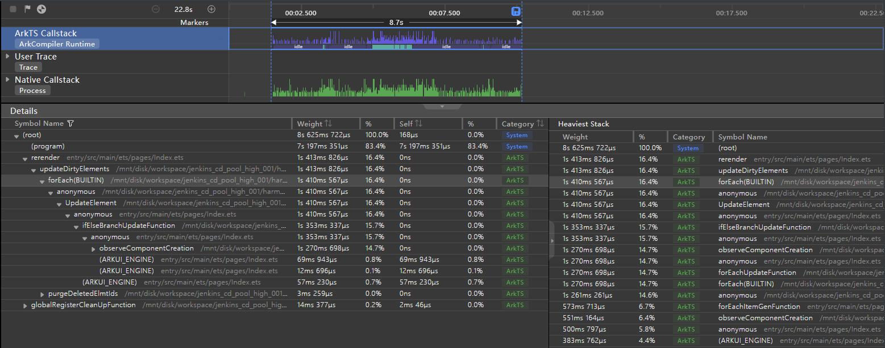
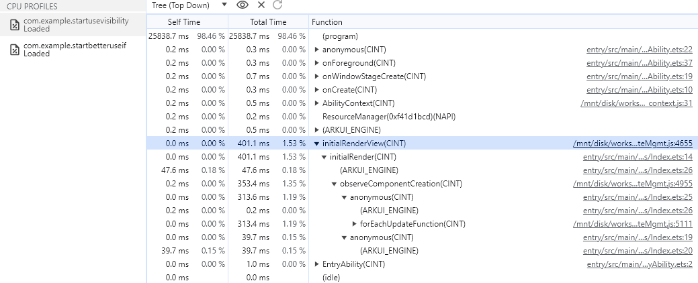
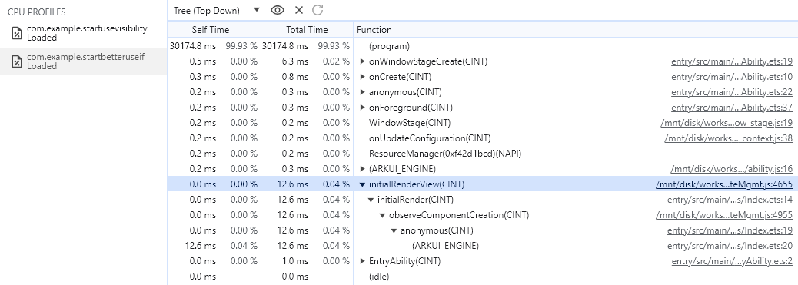
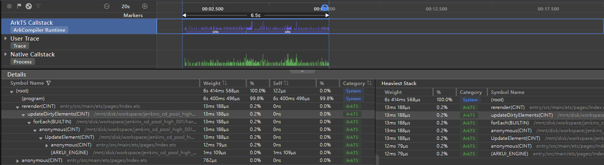
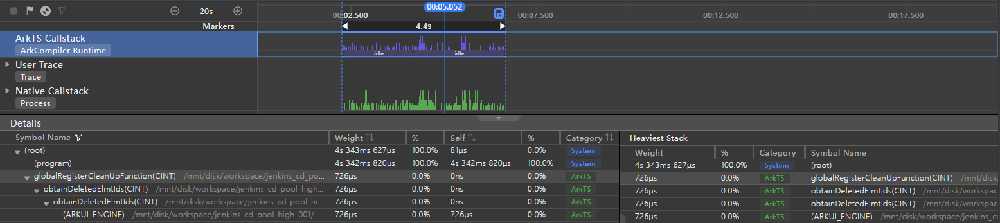
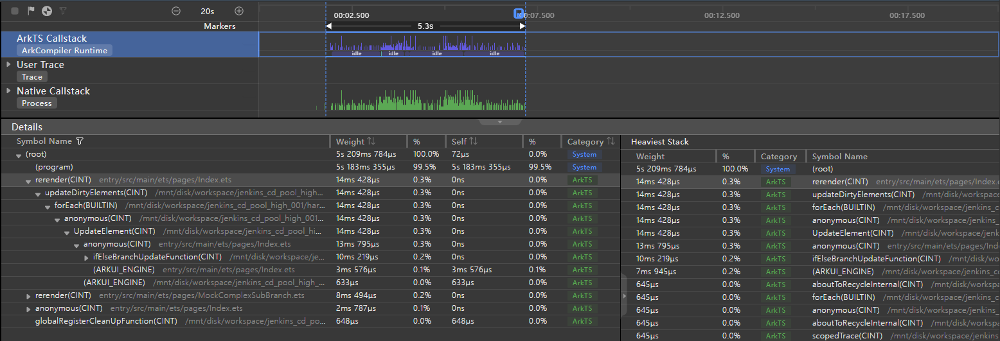

# Properly Choosing Between if/else and Visibility

Both conditional rendering and the visibility attribute to switch components between visibility states. This document is intended to help you choose between these two approaches, by comparing their mechanism, usage scenarios, and performance in typical examples.

## Mechanism

### Conditional Rendering

You can use the **if/else** statement for conditional rendering, one of the rendering control capabilities provided by the ArkUI application development framework. With conditional rendering, the UI description of a specific branch is rendered based on the application state. The mechanism of condition rendering is as follows:

- During initial page construction, conditional statements are evaluated, components in the positive branch are built. If a positive branch is missing, no component is built.
- When the application state changes, the conditional statements are re-evaluated. Components in the negative branch are deleted, and those in the positive branch are built. If a positive branch is missing, no component is built.

For details about conditional rendering, see [if/else: Conditional Rendering](../quick-start/arkts-rendering-control-ifelse.md).

### Visibility

Visibility is one of the universal component attributes provided by ArkUI. You can set the visibility attribute of a component to show or hide the component. The table below describes the visibility attribute values.

| Name   | Description                                    |
| ------- | ---------------------------------------- |
| Visible | The component is visible.                          |
| Hidden  | The component is invisible, but still takes up space in the layout.  |
| None    | The component is invisible, and does not take up space in the layout.|

For details about the visibility attribute, see [Visibility](../reference/apis-arkui/arkui-ts/ts-universal-attributes-visibility.md).

### Mechanism Differences

The table below compares the conditional rendering and visibility mechanisms.

| Mechanism                                              | Conditional Rendering| Visibility|
| ------------------------------------------------------ | -------- | -------- |
| Will a component be created if it is invisible during initial page construction?          | No      | Yes      |
| Will a component be destroyed and removed from the component tree if it changes from visible to invisible?| Yes      | No      |
| Does a component takes up space in the layout when it is invisible?                                | No      | Configurable|

## Usage Scenarios

Conditional rendering and the visibility attribute are applicable in different scenarios.

Conditional rendering applies to the following scenarios:

- To reduce render time and speed up application startup, consider conditional rendering in the cold start phase for components that do not need to be displayed initially when the application loads and draws the home page.
- If a component does not frequently switch between visibility states, or does not need to be displayed most of the time, you are advised to use conditional rendering, so as to reduce GUI complexity, reduce nesting, and improve performance.
- If memory is a critical concern, prefer conditional rendering for memory-hogging components, so they can be destroyed in time when they are not needed.
- If the component subtree structure is complex and the conditions for rendering change frequently, it is recommended that you use conditional rendering with the component reuse mechanism to improve application performance.
- If only some components need to be switched between visibility states and the conditions for rendering change frequently, combine conditional rendering with container restrictions to precisely control the component render scope to improve application performance.

The visibility attribute applies to the following scenarios:

- If a component is frequently switched between visibility states, the visibility attribute is a better choice, because it avoids frequent creation and destruction of the component and thereby improves performance.
- If a component needs to take up space in the page layout when invisible, use the visibility attribute.

### When Visibility Is Preferred

The following exemplifies why the visibility attribute is a better choice for components that are frequently switched between visibility states. In the examples below, a button is used to show and hide 1000 images.

**Nonexample**

Use conditional statements to switch components between visibility states.

```ts
@Entry
@Component
struct WorseUseIf {
  @State isVisible: boolean = true;
  private data: number[] = [];

  aboutToAppear() {
    for (let i: number = 0; i < 1000; i++) {
      this.data.push(i);
    }
  }

  build() {
    Column() {
      Button("Switch visible and hidden").onClick(() => {
        this.isVisible = !(this.isVisible);
      }).width('100%')
      Stack() {
        if (this.isVisible) {// When conditional rendering is used, components are frequently created and destroyed.
          Scroll() {
            Column() {
              ForEach(this.data, (item: number) => {
                Image($r('app.media.icon')).width('25%').height('12.5%')
              }, (item: number) => item.toString())
            }
          }
        }
      }
    }
  }
}
```

**Example**

Use the visibility attribute to switch components between visibility states.

```ts
@Entry
@Component
struct BetterUseVisibility {
  @State isVisible: boolean = true;
  private data: number[] = [];

  aboutToAppear() {
    for (let i: number = 0; i < 1000; i++) {
      this.data.push(i);
    }
  }

  build() {
    Column() {
      Button("Switch visible and hidden").onClick(() => {
        this.isVisible = !(this.isVisible);
      }).width('100%')
      Stack() {
        Scroll() {
          Column() {
            ForEach(this.data, (item: number) => {
              Image($r('app.media.icon')).width('25%').height('12.5%')
            }, (item: number) => item.toString())
          }
        }.visibility(this.isVisible ? Visibility.Visible : Visibility.None)// When the visibility attribute is used, components are not frequently created and destroyed.
      }
    }
  }
}
```

**Effect Comparison**

Perform the same steps for the preceding example and nonexample: Click the button to hide the initially visible components, and then click the button again to show the components. Make sure the interval between showing and hiding the components is long enough for the page rendering to be complete.

In the case of conditional rendering, components are destroyed when hidden, and re-created when shown. In this case, the core function **forEach** takes 1s, as shown below.

 

The visibility attribute does not involve creation and destruction of components. Instead, it caches the components to the component tree, obtains the state value from the cache, and changes the value to switch the components between visibility states. In this case, the core function **forEach** takes 2 ms, as shown below.

 

By comparing the performance data, we can learn that, regarding components that are frequently switched between visibility states, the visibility attribute outperforms conditional rendering, because it avoids frequent component creation and destruction.

### When Conditional Rendering Is Preferred

Conditional rendering applies in the cold start phase for components that do not need to be displayed initially when the application loads and draws the home page. In the examples below, there are invisible 1000 **Text** components at initial render.

**Nonexample**

Use the visibility attribute to hide components that do not need to be displayed at initial render of the home page.

```ts
@Entry
@Component
struct WorseUseVisibility {
  @State isVisible: boolean = false; // The component is invisible during application startup.
  private data: number[] = [];

  aboutToAppear() {
    for (let i: number = 0; i < 1000; i++) {
      this.data.push(i);
    }
  }

  build() {
    Column() {
      Button("Show the Hidden on start").onClick(() => {
        this.isVisible = !(this.isVisible);
      }).width('100%')
      Stack() {
        Image($r('app.media.icon')).objectFit(ImageFit.Contain).width('50%').height('50%')
        Scroll() {
          Column() {
            ForEach(this.data, (item: number) => {
              Text(`Item value: ${item}`).fontSize(20).width('100%').textAlign(TextAlign.Center)
            }, (item: number) => item.toString())
          }
        }.visibility(this.isVisible ? Visibility.Visible : Visibility.None)// When the visibility attribute is used, the component is created at application startup even when it is invisible.
      }
    }
  }
}
```

**Example**

Use conditional rendering to hide components that do not need to be displayed at initial render of the home page.

```ts
@Entry
@Component
struct BetterUseIf {
  @State isVisible: boolean = false; // The component is invisible during application startup.
  private data: number[] = [];

  aboutToAppear() {
    for (let i: number = 0; i < 1000; i++) {
      this.data.push(i);
    }
  }

  build() {
    Column() {
      Button("Show the Hidden on start").onClick(() => {
        this.isVisible = !(this.isVisible);
      }).width('100%')
      Stack() {
        Image($r('app.media.icon')).objectFit(ImageFit.Contain).width('50%').height('50%')
        if (this.isVisible) { // When conditional rendering is used, the component is created at application startup when it is invisible.
          Scroll() {
            Column() {
              ForEach(this.data, (item: number) => {
                Text(`Item value: ${item}`).fontSize(20).width('100%').textAlign(TextAlign.Center)
              }, (item: number) => item.toString())
            }
          }
        }
      }
    }
  }
}
```

**Effect Comparison**

Perform the same steps for the preceding example and nonexample: Run hdc commands to collect the CPU Profiler data of the main thread during the cold start of the application. For details, see [CPU Profiler](./application-performance-analysis.md#collecting-data-using-hdc-shell-commands).

When the application loads and draws the home page during the cold start, using the visibility attribute creates the components that do not need to be displayed initially, which increases the render time. As shown below, in the UIAbility startup phase, it takes 401.1 ms to render the initial view with the visibility attribute.

 

To reduce the render time during the cold start, use conditional rendering. In this case, components that do not need to be displayed initially will not be created. As shown below, in the UIAbility startup phase, it takes 12.6 ms to render the initial view with conditional rendering.

 

By comparing the performance data, we can learn that, regarding components that do not need to be displayed during the application cold start, conditional rendering can reduce the render time and speed up application startup.

### Conditional Rendering and Container Restrictions

If only some components need to be switched between visibility states and the conditions for rendering change frequently, you can combine conditional rendering with container restrictions to precisely control the component render scope. The following exemplifies the effect of container restrictions in this usage scenario: A **Column** component is used to hold 1000 **Text** components, and one of the **Text** components is controlled with conditional rendering.

**Nonexample**

When conditional rendering is used without container restrictions, the container is created and destroyed upon condition changes, which causes all components in the container to be re-rendered.

```ts
@Entry
@Component
struct RenderControlWithoutStack {
  @State isVisible: boolean = true;
  private data: number[] = [];

  aboutToAppear() {
    for (let i: number = 0; i < 1000; i++) {
      this.data.push(i);
    }
  }

  build() {
    Column() {
      Stack() {
        Scroll() {
          Column() {// The re-render scope is extended to this layer.
            if (this.isVisible) {// The container is created and destroyed upon condition changes, which causes all components in the container to be re-rendered.
              Text('New item').fontSize(20)
            }
            ForEach(this.data, (item: number) => {
              Text(`Item value: ${item}`).fontSize(20).width('100%').textAlign(TextAlign.Center)
            }, (item: number) => item.toString())
          }
        }
      }.height('90%')

      Button('Switch Hidden and Show').onClick(() => {
        this.isVisible = !(this.isVisible);
      })
    }
  }
}
```

**Example**

The following uses a container to limit the component render scope of conditional rendering.

```ts
@Entry
@Component
struct RenderControlWithStack {
  @State isVisible: boolean = true;
  private data: number[] = [];

  aboutToAppear() {
    for (let i: number = 0; i < 1000; i++) {
      this.data.push(i);
    }
  }

  build() {
    Column() {
      Stack() {
        Scroll() {
          Column() {
            Stack() { // Set a layer of container for conditional rendering to limit the render scope.
              if (this.isVisible) {
                Text('New item').fontSize(20)
              }
            }

            ForEach(this.data, (item: number) => {
              Text(`Item value: ${item}`).fontSize(20).width('100%').textAlign(TextAlign.Center)
            }, (item: number) => item.toString())
          }
        }
      }.height('90%')

      Button('Switch Hidden and Show').onClick(() => {
        this.isVisible = !(this.isVisible);
      })
    }
  }
}
```

**Effect Comparison**

Perform the same steps for the preceding example and nonexample: Click the button to hide the initially visible **Text** component, and then click the button again to show the component. Make sure the interval between showing and hiding the components is long enough for the page rendering to be complete.

The **Text** component in the container is contained in the **if** condition. Once the evaluation result of the **if** condition changes, the component is created or destroyed. In this case, the layout of the **Column** container is affected, and all components in the container, including the **ForEach** module, are re-rendered. As a result, the main thread spends a long time in UI re-rendering.

The following figure shows the performance data when no container is used to limit the component render scope. The **Column** component is marked as a dirty area, and **ForEach** takes 13 ms.

 

If a **Stack** component is used to wrap the **Text** component contained in the **if** condition, then only the **Text** component is re-rendered when the evaluation result of the **if** condition changes. This way, the UI re-rendering time of the main thread is reduced.

The following figure shows the performance data when a container is used to limit the component render scope. The **Column** component is not marked as a dirty area, and no time is spent for **ForEach**.

 

By comparing the performance data, we can conclude that, in scenarios where only some components need to be switched between visibility states and the conditions for rendering change frequently, combining conditional rendering with container restrictions can precisely control the component render scope and improve application performance.

### Conditional Rendering and Component Reuse

In scenarios where the branches of conditional rendering change repeatedly and the component subtree structure in each branch is complex, consider reusing components for conditional rendering. In the following examples, a custom complex child component **MockComplexSubBranch** is defined to work with conditional rendering.

**Nonexample**

Component reuse is not used to implement conditional rendering:

```ts
@Entry
@Component
struct IfWithoutReusable {
  @State isAlignStyleStart: boolean = true;

  build() {
    Column() {
      Button("Change FlexAlign").onClick(() => {
        this.isAlignStyleStart = !this.isAlignStyleStart;
      })
      Stack() {
        if (this.isAlignStyleStart) {
          MockComplexSubBranch({ alignStyle: FlexAlign.Start }); // MockComplexSubBranch is implemented without using the component reuse mechanism.
        } else {
          MockComplexSubBranch({ alignStyle: FlexAlign.End });
        }
      }
    }
  }
}
```

The **MockComplexSubBranch** consists of three **Flex** container components and 200 **Text** components. It is used to simulate a complex subtree structure. The code snippet is as follows:

```ts
@Component
export struct MockComplexSubBranch {
  @State alignStyle: FlexAlign = FlexAlign.Center;

  build() {
    Column() {
      Column({ space: 5 }) {
        Text('ComplexSubBranch not reusable').fontSize(9).fontColor(0xCCCCCC).width('90%')
        AlignContentFlex({ alignStyle: this.alignStyle });
        AlignContentFlex({ alignStyle: this.alignStyle });
        AlignContentFlex({ alignStyle: this.alignStyle });
      }
    }
  }
}

@Component
struct AlignContentFlex {
  @Link alignStyle: FlexAlign;
  private data: number[] = [];

  aboutToAppear() {
    for (let i: number = 0; i < 200; i++) {
      this.data.push(i);
    }
  }

  build() {
    Flex({ wrap: FlexWrap.Wrap, alignContent: this.alignStyle }) {
      ForEach(this.data, (item: number) => {
        Text(`${item % 10}`).width('5%').height(20).backgroundColor(item % 2 === 0 ? 0xF5DEB3 : 0xD2B48C)
      }, (item: number) => item.toString())
    }.size({ width: '100%', height: 240 }).padding(10).backgroundColor(0xAFEEEE)
  }
}
```

**Example**

Component reuse is used to implement conditional rendering:

```ts
@Entry
@Component
struct IfWithReusable {
  @State isAlignStyleStart: boolean = true;

  build() {
    Column() {
      Button("Change FlexAlign").onClick(() => {
        this.isAlignStyleStart = !this.isAlignStyleStart;
      })
      Stack() {
        if (this.isAlignStyleStart) {
          MockComplexSubBranch({ alignStyle: FlexAlign.Start }); // MockComplexSubBranch is implemented using the component reuse mechanism.
        } else {
          MockComplexSubBranch({ alignStyle: FlexAlign.End });
        }
      }
    }
  }
}
```

The implementation of **MockComplexSubBranch** is as follows. The **AlignContentFlex** code is the same as that in the preceding code snippet and therefore not included here.

```ts
@Component
@Reusable // Add the @Reusable decorator to declare that the component can be reused.
export struct MockComplexSubBranch {
  @State alignStyle: FlexAlign = FlexAlign.Center;

  aboutToReuse(params: ESObject) {// Called when the component is about to be added from the reuse cache to the component tree.
    this.alignStyle = params.alignStyle;
  }

  build() {
    Column() {
      Column({ space: 5 }) {
        Text('ComplexSubBranch reusable').fontSize(9).fontColor(0xCCCCCC).width('90%')
        AlignContentFlex({ alignStyle: this.alignStyle });
        AlignContentFlex({ alignStyle: this.alignStyle });
        AlignContentFlex({ alignStyle: this.alignStyle });
      }
    }
  }
}

```

**Effect Comparison**

Perform the same steps for the preceding example and nonexample: Click the button to change alignment of the **Text** component in the **Flex** container along the main axis. Make sure the interval between alignment switching is long enough for the page rendering to be complete.

The subtree structure of the **MockComplexSubBranch** component in each branch is complex. In this case, when the button is repeatedly clicked to change the branch, a large number of components are destroyed and created. As a result, if components are not reused, UI re-rendering can be significantly time-consuming. As shown below, the rendering of the application **Index** page takes 180 ms.

 

If components are reused during conditional rendering, the UI re-rendering time can be greatly shortened. As shown below, the rendering of the application **Index** page takes as short as 14 ms.

 

In sum, if the component subtree structure is complex and the conditions for rendering change frequently, it is recommended that you use conditional rendering with the component reuse mechanism to improve application performance.
