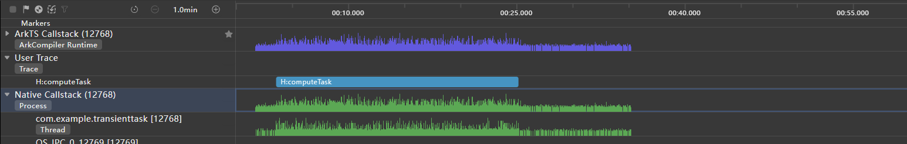
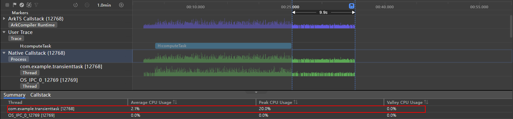

# Reasonably Running Background Tasks

## Introduction

When you return to the home screen, lock the screen, or switch to another application, the current application is switched to the background. To reduce the device power consumption and deliver a positive user experience, the system manages the application running in the background, for example, suspending or terminating its process. To ensure the normal use of features such as music playback and calendar reminders in the background, the system provides constrained background tasks to extend the running time of applications in the background.

This topic describes the basic concepts and use scenarios of different background tasks, and analyzes the performance of transient tasks and continuous tasks to explain the necessity of properly running background tasks.

## Transient Task

An application is suspended after it runs in the background for a short period of time. If the application needs to execute a short-time task in the background, it can request a transient task to extend the running time in the background.

Transient tasks are suitable for tasks that have high requirements on real-time performance and occupies resources for a short period of time, for example, small file download, caching, and information sending. For details about the development guide, see [Transient Task](../task-management/transient-task.md).

### Example

The following code requests a transient task to execute a time-consuming computing task in the background. The source code is obtained from [Transient Task Sample](https://gitee.com/openharmony/applications_app_samples/blob/master/code/Performance/PerformanceLibrary/feature/backgroundTask/src/main/ets/view/TransientTaskView.ets).

```javascript
import backgroundTaskManager from '@ohos.resourceschedule.backgroundTaskManager';
import { BusinessError } from '@ohos.base';
import util from '@ohos.util';
import hiTraceMeter from '@ohos.hiTraceMeter';

const totalTimes: number = 50000000; // Number of loops.
const calculateResult: string ='Total time costed = %s ms.'; // Text format.

@Entry
@Component
struct Index {
  @State message: string = 'Click button to calculate.';
  private requestId: number = 0;

  // Request a transient task.
  requestSuspendDelay() {
    try {
      let delayInfo = backgroundTaskManager.requestSuspendDelay('compute', () => {
        console.info('Request suspension delay will time out.');
        // Cancel the transient task when the task is about to time out.
        this.cancelSuspendDelay();
      })
      this.requestId = delayInfo.requestId;
    } catch (error) {
      console.error(`requestSuspendDelay failed. code is ${(error as BusinessError).code} message is ${(error as BusinessError).message}`);
    }
  }

  // Cancel the transient task.
  cancelSuspendDelay() {
    backgroundTaskManager.cancelSuspendDelay(this.requestId);
    console.info('Request suspension delay cancel.');
  }

  // Computing task.
  computeTask(times: number): number {
    let start: number = new Date().getTime();
    let a: number = 1;
    let b: number = 1;
    let c: number = 1;
    for (let i: number = 0; i < times; i++) {
      a = a * Math.random() + b * Math.random() + c * Math.random();
      b = a * Math.random() + b * Math.random() + c * Math.random();
      c = a * Math.random() + b * Math.random() + c * Math.random();
    }
    let end: number = new Date().getTime();
    return end - start;
  }

  // Configure the touch callback.
  clickCallback = () => {
    this.requestSuspendDelay();
    hiTraceMeter.startTrace('computeTask', 0); // Enable performance tracing.
    let timeCost = this.computeTask(totalTimes);
    this.message = util.format(calculateResult, timeCost.toString());
    hiTraceMeter.finishTrace('computeTask', 0); // End performance tracing.
    this.cancelSuspendDelay();
  }

  build() {
    Column() {
      Row(){
        Text(this.message)
      }
      Row() {
        Button ('Start Computing')
          .onClick(this.clickCallback)
      }
      .width('100%')
      .justifyContent(FlexAlign.Center)
    }
    .width('100%')
    .height('100%')
    .justifyContent(FlexAlign.Center)
  }
}
```

Time Profiler in DevEco Studio obtains the following data about the application performance within the duration (less than one minute) from the start of the computing task to switching to the background:  

**Figure 1** Time Profiler lane of a transient task



- ArkTS Callstack: displays the CPU usage and status changes based on the time axis.
- User Trace: displays details about user-defined trace tasks triggered in the current period based on the time axis. **H:computeTask** indicates the execution duration of the transient task.
- Native Callstack: displays the CPU usage changes, process/thread status, and function call stack based on the timeline.

As shown in the preceding figure, in the period corresponding to **H:computeTask** in the Native Callstack lane, the application process is active and the CPU usage changes in a high range. After the task is canceled, the application is still running, but the process activeness and CPU usage decrease significantly. The system suspends the application several seconds later and reclaims the CPU.

The figures below demonstrate the Native Callstack lane in the task execution phase and in the phase that the task is canceled but the process is not suspended. Check the average CPU usage and maximum CPU usage of the application main thread in the two phases.

**Figure 2** CPU usage in the task execution phase


**Figure 3** CPU usage when the task is canceled but the process is not suspended



In the first phase, the average CPU usage of the application main thread is 12.6%, and the highest CPU usage is 40.0%. In the second phase, the average CPU usage is 2.2%, and the highest CPU usage is 28.6%.

To sum up, running transient tasks in the background occupies system CPU resources, and too many transient tasks in the background may cause the applications in the foreground to freeze. Therefore, use transient tasks only when necessary, and do not request too many transient tasks at a time.

For details about the constraints on transient tasks, see [Constraints](../task-management/transient-task.md#constraints).

## Continuous Task

If an application has a perceivable task that needs to run in an extended period of time in the background, it can request a continuous task to prevent itself from being suspended. Examples of continuous tasks include music playback and navigation in the background. After an application requests a continuous task, the system verifies whether the application is actually executing the continuous task. For details about the development guide, see [Continuous Task](../task-management/continuous-task.md).

The table below lists the types of continuous tasks, which are used in various scenarios. You can select a task type suitable for your case based on the description.

| Description                          | Example Scenario                            |
| ------------------------------ | ------------------------------------ |
| Data transfer                      | The browser downloads a large file in the background.|
| Audio and video playback                    | A music application plays music in the background.          |
| Audio recording                          | A recorder records audio in the background.                  |
| Positioning and navigation                      | A navigation application provides navigation in the background.                |
| Bluetooth-related task                      | Transfer a file through Bluetooth.            |
| Multi-device connection                    | Carry out distributed service connection.                    |
| WLAN-related task (for system applications only) | Transfer a file over WLAN.          |
| Voice and video calls (for system applications only)| Use a system chat application to make an audio call in the background.        |
| Computing task (for specific devices only)  | Run antivirus software.                            |

- When an application requests a continuous task of the data transfer type, the system increases the priority of the application process to reduce the probability of terminating the process. However, it still suspends the process. To request a continuous task for file upload or download, the application must call the [upload and download agent API](../reference/apis-basic-services-kit/js-apis-request.md) so that the system functions as the agent. For details, see [Improving File Upload and Download Performance](improve-file-upload-and-download-performance.md).
- To request a continuous task for audio and video playback, the application must use the [AVSession service](../media/avsession/avsession-overview.md) for background playback.
- To request a continuous recording task, a dialog box must be displayed dynamically to request user authorization for the microphone permission.

### Example

The following simulates a background location scenario. An application subscribes to device location changes and obtains the location every second. To continue the use of the location service after switching to the background, the application requests a continuous task of the location type. The source code is obtained from [Continuous Task Sample](https://gitee.com/openharmony/applications_app_samples/blob/master/code/Performance/PerformanceLibrary/feature/backgroundTask/src/main/ets/view/LongTermTaskView.ets).

First, declare the continuous task type for the EntryAbility in the **module.json5** file.

```javascript
{
  "module": {
    ...
    "abilities": [
      {
        "name": "EntryAbility",
        ...
        "backgroundModes": [
          "location"
        ]
      }
    ],
  }
}
```

The following permissions are required:

- ohos.permission.INTERNET
- ohos.permission.LOCATION_IN_BACKGROUND
- ohos.permission.APPROXIMATELY_LOCATION
- ohos.permission.LOCATION
- ohos.permission.KEEP_BACKGROUND_RUNNING

For details about how to request the permissions, see [Declaring Permissions in the Configuration File](../security/AccessToken/declare-permissions-in-acl.md).

Configure the permission in the **module.json5** file. Confirmation from end users is required for the request of some permissions and the toggle of the notification switch. When the system publishes a notification for the continuous task, the notification feature of the application must be enabled. Otherwise, users cannot perceive the continuous task running in the background.

The code for implementing background location is as follows:

```javascript
import wantAgent, { WantAgent } from '@ohos.app.ability.wantAgent';
import common from '@ohos.app.ability.common';
import backgroundTaskManager from '@ohos.resourceschedule.backgroundTaskManager';
import { BusinessError } from '@ohos.base';
import geolocation from '@ohos.geoLocationManager';
import abilityAccessCtrl from '@ohos.abilityAccessCtrl';
import notificationManager from '@ohos.notificationManager';

const TAG: string = 'BackgroundLocation';

@Entry
@Component
export struct LongTermTaskView {
  @State latitude: number = 0;
  @State longitude: number = 0;

  aboutToAppear() {
    // Request the permission to send notifications.
    notificationManager.requestEnableNotification().then(() => {
      console.info(`[EntryAbility] requestEnableNotification success`);
      // Request the permission for location.
      let atManager = abilityAccessCtrl.createAtManager();
      try {
        atManager.requestPermissionsFromUser(getContext(this), ['ohos.permission.INTERNET',
          'ohos.permission.LOCATION',
          'ohos.permission.LOCATION_IN_BACKGROUND',
          'ohos.permission.APPROXIMATELY_LOCATION'])
          .then((data) => {
            console.info(`[EntryAbility], data: ${JSON.stringify(data)}`);
          })
          .catch((err: BusinessError) => {
            console.info(`[EntryAbility], err: ${JSON.stringify(err)}`);
          })
      } catch (err) {
        console.info(`[EntryAbility], catch err->${JSON.stringify(err)}`);
      }
    }).catch((err: BusinessError) => {
      console.error(`[EntryAbility] requestEnableNotification failed, code is ${err.code}, message is ${err.message}`);
    });
  }

  // Location change callback.
  locationChange = async (location: geolocation.Location) => {
    console.info(TAG, `locationChange location =${JSON.stringify(location)}`);
    this.latitude = location.latitude;
    this.longitude = location.longitude;
  }

  // Obtain the location.
  async getLocation() {
    console.info(TAG, `enter getLocation`);
    let requestInfo: geolocation.LocationRequest = {
      priority: geolocation.LocationRequestPriority.FIRST_FIX, // Fast location preferred.
      scenario: geolocation.LocationRequestScenario.UNSET, // Scenario unspecified.
      timeInterval: 1, // Time interval at which location information is reported.
      distanceInterval: 0, // Distance interval at which location information is reported, in meters.
      maxAccuracy: 100 // Location accuracy.
    };
    console.info(TAG, `on locationChange before`);
    geolocation.on('locationChange', requestInfo, this.locationChange);
    console.info(TAG, `on locationChange end`);
  }

  // Start the continuous task.
  startContinuousTask() {
    let context: Context = getContext(this);
    // Notification parameters, which are used to specify the target application that is redirected to when the continuous task notification is clicked.
    let wantAgentInfo: wantAgent.WantAgentInfo = {
      wants: [
        {
          bundleName: (context as common.UIAbilityContext).abilityInfo.bundleName,
          abilityName: (context as common.UIAbilityContext).abilityInfo.name
        }
      ],
      operationType: wantAgent.OperationType.START_ABILITY,
      requestCode: 0,
      wantAgentFlags: [wantAgent.WantAgentFlags.UPDATE_PRESENT_FLAG]
    };
    wantAgent.getWantAgent(wantAgentInfo).then((wantAgentObj: WantAgent) => {
      backgroundTaskManager.startBackgroundRunning(context,
        backgroundTaskManager.BackgroundMode.LOCATION, wantAgentObj).then(() => {
        console.info(`Succeeded in operationing startBackgroundRunning.`);
      }).catch((err: BusinessError) => {
        console.error(`Failed to operation startBackgroundRunning. Code is ${err.code}, message is ${err.message}`);
      });
    });
  }

  // Stop the continuous task.
  stopContinuousTask() {
    backgroundTaskManager.stopBackgroundRunning(getContext()).then(() => {
      console.info(`Succeeded in operationing stopBackgroundRunning.`);
    }).catch((err: BusinessError) => {
      console.error(`Failed to operation stopBackgroundRunning. Code is ${err.code}, message is ${err.message}`);
    });
  }

  build() {
    Column() {
      Column() {
        Text(this.latitude.toString())
        Text(this.longitude.toString())
      }
      .width('100%')

      Column() {
        Button('Enable Locating')
          .onClick(() => {
            this.startContinuousTask();
            this.getLocation();
          })
        Button('Disable Locating')
          .onClick(async () => {
            await geolocation.off('locationChange');
            this.stopContinuousTask();
          })
          .margin({ top: 10 })
      }
      .width('100%')
    }
    .width('100%')
    .height('100%')
    .justifyContent(FlexAlign.Center)
  }
}
```

Based on this scenario, the power consumption test tool obtains the following data about the device power consumption within 30 minutes.

| Task            | Test Duration (s)| Normalized Current (mA)| Maximum Current (mA)| Normalized Power Consumption (mAH)|
| -------------------- | ----------- | ------------ | ------------ | ------------- |
| Locating task in the background| 1836.4      | 15.52        | 995.72       | 7.92          |
| No background task          | 1839.9      | 0.85         | 404.03       | 0.44          |

- Normalized current: average current when the voltage is 3.8 V.
- Formula for calculating the normalized power consumption: Normalized current x Test duration/3600, where 3600 is the number of seconds in an hour.

The test data shows that the device power consumption increases significantly within 30 minutes when the locating task keeps running in the background.

Do not use too many continuous tasks from the perspective of power consumption. If continuous tasks must be used, you can optimize the task execution process to minimize the power consumption. The following provides some optimization suggestions:

- In scenarios that do not have high requirements on locating, increase the reporting time interval and distance interval to reduce the update frequency.

- Reduce the number of network requests and the network request interval as much as possible.

- Use efficient data formats and parsing methods during data transmission to reduce task execution time.

For details about the constraints on continuous tasks, see [Constraints](../task-management/continuous-task.md).

## Deferred Task

If an application needs to execute a non-real-time task after switching to the background, the application can request a deferred task. When the specified conditions (including the network type, charging type, storage status, battery status, and timing status) are met, the system adds the task to the execution queue. Then the system starts the application to execute the task based on the memory, power consumption, device temperature, and user habits.

Deferred tasks apply to scenarios such as software updates, information collection, and data processing. For details about the development guide, see [Deferred Task](../task-management/work-scheduler.md).

## Agent-powered Reminder

After an application switches to the background or an application process is terminated, it may have scheduled tasks for reminding users, for example, flash sale reminders for shopping applications. To meet this requirement, the system provides agent-powered reminders (implemented by **reminderAgentManager**). When the application switches to the background or the process is terminated, the system sends reminders on behalf of the application. For details about the development guide, see [Agent-powered Reminder](../task-management/agent-powered-reminder.md).

Currently, the following reminder types are supported:

- Countdown timers: Applications can use this type to implement short-time timing notification services, for example, flash sale reminders.
- Calendar events: Applications can use this type to implement long-time notification services, for example, birthday reminders.
- Alarm clocks: Applications can use this type to implement alarm-related services, for example, wake-up alarms.

## Summary

Proper selection and use of background tasks are important for optimizing user experience and reducing performance consumption. The table below describes these background tasks from different dimensions.

| Task Type| Task Description                                                                                    | Background Application Status                                                                                                                                                   | Example Scenario                                                                             |
| -------- | ---------------------------------------------------------------------------------------- | ------------------------------------------------------------------------------------------------------------------------------------------------------------------- | ------------------------------------------------------------------------------------- |
| No background  | The application does not execute any task in the background.                                                            | The application is suspended within several seconds after switching to the background.                                                                                                                                     | General                                                                                 |
| Transient task| Suitable for tasks that have high requirements on real-time performance and can be completed in a short period of time.                                                            | Within the one-off quota, the application is not suspended until the task is canceled. If the task is not canceled when the one-off quota expires, the application process is terminated.                                                                                     | Small file download, caching, and information sending                     |
| Continuous task| Suitable for perceivable task that needs to run in an extended period of time in the background.                                                      | The application is not suspended until the task is canceled. If the task is not canceled, the application process is terminated when the task is complete.                                                                                                         | Data transfer, audio playback, recording, positioning and navigation, Bluetooth-related task, WLAN-related task, multi-device connection, voice and video calls, and computing tasks|
| Deferred task| Suitable for tasks that do not have high requirements on real-time performance and can be executed at a later time.| The system enqueues tasks and schedules them in a unified manner based on the memory and power consumption. The application is suspended after switching to the background. When the preset conditions are met, the system starts the application and creates an Extension process to execute the task. The maximum execution duration for a single callback is 2 minutes. If the task is not canceled when the maximum duration expires, the system terminates the Extension process.| Software update, information collection, and data processing                                                       |
| Agent-powered reminder| The system sends reminders on behalf of the application.                                                                | The application is suspended or the process is terminated. When the conditions are met, the system sends reminders on behalf of the application.                                                                                                           | Alarm clocks, countdown timer, and calendar events                                                                   |
