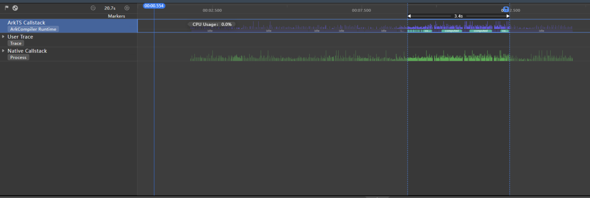
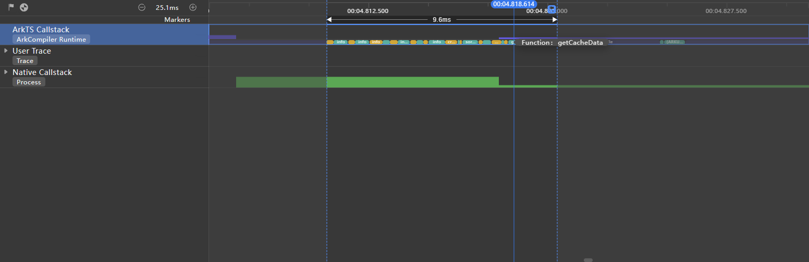
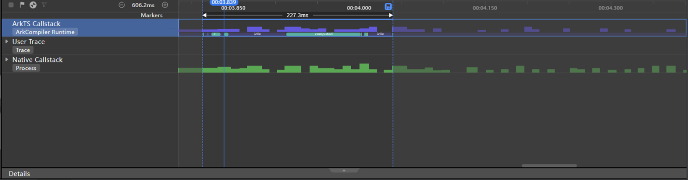
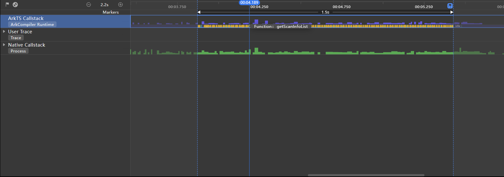
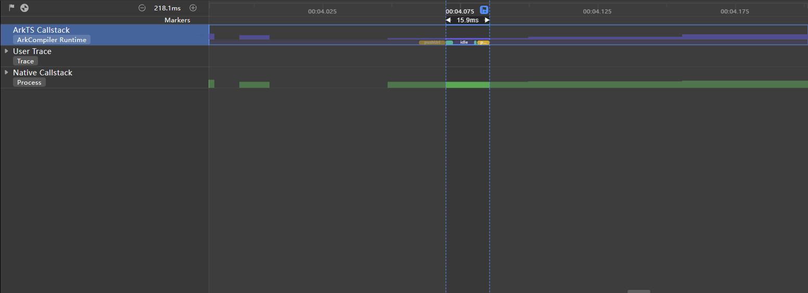

# IPC Usage

# **Background**

Inter-process communication (IPC) is a common mechanism that allows processes to communicate with each other. In OpenHarmony, IPC uses the Binder driver to implement cross-process communication between applications and system services.

While IPC facilitates interaction and communication between processes, improper use of IPC can undermine application performance.

When IPC is used for communication between the main thread and another thread, as the main thread needs to wait for response from the other thread to send and receive messages, it is subject to blocking. In the case of time-consuming or frequent operations, the generated delay may cause page freezing and frame loss.

IPC involves context switching, which is a series of procedures of switching from one process or thread to another. This can cause a waste of CPU time slices and reduce application performance.

To maintain data consistency and correctness, process synchronization and mutual exclusion (mutex) mechanisms are used. Each process attempts to lock a resource before performing any operation on the resource. When the operation is complete, the process unlocks the resource. This lock and unlock process results in extra overhead.

In this light, IPC is a significant area of improvement in scenarios that require high performance, such as online multi-player games, video editing, and real-time communication.

# **Optimization Approaches**

During application development, proper use of the IPC mechanism is a critical factor in delivering optimal application performance and user experience. In contrast, improper IPC usage may cause performance issues. Below are some approaches to better IPC usage:

**Local caching of data**: When possible, cache data on the local device rather than frequently request the data through IPC. This can reduce the number of unnecessary communication times. Make sure the validity period and update policy of local caching are proper, to prevent cache data expiration and inconsistency.

**Batch request**: When possible, combine multiple IPC requests into one batch request to reduce the number of communication times. This approach is especially useful for frequent small data requests. For example, regarding request for multiple data items, the data items may be requested at once, instead of one at a time.

**Asynchronous processing**: For IPC requests that do not require immediate responses, you can set them to be processed asynchronously, to avoid blocking the main thread. For example, background data synchronization can take place in a background thread, in order not to affect the UI response.

**Minimized data transmission**: Make sure only data required by applications is transmitted; avoid transmission of unnecessary information.

### Example 1

An application process needs to perform time-consuming calculation, and IPC is performed between the application process and the calculation task execution process.

**Problem**: After the foreground application process sends the calculation task request, it is stuck in the state of obtaining the calculation result. As a result, the UI is suspended and other operations cannot be performed.

**Analysis**: As revealed by Time Profiler, a tool for providing visibility into time consumption of applications, a large number of function call stacks exist in the **ArkTS Callstack** lane during page redirection. These function call stacks take a total of 3.4s, blocking UI drawing and rendering.



**Solution proposal**:

1. Read data locally cached in the application. If the calculation result of the same task already exists, obtain data without relying on IPC.

2. Change a single data-heavy, time-consuming IPC communication operation into multiple data-light, asynchronous IPC communication operations.

**Solution implementation**:

Read the data in the cache directory and compare the data with the target data.

```javascript
// Obtain cached data.
getCacheData(key: string) {
 try {
  let context = getContext(this) as common.UIAbilityContext;
  let cacheFilePath = context.cacheDir + '/ComputeResult.txt'; // Application sandbox cache directory.
  let computeResult = JSON.parse(fs.readTextSync(cacheFilePath));
  // Check for the same time-consuming task.
  if (computeResult[key] === undefined) {
   return undefined
  }
  return computeResult[key]
 } catch (e) {
  console.error('getCacheData failed' + JSON.parse(e));
 }
}
```

Determine whether to send an IPC request based on the cached data.

```javascript
if (this.getCacheData(this.taskId)) {
 // Obtain cached data.
 this.result = this.getCacheData(this.taskId);
} else {
 // Write data.
 data.writeStringArray(sendData);
 // Send an IPC request.
 await ReceivedData.sendMessageRequest(REQUEST_CODE, data, reply, option);
}
```

Change a single data-heavy, time-consuming IPC communication operation into multiple data-light, asynchronous IPC communication operations.

```javascript
if (this.getCacheData(this.taskId)) {
 this.result = this.getCacheData(this.taskId);
} else {
 let chunkSize = 10;
 for (let i = 0;i < sendData.length; i += chunkSize) {
  let chunk = sendData.slice(i, i + chunkSize);
  // Write data.
  data.writeStringArray(chunk);
  await ReceivedData.sendMessageRequest(REQUEST_CODE, data, reply, option);
 }
}
```


**Effect**

Below shows how the application performs after it is configured to read cached data.

 

As shown above, the **ArkTS Callstack** lane contains few time-consuming **computed** tasks, thanks to the calling of **getCacheData**, which reduces the number of IPC communication times.

 

Below shows how the application performs after a data-heavy operation is split.

 

As shown above, in the ArkTS Callstack lane, the time-consuming **computed** task of the current application process is greatly shortened from 3.4s to 227 ms.

### Example 2

**Problem**: An application contains pages A and B. The main view of page B is a **\<Tabs>** component, which contains multiple tabs such as the default home page and Wi-Fi list page. When the user switches from Page A to Page B, the page loading takes a long time.

**Analysis**: As revealed by Time Profiler, in the **ArkTS Callstack** lane, the **getScanInfoList** API is frequently called during the redirection process, causing congestion.

 

**Solution proposal**: According to the API document, the **getScanInfoList** API is used to obtain the list of found hotspots. It returns result synchronously and may block the main thread. Considering that the hotspot list is not displayed on the home tab of Page B, and is displayed only when the user has switched to the Wi-Fi tab, the scanning operation is unnecessary during page redirection. Therefore, the scanning operation can be moved to the processing logic for switching to the Wi-Fi list tab.

**Solution implementation**:

Remove the **ipcTask** API for obtaining the hotspot list from the **aboutToAppear** lifecycle callback of page B. On the Wi-Fi tab of the **\<Tabs>** component on page B, customize the **WiFiItem** component to display the Wi-Fi list. Place the **ipcTask** API in the **aboutToAppear** lifecycle callback of the **WiFiItem** component.

```javascript
aboutToAppear() {
 this.ipcTask();
}

ipcTask() {
 let count = 0;
 while (count < 100) {
  let data = wifiManager.getScanInfoList();
  count++;
 }
}
```


 

After the **ipcTask** API is relocated, the time required for redirection from page A to page B is significantly shortened.

# **Takeaway**

Proper IPC usage is critical to optimizing application performance. Through scenario analysis, logic optimization, and proper trade-off, we can reap benefits from IPC without letting it become the bottleneck of application performance.

# **References**

· [1] [ohos.rpc (RPC)](../reference/apis/js-apis-rpc.md)

· [2] [IPC & RPC Overview](../connectivity/ipc-rpc-overview.md)

· [3] [CPU Profiler](application-performance-analysis.md)

· [4] [@ohos.wifiManager (WLAN)](../reference/apis/js-apis-wifiManager.md)

<!--no_check-->