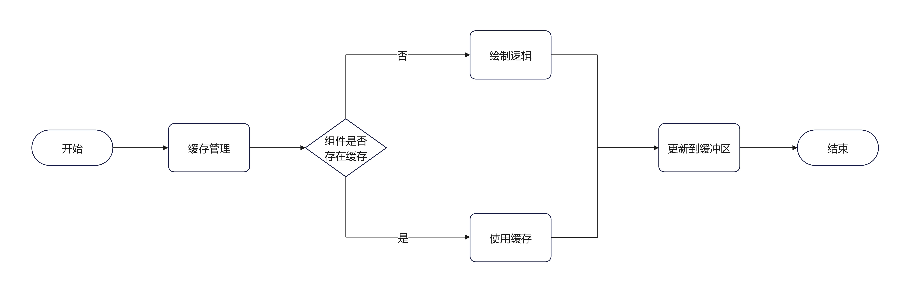
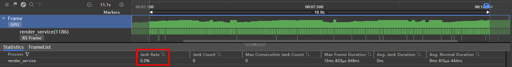
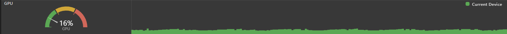
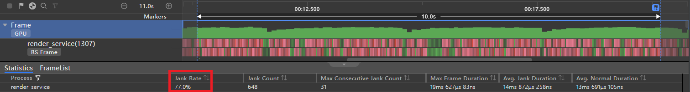
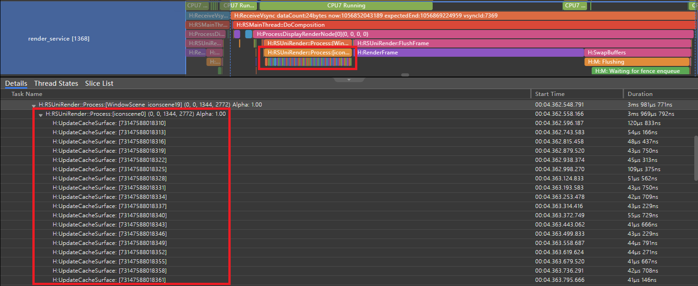
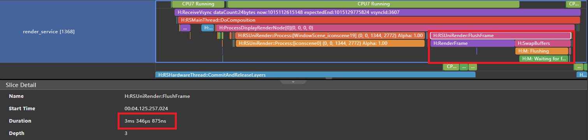

# Using renderGroup Properly

## Overview

During the development of large-scale service scenarios, attribute animations and transition animations are often used to improve the visual effect of products. When the service scenario complexity reaches a certain level, frame freezing may occur. In this document, you are advised to use the renderGroup method to solve the frame freezing problem when a large number of dynamic components exist on a single page, thereby improving the drawing performance.

renderGroup is a common component method that represents a combination of rendering and drawing. The core function is to mark components. In the drawing phase, the drawing results of components and their subcomponents are combined and cached to achieve reuse and reduce the drawing load. The renderGroup method transfers parameters to proactively mark whether cache reuse is enabled for the component. The parameters are described as follows:

| **Parameter**| Type | **Description**                               |
| ------ | ------- | ------------------------------------- |
| value  | boolean | false: disabled; true: enabled If the interface is not called, the default value of the component flag is false.|

renderGroup essentially uses the idea of exchanging space for time. If the cache can be reused all the time, the drawing time can be saved all the time. To achieve the preceding effect, the drawing result of each frame of the component must be the same. That is, if the internal content of the component is fixed, unchanged, and static, renderGroup takes effect only in this way. This document analyzes the case and compares the performance of the common component method renderGroup based on the scenario where dynamic effects are added to components with fixed content.

## Principles

When a component is drawn for the first time, if the component is marked with renderGroup enabled, the component and its subcomponents are drawn off the screen and the drawing result is cached. After that, when the component needs to be redrawn, the cache is preferentially used without redrawing. In this way, the drawing load is reduced and the rendering performance is optimized.

The following flowchart shows the rendering process of a single component, involving cache management and usage. When the component tree enters the rendering pipeline and starts the rendering process, the dirty components and their subcomponents in the component tree are rendered recursively. If the component cache exists, the cache is directly used for drawing. If renderGroup is enabled for a component, the drawing logic is entered, all its subcomponents are drawn recursively, and the drawing result is cached.

Figure 1 Component rendering process

 

The following flowchart shows the process details of cache management.

The cache is updated when the following conditions are met:

- The component is in the current component tree.
- The renderGroup component is marked as true.
- The component content is marked dirty.

The cache is cleared when any of the following conditions is met:

- The component does not exist in the component tree.
- The renderGroup component is marked as false.

Figure 2 Cache management process

 

## Constraints

Based on the preceding principles, to make the renderGroup function take effect, the component has the following restrictions:

- The component content is fixed.
  
  The attributes of the component and its subcomponents are fixed. If the component content is not fixed, that is, some components whose attributes or styles are changed exist in the subcomponents of the component, if renderGroup is used, the cache usage is greatly reduced, and the cache update logic may need to be executed continuously. In this case, the frame freezing effect cannot be optimized, it may even worsen frame freezing. For example, text content uses bidirectionally bound dynamic data, image resources use the GIF format, and the video component is used to play videos.

- The subcomponent does not take effect.
  
  The dynamic effect is applied by the component in a unified manner, and the subcomponents of the component have no dynamic effect. If the dynamic effect is also applied to the subcomponent, the subcomponent is no longer static compared with the parent component. Each frame may need to update the cache, and the update logic also consumes system resources.

## When to Use

If a large number of dynamic components exist on a single page and these components meet the preceding constraints, renderGroup is recommended.

The following shows an example of an application scenario. First, fixed images and text content are used inside each component in the scenario. Second, rotation and scaling effects are applied to each component in a unified manner. Finally, 60 such components are added to the scenario.

Figure 3 Application scenario example

 

## Recommended Example

The following shows the sample code of the recommendation scenario, including the component tree structure and customized component IconItem. The grid layout is used in the scenario. Multiple IconItems are placed in the component tree. Each IconItem uses a fixed image and text to represent a component with fixed content. The renderGroup method is called in the customized component IconItem. You can disable and enable renderGroup by clicking the switch button. The Profiler Frame tool is used to collect data. The performance differences when renderGroup is disabled and enabled are compared in terms of the frame loss rate, CPU usage, and GPU usage.

```ts
// Index.ets

import { IconItem } from './IconItem'

// IconItem-related data
class IconItemSource {
  image: string | Resource = ''
  text: string | Resource = ''

  constructor(image: string | Resource = '', text: string | Resource = '') {
    this.image = image;
    this.text = text;
  }
}

@Entry
@Component
struct Index {
  //Whether the renderGroup interface is enabled
  @State renderGroupFlag: boolean = false;
  private iconItemSourceList: IconItemSource[] = [];

  aboutToAppear() {
    // Traverse and add data of 60 IconItems.
    for (let index = 0; index < 20; index++) {
      const numStart: number = index * 3;
      //The three images are used cyclically.
      this.iconItemSourceList.push(
        new IconItemSource($r('app.media.album'), `item${numStart + 1}`),
        new IconItemSource($r('app.media.applet'), `item${numStart + 2}`),
        new IconItemSource($r('app.media.cards'), `item${numStart + 3}`),
      );
    }
  }

  build() {
    Column() {
      Row() {
        Row() {
          Text('Scenario Example')
            .fontSize(24)
            .lineHeight(24)
            .fontColor(Color.Black)
            .fontWeight(FontWeight.Bold)
            .margin({ left: 30 })
        }

        // Dynamically switch the renderGroup function.
        Stack({ alignContent: Alignment.End }) {
          Button(this.renderGroupFlag?'renderGroup has been enabled':'renderGroup has been disabled', {
            type: ButtonType.Normal,
            stateEffect: true
          })
            .fontSize(12)
            .borderRadius(8)
            .backgroundColor(0x317aff)
            .width(150)
            .height(30)
            .margin({ right: 30 })
            .onClick(() => {
              this.renderGroupFlag = !this.renderGroupFlag;
              AppStorage.setOrCreate('renderGroupFlag', this.renderGroupFlag)
            })
        }
      }
      .height(56)
      .width('100%')
      .backgroundColor(Color.White)
      .justifyContent(FlexAlign.SpaceBetween)

      //IconItem is placed in the grid.
      GridRow({
        columns: 6,
        gutter: { x: 0, y: 0 },
        breakpoints: { value: ["400vp", "600vp", "800vp"],
          reference: BreakpointsReference.WindowSize },
        direction: GridRowDirection.Row
      }) {
        ForEach(this.iconItemSourceList, (item: IconItemSource) => {
          GridCol() {
            IconItem({ image: item.image, text: item.text })
              .transition(
                TransitionEffect.scale({ x: 0.5, y: 0.5 })
                  .animation({duration: 3000, curve: Curve.FastOutSlowIn, iterations: -1 })
                  .combine(TransitionEffect.rotate({ z: 1, angle: 360 })
                    .animation({ duration: 3000, curve: Curve.Linear, iterations: -1 }))
              )
          }
          .height(70)
          .width('25%')
        })
      }
      .width("100%")
      .height("100%")
    }
    .width('100%')
    .height('100%')
    .alignItems(HorizontalAlign.Center)
  }
}
```

```ts
//  IconItem.ets

@Component
export struct  IconItem  {
  @StorageLink('renderGroupFlag')  renderGroupFlag:  boolean  =  false;
  image:  string  |  Resource  =  '';
  text:  string  |  Resource  =  '';

  build()  {
    Flex({
      direction:  FlexDirection.Column,
      justifyContent:  FlexAlign.Center,
      alignContent:  FlexAlign.Center
    })  {
      Image(this.image)
        .height(20)
        .width(20)
        .objectFit(ImageFit.Contain)
        .margin({  left:  15  })

      Text(this.text)
        .fontSize(10)
        .fontColor("#  182431")
        .margin({  top:  5  })
        .width(50)
        .opacity(0.8)
        .textAlign(TextAlign.Center)
    }
    .backgroundColor('#  e3e3e3')
    .width(50)
    .height(50)
    .borderRadius(25)
    //Invoke renderGroup in IconItem. true indicates that renderGroup is enabled, and false indicates that renderGroup is disabled.
    .renderGroup(this.renderGroupFlag)
  }
}
```

### Frame Loss Rate Analysis

As shown in FIG. 4, when renderGroup is disabled, up to 451 frames are lost within 10 seconds, and a corresponding frame loss rate is 52.3%. Such a high-frequency frame loss phenomenon may cause frame freezing. It can be learned from FIG. 5 that after renderGroup is enabled, no frame loss occurs in a time period of a same length.

Figure 4 Frame loss rate (with renderGroup disabled)

 

Figure 5 Frame loss rate (renderGroup enabled)

 

### CPU Usage Analysis

According to the data in Figure 6, when renderGroup is disabled, the CPU usage of the render_service process within 10 seconds is 17.22%. As shown in Figure 7, if renderGroup is started, the CPU usage of the process decreases to 10.86% at the same time. This indicates that enabling renderGroup can effectively reduce the CPU load pressure of the render_service process and improve system performance.

Figure 6 CPU usage (with renderGroup disabled)

 

Figure 7 CPU usage (renderGroup enabled)

 

### GPU Usage Analysis

According to the data shown in FIG. 8, when renderGroup is not enabled, the instantaneous GPU usage once reached a height of 55% and fluctuated greatly. On the contrary, in FIG. 9, it can be seen that after renderGroup is started, the GPU usage is stable at about 16% and fluctuates slightly. The results show that enabling renderGroup has better performance and more stable performance in optimizing GPU usage.

Figure 8 GPU usage (with renderGroup disabled)

 

Figure 9 GPU usage (renderGroup enabled)

 

## Non-recommended Example

If the modification is made based on the positive example scenario example and the dynamic effect is applied to the subcomponent of the component, the constraint that the subcomponent has no dynamic effect is no longer met.

The following figure shows the modification of the sample code in the previous scenario. The transparency gradually changes on the system component image in the custom component IconItem. The renderGroup method invoking mode remains unchanged. The Profiler Frame tool is still used to collect data from the frame loss rate and call stack, compare the performance differences when renderGroup is disabled and enabled after the modification.

```ts
// IconItem.ets

@Component
export  struct IconItem {
  @StorageLink('renderGroupFlag') renderGroupFlag: boolean = false;
  image: string | Resource = '';
  text: string | Resource = '';

  build() {
    Flex({
      direction: FlexDirection.Column,
      justifyContent: FlexAlign.Center,
      alignContent: FlexAlign.Center
    }) {
      Image(this.image)
        .height(20)
        .width(20)
        .objectFit(ImageFit.Contain)
        .margin({ left: 15 })
          //The transparency of the system component Image is gradually changed.
        .transition(
          TransitionEffect.OPACITY.animation({ duration: 3000, curve: Curve.EaseIn, iterations: -1 })
        )

      Text(this.text)
        .fontSize(10)
        .fontColor("# 182431")
        .margin({ top: 5 })
        .width(50)
        .opacity(0.8)
        .textAlign(TextAlign.Center)
    }
    .backgroundColor('# e3e3e3')
    .width(50)
    .height(50)
    .borderRadius(25)
    //Invoke renderGroup in IconItem. true indicates that renderGroup is enabled, and false indicates that renderGroup is disabled.
    .renderGroup(this.renderGroupFlag)
  }
}
```

### Frame Loss Rate Analysis

Check the frame loss rate. As shown in Figure 10, when renderGroup is disabled, the frame loss rate reaches 77.0% and the number of lost frames reaches 648. As shown in Figure 11, when renderGroup is enabled, the frame loss rate does not decrease but increases to 100.0%. That is, each frame is lost, and the total number of lost frames decreases to 506, the total number of frames is lower than that when renderGroup is disabled.

Figure 10 Negative example scenario - applying dynamic effects to subcomponents in a component (disabling renderGroup)

 

Figure 11 Negative example scenario - dynamic effect of subcomponents in a component (renderGroup enabled)

 

### Call Stack Analysis

Figure 12 shows that when the renderGroup function is disabled, the UpdateCacheSurface method is not called because the cache does not need to be maintained. However, in Figure 13, we can see that after the renderGroup function is enabled, the pre-rendering method Process starts to frequently call the UpdateCacheSurface method. In this case, each frame of the image subcomponent of all components changes. As a result, the cache of each component in each frame needs to be updated. Each step needs to be completed by invoking the UpdateCacheSurface method.

Figure 12 Negative example scenario - dynamic effect and call stack information of subcomponents in a component (disable renderGroup)

 

Figure 13 Negative example scenario - dynamic effect and call stack information of subcomponents in a component (renderGroup enabled)

 

Check the FlushFrame method. This method is used to distribute drawing instructions to the GPU to perform drawing operations. In Figure 14, when renderGroup is disabled, rendering takes about 3 ms. In Figure 15, when renderGroup is enabled, the rendering takes about 15 ms, which is five times that when renderGroup is disabled, because a large number of cache updates need to be redrawn.

Figure 14 Negative example scenario - Dynamic effect of subcomponents in a component, FlushFrame time consumption (renderGroup disabled)

 

Figure 15 Negative example scenario - Dynamic effect of subcomponents in a component and FlushFrame time (renderGroup enabled)

