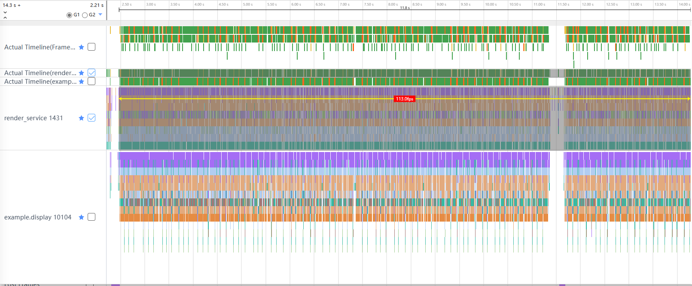
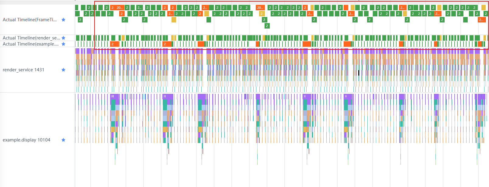
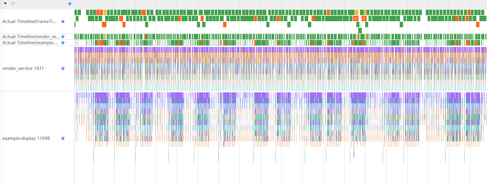

# Properly process the rendering of high-load components.

## Introduction

During application development, some pages need to load a large amount of data in the list. As a result, the number of components is large or the nesting level is deep, increasing the component load and drawing time. Although repeated component creation can be avoided through component reuse, if each list item contains a large number of components, a large amount of data is loaded at a time when the list item slides, which may cause performance problems such as frame freezing and frame loss.

## Issue Scenario

In the calendar application, you need to load all the days of each month in a list, including the Gregorian calendar and lunar calendar. In this way, at least 58 data records are loaded in an item, that is, 58 components are required. When the list slides, the aboutToReuse() interface of component-recycle.md is used to set new data. As a result, 58 components may be refreshed at the same time, which may cause frame loss and frame freezing.


## Workarounds

Loading a large amount of data at a time and refreshing a large number of components may cause frame freezing and frame loss. Therefore, reducing the amount of data loaded at a time is a solution. However, due to service requirements, the total amount of data to be loaded and the number of components to be drawn cannot be reduced. In this case, you can only split the data and divide the components related to the data into multiple times for drawing. ArkTS provides DisplaySync (variable frame rate) (https://developer.huawei.com/consumer/cn/doc/harmonyos-references/js-apis-graphics-displaysync-0000001813575980) to allow developers to set callback listening. Developers can process some data in the callback and load a small amount of data in each frame to reduce frame freezing or frame loss during sliding animation.

## Optimization Examples

### Common Code

Generally, new data is set in aboutToReuse() and all components are drawn at a time.

```ts
@Entry
@Component
struct Direct {
  ...
  //Initialize the data of one year in the calendar.
  initCalenderData() {
    ...
  }

  aboutToAppear() {
	...
    this.initCalenderData();
  }

  build() {
    Column() {
      ...
      List() {
        LazyForEach(this.contentData, (monthItem: Month) => {
          //Date of each month
          ListItem() {
            ItemView({
              monthItem: monthItem,
              currentMonth: this.currentMonth,
              currentDay: this.currentDay
            })
            //Set the reuse ID based on the number of days in each month. During component reuse, components with the same ID are selected for reuse.
            .reuseId("reuse_id_" + monthItem.days.length.toString())
          }
        })
      }
      ...
  }
}
@Reusable
@Component
struct ItemView {
  @State monthItem: Month = { month: '', num: 0, days: [], lunarDays: [] };
  ...

  aboutToReuse(params: Record<string, Object>): void {
    hiTraceMeter.startTrace("reuse_" + (params.monthItem as Month).month, 1);
    this.monthItem = params.monthItem as Month;
    hiTraceMeter.finishTrace("reuse_" + (params.monthItem as Month).month, 1);
  }

  build() {
    Flex({ wrap: FlexWrap.Wrap }) {
      ...
      //Date information
      ForEach(this.monthItem.days, (day: number, index: number) => {
        ...
      }, (index: number): string => index.toString())
    }
    ...
  }
}
```

In the preceding code, component reuse is used. In the aboutToReuse() interface of ItemView, the data of one month is directly set to the status variable monthItem. In this way, the following Flex receives the status variable change notification and updates the data in the component. After the compilation and running, go to the calendar page. Use the SmartPerf Host tool (performance-optimization-using-smartperf-host.md) to start capturing traces. Slide the list to the bottom to stop capturing traces. Use the SmartPerf Host to analyze the captured trace files. Select the label and related data area, as shown in Figure 1. The three Actual Timeline labels in the figure indicate the total time consumed by each frame of the application and RenderService, the drawing time of each frame of the application, and the drawing time of each frame of the RenderService layer, respectively. The render_service label indicates the drawing operation in each frame of the RenderService layer, the example.display label is the bundlename of the application, indicating the operations of the application in each frame, including creating components and loading data.

Figure 1 Component multiplexing frame rate



As shown in the preceding figure, the frame rate during the sliding period is 113 frames. If the frame rate is 120 frames, the frame drop rate during the sliding period is about 5.8%. As shown in Figure 1, each time the application loads new data (orange part in Figure 2), an exception occurs at the RenderService layer (yellow part in Figure 2). For details about the color areas in the figure, see [SmartPerf Host Tool] (performance-optimization-using-smartperf-host.md).

Figure 2 Drawing duration



FIG. 3 may be obtained after a part of the image is further zoomed in. After selecting 146272 in the Actual Timeline (render_service) tag, you can see that it is associated with 209136 and 209137 in the Actual Timeline (example.display) tag through the arrow, that is, the exception at the RenderService layer is caused by the operations in the first two frames at the application layer. Based on the code and the label of arrow 2, you can see that the aboutToReuse interface is called in 209135. In this case, the system starts the drawing operation of component reuse. According to the code, the aboutToReuse interface puts all data of a month into the component that is being reused, the data in all Text components used to display the date is updated (arrow 3, diffIndexArray.lenght: 35, indicating 35 different elements). As a result, 209136 needs to calculate the size of 35 subcomponents (arrow 1), as a result, the drawing time of 146272 is prolonged. When the list data volume is small, frame loss does not occur. This is because the frame extension time is short each time and the impact on the frame rate is small. However, when the list data volume is large, frame loss occurs because there are too many extended frames.

Figure 3 Detailed time consumption


### Optimize

The frame callback method in DisplaySync is used to split data into each frame for loading and drawing. You only need to modify the data loading mode of the customized subcomponent ItemView. Therefore, the same part as that in the common code is omitted.

Create the DisplaySync object when using the ItemView for the first time, set the expected frame rate, add the frame callback listener, and start the DisplaySync object.

```ts
@Reusable
@Component
struct ItemView {
  ...
  aboutToAppear(): void {
    //Create the DisplaySync object.
    this.displaySync = displaySync.create();
    // Initialize the expected frame rate.
    let range: ExpectedFrameRateRange = {
      expected: 120,
      min: 60,
      max: 120
    };
    // Set the expected frame rate.
    this.displaySync.setExpectedFrameRateRange(range);
    // Set the frame callback listener.
    this.displaySync.on("frame", () => {
      ...
    });
    // Enable the listening frame callback function.
    this.displaySync.start();
    ...  
  }
  ...
}
```

Then, add the code for updating data to the listener. The data update of each month is split. The first step is to update the monthly data and calculate the total execution steps. The last step is to initialize the count data. The number of other steps to be executed varies according to the amount of data loaded each time.

```ts
...
private temp: Month[] = [];
...
this.displaySync.on("frame", () => {
  //The execution starts only when there is data in the array.
  if (this.temp.length > 0) {
    if (this.step === 0) {
      // Step 1: Put the monthly data and calculate the maximum number of frames required to complete the data operation.
      hiTraceMeter.startTrace("reuse_" + this.step, 1);
      this.month = this.temp[0].month;
      this.monthNumber = this.temp[0].num;
      this.year = this.temp[0].year;
      this.maxStep = this.maxStep + Math.ceil(this.temp[0].days.length / this.MAX_EVERY_FRAME);
      hiTraceMeter.finishTrace("reuse_" + this.step, 1);
      this.step += 1;
    } else if (this.step === this.maxStep - 1) {
      //Last step: Initialize some count data.
      this.temp.shift();
      this.step = 0;
      this.maxStep = 2;
    } else {
      hiTraceMeter.startTrace("reuse_" + this.step, 1);
      //Calculate the start index when obtaining values from all data. 
      let start: number = this.MAX_EVERY_FRAME * (this.step - 1);
      //Calculate the end index when obtaining values from all data. 
      let end: number = (this.MAX_EVERY_FRAME * this.step) > this.temp[0].days.length ? 
            this.temp[0].days.length : this.MAX_EVERY_FRAME * this.step;
      //Update date data. 
      for (let i = start; i < end; i++) {
        this.days[i] = this.temp[0].days[i];
        this.lunarDays[i] = this.temp[0].lunarDays[i];
      }
      hiTraceMeter.finishTrace("reuse_" + this.step, 1);
      this.step += 1;
    }
  }
});
...
```

Finally, put the data into the array in the aboutToReuse interface for starting data update in the frame callback.

```ts
aboutToReuse(params: Record<string, Object>): void {
  hiTraceMeter.startTrace("reuse_" + (params.monthItem as Month).month, 1);
  this.temp.push(params.monthItem as Month);
  hiTraceMeter.finishTrace("reuse_" + (params.monthItem as Month).month, 1);
}
```

After the compilation and running, use the same method to view the optimized trace information, as shown in Figure 4.

Figure 4 Frame rate after optimization


As shown in Figure 4, the frame rate is 120 fps after code optimization. After the trace result in Figure 4 is zoomed in, you can see that the number of extended frames (yellow part in the Actual Timeline (render_service) tag) at the RenderService layer decreases significantly, which does not occur each time data is loaded before optimization.

Figure 5 Drawing duration after optimization



The following continues to zoom in the information in FIG. 5 to see what operations are performed in each frame, as shown in FIG. 6. In 211618, the aboutToReuse interface is called. Because only the data is put into an array and the data in the multiplexing component is not updated, the frame is not prolonged. In 211619, the data in the reused component is gradually updated. However, because the data in the current reused component is not updated in the previous frame (211618), the component does not need to be drawn in 211619. Therefore, the frame still takes a short time. According to the code, date data of five days is stored in 211620. Only two data records are set in the previous frame (211619), and only one data record is updated (this.month = this.temp[0].month updates the text of the displayed month). Therefore, the drawing time of this frame does not time out.

Figure 6 Detailed time required after optimization 1


Check the trace information, as shown in Figure 7. Similar to the previous frame (211621), the date data of five days is updated in this frame, and the sizes of the five Text components (arrow 1) of the updated data in the previous frame (211621) are measured again. The data of other components remains unchanged, so the measurement is skipped (arrow 2). The subsequent frames are similar. Only data of five days is stored each time, and the Text component associated with the data set in the previous frame is updated. Because the number of components updated each time is small, each frame can be drawn within the specified time (120 frames per second, that is, one frame per 8 ms). Therefore, the number of extended frames is small. In this way, frame loss does not occur regardless of the amount of data in the list.

Figure 7 Detailed time required after optimization 2


## Summary

Through the preceding sample code and optimization process, you can see that frame loss may occur when all components are loaded at a time when component reuse is used in the list. Although the delay of single-frame drawing does not cause frame loss when the data volume is small, the impact of the delay is obvious when the data volume increases. After data is split properly, the occurrence of extended frames can be effectively reduced, thereby reducing the performance problems caused by frame loss.

## Reference Links

[Using SmartPerf-Host to Analyze Application Performance] (performance-optimization-using-smartperf-host.md)
[DisplaySync Document] (https://gitee.com/openharmony/docs/blob/master/zh-cn/application-dev/reference/apis-arkgraphics2d/js-apis-graphics-displaySync.md)


## FAQ

**Q: Why do I need to set the third parameter for Forach in ItemView?**

A: In component reuse, if Forach is used, you must set the third parameter, that is, set a key for each data. Otherwise, the components added to Forach will not be reused but will be re-created.

**Q: Will performance problems be caused if a DisplaySync frame callback listener is set for each ListItem subcomponent in the list?**

A: No. The trace diagram in the example shows that except the callback listening of DisplaySync of the ItemView that is being reused, other listening takes a short time and the impact on the performance can be ignored. See figure 8.

Figure 8 DisplaySync listening duration


**Q: Why does the captured trace not contain so many tags in the example?**

A: You need to run the hdc shell command to enable the tag.

```shell
hdc shell
param set persist.ace.debug.enabled 1
param set persist.ace.trace.enabled 1
param set persist.ace.trace.layout.enabled true
param set const.security.developermode.state true
param set persist.ace.trace.build.enabled 1
```
