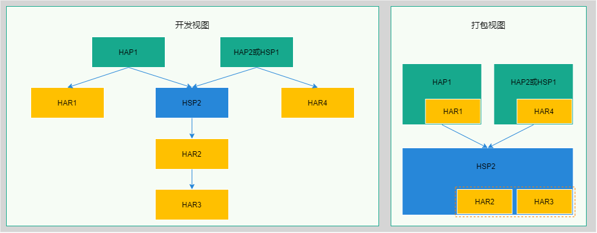

# Reducing the Size of Application Packages

## Overview

Reducing the size of an application package plays a key role in improving application download and installation experience. By compressing, simplifying, or reusing code or resources in an application, the size of the application can be effectively reduced, the application download and installation speed can be improved, and system space usage can be reduced.

You can use any of the following methods to reduce the size of an application package:

 - Configure .so compression options to compress the .so library to reduce the size of the application package.
 - When an application has multiple packages (HAP and HSP), the [HSP (Harmony Shared Package)](../quick-start/in-app-hsp.md) dynamic shared package can be used to share code and resources among multiple packages (HAP and HSP) of the application, eliminating repeated copy of code and resources between multiple packages (HAP and HSP) caused by the use of [HAR (Harmony Archive)](../quick-start/har-package.md) static shared packages, so as to reduce the size of the application packages.
 - Use a scanning tool to scan and analyze the App, HAP, and HSP packages, and take measures to optimize the application based on the output detection report.

## Method of Reducing the Size of an Application Package

### Configuring .so Compression Options

By default, DevEco Studio does not compress .so library files during application packaging. After the .so compression options are configured, DevEco Studio compresses .so library files into a package to reduce the application package size.

**Configuration Method**

Change the value of the [compressNativeLibs](../quick-start/module-configuration-file.md) field in the application module configuration file module.json5 to **true**, and recompile and package the application.

```json
{
  "module": { 
    // ...
    "compressNativeLibs": true // Indicates that the libs library is packaged in compression storage mode.
  }
}
```

**.so Compression Effect**

The following uses the default C++ library file in DevEco Studio as an example. The file sizes before and after compression are compared as follows:

| File Name                                 | Original Size      | Size After Compression    | Compression Rate |
| --------------------------------------- |---------------| -------------- | ----  |
| armeabi-v7a/libc++_shared.so            |1,108k         |386k             | 34%  |

### Using HSP to Share Code and Resources in Multi-Package Scenarios

The current system provides two types of [packages](../quick-start/shared-guide.md): [HAR (Harmony Archive](../quick-start/har-package.md) static shared package and [HSP (Harmony Shared Package)](../quick-start/in-app-hsp.md) dynamic shared package.

Both HAR and HSP are used to share code and resources and can contain code, C++ libraries, resources, and configuration files. The biggest differences between them are as follows: The code and resources in the HAR are compiled with the invoking module, and if there are multiple invoking modules, the build product contains multiple copies of the same code and resources; the code and resources in the HSP are compiled independently, and the build product contains only one copy of the code and resources.

In the multi-package scenario, if multiple HAP or HSP files of an application use the HAR package to share code and resources, each packaged HAP or HSP file contains a copy of the shared HAR package. As a result, the APP file contains redundant code and resources. As shown in the following figure, both the application modules HAP1 and HAP2/HSP1 reference HAR2 and HAR3. After packaging, HAR2 and HAR3 in the APP file have multiple duplicate copies, which are large in size.


In this scenario, it is recommended that developers use HSP instead of HAR to implement code and resource sharing. As shown in the following figure, HSP2 is used to upgrade and reconstruct the original application. After packaging, only one copy of HAR2 and HAR3 exists in the APP file. If the total size of HAR2 and HAR3 is greater than HSP (11 KB), the application package size can be reduced.



### Using the Scanning Tool to Analyze Application Packages

The [scanning tool](../tools/app-check-tool.md) is used to analyze and detect application packages. Based on the parameter settings, it scans the App, HAP, or HSP file in the specified path and generates detection reports, providing data support for you to optimize the package structure or locate problems. The tool provides the following functions:
- Scans for duplicate files.
- Scans for large files (files that exceed the specified size).
- Collects statistics on the size and proportion of each type of file.

Based on the scanning result, optimize the application as follows:

1. Duplicate files
    - Remove duplicate files in a package.
    - Use HSP to reuse resources if there are duplicate resources among multiple files (HAP and HSP).

2. Large files
    - Check whether the files are mandatory for the application and whether they can be deleted.
    - JPG, PNG, and GIF files can be compressed.

3. Files of a specific type
    - Configure .so compression options to compress and package .so files.
    - JPG, PNG, and GIF files can be compressed.
