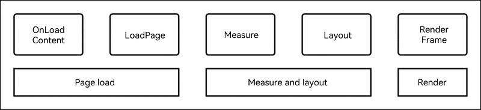

# Reducing Redundant Operations on First Frame Drawing

------

## Application Cold Start and Home Page Loading and Drawing

A code start is a startup mode where an application is started from scratch – the background does not have a process of the application, and therefore the system creates a new process and allocates it to the application.

The cold start process can be divided into four phases: application process creation and initialization, application and ability initialization, ability lifecycle, and home page loading and drawing, as shown below.


Home page loading and drawing is not only one of the four phases of application cold start, but also the most important phase of first frame drawing. It can be further divided into three phases: page load, measurement and layout, and render. This topic explores how application performance can be improved at these phases.



## Reducing Page Load Time

You can reduce your page load time by loading pages on demand or reducing the lifecycle time of custom components.

#### On-demand Loading

On-demand loading, as its name implies, loads resources only when they are needed. It avoids initializing and loading all elements at a time. In this way, the time required for creating list elements is reduced, allowing pages to load faster.

**Negative example**: There is a list with 10,000 elements (the sheer number is intended to make it easier to observe the benefits of on-demand loading). If each of the list element is initialized and loaded during page load, the page load time will be excessively long.

```ts
@Entry
@Component
struct AllLoad {
  @State arr: String[] = Array.from(Array<string>(10000), (val,i) =>i.toString());
  build() {
    List() {
      ForEach(this.arr, (item: string) => {
        ListItem() {
          Text(`item value: ${item}`)
            .fontSize(20)
            .margin({ left: 10 })
        }
      }, (item: string) => item.toString())
    }
  }
}
```

**Optimization**: Replace **ForEach** with **LazyForEach** to avoid initializing and loading all elements at a time.

```ts
class BasicDataSource implements IDataSource {
  private listeners: DataChangeListener[] = [];
  private originDataArray: string[] = [];

  public totalCount(): number {
    return 0;
  }

  public getData(index: number): string {
    return this.originDataArray[index]
  }

  // Register a listener for data changes.
  registerDataChangeListener(listener: DataChangeListener): void {
    if (this.listeners.indexOf(listener) < 0) {
      console.info('add listener')
      this.listeners.push(listener)
    }
  }

  // Deregister the listener for data changes.
  unregisterDataChangeListener(listener: DataChangeListener): void {
    const pos = this.listeners.indexOf(listener);
    if (pos >= 0) {
      console.info('remove listener')
      this.listeners.splice(pos, 1)
    }
  }

  // Invoked when all data is reloaded.
  notifyDataReload(): void {
    this.listeners.forEach(listener => {
      listener.onDataReloaded()
    })
  }

  // Invoked when data is added to the position indicated by the specified index.
  notifyDataAdd(index: number): void {
    this.listeners.forEach(listener => {
      listener.onDataAdd(index)
    })
  }

  // Invoked when data in the position indicated by the specified index is changed.
  notifyDataChange(index: number): void {
    this.listeners.forEach(listener => {
      listener.onDataChange(index)
    })
  }

  // Invoked when data is deleted from the position indicated by the specified index. LazyForEach will update the displayed content accordingly.
  notifyDataDelete(index: number): void {
    this.listeners.forEach(listener => {
      listener.onDataDelete(index)
    })
  }

  // Invoked when data is moved.
  notifyDataMove(from: number, to: number): void {
    this.listeners.forEach(listener => {
      listener.onDataMove(from, to)
    })
  }
}

class MyDataSource extends BasicDataSource {
  private dataArray: string[] = Array.from(Array<string>(10000), (val, i) => i.toString());

  public totalCount(): number {
    return this.dataArray.length
  }

  public getData(index: number): string {
    return this.dataArray[index]
  }

  public addData(index: number, data: string): void {
    this.dataArray.splice(index, 0, data)
    this.notifyDataAdd(index)
  }

  public pushData(data: string): void {
    this.dataArray.push(data)
    this.notifyDataAdd(this.dataArray.length - 1)
  }
}

@Entry
@Component
struct SmartLoad {
  private data: MyDataSource = new MyDataSource()

  build() {
    List() {
      LazyForEach(this.data, (item: string) => {
        ListItem() {
          Text(`item value: ${item}`)
            .fontSize(20)
            .margin({ left: 10 })
        }
      }, (item:string) => item)
    }
  }
}
```


#### Reducing Lifecycle of Custom Components

The custom component lifecycle **aboutToAppear** is time-consuming and, if not well managed, may greatly increase page load times and even block subsequent layout rendering of the main thread. Therefore, the lifecycle needs to be converted to a worker thread task so that the page can be rendered without waiting for the lifecycle to be completed first and the main thread will not be blocked at the startWindowIcon page.

**Negative example**: The time-consuming lifecycle of a custom component blocks the layout rendering of the main thread.

```ts
@Entry
@Component
struct TaskSync {
  @State private text: string = "";
  private count: number = 0;

  aboutToAppear() {
    this.text = 'hello world';
    this.computeTask(); // Synchronization task
  }

  build() {
    Column({space: 10}) {
      Text(this.text).fontSize(50)
    }
    .width('100%')
    .height('100%')
    .padding(10)
  }

  computeTask() {
    this.count = 0;
    while (this.count < 100000000) {
      this.count++;
    }
    this.text = 'task complete';
  }
}
```

**Optimization**: Convert the time-consuming lifecycle to a worker thread task. In this way, the page is drawn first, and then the worker thread result is sent to the main thread and updated to the page.

```ts
// TaskAsync.ets
import worker from '@ohos.worker';

@Entry
@Component
struct TaskAsync {
  @State private text: string = "";
  private workerInstance:worker.ThreadWorker = new worker.ThreadWorker("entry/ets/workers/worker.ts");

  aboutToAppear() {
    // Process messages from the worker thread.
    this.workerInstance.onmessage = (message)=> {
      console.info('message from worker: ' + JSON.stringify(message))
      this.text = JSON.parse(JSON.stringify(message)).data
      this.workerInstance.terminate()
    }
    this.text = 'hello world';
    // Execute the worker thread task.
    this.computeTaskAsync();
  }

  build() {
    Column({space: 10}) {
      Text(this.text).fontSize(50)
    }
    .width('100%')
    .height('100%')
    .padding(10)
  }
  private async computeTaskAsync(){
    // Send a message to the worker thread.
    this.workerInstance.postMessage('hello world')
  }
}
```

```ts
// worker.ts
import worker from '@ohos.worker';

let parentPort = worker.workerPort;

function computeTask(count: number) {
  while (count < 100000000) {
    count++;
  }
  return 'task complete'
}
// Process messages from the main thread.
parentPort.onmessage = (message) => {
  console.info("onmessage: " + JSON.stringify(message));
  // Send a message to the main thread.
  parentPort.postMessage(computeTask(0));
}
```


## Reducing Layout Time

Reducing layout time can be achieved by asynchronous loading and reduced nesting.

#### Asynchronous Loading

During synchronous loading, images are loaded in the main thread. This means that, page layout needs to wait until the main thread has completed the **makePixelMap** task, resulting in long page layout times. On the contrary, during asynchronous loading, images are loaded in other threads while page layout is executed in the main thread. In this way, no blocking occurs, leading to faster page layout and better performance. However, not all image loading must be asynchronous loading. For small local images that are fast to load, synchronous loading (with **syncLoad** set to **true**) is preferrable.

**Negative example**: The **Image** component is used to synchronously load high-resolution images, blocking the UI thread and increasing the total page layout time.

```ts
@Entry
@Component
struct SyncLoadImage {
  @State arr: String[] = Array.from(Array<string>(100), (val,i) =>i.toString());
  build() {
    Column() {
      Row() {
        List() {
          ForEach(this.arr, (item: string) => {
            ListItem() {
              Image($r('app.media.4k'))
                .border({ width: 1 })
                .borderStyle(BorderStyle.Dashed)
                .height(100)
                .width(100)
                .syncLoad(true)
            }
          }, (item: string) => item.toString())
        }
      }
    }
  }
}
```

**Optimization**: The **Image** component is loaded in the default asynchronous loading mode, which avoids blocking the UI thread and reduces the page layout time.

```ts
@Entry
@Component
struct AsyncLoadImage {
  @State arr: String[] = Array.from(Array<string>(100), (val,i) =>i.toString());
    build() {
      Column() {
        Row() {
          List() {
            ForEach(this.arr, (item: string) => {
              ListItem() {
                Image($r('app.media.4k'))
                  .border({ width: 1 })
                  .borderStyle(BorderStyle.Dashed)
                  .height(100)
                  .width(100)
              }
            }, (item: string) => item.toString())
          }
        }
      }
  }
}
```


#### Reducing Nesting

The view hierarchy can significantly affect application performance. Flatter view hierarchies can bring faster page layout and better layout performance. Therefore, whenever possible, reduce nesting and eliminate misplaced container components.

**Negative example**: A **Grid** container is used to load 1000 grids at a time, and additional three-layer **Flex** containers are used , resulting in an unnecessarily deeply nested structure.

```ts
@Entry
@Component
struct Depth1 {
  @State number: Number[] = Array.from(Array<number>(1000), (val, i) => i);
  scroller: Scroller = new Scroller()

  build() {
    Column() {
      Grid(this.scroller) {
        ForEach(this.number, (item: number) => {
          GridItem() {
            Flex() {
              Flex() {
                Flex() {
                  Text(item.toString())
                    .fontSize(16)
                    .backgroundColor(0xF9CF93)
                    .width('100%')
                    .height(80)
                    .textAlign(TextAlign.Center)
                    .border({width:1})
                }
              }
            }
          }
        }, (item:string) => item)
      }
      .columnsTemplate('1fr 1fr 1fr 1fr 1fr')
      .columnsGap(0)
      .rowsGap(0)
      .size({ width: "100%", height: "100%" })
    }
  }
}
```

**Optimization**: A **Grid** container is used to load 1000 grids at a time, but this time no unnecessary containers are used, which leads to faster layout.

```ts
@Entry
@Component
struct Depth2 {
  @State number: Number[] = Array.from(Array<number>(1000), (val, i) => i);
  scroller: Scroller = new Scroller()

  build() {
    Column() {
      Grid(this.scroller) {
        ForEach(this.number, (item: number) => {
          GridItem() {
                  Text(item.toString())
                    .fontSize(16)
                    .backgroundColor(0xF9CF93)
                    .width('100%')
                    .height(80)
                    .textAlign(TextAlign.Center)
                    .border({width:1})
          }
        }, (item:string) => item)
      }
      .columnsTemplate('1fr 1fr 1fr 1fr 1fr')
      .columnsGap(0)
      .rowsGap(0)
      .size({ width: "100%", height: "100%" })
    }
  }
}
```


## Reducing Render Time

You can reduce render time by replacing visibility control with conditional rendering.

#### Conditional Rendering

Replacing visibility control with conditional rendering can significantly reduce the render time during first frame drawing. With visibility control, even if a component is hidden, it still needs to be re-created when the page is re-rendered. Therefore, in scenarios where performance is critical, you are advised to use conditional rendering instead.

**Negative example**: The **visibility** attribute is used to display or hide the component.

```ts
@Entry
@Component
struct VisibilityExample {
  build() {
    Column() {
      Column() {
        // The component is hidden and does not take up space in the layout.
        Text('None').fontSize(9).width('90%').fontColor(0xCCCCCC)
        Row().visibility(Visibility.None).width('90%').height(80).backgroundColor(0xAFEEEE)

        // The component is hidden but takes up space in the layout.
        Text('Hidden').fontSize(9).width('90%').fontColor(0xCCCCCC)
        Row().visibility(Visibility.Hidden).width('90%').height(80).backgroundColor(0xAFEEEE)

        // The component is visible, which is the default display mode.
        Text('Visible').fontSize(9).width('90%').fontColor(0xCCCCCC)
        Row().visibility(Visibility.Visible).width('90%').height(80).backgroundColor(0xAFEEEE)
      }.width('90%').border({ width: 1 })
    }.width('100%').margin({ top: 5 })
  }
}
```

**Optimization**: Conditional rendering is used to replace visibility control.

```ts
@Entry
@Component
struct IsVisibleExample {
  @State isVisible : boolean = true;

  build() {
    Column(){
      Column() {
        // The component is not rendered. In this way, it is hidden and does not take up space in the layout.
        Text('None').fontSize(9).width('90%').fontColor(0xCCCCCC)
        if (!this.isVisible) {
          Row().width('90%').height(80).backgroundColor(0xAFEEEE)
        }
        
        // Conditional rendering cannot be used to hide the component with it still taking up space in the layout.
        
        // The component is rendered. In this way, it becomes visible.
        Text('Visible').fontSize(9).width('90%').fontColor(0xCCCCCC)
        if (this.isVisible){
          Row().width('90%').height(80).backgroundColor(0xAFEEEE)
        }
      }.width('90%').border({ width: 1 })
    }.width('100%').margin({ top: 5 })
  }
}
```
