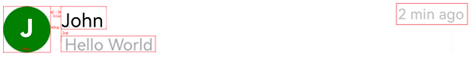
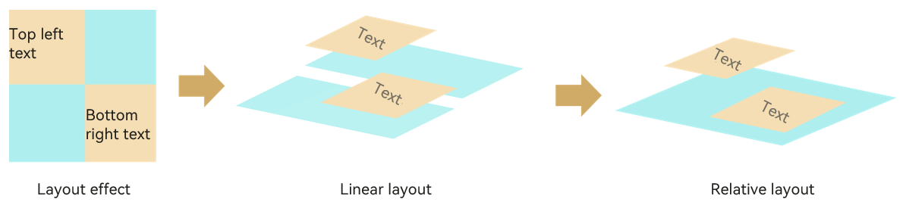

# Improving Layout Performance

## Background

Layouts in the user interface (UI) are a key part of interactions between users and your application. A UI with diverse, well-designed layouts is more enjoyable to interact with. Yet, if poorly implemented, layouts can also lead to performance bottlenecks. Poor layouts may still appear, on the surface, attractive, but the huge overhead underneath – resulting from transition layout calculation and unnecessary nesting, can undermine performance. This document provides tips for optimizing the layout structure, with primary focus on most common layouts and their use cases.

## Common Layouts

The layout defines how components are laid out in the UI. ArkUI offers a diverse array of layouts. Besides the basic layouts – [linear](../ui/arkts-layout-development-linear.md) ([\<Row>](../reference/arkui-ts/ts-container-row.md)/[\<Column>](../reference/arkui-ts/ts-container-column.md)), [stack](../ui/arkts-layout-development-stack-layout.md) ([\<Stack>](../reference/arkui-ts/ts-container-stack.md)), [flex](../ui/arkts-layout-development-flex-layout.md) ([\<Flex>](../reference/arkui-ts/ts-container-flex.md)), [relative](../ui/arkts-layout-development-relative-layout.md) ([\<RelativeContainer>](../reference/arkui-ts/ts-container-relativecontainer.md)), and [responsive grid](../ui/arkts-layout-development-grid-layout.md) ([\<GridCol>](../reference/arkui-ts/ts-container-gridcol.md)), you also have access to the advanced [list](../ui/arkts-layout-development-create-list.md) ([\<List>](../reference/arkui-ts/ts-container-list.md)), [grid](../ui/arkts-layout-development-create-grid.md) ([\<Grid>](../reference/arkui-ts/ts-container-grid.md)/[\<GridItem>](../reference/arkui-ts/ts-container-griditem.md)), and [swiper](../ui/arkts-layout-development-create-looping.md) ([\<Swiper>](../reference/arkui-ts/ts-container-swiper.md)) layouts.

## Optimizing Layout Structure

### Reducing Nesting

Compared with a flat layout, a deep layout with too much nesting means more time spent on node creation and layout. For optimized layout hierarchies, avoid redundant nesting or flatten the layout.

**Avoiding Redundant Nesting**

Redundant nesting results in unnecessary component nodes and deepens the hierarchy of the component tree. For example, if internal and external containers have the same layout direction, the external container can be used in place of the internal one to deliver the same layout effect. In this case, the redundant container can be removed to reduce nesting.

Nonexample:

The following uses the **\<Grid>** component to implement a grid, outside of which three layers of stack containers with different attributes are deployed.

```ts
@Entry
@Component
struct AspectRatioExample12 {
    @State children: Number[] = Array.from(Array<number>(900), (v, k) => k);
    
    build() {
      Scroll() {
      Grid() {
        ForEach(this.children, (item: Number[]) => {
          GridItem() {
            Stack() {  
              Stack() {  
                Stack() {  
                  Text(item.toString())  
                }.size({ width: "100%"})  
              }.backgroundColor(Color.Yellow)  
            }.backgroundColor(Color.Pink)  
          }  
        }, (item: string) => item)  
      }  
      .columnsTemplate('1fr 1fr 1fr 1fr')  
      .columnsGap(0)  
      .rowsGap(0)  
      .size({ width: "100%", height: "100%" })  
    }  
  }  
}

```

A review of the component tree structure reveals that, the desirable UI effect can be equally achieved by the attribute settings of the grid items. In this sense, the three-layer stack containers are redundant and can be removed.


```
└─┬Scroll
  └─┬Grid
    ├─┬GridItem
    │ └─┬Stack
    │   └─┬Stack
    │     └─┬Stack
    │       └──Text
    ├──GridItem
    ├──GridItem
```

Example:

In the following code, by removing redundant nesting of stack containers, the number of child components in each grid item is three less than that in the previous example.

```ts
@Entry  
@Component  
struct AspectRatioExample11 {  
  @State children: Number[] = Array.from(Array<number>(900), (v, k) => k);  
  
  build() {  
    Scroll() {  
      Grid() {  
        ForEach(this.children, (item: Number[]) => {  
          GridItem() {  
            Text(item.toString())  
          }.backgroundColor(Color.Yellow)  
        }, (item: string) => item)  
      }  
      .columnsTemplate('1fr 1fr 1fr 1fr')  
      .columnsGap(0)  
      .rowsGap(0)  
      .size({ width: "100%", height: "100%" })  
    }  
  }  
}
```

The component tree structure is as follows:

```
└─┬Scroll
  └─┬Grid
    ├─┬GridItem
    │ └──Text
    ├──GridItem
    ├──GridItem
```

**Flattening Layout**

In implementing an adaptive layout, use of the **\<Flex>** component can cause multi-level nesting. In this scenario, you are advised to use **\<RelativeContainer>** to flatten the layout to effectively reduce nesting and shorten the component creation time.

The figure below shows an adaptive UI.


Nonexample:

The following code uses a linear layout to implement the UI shown above:

```ts
@Entry  
@Component  
struct MyComponent {  
  build() {
    Row() {  
      Column() {  
        Flex({ justifyContent: FlexAlign.Center, alignItems: ItemAlign.Center }) {  
          Text ('J') 
          // For details about the attribute parameters, see the example. 
        }  
        .width("40vp")  
        .height("40vp")  
      }.height("100%").justifyContent(FlexAlign.Center)  
      //body  
      Flex({ direction: FlexDirection.Column, justifyContent: FlexAlign.Start }) {  
          Flex({ direction: FlexDirection.Column, justifyContent: FlexAlign.Center }) {  
          Flex({ direction: FlexDirection.Row,  
            justifyContent: FlexAlign.SpaceBetween, alignItems: ItemAlign.Center }) {  
            //Phone number or first name  
            Text('John') 
             // For details about the attribute parameters, see the example. 

            //Date Time  
            Text ('2 min ago') 
             // For details about the attribute parameters, see the example.
             }  
          .width("100%").height(22)  
  
          Row() {  
            Text() {  
              //Content Abbreviations for Latest News  
              Span('Hello World'.replace(new RegExp("/[\r\n]/g"), " "))  
                .fontSize("14fp")  
                .fontColor('# 66182431')  
            }  
            .maxLines(1)  
            .textOverflow({ overflow: TextOverflow.Ellipsis })  
          }  
          .alignSelf(ItemAlign.Start)  
          .alignItems(VerticalAlign.Top)  
          .width("100%")  
          .height(19)  
          .margin({ top: "2vp" })  
        }.width("100%")  
        .height("100%")  
      }  
      .layoutWeight(1)  
      .height("100%")  
      .padding({ left: "12vp" })  
    }  
    .alignItems(VerticalAlign.Top)  
    .width("100%")  
    .height("100%")  
  }  
}
```

The component tree structure is as follows:

```
└─┬Row
  ├──┬Column
  │  └─┬Flex
  │    └──Text
  └─┬Flex
    └─┬Flex
      │ └─┬Flex
      │   ├──Text
      │   └──Text
      └─┬Row
        └──Text
```

To place four elements in proper positions, 11 components are used with a tree depth of 5, which is actually unreasonable.

The figure below illustrates the layout of the elements.



Example:

The figure above shows a clear relative layout relationship. In light of this, a **\<RelativeContainer>** can be adopted to improve performance. Below is the specific code implementation.

```ts
@Entry  
@Component  
struct MyComponent {  
  build() {  
    Row() {  
      RelativeContainer() {  
        Text ('J') 
          .fontSize('20.0vp')  
          .fontWeight(FontWeight.Bold)  
          .fontColor(Color.White)  
          .height('40vp')  
          .width('40vp')  
          .textAlign(TextAlign.Center)  
          .clip(new Circle({ width: '40vp', height: '40vp' }))  
          .backgroundColor(Color.Green)  
          .alignRules({  
            center: { anchor: "__container__", align: VerticalAlign.Center },  
            left: { anchor: "__container__", align: HorizontalAlign.Start }  
          })  
          .id('head')  
        Text('John') 
          .fontSize('16.0fp')  
          .textOverflow({ overflow: TextOverflow.Ellipsis })  
          .fontColor('# ff182431')  
          .maxLines(1)  
          .fontWeight(FontWeight.Medium)  
          .padding({ left: '12vp' })  
          .height(22)  
          .alignRules({  
            top: { anchor: 'head', align: VerticalAlign.Top },  
            left: { anchor: 'head', align: HorizontalAlign.End }  
          })  
          .id('name')  
        Text ('2 min ago') 
          .fontColor('# 66182431')  
          .fontSize('12fp')  
          .maxLines(1)  
          .height(22)  
          .alignRules({  
            top: { anchor: 'head', align: VerticalAlign.Top },  
            right: { anchor: '__container__', align: HorizontalAlign.End }  
          })  
          .id("time")  
        Text() {  
          //Content Abbreviations for Latest News  
          Span('Hello World'.replace(new RegExp("/[\r\n]/g"), " "))  
            .fontSize('14fp')  
            .fontColor('# 66182431')  
        }  
        .maxLines(1)  
        .textOverflow({ overflow: TextOverflow.Ellipsis })  
        .width('100%')  
        .height(19)  
        .margin({ top: '2vp' })  
        .padding({ left: '12vp' })  
        .alignRules({  
          top: { anchor: 'name', align: VerticalAlign.Bottom },  
          left: { anchor: 'head', align: HorizontalAlign.End }  
        })  
        .id('content')  
      }  
      .width('100%').height('100%')  
      .border({ width: 1, color: "# 6699FF" })  
    }  
    .height('100%')  
  }  
}
```

The new layout, which delivers the same effect as the previous deep layout, has three less component layers and six less components.

```
└─┬RelativeContainer
  ├──Text
  ├──Text
  ├──Text
  └──Text
```

As shown in the preceding examples, the flattened layout presents clearer logic design, avoiding components that are not involved in drawing for better performance and less memory usage. By flattening the layout, you collapse the hierarchy levels of a deep UI tree and re-arrange content into under one top node. The figure below illustrates how layout flattening helps remove the redundant layout nodes.



Tools available for flattening the layout include, among others, the [\<RelativeContainer>](../reference/arkui-ts/ts-container-relativecontainer.md) component, [\<Grid>](../reference/arkui-ts/ts-container-grid.md) component, [absolute location](../reference/arkui-ts/ts-universal-attributes-location.md), and [custom layout](../reference/arkui-ts/ts-custom-component-lifecycle.md).

### Using High-Performance Layout Components

**Replacing Flex Containers with Columns/Rows**

If you are using the flex container to merely implement a horizontal or vertical layout, the **\<Row>** and **\<Column>** components are better choices in terms of rendering performance benefits. For details about the impact of the flex container on performance, see [Flex Layout Performance Improvement](flex-development-performance-boost.md).

For details about how to replace the flex container components with **\<Row>** and **\<Column>** components to avoid secondary rendering, see [More Performance Improvement Methods](arkts-performance-improvement-recommendation.md).

**Reducing Use of if/else**

In the build function of ArkUI, **if/else** is also regarded as a component and a node in the component tree. In scenarios where the basic layout remains unchanged, reduce the use of if/else if modifying attribute settings can achieve the same purpose – present different GUI content under different conditions. The use of **if/else** not only adds a layer of nodes, but might also result in re-layout and re-render.

Nonexample:

In the following code, the value of **isVisible** is used to control the visibility of the **\<Image>** component. As a result, the **\<Image>** component is continuously created and destroyed during the selection switchover.

```ts
@Entry  
@Component  
struct TopicItem {  
  @State isVisible : Boolean = true;  
  
  build() {  
    Stack() {  
      Column(){  
        if (this.isVisible) {  
          Image($r('app.media.icon')).width('25%').height('12.5%')  
          Image($r('app.media.icon')).width('25%').height('12.5%')  
          Image($r('app.media.icon')).width('25%').height('12.5%')  
          Image($r('app.media.icon')).width('25%').height('12.5%')  
        }  
      }  
      Column() {  
        Row().width(300).height(200).backgroundColor(Color.Pink)  
      }  
    }  
  }  
}
```

Below are the component trees at different values of **isVisible**.

```
Component tree when **isVisible** is **true**:
└─┬Stack
  ├─┬Column
  │ ├──Image
  │ ├──Image
  │ ├──Image
  │ └──Image
  └─┬Column
    └──Row

Component tree when **isVisible** is **false**:
└─┬Stack
  ├──Column
  └─┬Column
    └──Row
```

Example:

In the following example, the **visibility** attribute is used to control the visibility of the **\<Image>** component, avoiding the re-layout and re-rendered caused by **if/else**.

```ts
@Entry  
@Component  
struct TopicItem {  
  @State isVisible : Boolean = true;  
  
  build() {  
    Stack() {  
      Column(){  
          Image($r('app.media.icon'))  
            .width('25%').height('12.5%').visibility(this.isVisible ? Visibility.Visible : Visibility.None)  
          Image($r('app.media.icon'))  
            .width('25%').height('12.5%').visibility(this.isVisible ? Visibility.Visible : Visibility.None)  
          Image($r('app.media.icon'))  
            .width('25%').height('12.5%').visibility(this.isVisible ? Visibility.Visible : Visibility.None)  
          Image($r('app.media.icon'))  
            .width('25%').height('12.5%').visibility(this.isVisible ? Visibility.Visible : Visibility.None)  
      }  
      Column() {  
        Row().width(300).height(200).backgroundColor(Color.Pink)  
      }  
    }  
  }  
}
```

Note: The aforementioned recommendation is provided in regard of performance. If memory is more of a concern, use **if/else** instead.

## Reducing Layout Time

Compared with a flat layout, a deep layout with too much nesting means more time spent on node creation and layout. For optimized layout hierarchies, avoid redundant nesting or flatten the layout.

Nonexample:

The following uses a linear layout, which takes 166 ms 313 us.

```ts

import measure from '@ohos.measure';
import prompt from '@ohos.prompt';

@Entry
@Component
struct PerformanceRelative {
  @State message: string = 'Hello World'
  @State textWidth: string = "";

  build() {
    Column() {
      Image($r("app.media.app_icon")).width("100%").height(300).margin({ bottom: 20 })
      Row() {
        Blank()
        Column() {
          Image($r("app.media.app_icon")).margin({ bottom: 4 }).width(40).aspectRatio(1)
          Text("Name")
        }.margin({ left: 8, right: 8 })
      }.position({ y: 280 }).width("100%")
      // Empty row
      Row().height(this.textWidth)
      Column() {
        Row() {
          Text("Singapore").fontSize(20).fontWeight(FontWeight.Bolder)
            .margin(8)
            .textAlign(TextAlign.Start)
        }.width("100%").justifyContent(FlexAlign.Start)

        Flex({ alignItems: ItemAlign.Center }) {
          Text("Camera").flexShrink(0)
            .margin({ right: 8 })
          TextInput()
        }.margin(8)

        Flex({ alignItems: ItemAlign.Center }) {
          Text("Settings").flexShrink(0)
            .margin({ right: 8 })
          TextInput()
        }.margin(8)

        Row() {
          Column() {
            Image($r("app.media.app_icon")).width(80).aspectRatio(1).margin({ bottom: 8 })
            Text("Description")
          }.margin(8)

          Column() {
            Text("Title").fontWeight(FontWeight.Bold).margin({ bottom: 8 })
            Text("Long Text")
          }.margin(8).layoutWeight(1).alignItems(HorizontalAlign.Start)
        }.margin(8).width("100%").alignItems(VerticalAlign.Top)
      }.layoutWeight(1)

      Flex({ justifyContent: FlexAlign.End }) {
        Button("Upload").margin(8)
        Button("Discard").margin(8)
      }
    }
    .width("100%").height("100%")
  }
}

```

Example:

Use of a relative layout reduces both the nesting depth and quantity of components, shortening the time required for layout to 123 ms 278 us.

```ts

@Entry
@Component
struct RelativePerformance {
  @State message: string = 'Hello World'

  build() {
    RelativeContainer(){
      Image($r("app.media.app_icon"))
        .height(300)
        .width("100%")
        .id("topImage")
        .alignRules({
          left: { anchor: "__container__", align: HorizontalAlign.Start },
          top: {anchor: "__container__", align: VerticalAlign.Top }
        })
      Image($r("app.media.app_icon"))
        .width(40)
        .aspectRatio(1)
        .margin(4)
        .id("topCornerImage")
        .alignRules({
          right: { anchor: "__container__", align: HorizontalAlign.End },
          center: {anchor: "topImage", align: VerticalAlign.Bottom }
        })
      Text("Name")
        .id("name")
        .margin(4)
        .alignRules({
          left: { anchor: "topCornerImage", align: HorizontalAlign.Start },
          top: {anchor: "topCornerImage", align: VerticalAlign.Bottom }
        })
      Text("Singapore")
        .margin(8)
        .fontWeight(FontWeight.Bolder)
        .fontSize(20)
        .id("singapore")
        .alignRules({
          left: { anchor: "__container__", align: HorizontalAlign.Start },
          top: {anchor: "name", align: VerticalAlign.Bottom }
        })
      Text("Camera")
        .margin(8)
        .id("camera")
        .alignRules({
          left: { anchor: "__container__", align: HorizontalAlign.Start },
          top: {anchor: "singapore", align: VerticalAlign.Bottom }
        })
      TextInput()
        .id("cameraInput")
        .alignRules({
          left: { anchor: "camera", align: HorizontalAlign.End },
          right:{ anchor: "__container__", align: HorizontalAlign.End },
          top: {anchor: "camera", align: VerticalAlign.Top },
          bottom: { anchor: "camera", align: VerticalAlign.Bottom }
        })
      Text("Settings")
        .margin(8)
        .id("settings")
        .alignRules({
          left: { anchor: "__container__", align: HorizontalAlign.Start },
          top: {anchor: "camera", align: VerticalAlign.Bottom }
        })
      TextInput()
        .id("settingInput")
        .alignRules({
          left: { anchor: "settings", align: HorizontalAlign.End },
          right:{ anchor: "__container__", align: HorizontalAlign.End },
          top: {anchor: "settings", align: VerticalAlign.Top },
          bottom: { anchor: "settings", align: VerticalAlign.Bottom }
        })
      Image($r("app.media.app_icon"))
        .id("descriptionIcon")
        .margin(8)
        .width(80)
        .aspectRatio(1)
        .alignRules({
          left: { anchor: "__container__", align: HorizontalAlign.Start },
          top: {anchor: "settings", align: VerticalAlign.Bottom }
        })
      Text("Description")
        .id("description")
        .margin(8)
        .alignRules({
          left: { anchor: "__container__", align: HorizontalAlign.Start },
          top: {anchor: "descriptionIcon", align: VerticalAlign.Bottom }
        })
      Text("Title")
        .fontWeight(FontWeight.Bold)
        .id("title")
        .margin(8)
        .alignRules({
          left: { anchor: "description", align: HorizontalAlign.End },
          top: {anchor: "descriptionIcon", align: VerticalAlign.Top }
        })
      Text("Long Text")
        .id("longText")
        .margin(8)
        .alignRules({
          left: { anchor: "description", align: HorizontalAlign.End },
          right: { anchor: "__container__", align: HorizontalAlign.End },
          top: {anchor: "title", align: VerticalAlign.Bottom }
        })
      Button("Discard")
        .id("discard")
        .margin(8)
        .alignRules({
          right: { anchor: "__container__", align: HorizontalAlign.End },
          bottom: {anchor: "__container__", align: VerticalAlign.Bottom }
        })
      Button("Upload")
        .id("upload")
        .margin(8)
        .alignRules({
          right: { anchor: "discard", align: HorizontalAlign.Start },
          bottom: {anchor: "__container__", align: VerticalAlign.Bottom }
        })
    }.width("100%").height("100%")
  }
}

```


## Using Layout Optimization Tools

[DevEco Studio](../quick-start/deveco-studio-user-guide-for-openharmony.md) has a built-in ArkUI Inspector tool, which you can use to inspect the UI display effect of your application running on a real device. With ArkUI Inspector, you can quickly identify layout and other UI-related issues, as well as inspect the layout relationships and attributes of components.
