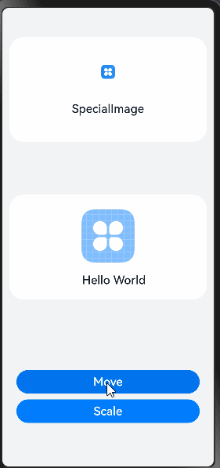
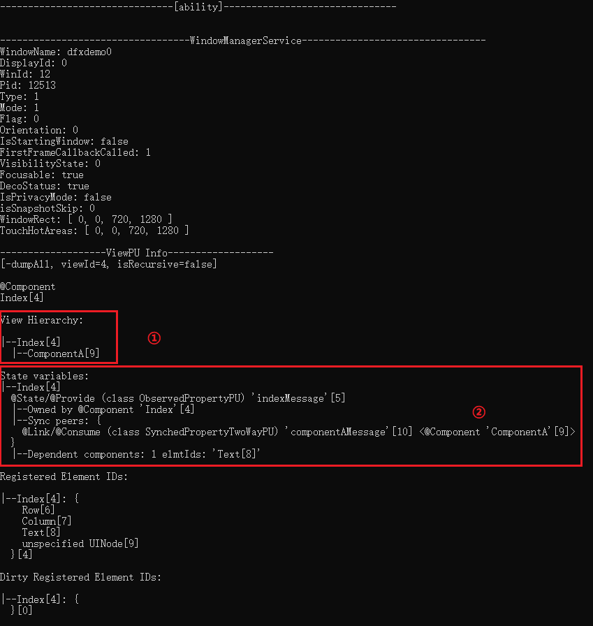

# Practice of the State Variable Component Locating Tool

## Overview

A variable in a custom component becomes a state variable after being decorated by a state decorator (such as @State and @Prop). The change of the state variable causes the rendering and refreshing of the UI component that uses the variable. Improper use of state variables may cause performance problems such as redundant refresh. Developers can use the state variable component locating tool to obtain status management information, such as state variables of custom components, synchronization objects of state variables, and associated components, understand the scope of state variables affecting the UI, and write high-performance application code.

This document uses scenario examples to provide developers with practice guidance on the state variable component locating tool, and explains the debugging commands and output results related to the tool.

## Usage Process

The state variable component locating tool uses specific commands in the HiDumper tool to obtain component and status management information. Developers can use the tool to view the state variable information of a specified custom component and understand the scope of components affected by each state variable.

The process of using the tool can be divided into the following steps:

1. Open the page where the component is located on the device.

2. Obtain the window ID of an application.

3. Obtain the custom component tree of the application based on the application window ID and find the target component and its node ID.

4. Obtain the state variable information of the component based on the component node ID obtained in the previous step.

5. Find the target state variable and see the scope of components it affects.

After determining the state variables contained in the target component and the component refresh scope affected by the variables, developers can analyze whether the state variables are used improperly based on requirements, and analyze and optimize the corresponding code.

## Scenario Examples

The following uses a scenario where a component is refreshed when a button is clicked to change the state variable as an example to provide practical tool usage guidance for developers. The scenario example shows only some key code. For details about the complete code, visit [Sample Code](https://gitee.com/openharmony/applications_app_samples/blob/master/code/Performance/PerformanceLibrary/feature/DFXStateManagement/src/main/ets/view/DFXStateBeforeOptimization.ets).

In the following code, custom components ComponentA and SpecialImage are created. Each component has some state variables and UI components. ComponentA has the Move and Scale buttons. When a button is clicked, the value of the state variable is changed to refresh the corresponding component.
```javascript
// feature/DFXStateManagement/src/main/ets/view/DFXStateBeforeOptimization.ets  

// Constant declaration
// ... 
// Style attribute class 
class UIStyle {  
  public translateX: number = 0;  
  public translateY: number = 0;  
  public scaleX: number = 0.3;  
  public scaleY: number = 0.3;  
}  
@Component  
struct ComponentA {  
  @Link uiStyle: UIStyle; // The attributes of uiStyle are used by multiple components. 
  build() {  
    Column() {  
      // Components that use state variables 
      SpecialImage({ specialImageUiStyle: this.uiStyle })  
      Stack() {  
        Column() {  
          Image($r('app.media.icon'))  
            .scale({  
              x: this.uiStyle.scaleX,  
              y: this.uiStyle.scaleY  
            })  
        }  
        Stack() {  
          Text('Hello World')  
        }  
      }  
      .translate({  
        x: this.uiStyle.translateX,  
        y: this.uiStyle.translateY  
      })  
  
      // Change the value of the state variable through button click callback to cause the corresponding component to be refreshed. 
      Column() {  
        Button('Move')  
          .onClick(() => {  
            animateTo({ duration: animationDuration }, () => {  
              this.uiStyle.translateY = (this.uiStyle.translateY + translateYChangeValue) % translateYChangeRange;  
            })  
          })  
        Button('Scale')  
          .onClick(() => {  
            this.uiStyle.scaleX = (this.uiStyle.scaleX + scaleXChangeValue) % scaleXChangeRange;  
          })  
      }  
    }  
  }  
}  
@Component  
struct SpecialImage {  
  @Link specialImageUiStyle: UIStyle;  
  private opacityNum: number = 0.5; // Default opacity 
  private isRenderSpecialImage(): number {  
    // The opacity of the image is increased by 0.1 each time the image is rendered. The opacity ranges from 0 to 1. 
    this.opacityNum = (this.opacityNum + opacityChangeValue) % opacityChangeRange;  
    return this.opacityNum;  
  }  
  build() {  
    Column() {  
      Image($r('app.media.icon'))  
        .scale({  
          x: this.specialImageUiStyle.scaleX,  
          y: this.specialImageUiStyle.scaleY  
        })  
        .opacity(this.isRenderSpecialImage())  
      Text("SpecialImage")  
    }  
  }  
}  
// Root component of the page, which is the parent component of ComponentA.
```

Run the preceding example and click the Move and Scale buttons respectively. You can see that the SpecialImage component is refreshed when you click the buttons, as shown in the following figure.

 

The following uses the custom component ComponentA and the state variable uiStyle as an example to describe how to use the tool.

1. Open an application on the device and go to the page where ComponentA is located.

2. Run the following command to obtain the window ID of the example application: The name of the running example application package is performancelibrary. You can find WinId corresponding to the window name performancelibrary0 in the command output, which is the window ID of the application. When the application is running in the foreground, the value of Focus window is the window ID of the application. In this example, the window ID of the application is 11. The window ID must be specified for commands used in subsequent processes.
```shell
hdc shell "hidumper -s WindowManagerService -a '-a'"
```
 

3. Based on the window ID 11 obtained in the previous step, use the **-viewHierarchy** command with the **-r** parameter to recursively print the custom component tree of the application. Find the target component ComponentA in the command output. The content in the brackets is the node ID of ComponentA: 70.
```shell
hdc shell "hidumper -s WindowManagerService -a '-w 11 -jsdump -viewHierarchy -r'"
```
```shell
-----------------ViewPU Hierarchy-----------------  
[-viewHierarchy, viewId=4, isRecursive=true]  
|--Index[4]  
-----------------ViewPU Hierarchy-----------------  
[-viewHierarchy, viewId=53, isRecursive=true]  
|--DFXStateManagementPage[53]  
  |--DFXStateManagementHome[55]  
-----------------ViewPU Hierarchy-----------------  
[-viewHierarchy, viewId=65, isRecursive=true]  
|--DFXStateBeforeOptimizationPage[65]  
  |--DFXStateBeforeOptimization[67]  
    |--ComponentA[70]  
      |--SpecialImage[73]
```
4. Run the **-stateVariables** command with the **-viewId** parameter (the parameter value is the node ID of ComponentA) to obtain the state variable information of ComponentA. The result shows that ComponentA has the state variable uiStyle of the @Link/@Consume type. The details of each state variable contain the owning component, synchronization objects, and associated components of the state variable.
```shell
hdc shell "hidumper -s WindowManagerService -a '-w 11 -jsdump -stateVariables -viewId=70'"
```
```shell
--------------ViewPU State Variables--------------  
[-stateVariables, viewId=70, isRecursive=false]  
|--ComponentA[70]  
  @Link/@Consume (class SynchedPropertyTwoWayPU) 'uiStyle'[71]  
  |--Owned by @Component 'ComponentA'[70]  
  |--Sync peers: {  
    @Link/@Consume (class SynchedPropertyTwoWayPU) 'specialImageUiStyle'[74] <@Component 'SpecialImage'[73]>  
  }  
  |--Dependent components: 2 elmtIds: 'Stack[75]', 'Image[77]'
```
5. The state variable uiStyle is used as an example.

(1) **Sync peers** indicates that uiStyle has the state variable specialImageUiStyle of the @Link/@Consume type in the custom component SpecialImage to subscribe to data changes.

(2) **Dependent components** indicates that Stack[79] and Image[81] in ComponentA use the state variable uiStyle, and the number of associated components is 2.

Therefore, when uiStyle changes, the custom component SpecialImage and system components Stack[79] and Image[81] are affected.

 

In the example, the SpecialImage component only uses the scaleX and scaleY attributes transferred from uiStyle to specialImageUiStyle, however, when you click Move to modify the translateY attribute in uiStyle, the change in uiStyle also causes the refresh of the SpecialImage component. Therefore, you can extract the scaleX and scaleY attributes in uiStyle to the state variable scaleStyle, extract the translateX and translateY attributes to the state variable translateStyle, and only transfer scaleStyle to the SpecialImage component to avoid unnecessary refresh.

Class nesting exists after extraction. Therefore, you need to use the @Observed/@ObjectLink decorator to decorate the corresponding class and state variables. The modified code is as follows. You can obtain the complete code from [Sample code](https://gitee.com/openharmony/applications_app_samples/blob/master/code/Performance/PerformanceLibrary/feature/DFXStateManagement/src/main/ets/view/DFXStateAfterOptimization.ets).
```javascript
// feature/DFXStateManagement/src/main/ets/view/DFXStateAfterOptimization.ets

// Constant declaration
// ...
// Style attribute class, nested ScaleStyle, and TranslateStyle 
@Observed  
class UIStyle {  
  translateStyle: TranslateStyle = new TranslateStyle();  
  scaleStyle: ScaleStyle = new ScaleStyle();  
}  
// Zoom attribute class 
@Observed  
class ScaleStyle {  
  public scaleX: number = 0.3;  
  public scaleY: number = 0.3;  
}  
// Displacement attribute class 
@Observed  
class TranslateStyle {  
  public translateX: number = 0;  
  public translateY: number = 0;  
}  
@Component  
struct ComponentA {  
  @ObjectLink scaleStyle: ScaleStyle;  
  @ObjectLink translateStyle: TranslateStyle;  
  
  build() {  
    Column() {  
      SpecialImage({  
        specialImageScaleStyle: this.scaleStyle  
      })  
      // Other UI components 
    }  
  }  
}  
  
@Component  
struct SpecialImage {  
  @Link specialImageScaleStyle: ScaleStyle;  
  // isRenderSpecialImage function 
  build() {  
    Column() {  
      Image($r('app.media.icon'))  
        .scale({  
          x: this.specialImageScaleStyle.scaleX,  
          y: this.specialImageScaleStyle.scaleY  
        })  
        .opacity(this.isRenderSpecialImage())   
      Text("SpecialImage")  
    }
  }  
}
// Root component of the page, which is the parent component of ComponentA.
```

The following figure shows the running effect of the modified example. SpecialImage is refreshed only when the Scale button is clicked. That is, it is not refreshed when the Move button is clicked.

 

You can perform the preceding steps to obtain the state variable information of ComponentA again. The state variable scaleStyle in ComponentA affects SpecialImage[74] and Image[78], and the state variable translateStyle affects Stack[76], the change of translateStyle does not cause the refresh of SpecialImage.
```shell
--------------ViewPU State Variables--------------  
[-stateVariables, viewId=70, isRecursive=false]  
  
|--ComponentA[70]  
  @ObjectLink (class SynchedPropertyNestedObjectPU) 'scaleStyle'[71]  
  |--Owned by @Component 'ComponentA'[70]  
  |--Sync peers: {  
    @Link/@Consume (class SynchedPropertyTwoWayPU) 'specialImageScaleStyle'[75] <@Component 'SpecialImage'[74]>  
  }  
  |--Dependent components: 1 elmtIds: 'Image[78]'  
  @ObjectLink (class SynchedPropertyNestedObjectPU) 'translateStyle'[72]  
  |--Owned by @Component 'ComponentA'[70]  
  |--Sync peers: none  
  |--Dependent components: 1 elmtIds: 'Stack[76]'
```
## Debugging Commands and Outputs

The following uses a simple example program of three-layer nesting of custom components to describe the debugging commands and output results of the tool in detail.
```javascript
@Entry  
@Component  
struct Index {  
  @State indexMessage: string = 'Hello World';  
  build() {  
    Row() {  
      Column() {  
        Text(this.indexMessage)  
        ComponentA({ componentAMessage: this.indexMessage })  
      }  
      .width('100%')  
    }  
    .height('100%')  
  }  
}  
@Component  
struct ComponentA {  
  @Link componentAMessage: string;  
  build() {  
    Column() {  
      ComponentB({ componentBMessage: this.componentAMessage })  
    }  
  }  
}  
@Component  
struct ComponentB {  
  @Link componentBMessage: string;  
  build() {  
    Column() {  
      Text(this.componentBMessage)  
    }  
  }  
}
```
1. Check the application window ID. Find WinId, that is, the application window ID, based on WindowName of the application in the window list. (The bundle name of the example application is dfxdemo, and the default WindowName is dfxdemo0.) In the result, Focus window indicates the ID of the window displayed on the current page. When the application is running in the foreground, the value of Focus window is the window ID of the application.
```shell
hdc shell "hidumper -s WindowManagerService -a '-a'"
```
 

2. Print the custom component tree.

By default, only the root node and its custom child components are printed. **11** indicates the window ID, which can be obtained by running the command for viewing the application window ID. In the result, the information in the format of Index[4] is the name of the custom component, and the number in the square brackets ([]) is the node ID of the component.
```shell
hdc shell "hidumper -s WindowManagerService -a '-w 11 -jsdump -viewHierarchy'"
```
```shell
-----------------ViewPU Hierarchy-----------------  
[-viewHierarchy, viewId=4, isRecursive=false]  
|--Index[4]  
  |--ComponentA[9]
```
If the -viewId parameter is carried, the custom component of the specified viewId and the custom child component of the component can be printed. Only the node ID of a custom component can be used as the value of -viewId. Take -viewId=9 as an example. You can obtain the custom component ComponentA whose viewId is 9 and its custom child component ComponentB.
```shell
hdc shell "hidumper -s WindowManagerService -a '-w 11 -jsdump -viewHierarchy -viewId=9'"
```
```shell
-----------------ViewPU Hierarchy-----------------  
[-viewHierarchy, viewId=9, isRecursive=false]  
|--ComponentA[9]  
  |--ComponentB[12]
```
If the -r parameter is carried, print the custom component tree recursively starting from the root node. For example, the output of the following command is the root node Index and each level of custom components, which are displayed in a tree structure.
```shell
hdc shell "hidumper -s WindowManagerService -a '-w 11 -jsdump -viewHierarchy -r'"
```
```shell
-----------------ViewPU Hierarchy-----------------  
[-viewHierarchy, viewId=4, isRecursive=true]  
|--Index[4]  
  |--ComponentA[9]  
    |--ComponentB[12]
```
3. Print the state variable information of each custom component. Each piece of information contains the component to which the variable belongs, Sync peers (synchronization object), and Dependent components (associated components). When the state variable changes, its Dependent components and the Dependent components of Sync peers are dirty nodes. By default, the root node is printed.
```shell
hdc shell "hidumper -s WindowManagerService -a '-w 11 -jsdump -stateVariables'"
```
```shell
--------------ViewPU State Variables--------------  
--Index[4]  
  @State/@Provide (class ObservedPropertyPU) 'indexMessage'[5]  
  |--Owned by @Component 'Index'[4]  
  |--Sync peers: {  
    @Link/@Consume (class SynchedPropertyTwoWayPU) 'componentAMessage'[9] <@Component 'ComponentA'[8]>  
  }  
  |--Dependent components: 1 elmtIds: 'Text[8]'
```
- @State/@Provide: Decorator type of the state variable.
- 'message'[5]: Name and node ID of the state variable. However, -viewId=5 cannot be used to obtain the corresponding dump information.
- Owned by @Component'Index'[4]: Component to which the state variable belongs.
- Sync peers: Other state variables to be synchronized and the components to which the variables belong.
- Dependent components: ID of the node associated with the current state variable in the component, that is, the node ID of the system or custom component that depends on the variable.

**NOTE**

-stateVariables can only be used to print the state variable information of the specified viewId. It does not support recursive printing. Therefore, you can only obtain the state variable information of a single custom component for level-by-level analysis. Currently, you cannot view all components affected by a state variable globally.

4. Print all information, including information about the custom component tree and state variable information. If no node is specified, the root node is printed by default. If the **-viewId** parameter is carried, information about the specified node is printed. If the **-r** parameter is carried, information about the specified node is printed recursively.
```shell
hdc shell "hidumper -s WindowManagerService -a '-w 11 -jsdump -dumpAll'"
```
The following figure shows the output.

 

1. Custom component tree, corresponding to the **-viewHierarchy** command.

2. State variable information, corresponding to the **-stateVariables** command.

If the dumpAll command contains the **-r** and **-viewId** parameters, the command output is the same as that when the **dumpAll** command contains the corresponding parameters.

## Documents

[Scenario Sample Code](https://gitee.com/openharmony/applications_app_samples/tree/OpenHarmony-5.0-Beta1/code/Performance/PerformanceLibrary/feature/DFXStateManagement/src/main/ets/view)

[Using the HiDumper Command Line Tool to Optimize Performance](performance-optimization-using-hidumper.md)

[Precisely Controlling Render Scope](precisely-control-render-scope.md)
