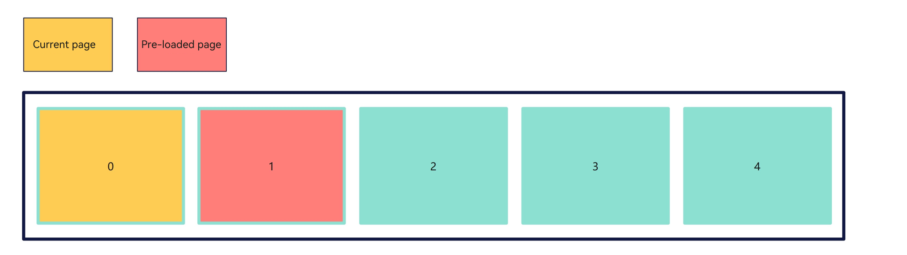

# High-Performance Swiper Development

## Background

During application development, the **\<Swiper>** component is frequently seen in page turning scenarios, as in home screen and gallery applications. In general cases, the on-demand loading technique is adopted for the **\<Swiper>** component. This means that, a new page is loaded and rendered only when it is about to be displayed.This process includes the following steps:

- If the target page uses a custom component decorated by @Component, the build function of the custom component is executed and the internal UI component is created.

- If [LazyForEach](../quick-start/arkts-rendering-control-lazyforeach.md) is used, the UI generation function of LazyForEach is executed to generate UI components.

- After the UI components are built, their layout is calculated and drawn.

In complex page scenarios, the preceding process may last for a long time. As a result, frame freezing occurs during swiping, undermining the swiping experience and even becoming a performance bottleneck of the entire application. For example, in terms of browsing large images in the Gallery application, if an image is not loaded until the first frame of swiping, the first frame will take a long time or even frame loss will occur, slowing down the application performance.

This is where the pre-loading mechanism of the **\<Swiper>** component comes into picture. By allowing for prebuilding and prerendering components in the idle time of the main thread, this mechanism can greatly improve the swiping experience.

## When to Use

The pre-loading mechanism of the **\<Swiper>** component is preferred where time-consuming loading is involved, especially in the following scenarios:

- The number of child components in **\<Swiper>** is greater than or equal to 5.

- The child components in **\<Swiper>** exhibit complex animations.

- Loading child components in **\<Swiper>** is accompanied by time-consuming operations such as network requests.

- The child components in **\<Swiper>** contain a large number of images or resources to be rendered.

## Understanding Pre-loading of \<Swiper>

The pre-loading mechanism of **\<Swiper>** is designed to offer an uninterrupted swiping experience, by allowing **\<Swiper>** to load page content before the associated page is actually displayed As opposed to the traditional approach, where page loading happens concurrently with processing of the swipe event, pre-loading is triggered when the animation for finger lifting starts. As the animation for finger lifting is calculated is in the rendering thread, the main thread has time to perform pre-loading. To improve swipe performance with less memory usage, combine pre-loading with the on-demand loading and destruction capabilities of **LazyForEach**.

## How to Use

- Set the number of elements to load ahead of time through the [cachedCount](../reference/apis-arkui/arkui-ts/ts-container-swiper.md#attributes) attribute of **\<Swiper>**.

Below shows the pre-loading result of the **\<Swiper>** component that contains five pages and its **cacheCount** attribute set to **1** and **loop** attribute set to **false**.
 

\
 Below shows the pre-loading result of the **\<Swiper>** component that contains five pages and its **cacheCount** attribute set to **1** and **loop** attribute set to **true**.
 

- [LazyForEach](../quick-start/arkts-rendering-control-lazyforeach.md) is used to dynamically load and destroy the child components in **\<Swiper>**.

**Example**

```TypeScript
class MyDataSource implements IDataSource { // LazyForEach data source
  private list: number[] = [];

  constructor(list: number[]) {
    this.list = list;
  }

  totalCount(): number {
    return this.list.length;
  }

  getData(index: number): number {
    return this.list[index];
  }

  registerDataChangeListener(_: DataChangeListener): void {
  }

  unregisterDataChangeListener(): void {
  }
}

@Component
struct SwiperChildPage { // Child component in <Swiper>
  @State arr: number[] = [];

  aboutToAppear(): void {
    for (let i = 1; i <= 100; i++) {
      this.arr.push(i);
    }
  }

  build() {
    Column() {
      List({ space: 20 }) {
        ForEach(this.arr, (index: number) => {
          ListItem() {
            Text(index.toString())
              .height('4.5%')
              .fontSize(16)
              .textAlign(TextAlign.Center)
              .backgroundColor(0xFFFFFF)
          }
          .border({ width: 2, color: Color.Green })
        }, (index: number) => index.toString());
      }
      .height("95%")
      .width("95%")
      .border({ width: 3, color: Color.Red })
      .lanes({ minLength: 40, maxLength: 40 })
      .alignListItem(ListItemAlign.Start)
      .scrollBar(BarState.Off)

    }.width('100%').height('100%').padding({ top: 5 });
  }
}

@Entry
@Preview
@Component
struct SwiperExample {
  private dataSrc: MyDataSource = new MyDataSource([]);

  aboutToAppear(): void {
    let list: Array<number> = []
    for (let i = 1; i <= 10; i++) {
      list.push(i);
    }
    this.dataSrc = new MyDataSource(list);
  }

  build() {
    Column({ space: 5 }) {
      Swiper() {
        LazyForEach(this.dataSrc, (_: number) => {
          SwiperChildPage();
        }, (item: number) => item.toString());
      }
      .loop(false)
      .cachedCount(1) // Load one child component ahead of time.
      .indicator(true)
      .duration(100)
      .displayArrow({
        showBackground: true,
        isSidebarMiddle: true,
        backgroundSize: 40,
        backgroundColor: Color.Orange,
        arrowSize: 25,
        arrowColor: Color.Black
      }, false)
      .curve(Curve.Linear)

    }.width('100%')
    .margin({ top: 5 })
  }
}

```

## Verification

To better demonstrate the performance improvements brought by the **\<Swiper>** component's pre-loading mechanism, the following prerequisites are used:

- The **\<Swiper>** component contains 10 **\<List>** components.

- Each of the **\<List>** component contains 100 list items.

Under these prerequisites, using the **\<Swiper>** component's pre-loading mechanism can save about 40% time for each page turning action and ensure that no frame is lost during page turning.

## Optimization Suggestion

Component building and layout calculation take some time. Therefore, the value of **cachedCount** cannot be as large as possible. If the value of **cachedCount** is too large, the application performance may deteriorate. Currently, the duration of the animation for finger lifting is about 400 ms for the **\<Swiper>** component. If the time for the application to load a child component ranges from 100 ms to 200 ms, you are advised to set **cachedCount** to **1** or **2**, so that the pre-loading can be completed before the animation ends.

In light of this, the [OnAnimationStart](../reference/apis-arkui/arkui-ts/ts-container-swiper.md#events) callback provided by **\<Swiper>** can be used, which is called when the switching animation starts. At this time, the main thread is idle, and the application can make full use of this period to preload resources such as images, reducing the time required for preloading nodes specified by **cachedCount**.

**Example**

The page code of the child component in **\<Swiper>** is as follows.

When the child component is built for the first time (the lifecycle reaches [aboutToAppear](../quick-start/arkts-page-custom-components-lifecycle.md)), the system checks the data source for data that matches the index. If no data is found, the system loads resources before building the node. If data is found, the system directly builds the node.

```TypeScript
import image from '@ohos.multimedia.image';
import { MyDataSource } from './Index'

@Component
export struct PhotoItem { // Child component in <Swiper>
  myIndex: number = 0;
  private dataSource: MyDataSource = new MyDataSource([]);
  context = getContext(this);
  @State imageContent: image.PixelMap | undefined = undefined;

  aboutToAppear(): void {
    console.info(`aboutToAppear` + this.myIndex);
    this.imageContent = this.dataSource.getData(this.myIndex)?.image;
    if (!this.imageContent) {// Check the data source for data that matches the index. If no data is found, the system loads resources before building the node.
      try {
        // Obtain a resource manager.
        const resourceMgr = this.context.resourceManager;
        // Obtain the ArrayBuffer instance of item.jpg in the rawfile folder.
        let str = "item" + (this.myIndex + 1) + ".jpg";
        resourceMgr.getRawFileContent(str).then((value) => {
          // Create an ImageSource instance.
          const imageSource = image.createImageSource(value.buffer);
          imageSource.createPixelMap().then((value) => {
            console.log("aboutToAppear push" + this.myIndex)
            this.dataSource.addData(this.myIndex, { description: "" + this.myIndex, image: value })
            this.imageContent = value;
          })
        })
      } catch (err) {
        console.log("error code" + err);
      }
    }
  }

  build() {
    Column() {
      Image(this.imageContent)
        .width("100%")
        .height("100%")
    }
  }
}
```

The code of the \<Swiper> home page is as follows:
```
import Curves from '@ohos.curves';
import { PhotoItem } from './PhotoItem'
import image from '@ohos.multimedia.image';

interface MyObject {
  description: string,
  image: image.PixelMap,
};

export class MyDataSource implements IDataSource {
  private list: MyObject[] = []

  constructor(list: MyObject[]) {
    this.list = list
  }

  totalCount(): number {
    return this.list.length
  }

  getData(index: number): MyObject {
    return this.list[index]
  }

  registerDataChangeListener(listener: DataChangeListener): void {
  }

  unregisterDataChangeListener(listener: DataChangeListener): void {
  }

  addData(index: number, data: MyObject) {
    this.list[index] = data;
  }
}

@Entry
@Component
struct Index {
  @State currentIndex: number = 0;
  cacheCount: number = 1
  swiperController: SwiperController = new SwiperController();
  private data: MyDataSource = new MyDataSource([]);
  context = getContext(this);

  aboutToAppear() {
    let list: MyObject[] = []
    for (let i = 0; i < 6; i++) {
      list.push({ description: "", image: this.data.getData(this.currentIndex)?.image })
    }
    this.data = new MyDataSource(list)
  }

  build() {
    Swiper(this.swiperController) {
      LazyForEach(this.data, (item: MyObject, index?: number) => {
        PhotoItem({
          myIndex: index,
          dataSource: this.data
        })
      })
    }
    .cachedCount(this.cacheCount)
    .curve(Curves.interpolatingSpring(0, 1, 228, 30))
    .index(this.currentIndex)
    .indicator(true)
    .loop(false)
    // Pre-load resources in the OnAnimationStart callback.
    .onAnimationStart((index: number, targetIndex: number) => {
      console.info("onAnimationStart " + index + " " + targetIndex);
      if (targetIndex !== index) {
        try {
          // Obtain a resource manager.
          const resourceMgr = this.context.resourceManager;
          // Obtain the ArrayBuffer instance of item.jpg in the rawfile folder.
          let str = "item" + (targetIndex + this.cacheCount + 2) + ".jpg";
          resourceMgr.getRawFileContent(str).then((value) => {
            // Create an ImageSource instance.
            const imageSource = image.createImageSource(value.buffer);
            imageSource.createPixelMap().then((value) => {
              this.data.addData(targetIndex + this.cacheCount + 1, {
                description: "" + (targetIndex + this.cacheCount + 1),
                image: value
              })
            })
          })
        } catch (err) {
          console.log("error code" + err);
        }
      }
    })
    .width('100%')
    .height('100%')
  }
}

```

## Takeaway

- A tie-in of the **\<Swiper>** component's pre-loading mechanism and **LazyForEach** delivers optimal performance improvements.

- The value of **cachedCount** for pre-loading must be set appropriately based on the loading duration of a single child component. A larger value does not necessarily lead to better performance. If a child component takes *N* ms to load, you are advised to set **cachedCount** to a value less than 400/*N*.

- To further improve pre-loading efficiency to meet high-demanding performance requirements, use the **\<Swiper>** component's pre-loading mechanism together with the **OnAnimationStart** callback.
