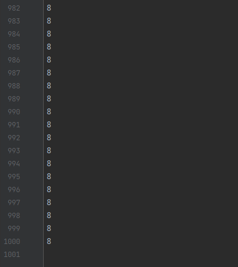

# Reasonably Using Multithreaded Shared Memory
## Introduction
During application development, some time-consuming operations are executed in subthreads to prevent the main thread from being blocked. In this case, the subthreads need to access data in the main thread. ArkTS adopts the actor model that is based on message communication and therefore features memory isolation, which requires data serialization during cross-thread transmission. However, ArkTS supports shared memory through SharedArrayBuffer.

If the data volume is large and multiple threads are required for simultaneous operations, you are advised to use SharedArrayBuffer to reduce the extra overhead caused by data replication and serialization during cross-thread transmission. Example scenarios are audio/video decoding and playback, and simultaneous file read and write by multiple threads. In addition, you can use locks to prevent data disorder when multiple threads simultaneously operate the same memory. This topic describes SharedArrayBuffer and locks in details. For details about the usage and principles of multiple threads, see [Multithread Capability Scenarios](./multi_thread_capability.md).
## Working Principles 
A **SharedArrayBuffer** object is a raw binary data buffer with a fixed length. It can store any type of data including numbers and strings. It can be transferred between multiple threads. The objects before and after the transfer point to the same memory block, achieving memory sharing. If multiple operations are simultaneously performed by subthreads to modify data stored in a **SharedArrayBuffer** object, you must use atomic operations to ensure data synchronization. Atomic operations ensure that the current operation is complete before the next operation starts. The following uses an example to describe the necessity of atomic operations for purposes of synchronization. The full code can be obtained from [AtomicsUsage.ets](https://gitee.com/openharmony/applications_app_samples/blob/master/code/Performance/PerformanceLibrary/feature/memoryShared/src/main/ets/pages/AtomicsUsage.ets).
### Non-atomic Operation

```javascript
......
// Non-atomic operation, which performs auto-increment operations for 10,000 times.
@Concurrent
function normalProcess(int32Array: Int32Array) {
  for (let i = 0; i < 10000; i++) {
    int32Array[0]++;
  }
}
// Atomic operation, which performs auto-increment operations for 10,000 times.
@Concurrent
function atomicsProcess(int32Array: Int32Array) {
  for (let i = 0; i < 10000; i++) {
    Atomics.add(int32Array, 0, 1);
  }
}
......
@State result: string = "Calculation result:";
private taskNum: number = 2;
private scroller: Scroller = new Scroller();
......
Button ("Non-atomic Operation")
  .width("80%")
  .fontSize(30)
  .fontWeight(FontWeight.Bold)
  .margin({ top: 30 })
  .onClick(async () => {
     this.sharedArrayBufferUsage(false);
  })
Scroll(this.scroller) {
  Column() {
    Text(this.result)
      .width("80%")
      .fontSize(30)
      .fontWeight(FontWeight.Bold)
      .fontColor(Color.Blue)
  }
}.height("60%")
.margin({ top: 30 })
......
// Determine whether to use atomic operations based on the passed-in value of isAtomics.
sharedArrayBufferUsage(isAtomics: boolean) {
  // Create a 4-byte SharedArrayBuffer object.
  let sab: SharedArrayBuffer = new SharedArrayBuffer(4);
  // SharedArrayBuffer is a raw binary data buffer and cannot be directly used. Therefore, SharedArrayBuffer is converted to the Int32Array type for subsequent operations.
  let int32Array: Int32Array = new Int32Array(sab);
  int32Array[0] = 0;
  let taskGroup: taskpool.TaskGroup = new taskpool.TaskGroup();
  // Create a Task object and put it in the task group for execution.
  for (let i = 0; i < this.taskNum; i++) {
    if (isAtomics) {
      taskGroup.addTask(new taskpool.Task(atomicsProcess, int32Array));
    } else {
      taskGroup.addTask(new taskpool.Task(normalProcess, int32Array));
    }
  }
  taskpool.execute(taskGroup).then(() => {
    // Print the result on the <Text> component.
    this.result = this.result + "\n" + int32Array;
    // If the mouse pointer is not at the bottom of the screen, scroll to the bottom.
    if (!this.scroller.isAtEnd()) {
      this.scroller.scrollEdge(Edge.Bottom);
    }
  }).catch((e: BusinessError) => {
    logger.error(e.message);
  })
}

```
In this code, two tasks are created, each of which is used to perform 10,000 auto-increment operations on the **SharedArrayBuffer** object. The expected result is 20000. The calculation result may not be 20000, and the result may be different each time you touch the **Non-atomic Operation** button. This is because SharedArrayBuffer is shared memory. When multiple threads perform auto-increment at the same time, the same memory block is operated. The auto-increment operation, however, is not an atomic operation and can be divided into the following three steps:
- Step 1: Obtains the value from the memory.
- Step 2: Increases the obtained value by 1.
- Step 3: Writes the result to the memory.

When multiple threads operate the memory at the same time, the following situation occurs: Thread A obtains the value 1000 from the memory and increases the value by 1 (the result is now 1001). Before thread A writes the result to the memory, thread B obtains the value, which is still 1000. Thread A writes 1001 to the memory. Thread B increases the value by 1 (the result is now 1001) and writes the result 1001 to the memory. As a result, the operation of increasing the value by 1 is performed twice, but the result is 1001 instead of 1002. The result does not meet the expectation.
### Atomic Operations
The code below uses the atomic operation **Atomics.add()** to perform the auto-increment operation.

```javascript
......
Button("Atomic Operation")
  .width("80%")
  .fontSize(30)
  .fontWeight(FontWeight.Bold)
  .margin({ top: 30 })
  .onClick(async () => {
    this.sharedArrayBufferUsage(true);
  })
......

```
No matter how many times you touch the **Atomic Operation** button, the result is always 20,000. This is because the atomic operation is one or a series of operations that cannot be interrupted. It ensures the operation of thread A is not interrupted by thread B, and thread B always obtains the new value written by thread A to the memory. Therefore, when using SharedArrayBuffer, use atomic operations to ensure data synchronization and avoid data disorder.
## Example
In the case of complex logic, it cannot be ensured the entire thread carries out an atomic operation. Locks are introduced to address this scenario.
### Implementation of Locks
Concurrent programming focuses on solving the problems of task division, synchronization, and mutual exclusion between threads, and locks are the important way to implement mutual exclusion. The code snippet below implements the lock **NonReentrantLock** by using Atomics and SharedArrayBuffer.

The **constructor()** method initializes the lock by passing in a **SharedArrayBuffer** object. Multiple threads operate the same shared memory and use a flag bit to control the lock status.

```javascript
const UNLOCKED = 0;
const LOCKED_SINGLE = 1;
const LOCKED_MULTI = 2;
export class NonReentrantLock {
  flag: Int32Array;
  constructor(sab: SharedArrayBuffer) { // Pass in a 4-byte SharedArrayBuffer.
    this.flag= new Int32Array(sab); // The view is a one-bit int array (1 = 4 bytes * 8 / 32 bits).
  }
   
  lock(): void {...}
  tryLock(): boolean {...}
  unlock(): void {...}
}

```
The **lock()** method is used to obtain a lock. A thread that fails to obtain the lock is blocked.

```javascript
lock(): void {
  const flag= this.flag;
  let c = UNLOCKED;
  // If the current value is UNLOCKED at the index 0 of the flag array, the value is changed to LOCKED_SINGLE. Otherwise, the code enters the do-while loop and the thread is blocked.
  if ((c = Atomics.compareExchange(flag, 0, UNLOCKED, LOCKED_SINGLE)) !== UNLOCKED) {
    do {
      // A thread fails to obtain the lock. Its flag bit is changed to LOCKED_MULTI, and the thread is blocked.
      if (c === LOCKED_MULTI || Atomics.compareExchange(flag, 0, LOCKED_SINGLE, LOCKED_MULTI) !== UNLOCKED) {
        Atomics.wait(flag, 0, LOCKED_MULTI);
      }
    // If the thread is woken up and fails to obtain the lock again, the thread returns to the loop and is blocked again.
    } while ((c = Atomics.compareExchange(flag, 0, UNLOCKED, LOCKED_MULTI)) !== UNLOCKED);
  }
}

```
The **tryLock()** method is used to try to obtain the lock. If the lock is obtained, **true** is returned. If the lock fails to be obtained, **false** is returned, but the thread is not blocked.

```javascript
tryLock(): boolean {
  const flag= this.flag;
  return Atomics.compareExchange(flag, 0, UNLOCKED, LOCKED_SINGLE) === UNLOCKED;
}

```
The **unlock()** method is used to release the lock.

```javascript
unlock(): void {
  // Local flag to ensure that only the thread that has the lock can release the lock.
  const flag= this.flag;
  let v0 = Atomics.sub(flag, 0, 1);
  if (v0 !== LOCKED_SINGLE) {
    Atomics.store(flag, 0, UNLOCKED);
    // Wake up only one thread waiting at the index 0 of the array, check the while condition in the lock() method, and try to obtain the lock.
    Atomics.notify(flag, 0, 1);
  }
}

```
### Usage of Locks
In the example scenario below where multiple threads write data to a file, improper manipulation on the shared memory makes the thread insecure. Consequently, garbled characters are displayed in the output file. The lock **NonReentrantLock** implemented above is used to solve the problem.

The main thread uses the **startWrite(useLock: boolean)** method to enable multiple threads to write data to the file and uses the **useLock** parameter to determine whether to use the lock.

```javascript
@Component
export struct LockUsage {
  taskNum: number = 10; // Number of tasks. The actual number of concurrent threads depends on the device.
  baseDir: string = getContext().filesDir + '/TextDir'; // Application sandbox path of the file.
  sabInLock: SharedArrayBuffer = new SharedArrayBuffer(4); // Shared memory used by the main thread to initialize the lock flag bit of the subthread.
  sabForLine: SharedArrayBuffer = new SharedArrayBuffer(4); // Shared memory used by the main thread to initialize the offset bit of the subthread.
  @State result: string = "";
  build() {
    Row() {
      Column() {
        // The button indicates that the lock is not used.
        Button($r('app.string.not_use_lock'))
          .width("80%").fontSize(30)
          .fontWeight(FontWeight.Bold)
          .margin({ top: 30 })
          .onClick(async () => {
            this.startWrite(false);
          })
        // The button indicates that the lock is used.
        Button($r('app.string.use_lock'))
          .width("80%")
          .fontSize(30)
          .fontWeight(FontWeight.Bold)
          .margin({ top: 30 }) 
          .onClick(async () => {
            this.startWrite(true);
          })
        // Running status description
        Text(this.result)
          .width("80%")
          .fontSize(30)
          .fontWeight(FontWeight.Bold)
          .fontColor(Color.Blue)
          .margin({ top: 30 }) 
      }
      .width('100%')
    }
    .height('100%')
  }
  startWrite(useLock: boolean): void {
    // Specify the running status as "Starting writing data to the file".
    this.result = getContext().resourceManager.getStringSync($r('app.string.write_file_start'));  
    // Initialize the offset for writing.
    let whichLineToWrite: Int32Array = new Int32Array(this.sabForLine);
    Atomics.store(whichLineToWrite, 0, 0);
    // Enable multiple threads to write the file based on the offset.
    // Initialize the lock through sabInLock:SharedArrayBuffer of the main thread to ensure that multiple threads operate the same lock flag.
    // Initialize the offset bit through sabForLine:SharedArrayBuffer of the main thread to ensure that multiple threads operate the same offset.
    let taskPoolGroup: taskpool.TaskGroup = new taskpool.TaskGroup();
    for (let i: number = 0; i < this.taskNum; i++) {
      taskPoolGroup.addTask(new taskpool.Task(createWriteTask, this.baseDir, i, this.sabInLock, this.sabForLine, useLock));
    }
    taskpool.execute(taskPoolGroup).then(() => {
      // Specify the running status as "Writing the file succeeded."
      this.result = this.result = getContext().resourceManager.getStringSync($r('app.string.write_file_success'));  
    }).catch(() => {
      // Specify the running status as "Failed to write the file."
      this.result = getContext().resourceManager.getStringSync($r('app.string.write_file_failed'));  
    })
  }
}

```
The subthread writes data to the file at the specified position based on the offset and specifies the position to write next time by automatically incrementing the offset.

```javascript
@Concurrent
async function createWriteTask(baseDir: string, writeText: number, sabInLock: SharedArrayBuffer, sabForLine: SharedArrayBuffer, useLock: boolean): Promise<void> {
  class Option {// Interface method parameter class for writing data to a file.
    offset: number = 0;
    length: number = 0;
    encoding: string = 'utf-8';
    
    constructor(offset: number, length: number) {
      this.offset = offset;
      this.length = length;
    }
  }
  // Initialize the output file directory.
  let filePath: string | undefined = undefined;
  filePath = baseDir + useLock ? "/useLock.txt" : "/unusedLock.txt";
  if (!fs.accessSync(baseDir)) {
    fs.mkdirSync(baseDir);
  }
  // Use SharedArrayBuffer passed in by the main thread to initialize the lock.
  let nrl: NonReentrantLock | undefined = undefined;
  if (useLock) {
    nrl = new NonReentrantLock(sabInLock);
  }
  // Use SharedArrayBuffer passed in by the main thread to initialize the offset for file writing.
  let whichLineToWrite: Int32Array = new Int32Array(sabForLine);
  let str: string = writeText + '\n';
  for (let i: number = 0; i < 100; i++) {
    // Obtain the lock.
    if (useLock && nrl !== undefined) {
      nrl.lock();
    }
    // Write data to the file.
    let file: fs.File = fs.openSync(filePath, fs.OpenMode.READ_WRITE | fs.OpenMode.CREATE);
    try {
      fs.writeSync(file.fd, str, new Option(whichLineToWrite[0], str.length));
    } catch (err) {
      logger.error(`errorCode : ${err.code},errMessage : ${err.message}`);
    }
    fs.closeSync(file);
    // Modify the offset to specify the position for the next write.
    whichLineToWrite[0] += str.length;
    // Release the lock.
    if (useLock && nrl !== undefined) {
      nrl.unlock();
    }
  }
}

```
View the written file in the application sandbox directory. The **unusedLock.txt** file contains less than 1000 lines with garbled characters, as shown in Figure 1.

**Figure 1** File written without using the lock


The **usedLock.txt** file contains 1000 lines without garbled characters, as shown in Figure 2.

**Figure 2** File written using the lock



## Summary
ArkTS supports inter-thread communication through shared memory, although it uses the actor model based on message communication. When SharedArrayBuffer is used to implement shared memory, atomic operations and locks can be used to solve the problem of synchronization and mutual exclusion between threads. Proper use of multithreaded shared memory can improve application performance while ensuring thread security.

 <!--no_check--> 