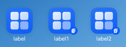
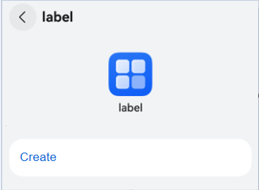
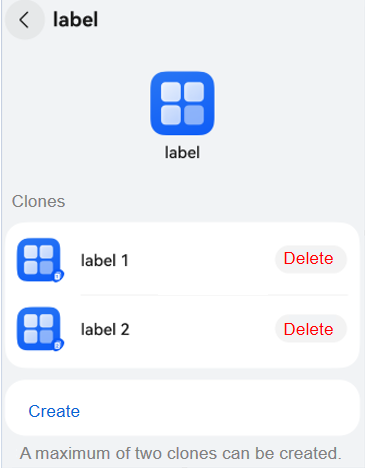

# Creating an Application Clone
Application clone supports users to install multiple identical applications on one device, allowing several accounts to log in to and run the applications at the same time without affecting each other. When users log in with two different accounts to a social media or a game application simultaneously, they do not have to switch the account, reducing frequent logins.

After application clones are created, multiple applications with the same icon will be displayed on the home screen. An application with a lower corner mark is a cloned application.

Relationship between the main application and the application clone:
- These two applications share the same one. For example, when the main application is updated, both of them are synchronously updated, including icon, label, and features of the application.
- These two applications are independent of each other in terms of enabling, related configurations, and data.
- When the main application is uninstalled, all application clones will also be uninstalled. However, the main application will not be affected if a user uninstalls the application clones.

The following figure shows the effect.



## Constraints
The input method application cannot create an application clone.

## How to Develop

1.  

    Configure the [multiAppMode](app-configuration-file.md#multiappmode) field in the **AppScope/application.json5** configuration file in the project. The code snippet is as follows:
    ```json
    {
      "app": {
        "multiAppMode": {
          "multiAppModeType": "appClone",
          "maxCount": 2
        }
      }
    }
    ```


2. Create an application clone.

    - Build and package the configured project and install it on the device.
 
      

    - Choose **Settings** > **System** > **App Clone**, and touch **Create**.

      

      

    - Return to the home screen and check whether the application clone is created.

      

      The three applications in the figure are independent of each other in terms of running, data, and notification.
