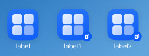
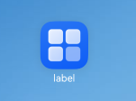
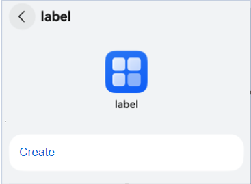
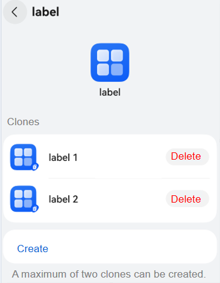

# Creating an Application Clone

<!--Kit: Ability Kit-->
<!--Subsystem: BundleManager-->
<!--Owner: @wanghang904-->
<!--Designer: @hanfeng6-->
<!--Tester: @memghaiyang-->
<!--Adviser: @HelloCrease-->
<!-- md-trans-meta sourceCommit=e614db0ed9ef9e65ff9f340640f4a0fd5317e78d translatedAt=2026-08-13T08:48:51.110Z pushedAt=2026-08-13T10:56:46.428Z -->

Application clone allows multiple instances of the same application to be installed on one device, enabling simultaneous login and independent operation for multiple accounts. When users log in with two different accounts to a social media or a game application simultaneously, they do not have to switch accounts, reducing frequent logins.

After an application is cloned, multiple applications with the same icon are displayed on the home screen. An application with a lower corner mark is a cloned application.

Relationship between the main application and the cloned application:

- These two applications share the same program. For example, when the main application is updated, the cloned one is synchronously updated, including icon, label, and new features.

- Both applications are independent of each other in terms of feature enabling, related configurations, and data.

- When the main application is uninstalled, all cloned applications will also be uninstalled. However, uninstalling a cloned application does not affect the main application.

The following figure shows the effect of cloned applications.



## Constraints

The input method application cannot create an application clone.

## How to Develop

1. Configure the application clone.

    Configure the [multiAppMode](app-configuration-file.md#multiappmode) field in the **AppScope/application.json5** configuration file in the project. The code snippet is as follows:

    <!-- @[app_clone](https://gitcode.com/openharmony/applications_app_samples/blob/master/code/DocsSample/bmsSample/AppClone/AppScope/app.json5) -->

    ``` JSON5
    {
      "app": {
        // ...
        "multiAppMode": {
          "multiAppModeType": "appClone",
          "maxCount": 2
        }
      }
    }
    ```

2. Clone an application.

    - Build and package the configured project and install it on the device.

      

    - Choose **Settings** > **System** > **App Clone**, and tap **Create**.

      

      

    - Return to the home screen and check whether the application is cloned.

      

      The three cloned applications in the figure are independent of each other in terms of process, running, data, and notification.