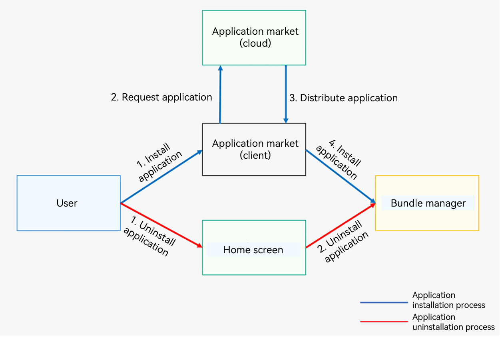

# Application Installation and Uninstallation Process

The OpenHarmony bundle manager service module provides APIs for installing, updating, and uninstalling applications. You can call these APIs when needed. After you release your application to the application market, users can install and uninstall it on their device.

  **Figure 1** Process of installing and uninstalling an application 

