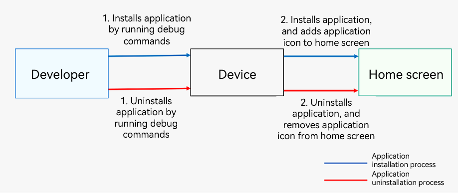
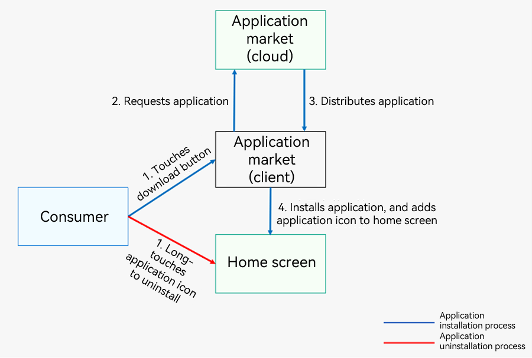

# Application Installation, Uninstall, and Update

This topic describes how to install, uninstall, and update an application.

## Installing or Uninstalling an Application
You can install and uninstall applications by running debug commands. For details, see the [compilation, release, and deployment process](./application-package-structure-stage.md#package-structure-in-the-release-phase).

**Figure 1** Process of installing and uninstalling an application (applicable to developers) 

When an application has been released to the application market, consumers can install or uninstall the application on their device through the application market.

**Figure 2** Process of installing and uninstalling an application (applicable to consumers)

## Updating an Application

An application can be updated in either of the following ways:

- In the application market: The application market notifies the user of an available update, and the user can install the update by following the onscreen instructions.
- In the application: When the application for which an update is available starts up, the application market notifies the user of the update, and the user can install the update by following the onscreen instructions.
