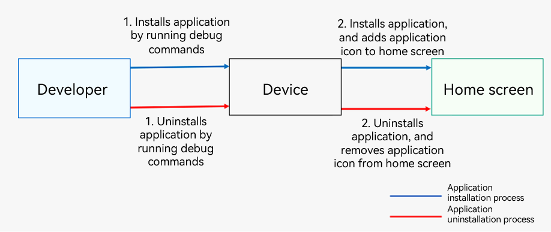
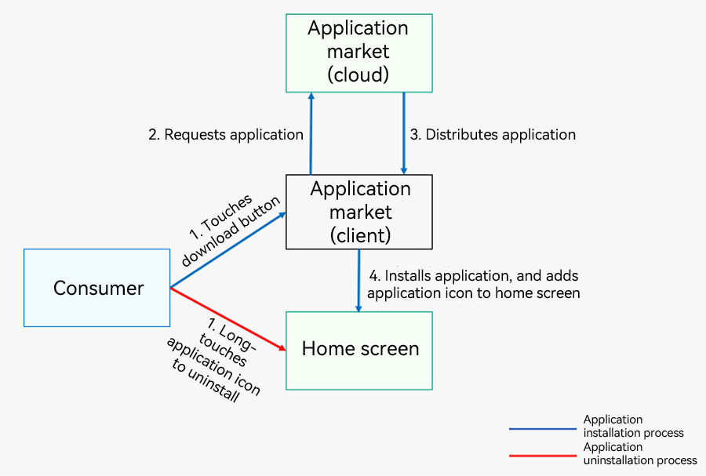

# Application Installation, Uninstall, and Update

<!--Kit: Ability Kit-->
<!--Subsystem: BundleManager-->
<!--Owner: @wanghang904-->
<!--Designer: @hanfeng6-->
<!--Tester: @memghaiyang-->
<!--Adviser: @HelloCrease-->
<!-- md-trans-meta sourceCommit=e614db0ed9ef9e65ff9f340640f4a0fd5317e78d translatedAt=2026-08-13T08:49:13.500Z pushedAt=2026-08-13T11:45:28.321Z -->

This topic describes application installation, uninstallation, and two update modes.

## Installing or Uninstalling an Application

You can install and uninstall applications using debug commands, for example, the [install](../tools/bm-tool.md#install) and [uninstall](../tools/bm-tool.md#uninstall) commands in the bm tool. For details, see the [compilation, release, and deployment process](./application-package-structure-stage.md#package-structure-in-the-release-phase) flowchart.

**Figure 1** Process of installing and uninstalling an application (applicable to developers)

After an application is released to AppGallery, users can install the application on their devices through the AppGallery.

**Figure 2** Process of installing and uninstalling an application (applicable to consumers)

## Updating an Application

For developers, you need to first update the **versionCode** field in the [app.json5 configuration file](./app-configuration-file.md), package the application using DevEco Studio, and release it on AppGallery. For users, you can update the application in either of the following ways after a new version is released:

- On AppGallery: AppGallery notifies the user of an available update, and the user can install the update by following the on-screen instructions.

- In the application: <!--RP1-->When the application for which an update is available starts up, it notifies the user of the update, and the user can install the update by following the on-screen instructions.<!--RP1End-->