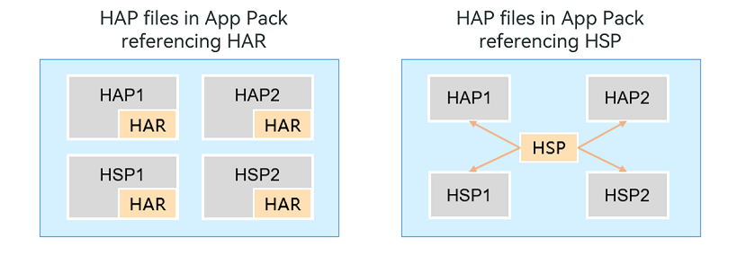

# Application Package Overview

Before developing applications based on the [stage model](https://gitee.com/openharmony/docs/blob/master/en/application-dev/quick-start/application-configuration-file-overview-stage.md), you need to have a basic knowledge of application design mechanism and application package structure.

## Application and Application Package

A user application, also known as an application or app, runs on the operating system of devices and provides particular services for users. The software package corresponding to an application is called an application package.

The system provides an efficient management mechanism for application packages. With this mechanism, you can easily develop, install, query, update, and uninstall application packages. In addition, to allow an application to run across various chipset platforms, such as x86, Arm, and other 32-bit or 64-bit platforms, the system abstracts away the differences between chip platforms for application packages.

## Multi-Module Design Mechanism

- **Modular development**: An application may provide a wide range of features. It is a good practice to divide and manage application features by module. During development, you can develop each functional module as an independent module, which contains source code, resource files, third-party libraries, and configuration files (also called profiles). Each module can be built independently to implement specific features. This modular, loosely coupling mode facilitates application development, maintenance, and expansion.

- **Multi-device adaptation**: You may want your application to deliver features specific to device types. With the multi-module design mechanism, you can achieve this purpose by specifying the supported device types for each of the modules in your application. You can configure some modules to support all device types, and some to support only one or more device types (such as tablet). In this way, the application market can distribute application packages to specified device types, with appropriate filtering, matching, and combination.

## Module Types

There are two types of modules by usage scenario:

- **Modules of the ability type**: used to implement application functionality. Each module of the ability type is built into a Harmony Ability Package (HAP), in .hap format. As a basic unit for application installation, a HAP can be installed and run separately. An application contains one or more HAPs. Depending on the module from each it is built, a HAP is of the entry or feature type.
  - Entry HAP: built from an entry module, which serves as the application's main module and implements the application's entry screen, entry icon, or headline feature. In an application package, there can be only one entry HAP per device type.
  - Feature HAP: built from a dynamic feature module. An application can contain zero, one, or more feature HAPs.

- **Modules of the library type**: used to implement code and resource sharing. This type of module can be referenced by other modules multiple times and, when used smartly, can reduce development and maintenance costs. Modules of the library type are classified as static or shared. Each is built into a shared package.
  - Static: static shared library. This type of library is built into a Harmony Archive (HAR), in .har format.
  - Shared: dynamic shared library. This type of library is built into a Harmony Shared Package (HSP), in .hsp format.
  
  > **NOTE**
  > 
  > Actually, a build of the shared library generates a HAR as well as an HSP. The HAR contains the interfaces exported from the HSP and is used by other modules in the application to reference the features of the HSP. For convenience purposes, it is usually considered that a shared library is built into an HSP.
  
  The table below lists the differences between the HAR and HSP.
  | Shared Package Type| Build and Running | Release and Reference| 
  | --------  | ---- | --- |
  | HAR | The code and resources in the HAR are built with the invoking module, and if there are multiple invoking modules, the build product contains multiple copies of the same code and resources. Note: When [building a HAR](https://gitee.com/openharmony/docs/blob/master/en/application-dev/quick-start/har-package.md#building-a-har), you are advised to enable the obfuscation capability to protect code assets.| The HAR can be referenced inside the application and, by being released independently, can be referenced across applications.| 
  | HSP  | The code and resources in the HSP are built independently, and the build product contains only one copy of the code and resources.| Generally, the HSP is packaged with the application. Intra-application HSP and [integrated HSP](integrated-hsp.md) are supported. The intra-app HSP can only be referenced in an application; the integrated HSP can be published to the ohpm private repository and referenced in cross-applications.|  

 
  **Figure 1** HAR and HSP in the App Pack
  
