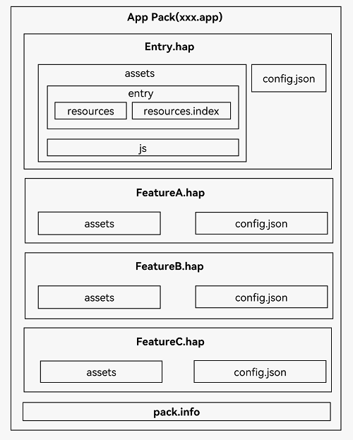

# Application Package Structure in FA Model

<!--Kit: Ability Kit-->
<!--Subsystem: BundleManager-->
<!--Owner: @wanghang904-->
<!--Designer: @hanfeng6-->
<!--Tester: @memghaiyang-->
<!--Adviser: @HelloCrease-->
<!-- md-trans-meta sourceCommit=e614db0ed9ef9e65ff9f340640f4a0fd5317e78d translatedAt=2026-08-13T08:49:23.115Z pushedAt=2026-08-13T11:47:33.328Z -->

The following figure shows the package structure of an application developed based on the [FA Model](application-configuration-file-overview-fa.md). You should have a basic understanding of the related concepts.

>
> **NOTE**
> The FA application development model is supported in API version 8 and earlier. Now, the stage model is recommended for application development.
>

The storage locations of internal files differ between the FA model and the Stage model. In the FA model, all resource files, library files, and code files are stored in the **assets** folder and further differentiated within the folder. For the storage locations of internal files in the Stage model, see [Application Package Structure in Stage Model](./application-package-structure-stage.md).

- **config.json** is an application configuration file, where the template code is automatically created by DevEco Studio. You can modify the configuration as required. For details about the fields, see [Overview of Application Configuration Files in FA Model](application-configuration-file-overview-fa.md#configuration-file-internal-structure).

- The **assets** folder is a collection of all the resource files, library files, and code files in a HAP file. It can be further organized into the **entry** folder and the **js** folder. The **entry** folder stores the **resources** folder and the **resources.index** file.

- The **resources** folder stores resource files (such as strings and images) of the application. For details, see [Resource Categories and Access](resource-categories-and-access.md).

- The **resources.index** file provides a resource index table, which is generated by DevEco Studio using the specific SDK tool.

- The **js** folder stores code files created after compilation.

- The **pack.info** file describes the HAP attributes in the bundle, for example, **bundleName** and **versionCode** of an application and **name**, **type**, and **abilities** of a module. The file is automatically generated when DevEco Studio builds the bundle.

**Figure 1** Application package structure in FA model 
