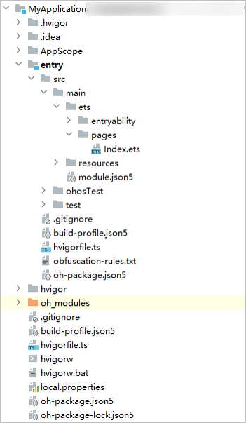
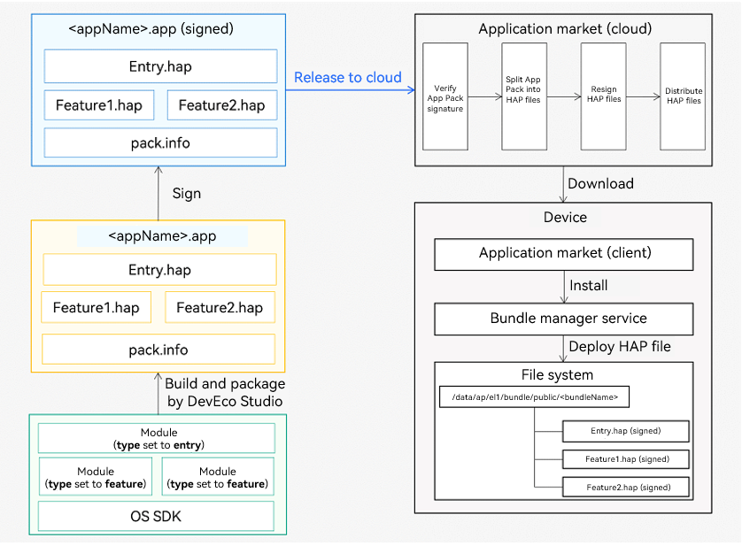

# Application Package Structure in Stage Model

This topic explores the structure of an application package in different phases of application development – development phase, build phase, and release phase.

## Package Structure in the Development Phase
To have a clearer idea on the application package structure, it would be helpful if you have a project directory at hand. As such, first create a project] in DevEco Studio and add modules of different types to the project.

**Figure 1** Project structure (for reference only)

The table below lists the main file types in the project structure.

> **NOTE**
> 
> - The **AppScope** directory is automatically generated by DevEco Studio and its name cannot be changed.
> - The module directory name can be automatically generated by DevEco Studio (for example, **entry** and **library**) or customized. For ease of description, **Module_name** is used below to represent the module directory name.

 
| File Type| Description| 
| -------- | -------- | 
| Configuration files| A collection of application-level and module-level configurations.  - **AppScope &gt; [app.json5](app-configuration-file.md)**: application-wide configuration, such as the bundle name, version number, application icon, application name, and dependent SDK version number.  - **Module_name &gt; src &gt; main &gt; [module.json5](module-configuration-file.md)**: basic information, supported device types, component information, and required permissions of the module.|
| ArkTS source code files| **Module_name &gt; src &gt; main &gt; ets**: ArkTS source code files of the module.| 
| Resource files| A collection of application-level and module-level resource files, including images, multimedia, strings, and layout files. For details, see [Resource Categories and Access](resource-categories-and-access.md).  - **AppScope &gt; resources**: resource files required for the application.  - **Module_name &gt; src &gt; main &gt; resources**: resource files required for the module.| 
| Other configuration files| A collection of files used for compilation and building, including build configuration files, build scripts, obfuscation rule files, and files declaring dependencies.  - **build-profile.json5**: project-level or module-level build configurations, including application signatures and product configurations.  - **hvigorfile.ts**: application-level or module-level build script. You can specify the compilation and build tool version and configuration parameters for controlling build behavior.  - **obfuscation-rules.txt**: obfuscation rule file. When obfuscation is enabled, DevEco Studio compiles, obfuscates, and compresses code during builds in Release mode.  - **oh-package.json5**: information about dependencies, including dependent third-party libraries and shared packages.| 

## Package Structure in the Build Phase
Depending on its type, a module is built into a HAP, HAR, or HSP. Below you can see the mapping between the development view (in the development phase) and the view after build and packaging (in the build phase).

**Figure 2** Mapping between the development view and the view after build and packaging

From the development phase to the build phase, the files in the module directory are changed as follows:
- **ets** directory: The ArkTS source code files are built into .abc files.
- **resources** directory: The resource files in the **AppScope** directory are merged into this directory. If files with the same name exist in these two directories, the ones in the **AppScope** directory are retained after build and packaging.
- Module configuration file: Fields in the **app.json5** file in the **AppScope** directory are integrated into the **module.json5** file in the **Module_name** directory, generating the final **module.json** file for the created HAP or HSP.

> **NOTE**
> 
> When the HAP and HSP are built, the HARs on which they depend are also packaged into them.

## Package Structure in the Release Phase

Each application contains at least one HAP and zero, one or more HSPs. The collection of HAP and HSP files in an application is called a bundle, and the bundle name is the unique identifier of the application. For details, see the **bundleName** tag in the [app.json5 configuration file](app-configuration-file.md).

To release an application to the application market, the bundle must be first packed into an Application Package (App Pack) in .app format. With the packing, DevEco Studio automatically generates a **pack.info** file, which describes the attributes of each HAP and HSP in the App Pack, including the application-level information (bundle name and version code) and module-level information (name, type, and abilities).

> **NOTE**
> 
> - The App Pack is merely used to release an application to the application market and cannot be directly installed or run on devices.
> - The signing, distribution, and installation of an application are all conducted on a HAP-by-HAP or HSP-by-HSP basis.

**Figure 3** Compilation, release, and deployment process

## Selecting a File Type

The following table compares the HAP, HAR, and HSP regarding their functionality and use scenarios.

| Module Type| File Type| Description| 
| -------- | -------- | -------- | 
| Ability | [HAP](hap-package.md)| Functional module of an application, which can be installed and run independently. An application must contain at least one entry HAP and zero, one, or more feature HAPs.| 
| Static Library | [HAR](har-package.md) | Static shared package, which is reused in the build phase.  - Supports intra-application sharing or, after being released, intra-application sharing.  &ensp; - As a second-party library for internal applications, by being released to an OHPM private repository.  &ensp; - As a third-party library for external applications, by being released to the OHPM central repository.  - When multiple HAPs or HSPs reference the same HAR, the application package may contain multiple copies of code and resource files for the HAPs or HSPs, resulting in an unwelcome large package size.  - When [building a HAR](https://gitee.com/openharmony/docs/blob/master/en/application-dev/quick-start/har-package.md#building-a-har), you are advised to enable the obfuscation capability to protect code assets.| 
| Shared Library | [HSP](in-app-hsp.md)| Dynamic shared package, which is reused in the running phase.  - Supports intra-application sharing.  - For multiple HAPs or HSPs to reference the same shared package, using an HSP instead of HAR as the shared package can avoid the unnecessary copies of code and resource files and thereby reduce the application package size.| 

The following table compares the HAP, HSP, and HAR regarding their specifications. The symbol "√" means that the item is supported, and "x" means the opposite.

During your development, select a file type that best meets the actual requirements. For more details, see [HAP](hap-package.md), [HAR](har-package.md), and [HSP](in-app-hsp.md).

| Item| HAP | HAR | HSP |
| -------- | ---------- |----------- |----------- |
| Declaring the [UIAbility](../application-models/uiability-overview.md) and [ExtensionAbility](../application-models/extensionability-overview.md) in the configuration file |  √  |  x  |  x  |
| Declaring the [pages](./module-configuration-file.md#pages) tag in the configuration file| √  |x|√ |
| Including resource files and .so files| √  |√ |√|
| Depending on other HARs| √ |√  |√  |
| Depending on other HSPs| √ |√  |√  |
| Being installed or run on a device| √ |x|x|

> **NOTE**
> 
> - The configuration file of a HAR does not support declaration of the **pages** tag. Still, it can include pages, which can be redirected through a [named route](../ui/arkts-routing.md#named-route).
> - As the HSP supports only intra-application sharing, a HAR that depends on any HSP can be shared only within the same application. Do not release such a HAR to a second-party or third-party repository for other applications to use: Using it in other applications will result in build failures.
> - Neither the HAR nor HSP supports cyclic dependency or dependency transfer.
