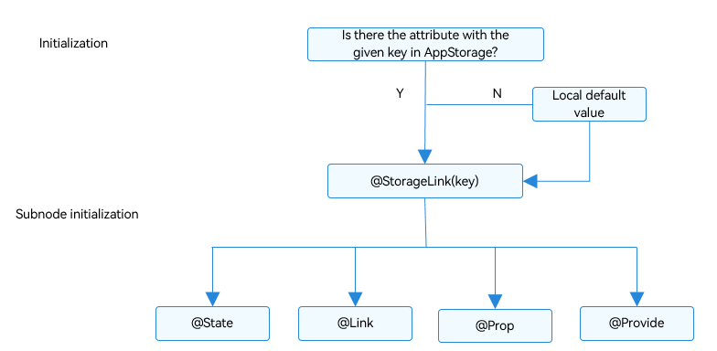

# AppStorage: Storing Application-wide UI State


AppStorage provides central storage for application UI state attributes. It is bound to the application process and is created by the UI framework at application startup.


Unlike LocalStorage, which is usually used for page-level state sharing, AppStorage enables application-wide UI state sharing. AppStorage is equivalent to the hub of the entire application. [PersistentStorage](arkts-persiststorage.md) and [Environment](arkts-environment.md) data is passed first to AppStorage and then from AppStorage to the UI component.


This topic describes the AppStorage use scenarios and related decorators: \@StorageProp and \@StorageLink.


## Overview

AppStorage is a singleton object that is created at application startup. Its purpose is to provide central storage for application UI state attributes. AppStorage retains all those attributes and their values as long as the application remains running. Each attribute is accessed using a unique key, which is a string.

UI components synchronize application state attributes with AppStorage. AppStorage can be accessed during implementation of application service logic as well.

AppStorage supports state sharing among multiple UIAbility instances in the [main thread](../application-models/thread-model-stage.md) of an application.

Selected state attributes of AppStorage can be synchronized with different data sources or data sinks. Those data sources and sinks can be on a local or remote device, and have different capabilities, such as data persistence (see [PersistentStorage](arkts-persiststorage.md)). These data sources and sinks are implemented in the service logic, and separated from the UI. Link to [@StorageProp](#storageprop) and [@StorageLink](#storagelink) those AppStorage attributes whose values should be kept until application re-start.


## \@StorageProp

As mentioned above, if you want to establish a binding between AppStorage and a custom component, you'll need the \@StorageProp or \@StorageLink decorator. Use \@StorageProp(key) or \@StorageLink(key) to decorate variables in the component, where **key** identifies an attribute in AppStorage.

When a custom component is initialized, the attribute value corresponding to the key in AppStorage is used to initialize the \@StorageProp(key) or \@StorageLink(key) decorated variable. Whether the attribute with the given key exists in AppStorage depends on the application logic. This means that it may be missing from AppStorage. In light of this, local initialization is mandatory for the \@StorageProp(key) or \@StorageLink(key) decorated variable.

By decorating a variable with \@StorageProp(key), a one-way data synchronization is established from the attribute with the given key in AppStorage to the variable. A local change can be made, but it will not be synchronized to AppStorage. An update to the attribute with the given key in AppStorage will overwrite local changes.
> **NOTE**
>
> This decorator can be used in atomic services since API version 11.

### Rules of Use

| \@StorageProp Decorator| Description                                                        |
| ----------------------- | ------------------------------------------------------------ |
| Decorator parameters             | **key**: constant string, mandatory (the string must be quoted)                 |
| Allowed variable types     | Object, class, string, number, Boolean, enum, and array of these types.<br>(Applicable to API version 12 or later) Map, Set, and Date types. For details about the scenarios of nested objects, see [Observed Changes and Behavior](#observed-changes-and-behavior).<br>The type must be specified. Whenever possible, use the same type as that of the corresponding attribute in AppStorage. Otherwise, implicit type conversion occurs, which may cause application behavior exceptions.<br>**any** is not supported. **undefined** and **null** are supported since API version 12.<br>(Applicable to API version 12 or later) Union type of the preceding types, for example, **string \| number**, **string \| undefined** or **ClassA \| null**. For details, see [Union Type](#union-type).<br>**NOTE**<br>When **undefined** or **null** is used, you are advised to explicitly specify the type to pass the TypeScript type check. For example, **@StorageProp("AA") a: number \| null = null** is recommended; **@StorageProp("AA") a: number = null** is not recommended. |
| Synchronization type               | One-way: from the attribute in AppStorage to the component variable.<br>The component variable can be changed locally, but an update from AppStorage will overwrite local changes.|
| Initial value for the decorated variable     | Mandatory. If the attribute does not exist in AppStorage, it will be created and initialized with this value.|


### Variable Transfer/Access Rules

| Transfer/Access     | Description                                      |
| ---------- | ---------------------------------------- |
| Initialization and update from the parent component| Forbidden.|
| Child component initialization    | Supported. The \@StorageProp decorated variable can be used to initialize an \@State, \@Link, \@Prop, or \@Provide decorated variable in the child component.|
| Access from outside the component | Not supported.                                      |


  **Figure 1** \@StorageProp initialization rule 


### Observed Changes and Behavior

**Observed Changes**


- When the decorated variable is of the Boolean, string, or number type, its value change can be observed.

- When the decorated variable is of the class or object type, its value change as well as value changes of all its attributes can be observed. For details, see [Example of Using AppStorage and LocalStorage Inside the UI](#example-of-using-appstorage-and-localstorage-inside-the-ui).

- When the decorated variable is of the array type, the addition, deletion, and updates of array items can be observed.

- When the decorated variable is of the Date type, the value change of the **Date** object can be observed, and the following APIs can be called to update **Date** properties: **setFullYear**, **setMonth**, **setDate**, **setHours**, **setMinutes**, **setSeconds**, **setMilliseconds**, **setTime**, **setUTCFullYear**, **setUTCMonth**, **setUTCDate**, **setUTCHours**, **setUTCMinutes**, **setUTCSeconds**, and **setUTCMilliseconds**. For details, see [Decorating Variables of the Date Type](#decorating-variables-of-the-date-type).

- When the decorated variable is **Map**, value changes of **Map** can be observed. In addition, you can call the **set**, **clear**, and **delete** APIs of **Map** to update its value. For details, see [Decorating Variables of the Map Type](#decorating-variables-of-the-map-type).

- When the decorated variable is **Set**, value changes of **Set** can be observed. In addition, you can call the **add**, **clear**, and **delete** APIs of **Set** to update its value. For details, see [Decorating Variables of the Set Type](#decorating-variables-of-the-set-type).


**Framework Behavior**


- When the value change of the \@StorageProp(key) decorated variable is observed, the change is not synchronized to the attribute with the given key in AppStorage.

- The value change of the \@StorageProp(key) decorated variable only applies to the private member variables of the current component, but not other variables bound to the key.

- When the data decorated by \@StorageProp(key) is a state variable, the change of the data is not synchronized to AppStorage, but the owning custom component is re-rendered.

- When the attribute with the given key in AppStorage is updated, the change is synchronized to all the \@StorageProp(key) decorated data, and the local changes of the data are overwritten.


## \@StorageLink

> **NOTE**
>
> This decorator can be used in atomic services since API version 11.

\@StorageLink(key) creates a two-way data synchronization between the variable it decorates and the attribute with the given key in AppStorage.

1. Local changes are synchronized to AppStorage.

2. Any change in AppStorage is synchronized to the attribute with the given key in all scenarios, including one-way bound variables (\@StorageProp decorated variables and one-way bound variables created through \@Prop), two-way bound variables (\@StorageLink decorated variables and two-way bound variables created through \@Link), and other instances (such as PersistentStorage).

### Rules of Use

| \@StorageLink Decorator| Description                                      |
| ------------------ | ---------------------------------------- |
| Decorator parameters             | **key**: constant string, mandatory (the string must be quoted)                 |
| Allowed variable types         | Object, class, string, number, Boolean, enum, and array of these types.<br>(Applicable to API version 12 or later) Map, Set, and Date types. For details about the scenarios of nested objects, see [Observed Changes and Behavior](#observed-changes-and-behavior).<br>The type must be specified. Whenever possible, use the same type as that of the corresponding attribute in AppStorage. Otherwise, implicit type conversion occurs, which may cause application behavior exceptions.<br>**any** is not supported. **undefined** and **null** are supported since API version 12.<br>(Applicable to API version 12 or later) Union type of the preceding types, for example, **string \| number**, **string \| undefined** or **ClassA \| null**. For details, see [Union Type](#union-type).<br>**NOTE**<br>When **undefined** or **null** is used, you are advised to explicitly specify the type to pass the TypeScript type check. For example, **@StorageLink("AA") a: number \| null = null** is recommended; **@StorageLink("AA") a: number = null** is not recommended. |
| Synchronization type              | Two-way: from the attribute in AppStorage to the custom component variable and vice versa|
| Initial value for the decorated variable         | Mandatory. If the attribute does not exist in AppStorage, it will be created and initialized with this value.|


### Variable Transfer/Access Rules

| Transfer/Access     | Description                                      |
| ---------- | ---------------------------------------- |
| Initialization and update from the parent component| Forbidden.                                     |
| Child component initialization    | Supported. The \@StorageLink decorated variable can be used to initialize a regular variable or an \@State, \@Link, \@Prop, or \@Provide decorated variable in the child component.|
| Access from outside the component | Not supported.                                      |


  **Figure 2** \@StorageLink initialization rule 





### Observed Changes and Behavior

**Observed Changes**


- When the decorated variable is of the Boolean, string, or number type, its value change can be observed.

- When the decorated variable is of the class or object type, its value change as well as value changes of all its attributes can be observed. For details, see [Example of Using AppStorage and LocalStorage Inside the UI](#example-of-using-appstorage-and-localstorage-inside-the-ui).

- When the decorated variable is of the array type, the addition, deletion, and updates of array items can be observed.

- When the decorated variable is of the Date type, the value change of the **Date** object can be observed, and the following APIs can be called to update **Date** properties: **setFullYear**, **setMonth**, **setDate**, **setHours**, **setMinutes**, **setSeconds**, **setMilliseconds**, **setTime**, **setUTCFullYear**, **setUTCMonth**, **setUTCDate**, **setUTCHours**, **setUTCMinutes**, **setUTCSeconds**, and **setUTCMilliseconds**. For details, see [Decorating Variables of the Date Type](#decorating-variables-of-the-date-type).

- When the decorated variable is **Map**, value changes of **Map** can be observed. In addition, you can call the **set**, **clear**, and **delete** APIs of **Map** to update its value. For details, see [Decorating Variables of the Map Type](#decorating-variables-of-the-map-type).

- When the decorated variable is **Set**, value changes of **Set** can be observed. In addition, you can call the **add**, **clear**, and **delete** APIs of **Set** to update its value. For details, see [Decorating Variables of the Set Type](#decorating-variables-of-the-set-type).


**Framework Behavior**


1. When the value change of the \@StorageLink(key) decorated variable is observed, the change is synchronized to the attribute with the given key in AppStorage.

2. Once the attribute with the given key in AppStorage is updated, all the data (including \@StorageLink and \@StorageProp decorated variables) bound to the key is changed synchronously.

3. When the data decorated by \@StorageLink(key) is a state variable, its change is synchronized to AppStorage, and the owning custom component is re-rendered.

## Use Scenarios


### Example of Using AppStorage and LocalStorage in Application Logic

Since AppStorage is a singleton, its APIs are all static. How these APIs work resembles the non-static APIs of LocalStorage.


```ts
AppStorage.setOrCreate('PropA', 47);

let storage: LocalStorage = new LocalStorage();
storage.setOrCreate('PropA',17);
let propA: number | undefined = AppStorage.get('PropA') // propA in AppStorage == 47, propA in LocalStorage == 17
let link1: SubscribedAbstractProperty<number> = AppStorage.link('PropA'); // link1.get() == 47
let link2: SubscribedAbstractProperty<number> = AppStorage.link('PropA'); // link2.get() == 47
let prop: SubscribedAbstractProperty<number> = AppStorage.prop('PropA'); // prop.get() == 47

link1.set(48); // two-way sync: link1.get() == link2.get() == prop.get() == 48
prop.set(1); // one-way sync: prop.get() == 1; but link1.get() == link2.get() == 48
link1.set(49); // two-way sync: link1.get() == link2.get() == prop.get() == 49

storage.get<number>('PropA') // == 17
storage.set('PropA', 101);
storage.get<number>('PropA') // == 101

AppStorage.get<number>('PropA') // == 49
link1.get() // == 49
link2.get() // == 49
prop.get() // == 49
```


### Example of Using AppStorage and LocalStorage Inside the UI

\@StorageLink works together with AppStorage in the same way as \@LocalStorageLink works together with LocalStorage. It creates two-way data synchronization with an attribute in AppStorage.


```ts
class PropB {
  code: number;

  constructor(code: number) {
    this.code = code;
  }
}

AppStorage.setOrCreate('PropA', 47);
AppStorage.setOrCreate('PropB', new PropB(50));
let storage = new LocalStorage();
storage.setOrCreate('PropA', 48);
storage.setOrCreate('PropB', new PropB(100));

@Entry(storage)
@Component
struct CompA {
  @StorageLink('PropA') storageLink: number = 1;
  @LocalStorageLink('PropA') localStorageLink: number = 1;
  @StorageLink('PropB') storageLinkObject: PropB = new PropB(1);
  @LocalStorageLink('PropB') localStorageLinkObject: PropB = new PropB(1);

  build() {
    Column({ space: 20 }) {
      Text(`From AppStorage ${this.storageLink}`)
        .onClick(() => {
          this.storageLink += 1;
        })

      Text(`From LocalStorage ${this.localStorageLink}`)
        .onClick(() => {
          this.localStorageLink += 1;
        })

      Text(`From AppStorage ${this.storageLinkObject.code}`)
        .onClick(() => {
          this.storageLinkObject.code += 1;
        })

      Text(`From LocalStorage ${this.localStorageLinkObject.code}`)
        .onClick(() => {
          this.localStorageLinkObject.code += 1;
        })
    }
  }
}
```

### Unrecommended: Using @StorageLink to Implement Event Notification

The two-way synchronization mechanism of @StorageLink and AppStorage is not recommended. This is because the variables in AppStorage may be bound to components on different pages, but the event notifications may not be sent to all these components. In addition, any change to the @StorageLink decorated variables may trigger UI re-rendering, bringing negative impact on the performance.

In the following example, any click event in the **TapImage** component will trigger a change of the **tapIndex** attribute. As @StorageLink establishes a two-way data synchronization with AppStorage, the local change is synchronized to AppStorage. As a result, all custom components owning the **tapIndex** attribute bound to AppStorage are notified of the change. After @Watch observes the change to **tapIndex**, the state variable **tapColor** is updated, and the UI is re-rendered. (Because **tapIndex** is not directly bound to the UI, its change does not directly trigger UI re-rendering.)

To use the preceding mechanism to implement event notification, ensure that variables in AppStorage are not directly bound to the UI and the @Watch decorated function is as simple as possible. (If the @Watch decorated function takes a long time to execute, the UI re-rendering efficiency will be affected.)


```ts
// xxx.ets
class ViewData {
  title: string;
  uri: Resource;
  color: Color = Color.Black;

  constructor(title: string, uri: Resource) {
    this.title = title;
    this.uri = uri
  }
}

@Entry
@Component
struct Gallery2 {
  dataList: Array<ViewData> = [new ViewData('flower', $r('app.media.icon')), new ViewData('OMG', $r('app.media.icon')), new ViewData('OMG', $r('app.media.icon'))]
  scroller: Scroller = new Scroller()

  build() {
    Column() {
      Grid(this.scroller) {
        ForEach(this.dataList, (item: ViewData, index?: number) => {
          GridItem() {
            TapImage({
              uri: item.uri,
              index: index
            })
          }.aspectRatio(1)

        }, (item: ViewData, index?: number) => {
          return JSON.stringify(item) + index;
        })
      }.columnsTemplate('1fr 1fr')
    }

  }
}

@Component
export struct TapImage {
  @StorageLink('tapIndex') @Watch('onTapIndexChange') tapIndex: number = -1;
  @State tapColor: Color = Color.Black;
  private index: number = 0;
  private uri: Resource = {
    id: 0,
    type: 0,
    moduleName: "",
    bundleName: ""
  };

  // Check whether the component is selected.
  onTapIndexChange() {
    if (this.tapIndex >= 0 && this.index === this.tapIndex) {
      console.info(`tapindex: ${this.tapIndex}, index: ${this.index}, red`)
      this.tapColor = Color.Red;
    } else {
      console.info(`tapindex: ${this.tapIndex}, index: ${this.index}, black`)
      this.tapColor = Color.Black;
    }
  }

  build() {
    Column() {
      Image(this.uri)
        .objectFit(ImageFit.Cover)
        .onClick(() => {
          this.tapIndex = this.index;
        })
        .border({ width: 5, style: BorderStyle.Dotted, color: this.tapColor })
    }

  }
}
```

Compared with the use of @StorageLink, the use of **emit** implements event notification with less overhead, by allowing you to subscribe to an event and receive an event callback.

> **NOTE**
>
> The **emit** API is not available in DevEco Studio Previewer.


```ts
// xxx.ets
import { emitter } from '@kit.BasicServicesKit';

let NextID: number = 0;

class ViewData {
  title: string;
  uri: Resource;
  color: Color = Color.Black;
  id: number;

  constructor(title: string, uri: Resource) {
    this.title = title;
    this.uri = uri
    this.id = NextID++;
  }
}

@Entry
@Component
struct Gallery2 {
  dataList: Array<ViewData> = [new ViewData('flower', $r('app.media.icon')), new ViewData('OMG', $r('app.media.icon')), new ViewData('OMG', $r('app.media.icon'))]
  scroller: Scroller = new Scroller()
  private preIndex: number = -1

  build() {
    Column() {
      Grid(this.scroller) {
        ForEach(this.dataList, (item: ViewData) => {
          GridItem() {
            TapImage({
              uri: item.uri,
              index: item.id
            })
          }.aspectRatio(1)
          .onClick(() => {
            if (this.preIndex === item.id) {
              return
            }
            let innerEvent: emitter.InnerEvent = { eventId: item.id }
            // Selected: from black to red
            let eventData: emitter.EventData = {
              data: {
                "colorTag": 1
              }
            }
            emitter.emit(innerEvent, eventData)

            if (this.preIndex != -1) {
              console.info(`preIndex: ${this.preIndex}, index: ${item.id}, black`)
              let innerEvent: emitter.InnerEvent = { eventId: this.preIndex }
              // Deselected: from red to black
              let eventData: emitter.EventData = {
                data: {
                  "colorTag": 0
                }
              }
              emitter.emit(innerEvent, eventData)
            }
            this.preIndex = item.id
          })
        }, (item: ViewData) => JSON.stringify(item))
      }.columnsTemplate('1fr 1fr')
    }

  }
}

@Component
export struct TapImage {
  @State tapColor: Color = Color.Black;
  private index: number = 0;
  private uri: Resource = {
    id: 0,
    type: 0,
    moduleName: "",
    bundleName: ""
  };

  onTapIndexChange(colorTag: emitter.EventData) {
    if (colorTag.data != null) {
      this.tapColor = colorTag.data.colorTag ? Color.Red : Color.Black
    }
  }

  aboutToAppear() {
    // Define the event ID.
    let innerEvent: emitter.InnerEvent = { eventId: this.index }
    emitter.on(innerEvent, data => {
    this.onTapIndexChange(data)
    })
  }

  build() {
    Column() {
      Image(this.uri)
        .objectFit(ImageFit.Cover)
        .border({ width: 5, style: BorderStyle.Dotted, color: this.tapColor })
    }
  }
}
```

The preceding notification logic is simple. It can be simplified into a ternary expression as follows:

```ts
// xxx.ets
class ViewData {
  title: string;
  uri: Resource;
  color: Color = Color.Black;

  constructor(title: string, uri: Resource) {
    this.title = title;
    this.uri = uri
  }
}

@Entry
@Component
struct Gallery2 {
  dataList: Array<ViewData> = [new ViewData('flower', $r('app.media.icon')), new ViewData('OMG', $r('app.media.icon')), new ViewData('OMG', $r('app.media.icon'))]
  scroller: Scroller = new Scroller()

  build() {
    Column() {
      Grid(this.scroller) {
        ForEach(this.dataList, (item: ViewData, index?: number) => {
          GridItem() {
            TapImage({
              uri: item.uri,
              index: index
            })
          }.aspectRatio(1)

        }, (item: ViewData, index?: number) => {
          return JSON.stringify(item) + index;
        })
      }.columnsTemplate('1fr 1fr')
    }

  }
}

@Component
export struct TapImage {
  @StorageLink('tapIndex') tapIndex: number = -1;
  private index: number = 0;
  private uri: Resource = {
    id: 0,
    type: 0,
    moduleName: "",
    bundleName: ""
  };

  build() {
    Column() {
      Image(this.uri)
        .objectFit(ImageFit.Cover)
        .onClick(() => {
          this.tapIndex = this.index;
        })
        .border({
          width: 5,
          style: BorderStyle.Dotted,
          color: (this.tapIndex >= 0 && this.index === this.tapIndex) ? Color.Red : Color.Black
        })
    }
  }
}
```


### Union Type

In the following example, the type of variable **A** is **number | null**, and the type of variable **B** is **number | undefined**. The **Text** components display **null** and **undefined** upon initialization, numbers when clicked, and **null** and **undefined** when clicked again.

```ts
@Component
struct StorLink {
  @StorageLink("AA") A: number | null = null;
  @StorageLink("BB") B: number | undefined = undefined;

  build() {
    Column() {
      Text("@StorageLink initialization, @StorageLink value")
      Text(this.A + "").fontSize(20).onClick(() => {
        this.A ? this.A = null : this.A = 1;
      })
      Text(this.B + "").fontSize(20).onClick(() => {
        this.B ? this.B = undefined : this.B = 1;
      })
    }
    .borderWidth(3).borderColor(Color.Red)

  }
}

@Component
struct StorProp {
  @StorageProp("AAA") A: number | null = null;
  @StorageProp("BBB") B: number | undefined = undefined;

  build() {
    Column() {
      Text("@StorageProp initialization, @StorageProp value")
      Text(this.A + "").fontSize(20).onClick(() => {
        this.A ? this.A = null : this.A = 1;
      })
      Text(this.B + "").fontSize(20).onClick(() => {
        this.B ? this.B = undefined : this.B = 1;
      })
    }
    .borderWidth(3).borderColor(Color.Blue)
  }
}

@Entry
@Component
struct TestCase3 {
  build() {
    Row() {
      Column() {
        StorLink()
        StorProp()
      }
      .width('100%')
    }
    .height('100%')
  }
}
```


### Decorating Variables of the Date Type

> **NOTE**
>
> AppStorage supports the Set type since API version 12.

In this example, the **selectedDate** variable decorated by @StorageLink is of the Date type. After the button is clicked, the value of **selectedDate** changes, and the UI is re-rendered.

```ts
@Entry
@Component
struct DateSample {
  @StorageLink("date") selectedDate: Date = new Date('2021-08-08');

  build() {
    Column() {
      Button('set selectedDate to 2023-07-08')
        .margin(10)
        .onClick(() => {
          AppStorage.setOrCreate("date", new Date('2023-07-08'));
        })
      Button('increase the year by 1')
        .margin(10)
        .onClick(() => {
          this.selectedDate.setFullYear(this.selectedDate.getFullYear() + 1);
        })
      Button('increase the month by 1')
        .margin(10)
        .onClick(() => {
          this.selectedDate.setMonth(this.selectedDate.getMonth() + 1);
        })
      Button('increase the day by 1')
        .margin(10)
        .onClick(() => {
          this.selectedDate.setDate(this.selectedDate.getDate() + 1);
        })
      DatePicker({
        start: new Date('1970-1-1'),
        end: new Date('2100-1-1'),
        selected: $$this.selectedDate
      })
    }.width('100%')
  }
}
```


### Decorating Variables of the Map Type

> **NOTE**
>
> AppStorage supports the Map type since API version 12.

In this example, the **message** variable decorated by @StorageLink is of the Map\<number, string\> type. After the button is clicked, the value of **message** changes, and the UI is re-rendered.

```ts
@Entry
@Component
struct MapSample {
  @StorageLink("map") message: Map<number, string> = new Map([[0, "a"], [1, "b"], [3, "c"]]);

  build() {
    Row() {
      Column() {
        ForEach(Array.from(this.message.entries()), (item: [number, string]) => {
          Text(`${item[0]}`).fontSize(30)
          Text(`${item[1]}`).fontSize(30)
          Divider()
        })
        Button('init map').onClick(() => {
          this.message = new Map([[0, "a"], [1, "b"], [3, "c"]]);
        })
        Button('set new one').onClick(() => {
          this.message.set(4, "d");
        })
        Button('clear').onClick(() => {
          this.message.clear();
        })
        Button('replace the existing one').onClick(() => {
          this.message.set(0, "aa");
        })
        Button('delete the existing one').onClick(() => {
          AppStorage.get<Map<number, string>>("map")?.delete(0);
        })
      }
      .width('100%')
    }
    .height('100%')
  }
}
```


### Decorating Variables of the Set Type

> **NOTE**
>
> AppStorage supports the Set type since API version 12.

In this example, the **memberSet** variable decorated by @StorageLink is of the Set\<number\> type. After the button is clicked, the value of **memberSet** changes, and the UI is re-rendered.

```ts
@Entry
@Component
struct SetSample {
  @StorageLink("set") memberSet: Set<number> = new Set([0, 1, 2, 3, 4]);

  build() {
    Row() {
      Column() {
        ForEach(Array.from(this.memberSet.entries()), (item: [number, string]) => {
          Text(`${item[0]}`)
            .fontSize(30)
          Divider()
        })
        Button('init set')
          .onClick(() => {
            this.memberSet = new Set([0, 1, 2, 3, 4]);
          })
        Button('set new one')
          .onClick(() => {
            AppStorage.get<Set<number>>("set")?.add(5);
          })
        Button('clear')
          .onClick(() => {
            this.memberSet.clear();
          })
        Button('delete the first one')
          .onClick(() => {
            this.memberSet.delete(0);
          })
      }
      .width('100%')
    }
    .height('100%')
  }
}
```

## FAQs

### Value Changed by \@StorageProp Locally Fails to Update through AppStorage

```ts
AppStorage.setOrCreate('PropA', false);

@Entry
@Component
struct Index {
  @StorageProp('PropA') @Watch('onChange') propA: boolean = false;

  onChange() {
    console.log(`propA change`);
  }

  aboutToAppear(): void {
    this.propA = true;
  }

  build() {
    Column() {
      Text(`${this.propA}`)
      Button('change')
        .onClick(() => {
          AppStorage.setOrCreate('PropA', false);
          console.log(`PropA: ${this.propA}`);
        })
    }
  }
}
```

In the preceding example, the value of **PropA** has been changed to **true** locally before the click event, but the value stored in **AppStorage** is still **false**. When the click event attempts to update the value of **PropA** to **false** through the **setOrCreate** API, the value of @StorageProp remains **true** because the local value and stored value of **PropA** are the same.

To synchronize the two values, use either of the following methods:
(1) Change \@StorageProp to \@StorageLink.
(2) Use **AppStorage.setOrCreate('PropA', true)** to change the value locally.
