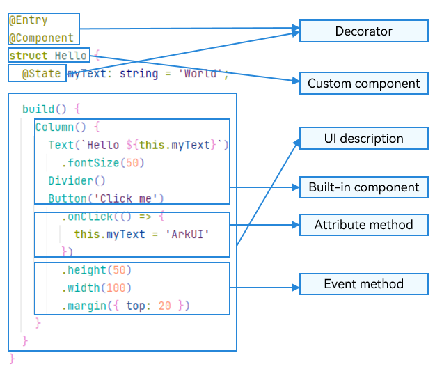

# Basic Syntax Overview

With a basic understanding of the ArkTS language, let's look into the basic composition of ArkTS through an example. As shown below, when the user clicks the button, the text content changes from **Hello World** to **Hello ArkUI**.

  **Figure 1** Example effect drawing 

In this example, the basic composition of ArkTS is as follows.

  **Figure 2** Basic composition of ArkTS 

- Decorator: design pattern used to decorate classes, structures, methods, and variables to assign special meanings to them. In the preceding sample code, \@Entry, \@Component, and \@State are decorators. \@Component indicates a custom component, \@Entry indicates that the custom component is an entry component, and \@State indicates a state variable in the component, whose change will trigger the UI to re-render.

- [UI description](arkts-declarative-ui-description.md): declarative description of the UI structure, such as the code block of the **build()** method.

- [Custom component](arkts-create-custom-components.md): reusable UI unit, which can be combined with other components, such as the struct **Hello** decorated by @Component.

- Built-in component: default basic or container component preset in ArkTS, which can be directly invoked, such as **\<Column>**, **\<Text>**, **\<Divider>**, and **\<Button>** components in the sample code.

- Attribute method: method used to configure component attributes, such as **fontSize()**, **width()**, **height()**, and **backgroundColor()**. You can configure multiple attributes of a component in method chaining mode.

- Event method: method used to add the logic for a component to respond to an event. In the sample code, **onClick()** following **Button** is an event method. You can configure response logic for multiple events in method chaining mode.

ArkTS extends multiple syntax paradigms to make development a more enjoyable experience.

- [@Builder](arkts-builder.md)/[@BuilderParam](arkts-builderparam.md): special method for encapsulating UI descriptions. It enables UI descriptions to be encapsulated and reused in a fine-grained manner.

- [@Extend](arkts-extend.md)/[@Style](arkts-style.md): decorator that extends built-in components and encapsulates attribute styles to combine built-in components more flexibly.

- [stateStyles](arkts-statestyles.md): polymorphic style, which can be set based on the internal state of the component.
